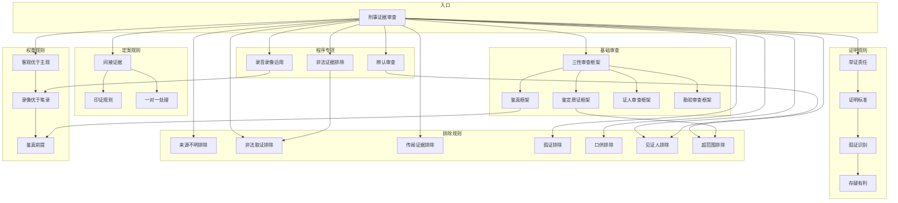

# 刑事证据审查技能包

## 概述

本技能包提供系统化的刑事证据审查方法论，帮助用户从合法性、真实性、关联性三个维度质证控方证据，攻破证据锁链。

## 核心原则

证据审查遵循三性框架：
- **合法性**：证据能力门槛，决定能否在法庭出示
- **真实性**：证明力维度，决定证据内容是否可靠
- **关联性**：证明力维度，决定证据与案件事实的联系

先审查证据能力（合法性），再审查证明力（真实性、关联性）。

## 技能构成

本技能包含六大模块，详见 `references/` 目录：

| 模块 | 文件 | 内容 | 适用场景 |
|---|---|---|---|
| 基础审查框架 | 基础审查框架.md | 三性审查、鉴真、鉴定质证、证人审查、勘验审查 | 审查各类证据的基础方法 |
| 程序审查专项 | 程序审查专项.md | 辨认审查、录音录像运用、非法证据排除 | 程序合法性专项审查 |
| 证明责任与标准 | 证明责任与标准.md | 举证责任、证明标准、孤证识别、存疑有利 | 证明层面的判断规则 |
| 证据定案规则 | 证据定案规则.md | 间接证据、印证规则、一对一处理 | 综合判断能否定案 |
| 排除规则 | 排除规则.md | 各类强制性排除情形 | 判断证据应否排除 |
| 证据权重与优先 | 证据权重与优先.md | 客观优于主观、录像优于笔录、鉴真前提 | 证据矛盾时的取舍规则 |

## 技能关系图



## 推荐学习路径

### 新手入门

1. **基础审查框架** → 理解三性审查是所有证据审查的起点
2. **证明责任与标准** → 理解控方独担举证责任
3. **鉴真框架** → 理解实物证据必须先鉴真后质证

### 进阶实战

4. **程序审查专项** → 掌握攻破控方证据的核心武器
5. **排除规则** → 判断哪些证据必须排除
6. **录音录像运用** → 掌握推翻笔录的方法

### 高级综合

7. **证据定案规则** → 判断证据链能否支撑定案
8. **印证规则** → 理解印证解决真实性不解决合法性
9. **存疑有利** → 无罪推定的具体体现

## 文件结构

```
├── README.md              # 使用说明
├── SKILL.md               # 主技能文件（原则+要点）
├── INDEX.md               # 本索引文件
├── BOOK_OVERVIEW.md       # 全书分析（审计用）
├── candidates/            # 原始候选池（审计用）
│   ├── frameworks.md
│   ├── principles.md
│   ├── cases.md
│   ├── counter-examples.md
│   └── glossary.md
└── references/            # 详细说明目录
    ├── 基础审查框架.md
    ├── 程序审查专项.md
    ├── 证明责任与标准.md
    ├── 证据定案规则.md
    ├── 排除规则.md
    └── 证据权重与优先.md
```

---

**版本**: 1.0
**更新时间**: 2026/04/21