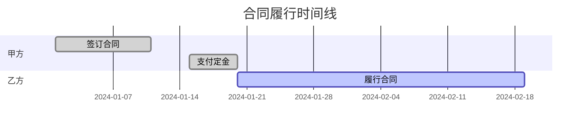
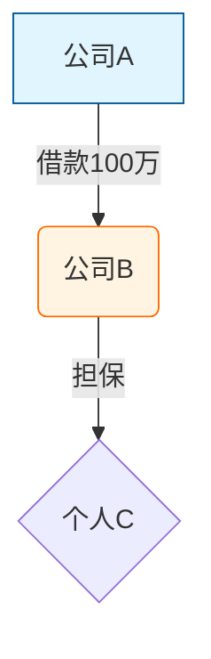
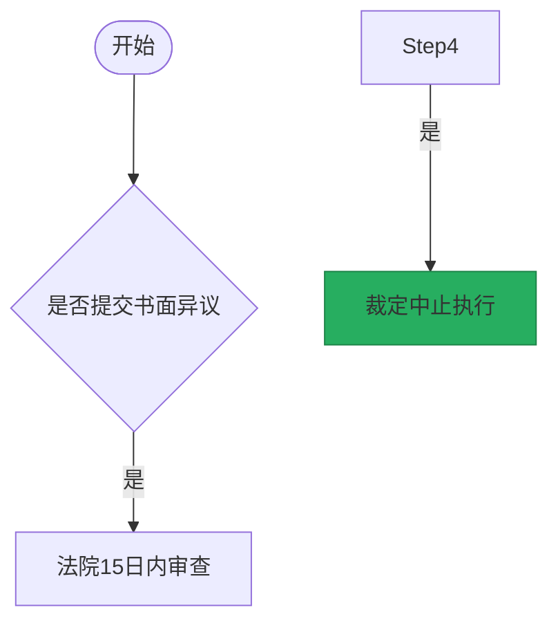

# 诉讼可视化 Skill

## 概述

本 skill 提供诉讼案件的可视化分析方法，帮助制作案件事实图和法律关系图，采用 Mermaid 语言生成图表。

## 核心特点

### 1. 两张图工作法
- 案件事实图：以时间线为基础，客观反映案件事实
- 法律关系图：以主体关系为核心，展示法律关系结构

### 2. 图表说话
- 通过图表结构、位置、颜色传达观点
- 让受众更容易理解复杂信息

### 3. 色彩与美观设计
- 使用颜色区分不同主体、不同性质的行为/关系
- 避免单色输出，确保图表直观清晰
- 保持同一案件配色一致性

### 4. 智能分析
- 用户未指定图表类型时：分析案情，推荐多种图表组合
- 用户指定图表类型时：仅制作指定的图表

### 5. Mermaid 语言交付
- 使用 Mermaid 语法生成图表
- 提供时间图、关系图、流程图等多种格式示例

## 自动触发场景

当用户输入包含以下关键词时，自动激活本 skill：

### 直接请求类（动词触发）
- "帮我画一个XX关系图"
- "画一个XX案件事实图"
- "用可视化的方式梳理一下XX的关系"
- "制作一张时间图"
- "设计一个流程图"
- "可视化XX案情"

### 分析描述类
- "这个案件关系复杂，梳理一下"
- "主体太多，画图说明"
- "时间线很乱，可视化一下"
- "交易结构复杂，画图展示"

### 结合场景类
- "需要准备庭审图表"
- "向法官/客户展示这个关系"

## 使用方式

### 单独部署

本 skill 是绝对独立的 skill，可单独部署到 AGENT 中调用，不依赖合同审查/起草 skill。

### 部署路径

```
/Users/ziyang/Desktop/contract review/contract-skills/litigation-visualization
```

## 可执行步骤

### 第一步：明确目标与对象
- 确定图表呈送对象（法官、客户、团队内部）
- 根据对象选择图表类型和内容侧重
- 未指定时进行智能分析，推荐合适图表

### 第二步：收集素材
- 全面罗列：收集所有相关事件、主体、时间节点
- 逻辑整合：按时间、主体、事件性质归类
- 精简内容：删除无关信息，保留核心事实

### 第三步：设计图表结构
- 时间图：确定时间轴方向、设计纵向/横向划分
- 关系图：确定主体节点布局、设计关系连线和箭头

### 第四步：确定配色方案
- 区分类别：不同主体使用不同颜色
- 突出重点：关键内容使用醒目颜色
- 保持一致性：同一案件中多张图表配色一致

### 第五步：使用 Mermaid 语言生成图表
- 时间图：使用 Gantt 格式
- 关系图：使用 Graph 格式
- 流程图：使用 Flowchart 格式

### 第六步：辅助理解与沟通
- 提供 Mermaid 图表代码
- 提供图表说明（重点解读）
- 提供配色说明（每种颜色代表什么）

## 与合同工作的结合

### 合同审查场景
- 发现诉讼风险时，用可视化方式向客户展示风险点
- 合同履行过程用时间图清晰呈现
- 多方主体关系用关系图说明

### 合同起草场景
- 用可视化方式展示交易结构
- 用关系图说明各方权利义务
- 用流程图说明合同履行程序

## References 目录

本 skill 包含 8 个详细方法论文档：

| 文档 | 说明 |
|------|------|
| overview.md | 诉讼可视化概述、方法论四步骤 |
| two-charts-method.md | 两张图工作法、配色方案 |
| chart-speaking.md | 图表说话、结构、位置、颜色、线条 |
| time-charts.md | 时间图设计方法、纵向/横向划分 |
| relationship-charts.md | 关系图设计方法、典型案件示例 |
| content-determination.md | 图表内容确定方法（全面罗列、逻辑整合、精简内容） |
| better-expression.md | 图表更好表达方法（色彩与构图、突出观点） |
| virtuous-cycle.md | 良性循环、对法律职业共同体的意义 |

## Mermaid 图表类型示例

### 时间图（Gantt）


### 关系图（Graph）


### 流程图（Flowchart）


## 配色原则

### 基础配色
- **蓝色系**：客观、中性的信息
- **红色系**：违约、争议、需要关注的问题
- **绿色系**：正常履行的行为
- **灰色系**：背景信息或次要内容

### 配色要求
1. **颜色不宜过多**：一张图表中的颜色种类不宜超过 5-6 种
2. **色彩编码一致**：同一案件中多张图表的颜色编码应保持一致
3. **考虑色盲友好**：避免仅用颜色区分信息，配合形状或线条粗细
4. **避免过饱和**：过于鲜艳的颜色可能造成视觉疲劳

## 注意事项

1. 必须使用颜色区分不同元素，避免单色输出
2. 同一案件中多张图表应保持配色一致性
3. Mermaid 代码应简洁清晰，便于用户复制使用
4. 图表设计应以受众理解为核心，而非展示技巧
5. 优先考虑用户指定的图表类型，未指定时智能推荐

## 测试用例

本 skill 包含 `test-prompts.json` 文件，包含 18 个测试用例，覆盖：
- 直接请求类（动词触发）
- 分析描述类
- 结合场景类
- 智能分析场景
- 用户指定图表类型场景

## 版本信息

**创建时间**: 2026-04-20
**方法论**: 诉讼可视化相关方法论
**版本**: 1.0（独立版）
