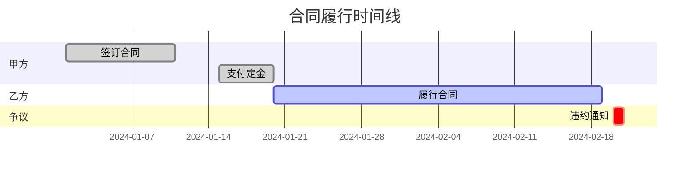
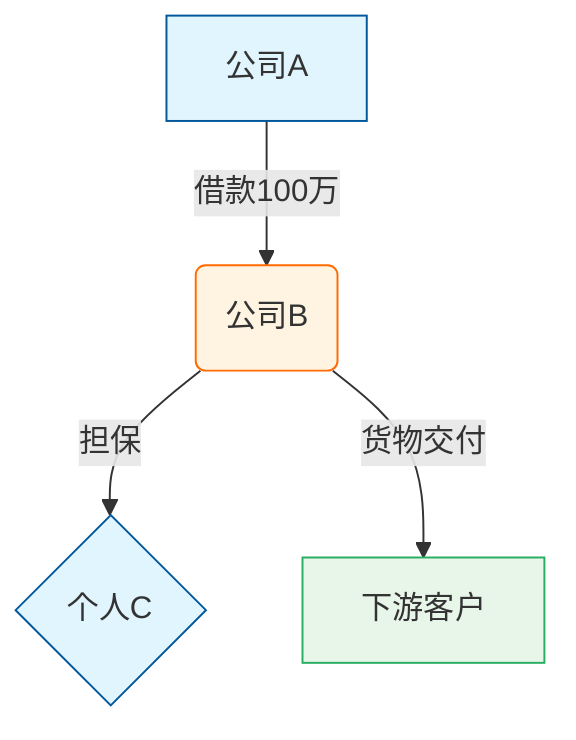
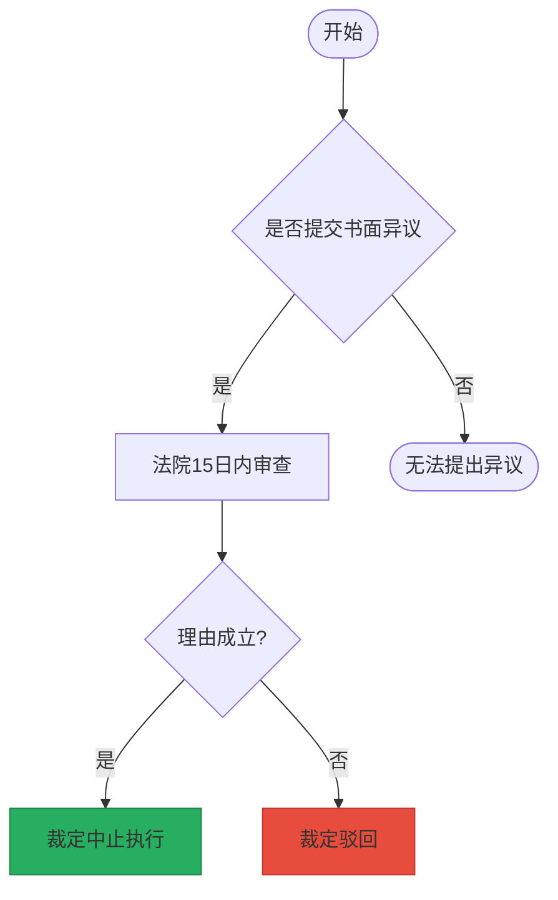

# 诉讼可视化技能

## 核心原则

### 1. 两张图工作法
- 案件事实图：以时间线为基础，客观反映案件事实
- 法律关系图：以主体关系为核心，展示法律关系结构

### 2. 图表说话
- 让受众更容易理解复杂信息
- 通过图表结构、位置、颜色传达观点

### 3. 促进良性循环
- 提升专业能力 → 获得认可 → 建立信任

### 4. 色彩与美观设计
- 使用颜色区分不同主体、不同性质的行为/关系
- 避免单色输出，确保图表直观清晰
- 遵循配色原则：不超过5-6种颜色，保持同一案件配色一致性

---

## 使用场景

### 案件事实可视化
### 法律关系分析
### 庭审准备
### 合同风险可视化（与合同审查/起草结合）

---

## 语言信号（自动触发）

当用户输入包含以下关键词时，自动激活本 skill：

### 直接请求类
- "帮我画一个XX关系图"
- "画一个XX案件事实图"
- "用可视化的方式梳理一下XX的关系"
- "制作一张时间图"
- "设计一个流程图"
- "可视化XX案情"

### 分析描述类
- "这个案件关系复杂，梳理一下"
- "主体太多，画图说明"
- "时间线很乱，可视化一下"
- "交易结构复杂，画图展示"

### 结合场景类
- "需要准备庭审图表"
- "向法官/客户展示这个关系"
- "用图表方式说明这个事实"

---

## 可执行步骤

### 第一步：明确目标与对象
**判断标准**：
- 确定图表呈送对象（法官、客户、团队内部）
- 根据对象选择图表类型和内容侧重

**用户未指定图表类型时的智能分析**：
1. 分析案件核心要素：时间、关系、数据
2. 分析案件主体数量、关系复杂度
3. 评估需要说明的关键点
4. 推荐多种图表组合：
   - 主体多、关系复杂 → 优先法律关系图
   - 时间要素重要 → 优先时间图
   - 需要展示流程 → 流程图
   - 复杂案件 → 建议多张图表配合

**用户指定图表类型时**：
- 仅制作指定类型的图表
- 按照对应图表类型的设计规范执行

### 第二步：收集素材
**分析方法**：
1. 全面罗列：收集所有相关事件、主体、时间节点
2. 逻辑整合：按时间、主体、事件性质归类
3. 精简内容：删除无关信息，保留核心事实

### 第三步：设计图表结构
**时间图设计**：
- 确定时间轴方向（横向或纵向）
- 设计纵向空间划分（行为分层、对比关系）
- 设计横向空间划分（时间区间表达方式）

**关系图设计**：
- 确定主体节点布局
- 设计关系连线和箭头方向
- 考虑背景元素标注

### 第四步：确定配色方案
**配色原则**：
1. 区分类别：不同主体使用不同颜色
2. 突出重点：关键内容使用醒目颜色
3. 表达情感：争议/违约用警示色，正常履行用安全色
4. 保持一致性：同一案件中多张图表配色一致

**常见配色建议**：
- 主体区分：蓝色、绿色、橙色、紫色...
- 违约/争议：红色或橙色
- 正常/合规：蓝色或绿色
- 背景/次要：灰色
- 时间区分：不同时间段用不同颜色

### 第五步：使用Mermaid语言生成图表
**输出格式**：使用Mermaid语法生成图表

**时间图Mermaid示例**：

**关系图Mermaid示例**：

**流程图Mermaid示例**：

### 第六步：辅助理解与沟通
**交付内容**：
1. Mermaid图表代码
2. 图表说明（重点解读）
3. 配色说明（每种颜色代表什么）
4. 关键事实标注

**与文字配合**：
- 图表展示"什么"：客观事实和关系结构
- 文字说明"为什么"：法律分析和论证理由
- 标注指出"关键点"：图表中的核心争议点

---

## 与合同工作的结合

### 合同审查场景
- 发现诉讼风险时，用可视化方式向客户展示风险点
- 合同履行过程用时间图清晰呈现
- 多方主体关系用关系图说明

### 合同起草场景
- 用可视化方式展示交易结构
- 用关系图说明各方权利义务
- 用流程图说明合同履行程序

---

## 边界

### 不要在以下情况使用此skill
- 用户只是想了解图表的基本画法（应提供教程而非分析）
- 无具体案件事实，仅讨论抽象问题
- 纯粹的文字翻译或解释咨询

### 注意事项
1. 必须使用颜色区分不同元素，避免单色输出
2. 同一案件中多张图表应保持配色一致性
3. Mermaid代码应简洁清晰，便于用户复制使用
4. 图表设计应以受众理解为核心，而非展示技巧
5. 优先考虑用户指定的图表类型，未指定时智能推荐
