# 诉讼可视化 Skill

## 概述

诉讼可视化是将复杂的法律事实和法律关系，用简单明了的图表方式呈现出来，帮助法官和客户更好地理解诉讼诉求的一种工作方法。

---

## 核心方法论

### 一、两张图工作法

推行"两张图"工作法，即每个案件要画两张图：

| 图表类型 | 核心要素 | 表达重点 | 呈送对象 |
|---------|---------|---------|---------|
| 案件事实图 | 时间 | 客观事实 | 法官为主 |
| 法律关系图 | 关系 | 法律分析 | 客户、团队为主 |

#### 案件事实图

**定义**：以时间线为基础，客观、真实地反映案件中各主体行为、事件发生先后顺序及相互关系。

**主要特点**：
1. 客观性：以客观事实为基础，避免主观判断
2. 时间导向：以时间轴为核心框架
3. 行为主体分层：将不同主体的行为在空间上区分开来
4. 关键事实突出：突出与案件争议相关的核心事实

**适用场景**：
- 事件发生的先后顺序对案件定性有重要影响
- 需要梳理复杂的程序性事实
- 需要对比不同主体在同一时间段的行为
- 需要展示时间区间概念（保证期间、诉讼时效等）

#### 法律关系图

**定义**：以主体间的关系为核心，反映各方当事人在法律层面上的权利义务关系、交易结构、股权架构等。

**主要特点**：
1. 关系导向：以主体间的关系为表达核心
2. 结构化：通过图表结构体现关系性质
3. 主观观点融入：可融入对案件的法律分析和论证
4. 逻辑清晰：通过箭头、连线等表达关系方向和性质

**适用场景**：
- 案件主体数量较多（三个以上）
- 各主体之间的法律关系复杂
- 关系本身是案件的争议焦点
- 需要展示交易结构、股权架构

#### 两张图的配合使用

**制作顺序**：
1. 先画案件事实图：客观梳理事实，确保准确性
2. 后画法律关系图：在事实基础上进行法律分析
3. 交叉验证：两张图应相互印证，避免矛盾

**配色一致性**：两张图中相同主体应使用相同颜色，相同类型的行为或关系应使用相同的颜色编码。

---

### 二、图表说话原则

"用图表说话"是诉讼可视化的核心理念，即通过图表本身的结构、设计和布局，让图表直接传达核心观点。

#### 实现方式

| 方式 | 说明 | 示例 |
|-----|------|------|
| 结构说话 | 通过整体结构体现论证思路 | 闭环结构展示融资性贸易特征 |
| 位置说话 | 通过元素位置体现重要性 | 核心争议置于视觉中心 |
| 线条说话 | 通过线条类型表达含义 | 实线=确定关系，虚线=待证事实 |
| 颜色说话 | 通过颜色编码传递信息和情感 | 红色=违约/争议，绿色=正常履行 |

#### 突出观点的方法

- **位置突出**：核心观点置于视觉中心或显著位置
- **大小突出**：放大核心元素，缩小次要元素
- **颜色突出**：醒目颜色标注核心内容
- **线条突出**：核心关系用粗线，次要关系用细线
- **框线突出**：用框线圈出核心内容

---

### 三、良性循环价值

诉讼可视化构建律师与法官之间的良性循环：

```
律师运用图表充分说理 → 法官理解并认可 → 律师获得正向反馈 → 更投入钻研诉讼技术 → 法官期待更多专业律师
```

**核心启示**：
- 改变从自己开始，不要等待环境改变
- 专业能力和专业态度是建立信任的基础
- 诉讼技术比想象中更有影响力

---

## 图表选择决策指南

### 一、核心要素判断

根据案件核心要素选择图表类型：

| 核心要素 | 推荐图表 | 说明 |
|---------|---------|------|
| 时间 | Timeline、Gantt | 关键事件的时间点或先后顺序 |
| 关系 | Graph、Flowchart | 法律关系、交易结构、股权架构 |
| 数据 | 表格/图表 | 金额、数量等数据对比（非Mermaid） |
| 流程 | Flowchart、Sequence | 程序性事项、交互过程 |
| 状态 | StateDiagram | 法律状态变化、条件触发 |
| 证据/思路 | Mindmap | 证据整理、分析框架 |

### 二、呈送对象判断

不同呈送对象的图表选择：

| 呈送对象 | 推荐图表 | 内容侧重 | 注意事项 |
|---------|---------|---------|---------|
| 法官 | 案件事实图优先 | 客观事实、有利证据 | 保持客观，避免主观评价 |
| 客户 | 法律关系图优先 | 完整事实、法律分析、策略 | 让客户理解律师价值 |
| 团队内部 | 两张图并用 | 尽量翔实、标注待核实信息 | 全面性优先 |

### 三、案件类型推荐表

| 案件类型 | 推荐图表组合 | 说明 |
|----------|--------------|------|
| 借款合同纠纷 | Timeline + Graph | 展示借款期限、还款节点、担保关系 |
| 买卖合同纠纷 | Timeline + Flowchart | 展示履约时间节点、违约流程 |
| 融资性贸易 | Graph + Mindmap | 展示贸易闭环结构、法律关系分析 |
| 建设工程纠纷 | Gantt + Graph | 展示工程进度、合同关系 |
| 股权转让纠纷 | Graph + Mindmap | 展示股权结构、交易流程 |
| 劳动争议 | Timeline + StateDiagram | 展示劳动关系变化状态 |
| 执行异议 | Flowchart + Sequence | 展示执行异议流程、交互过程 |

### 四、决策流程

```
用户输入案情
    │
    ├─ 主体数量 ≥ 3？
    │   └─ 是 → 关系图（Graph）
    │
    ├─ 涉及时间序列/先后顺序？
    │   └─ 是 → Timeline 或 Gantt
    │
    ├─ 涉及程序流转/决策分支？
    │   └─ 是 → 流程图（Flowchart）
    │
    ├─ 涉及多方交互/时序？
    │   └─ 是 → 序列图（Sequence）
    │
    ├─ 涉及状态变化？
    │   └─ 是 → 状态图（StateDiagram）
    │
    └─ 需要梳理证据/思路？
        └─ 是 → 思维导图（Mindmap）
```

---

## 制作方法论

### 三步法

#### 第一步：收集素材

**全面罗列**：将所有可能相关的信息先罗列出来，不要急于筛选。

罗列内容包括：
- 当事人的所有行为和事件
- 时间节点
- 涉及的金额、数量等数据
- 相关法律规定和司法解释

**注意**：暂时不判断信息重要性，先罗列再说。

#### 第二步：设计结构

**逻辑整合**：按照一定逻辑对信息归类整理。

整合方式：
- 按时间顺序整合：适用于时间要素重要的案件
- 按主体分类整合：适用于主体较多的案件
- 按事件性质整合：如"申请行为"和"裁判行为"
- 按争议焦点整合：围绕核心争议组织信息

**图表结构设计**：

**时间图结构**：
- 确定时间轴方向（横向或纵向）
- 纵向划分：表达对比关系或行为分层
- 横向划分：用括号/箭头/颜色变换表达时间区间

**关系图结构**：
- 以主体为节点
- 用箭头表示关系方向（资金流向、权利义务方向）
- 通过连线标注关系性质
- 保持布局均衡，避免交叉混乱

#### 第三步：确定配色

**配色原则**：
1. 主体区分：不同主体使用不同颜色
2. 突出重点：关键内容使用醒目颜色
3. 表达情感：争议/违约用警示色（红色），正常履行用安全色（绿色/蓝色）
4. 保持一致性：同一案件中多张图表配色一致
5. 色彩限制：不超过 5-6 种主色

---

## Mermaid 图表类型指南

### 一、Timeline（时间线图）

**适用场景**：
- 核心要素为时间的案件
- 事件先后顺序对案件定性有重要影响
- 需要梳理程序性事实

**语法**：
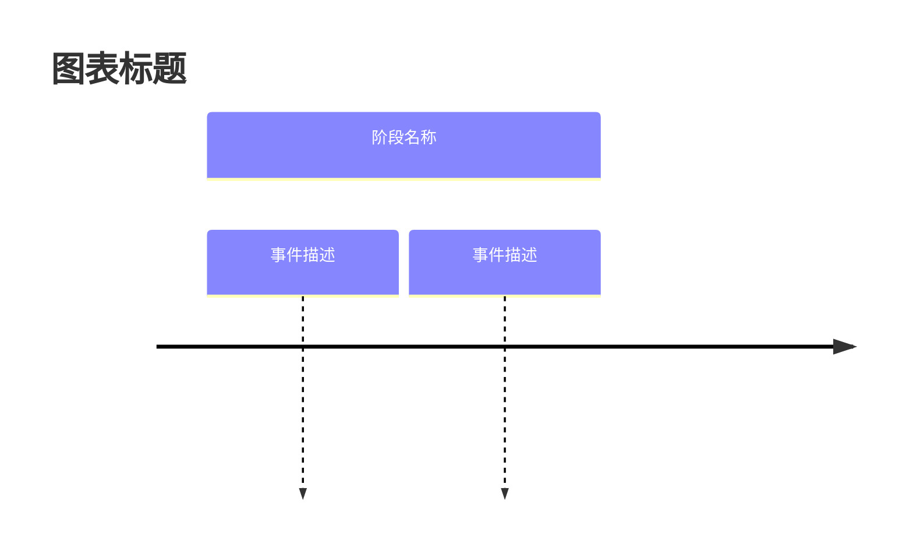

**模板**：
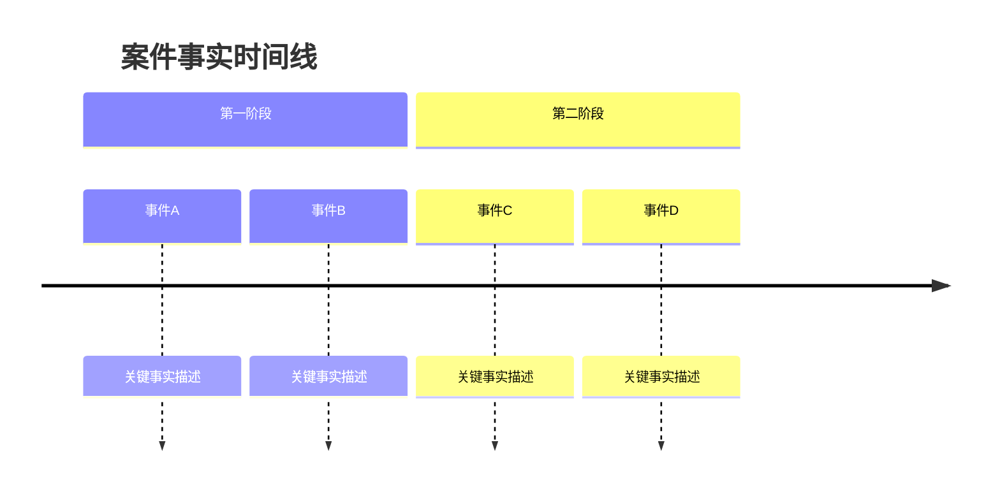

**设计要点**：
- 时间轴清晰易读
- 事件位置准确反映时间关系
- 用 section 进行阶段划分
- 颜色区分不同性质的事件

---

### 二、Gantt（甘特图）

**适用场景**：
- 需要展示时间区间（合同履行期限、保证期间）
- 需要展示进度和阶段
- 建设工程、长期合同等案件

**语法**：
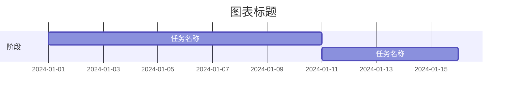

**模板**：
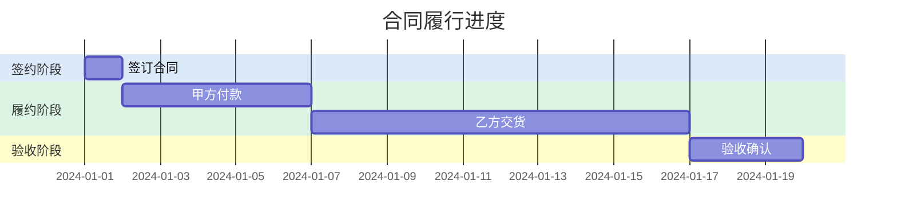

**时间区间表达技巧**：
- 用不同颜色区分不同性质的时间段
- 用 milestone 标注关键时间节点
- 用依赖关系（after）表达先后顺序

---

### 三、Graph（关系图）

**适用场景**：
- 案件主体数量较多（≥3）
- 法律关系复杂
- 关系本身是争议焦点
- 需要展示交易结构、股权架构

**语法**：
```mermaid
graph TD
    A[主体A]:::styleA
    B[主体B]:::styleB
    A -->|关系类型| B
    
    classDef styleA fill:#颜色,stroke:#边框色,color:#000000,stroke-width:2px
```

**模板**：
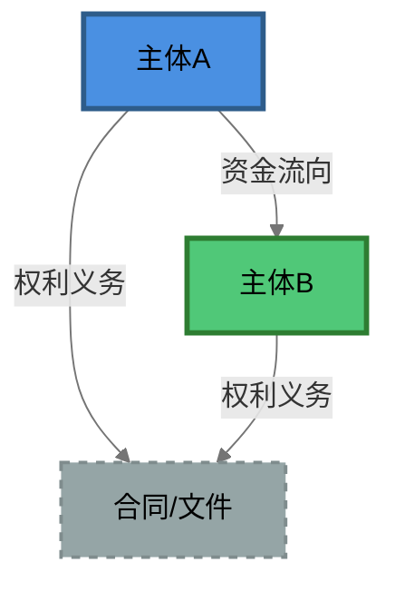

**关系要素表达**：

| 元素 | 表达方式 | 说明 |
|-----|---------|------|
| 主体节点 | 矩形/圆形 | 不同颜色区分主体性质 |
| 关系连线 | 实线/虚线 | 实线=确定关系，虚线=待证事实 |
| 连线粗细 | 粗/细 | 粗线=主要关系，细线=次要关系 |
| 箭头方向 | 指向 | 资金流向、权利方向、控制方向 |

**设计要点**：
- 核心主体置于中心位置
- 避免连线交叉过多
- 保持视觉平衡
- 标注关系性质和关键细节

---

### 四、Flowchart（流程图）

**适用场景**：
- 程序性事项说明（再审流程、执行异议流程）
- 多种路径选择展示
- 决策过程展示
- 不需要具体时间节点的事项

**语法**：
```mermaid
flowchart TD
    A[开始]:::start
    B{决策点}:::decision
    C[结果A]:::resultA
    D[结果B]:::resultB
    
    A --> B
    B -->|条件A| C
    B -->|条件B| D
    
    classDef start fill:#颜色,stroke:#边框色,color:#000000
```

**模板**：
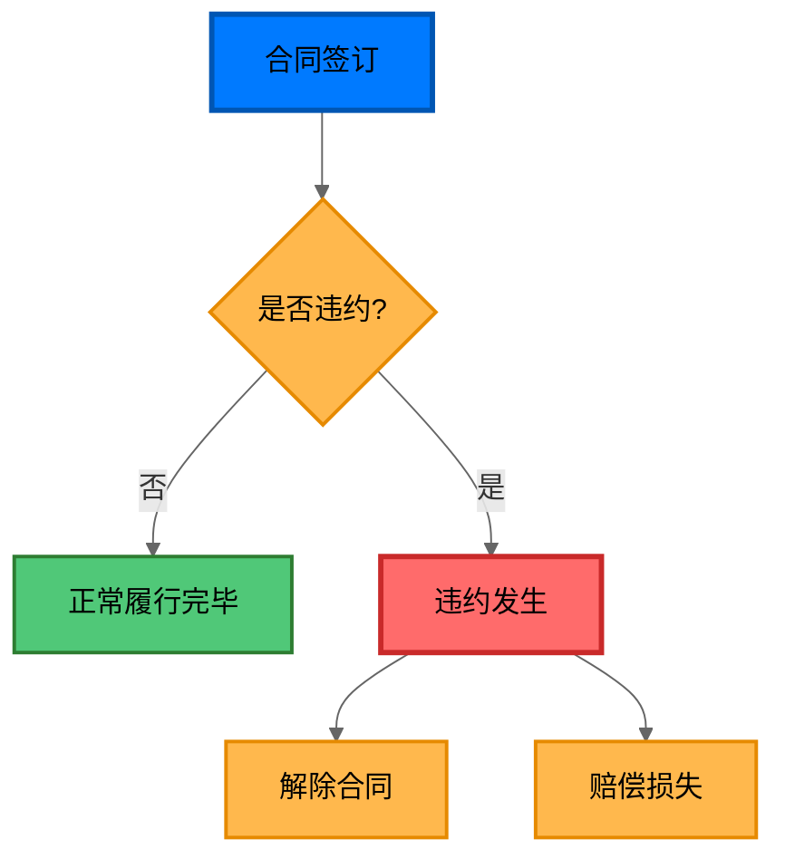

**设计要点**：
- 给不熟悉领域的人看，要简单易懂
- 统一入口、根据不同情形分支
- 避免过于复杂，不要展示过多分支
- 用颜色区分不同性质的结果

---

### 五、Sequence（序列图）

**适用场景**：
- 多方交互过程展示
- 程序流转、时序关系
- 诉讼程序各阶段交互

**语法**：
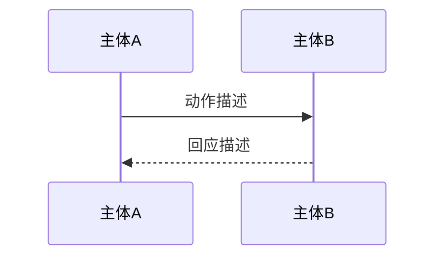

**模板**：
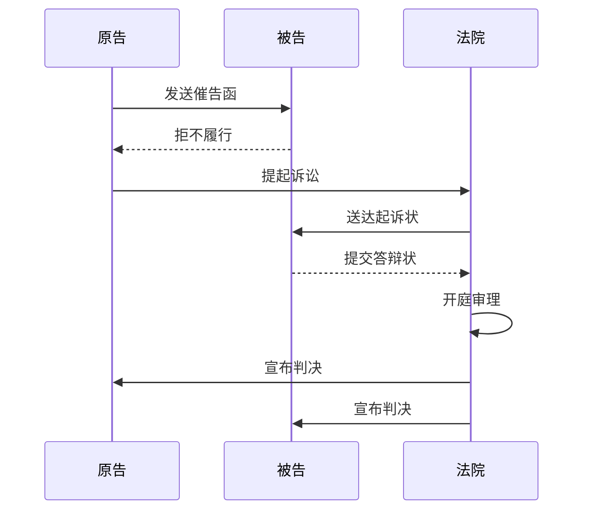

**箭头类型**：
- `->>`：实线箭头（请求/动作）
- `-->>`：虚线箭头（回应/返回）
- `->>`：实线无箭头（通知）

---

### 六、StateDiagram（状态图）

**适用场景**：
- 法律状态变化展示
- 条件触发关系
- 合同履行状态变化
- 劳动关系状态变化

**语法**：
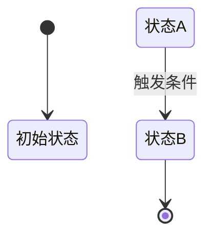

**模板**：
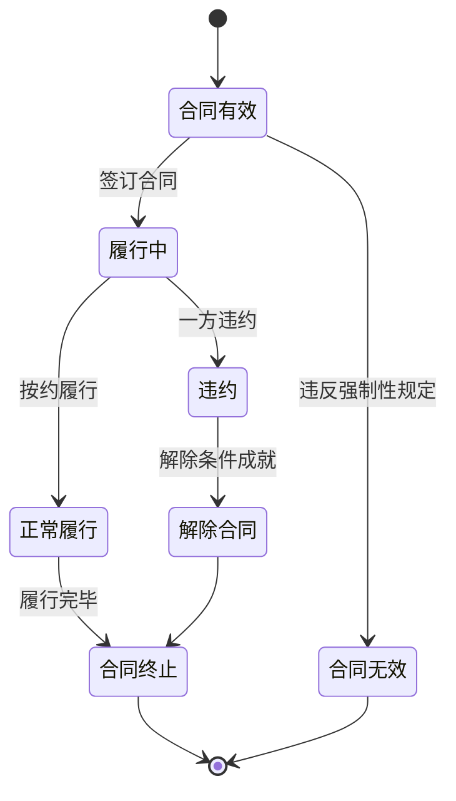

---

### 七、Mindmap（思维导图）

**适用场景**：
- 证据整理
- 案件分析框架
- 思路梳理
- 法律关系梳理

**语法**：
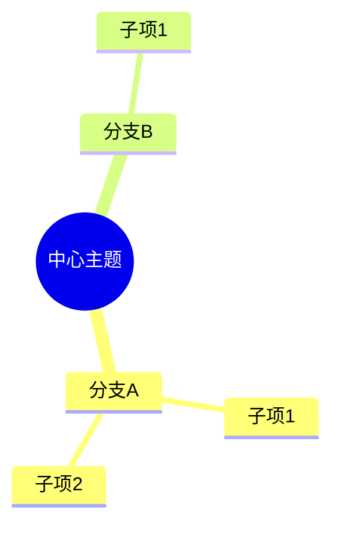

**模板**：
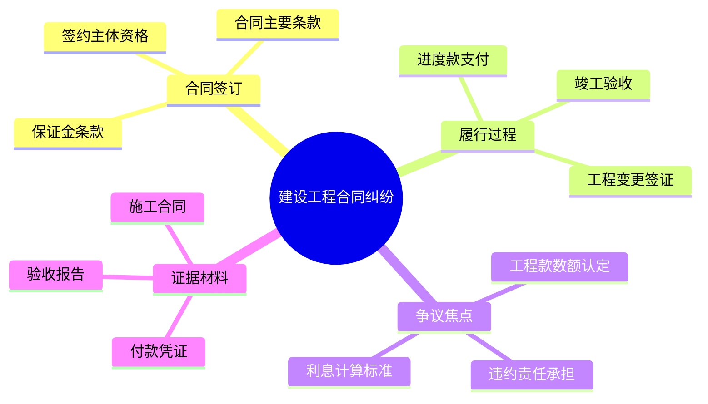

---

## 配色系统

### 一、标准配色方案

#### 主体色

| 角色 | 颜色名称 | 色值 | 用途 |
|-----|---------|------|------|
| 权利人/债权人/己方 | 蓝色 | #4A90E2 | 出借人、买方、原告等 |
| 义务人/债务人/对方 | 绿色 | #50C878 | 借款人、卖方、被告等 |
| 第三人/担保人 | 橙色 | #F39C12 | 保证人、担保人、第三人 |
| 政府/机关 | 深蓝 | #2C3E50 | 法院、行政机关 |

#### 行为色

| 行为性质 | 颜色名称 | 值 | 用途 |
|---------|---------|------|------|
| 正常履行 | 浅蓝 | #E6F3FF | 合规行为 |
| 违约/争议 | 红色 | #FF6B6B | 违约行为、争议事项 |
| 待定/待证 | 黄色 | #FFF3CD | 待证事实、待定状态 |
| 关键节点 | 深蓝 | #007AFF | 关键时间点、关键行为 |

#### 文件/状态色

| 类型 | 颜色名称 | 色值 | 用途 |
|-----|---------|------|------|
| 合同/文件 | 灰色 | #95A5A6 | 合同、协议、判决书等 |
| 背景信息 | 浅灰 | #F5F5F5 | 次要内容、背景信息 |
| 完成/结束 | 灰蓝 | #607D8B | 终止状态、完成状态 |

---

### 二、线条样式规范

| 线条类型 | 语法 | 用途 |
|---------|------|------|
| 实线箭头 | `-->` | 确定的关系、确定的行为 |
| 虚线箭头 | `-.->` | 潜在关系、待证事实 |
| 无箭头连线 | `---` | 平行关系、关联关系 |
| 粗线 | `stroke-width:3px` | 主要关系、重点内容 |
| 细线 | `stroke-width:1px` | 次要关系、辅助内容 |

---

### 三、色盲友好方案

为色盲用户提供形状区分替代方案：

| 角色 | 形状 | 备注 |
|-----|------|------|
| 权利人 | 圆角矩形 | `([内容])` |
| 义务人 | 矩形 | `[内容]` |
| 第三人 | 圆形 | `((内容))` |
| 合同/文件 | 虚线框 | `stroke-dasharray: 5 5` |

---

### 四、classDef 快速定义模板

```mermaid
classDef partyA fill:#4A90E2,stroke:#2E5C8A,color:#000000,stroke-width:3px
classDef partyB fill:#50C878,stroke:#2E7D32,color:#000000,stroke-width:3px
classDef partyC fill:#F39C12,stroke:#B7950B,color:#000000,stroke-width:3px
classDef contract fill:#95A5A6,stroke:#7F8C8D,color:#000000,stroke-width:2px,stroke-dasharray: 5 5
classDef alert fill:#FF6B6B,stroke:#C0392B,color:#000000,stroke-width:3px
classDef normal fill:#E6F3FF,stroke:#007AFF,color:#000000,stroke-width:2px
```

---

## 典型案件可视化模板

### 一、借款合同纠纷

#### 案情特征
- 借款期限、还款节点明确
- 可能涉及担保关系
- 利息计算是常见争议

#### 推荐图表组合
- Timeline：展示借款发放、还款、逾期时间线
- Graph：展示借款人、出借人、担保人关系

#### Timeline 示例

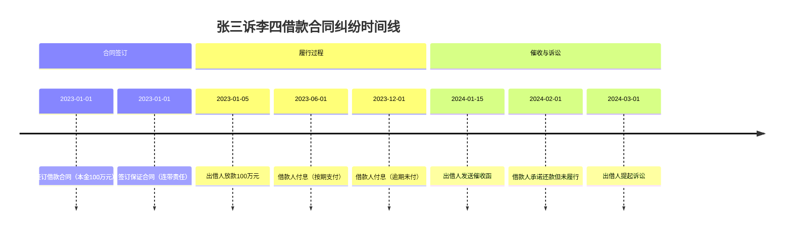

#### Graph 示例

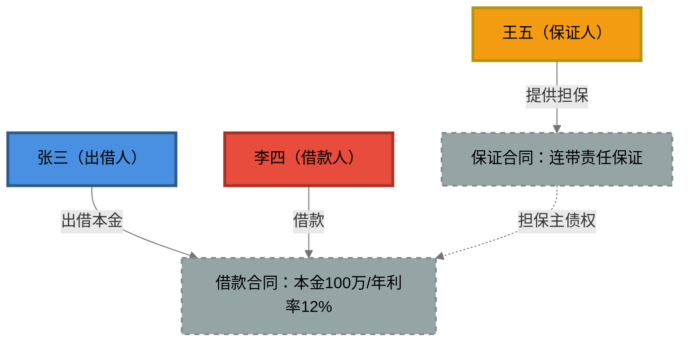

---

### 二、买卖合同纠纷

#### 案情特征
- 交货与付款的双务关系
- 履约时间节点明确
- 违约责任认定是常见争议

#### 推荐图表组合
- Timeline：展示合同签订、交货、付款、违约时间线
- Flowchart：展示违约认定流程和后果

#### Timeline 示例

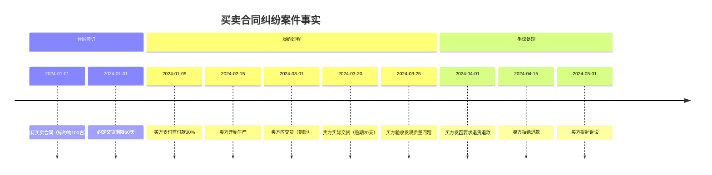

#### Flowchart 示例（违约认定）

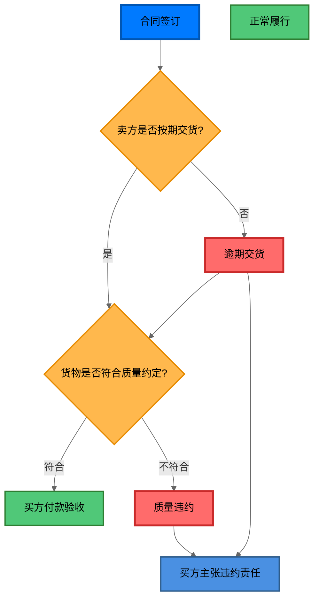

---

### 三、融资性贸易案件

#### 案情特征
- 形成贸易闭环
- 货物不存在或仅以提货单代替
- 同一时间段缔结合约，一方高买低卖

#### 推荐图表组合
- Graph：展示贸易闭环结构
- Mindmap：展示融资性贸易认定要点

#### Graph 示例（贸易闭环）

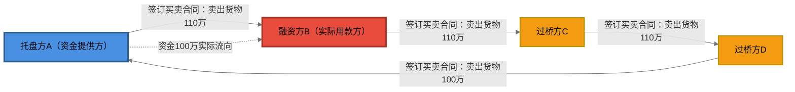

#### Mindmap 示例（认定要点）

```mermaid
%%{init: {'themeVariables': {
  'primaryColor': '#F3E5F5',
  'primaryTextColor': '#000000'
}}}%%
mindmap
  root((融资性贸易认定))
    形式特征
      贸易闭环
      同时间段签约
      一方高买低卖
    实质特征
      货物不存在
      仅提货单流转
      资金实际流向融资方
    法律后果
      名为买卖实为借贷
      托盘方无权主张货款
      按借贷关系处理
```

---

### 四、建设工程纠纷

#### 案情特征
- 工程周期长，进度复杂
- 涉及多阶段付款
- 工程量认定是常见争议

#### 推荐图表组合
- Gantt：展示工程进度和付款节点
- Graph：展示发包方、承包方、分包方关系

#### Gantt 示例

```mermaid
%%{init: {'themeVariables': {
  'primaryColor': '#E6F3FF',
  'primaryTextColor': '#000000',
  'sectionBkgColor': '#4A90E2',
  'altSectionBkgColor': '#50C878'
}}}%%
gantt
    title 建设工程项目进度
    dateFormat  YYYY-MM-DD
    
    section 施工准备
    签订施工合同 :contract, 2024-01-01, 1d
    进场准备 :prepare, after contract, 7d
    
    section 主体施工
    基础工程 :foundation, after prepare, 30d
    主体结构 :structure, after foundation, 60d
    
    section 付款节点
    预付款30% :milestone, pay1, 2024-01-05, 0d
    进度款40% :milestone, pay2, 2024-03-15, 0d
    完工款25% :milestone, pay3, 2024-06-01, 0d
    
    section 验收结算
    竣工验收 :accept, after structure, 15d
    工程结算 :settle, after accept, 30d
```

#### Graph 示例（合同关系）

```mermaid
%%{init: {'themeVariables': {
  'primaryColor': '#E3F2FD',
  'primaryTextColor': '#000000',
  'lineColor': '#757575'
}}}%%
graph TD
    A[发包方（业主）]:::owner
    B[承包方（施工企业）]:::contractor
    C[分包方A（劳务分包）]:::subcontractor
    D[分包方B（专业分包）]:::subcontractor
    E[监理单位]:::supervisor
    F[施工合同]:::contract
    G[分包合同A]:::contract
    H[分包合同B]:::contract
    
    A --发包--> F
    B --承包--> F
    B --分包--> G
    B --分包--> H
    C --分包施工--> G
    D --分包施工--> H
    E --监理--> F
    
    classDef owner fill:#4A90E2,stroke:#2E5C8A,color:#000000,stroke-width:3px
    classDef contractor fill:#50C878,stroke:#2E7D32,color:#000000,stroke-width:3px
    classDef subcontractor fill:#F39C12,stroke:#B7950B,color:#000000,stroke-width:2px
    classDef supervisor fill:#9B59B6,stroke:#7D3C98,color:#000000,stroke-width:2px
    classDef contract fill:#95A5A6,stroke:#7F8C8D,color:#000000,stroke-width:2px,stroke-dasharray: 5 5
```

---

### 五、股权转让纠纷

#### 案情特征
- 股权结构复杂
- 可能涉及代持、多层持股
- 实际控制人与名义持股人不一致

#### 推荐图表组合
- Graph：展示股权结构和控制关系
- Mindmap：展示股权转让争议要点

#### Graph 示例（股权结构）

```mermaid
%%{init: {'themeVariables': {
  'primaryColor': '#E3F2FD',
  'primaryTextColor': '#000000',
  'lineColor': '#757575'
}}}%%
graph TD
    A[实际控制人（张三）]:::controller
    B[名义股东A（李四持股60%）]:::nominee
    C[名义股东B（王五持股40%）]:::nominee
    D[目标公司]:::company
    E[代持协议]:::contract
    
    A -.实际控制.-> B
    A -.实际控制.-> C
    B --名义持股60%--> D
    C --名义持股40%--> D
    A --代持安排--> E
    B --代持确认--> E
    C --代持确认--> E
    
    classDef controller fill:#E74C3C,stroke:#A93226,color:#000000,stroke-width:3px
    classDef nominee fill:#4A90E2,stroke:#2E5C8A,color:#000000,stroke-width:2px
    classDef company fill:#50C878,stroke:#2E7D32,color:#000000,stroke-width:3px
    classDef contract fill:#95A5A6,stroke:#7F8C8D,color:#000000,stroke-width:2px,stroke-dasharray: 5 5
```

---

### 六、劳动争议案件

#### 案情特征
- 劳动关系状态变化明确
- 涉及入职、在职、离职等阶段
- 劳动合同解除条件是常见争议

#### 推荐图表组合
- StateDiagram：展示劳动关系状态变化
- Timeline：展示劳动争议处理时间线

#### StateDiagram 示例

```mermaid
%%{init: {'themeVariables': {
  'primaryColor': '#E1F5FE',
  'primaryTextColor': '#000000',
  'primaryBorderColor': '#03A9F4'
}}}%%
stateDiagram-v2
    [*] --> 招聘阶段
    招聘阶段 --> 劳动关系建立 : 签订劳动合同
    劳动关系建立 --> 在职期间 : 正常入职
    在职期间 --> 合同续签 : 合同到期续签
    在职期间 --> 合同解除 : 解除条件成就
    合同解除 --> 协商解除 : 双方协商一致
    合同解除 --> 单方解除 : 一方提出解除
    单方解除 --> 合法解除 : 符合法定条件
    单方解除 --> 违法解除 : 违反法定程序
    协商解除 --> 劳动关系终止
    合法解除 --> 劳动关系终止
    违法解除 --> 劳动关系终止 : 支付赔偿金
    劳动关系终止 --> [*]
```

---

## 质量检查清单

### 输出前自检

```
□ 核心检查
  □ 图表是否清晰表达了核心事实/关系？
  □ 图表类型是否适合案件核心要素？
  □ 图表类型是否适合呈送对象？

□ 配色检查
  □ 配色是否一致（同主体同色）？
  □ 文字是否清晰可读（黑色文字 color:#000000）？
  □ 颜色是否不超过5-6种？

□ 结构检查
  □ 元素是否过多（建议≤15个节点）？
  □ 连线是否交叉过多？
  □ 布局是否平衡？

□ 内容检查
  □ 时间线方向是否一致？
  □ 箭头方向是否正确（资金流向、权利方向）？
  □ 是否标注了关系性质？
  □ 是否需要分拆为多张图？

□ 受众检查
  □ 是否适合呈送对象（法官→客观/客户→分析）？
  □ 是否包含不必要的主观评价（法官图表）？
  □ 是否能让不了解案件的人理解？
```

---

## 自动触发场景

当用户输入包含以下关键词时，自动激活本 skill：

### 直接请求类
- "帮我画一个XX关系图"
- "画一个XX案件事实图"
- "用可视化的方式梳理一下XX的关系"
- "制作一张时间线图"
- "设计一个流程图"
- "可视化XX案情"

### 分析描述类
- "这个案件关系复杂，梳理一下"
- "主体太多，画图说明"
- "时间线很乱，可视化一下"
- "交易结构复杂，画图展示"

### 结合场景类
- "需要准备庭审图表"
- "向法官/客户展示这个关系"
- "两张图工作法"

---

## 使用场景

- 案件事实可视化
- 法律关系分析
- 庭审准备
- 合同风险可视化（与合同审查/起草结合）
- 案件分析框架梳理
- 证据整理

---

## 注意事项

### 一、Mermaid 语法规范（必须遵守）

**以下语法会导致解析错误，必须避免：**

| 禁止用法 | 错误原因 | 正确替代方案 |
|---------|---------|-------------|
| `<br>` 非自闭合标签 | 解析器不支持 HTML 换行 | 使用 `<br/>` 或简化文字 |
| `"` 双引号 | 会被识别为字符串边界 | 使用单引号 `'` 或去掉引号 |
| `'` 单引号（部分场景） | 与语法冲突 | 使用全角引号 `「」` 或去掉 |
| 中文特殊符号 `「」【】` | 部分渲染器不支持 | 使用英文括号 `()` 或去掉 |
| 节点内容过长 | 超过渲染宽度 | 控制在15字以内 |

**换行标签说明：**

- `<br>`：**禁止使用**，会导致解析错误
- `<br/>`：自闭合标签，多数渲染器支持，但部分环境可能有问题
- **推荐方案**：避免换行，将内容简化或分拆为多个节点

**节点内容书写规范：**

```
❌ 错误写法（会导致解析错误）：
F[朱某意识到条款违法<br>以"未依法缴纳社保"为由<br>主动解除劳动]

⚠️ 可能出错写法（部分渲染器不支持）：
F[张三<br/>出借人]

✅ 推荐写法（最大兼容性）：
F[张三-出借人]
F[张三（出借人）]
或分拆为：
F[张三]:::partyA
G[出借人角色]
```

**连线上标注文字规范：**

```
❌ 错误写法：
A -->|"未依法缴纳社保"| B

✅ 正确写法：
A -->|未依法缴纳社保| B
A -->|以社保问题为由| B
```

### 二、设计规范

1. **文字可读性**：所有节点必须设置黑色文字 `color:#000000`
2. **配色一致性**：同一案件中多张图表使用统一配色
3. **节点简洁**：每个节点文字控制在15字以内，过长时分拆
4. **输出格式**：输出直接是 mermaid 代码块，不写入文件
5. **图表类型选择**：根据案件核心要素选择合适的图表类型
6. **避免过度复杂**：节点数量建议≤15个，保持简洁
7. **两张图配合**：案件事实图和法律关系图应相互印证
8. **受众导向**：根据呈送对象调整内容和表达方式

---

## 部署路径

```
/Users/leslie/Desktop/程子洋0424Macbook备份/contract review/.claude/skills/litigation-visualization
```

本 skill 是独立 skill，可单独部署调用，不依赖其他 skill。