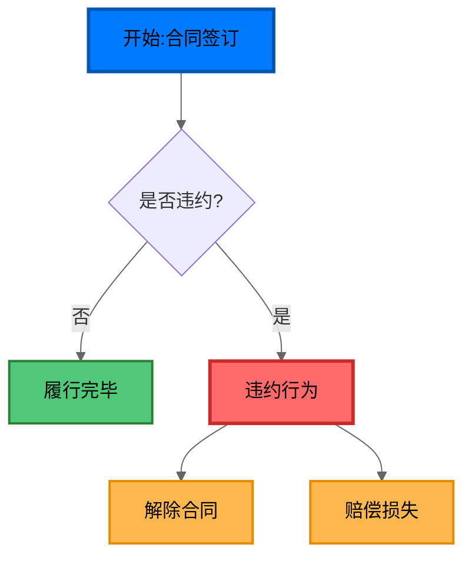
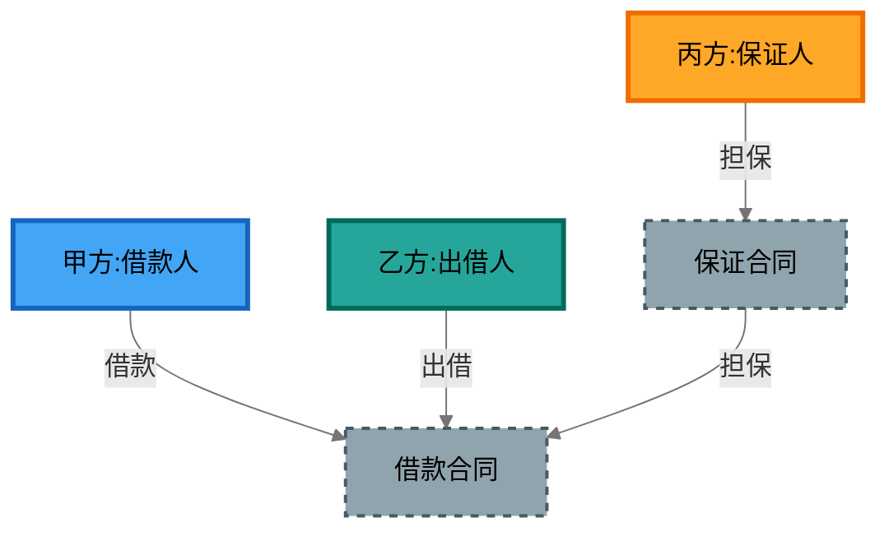
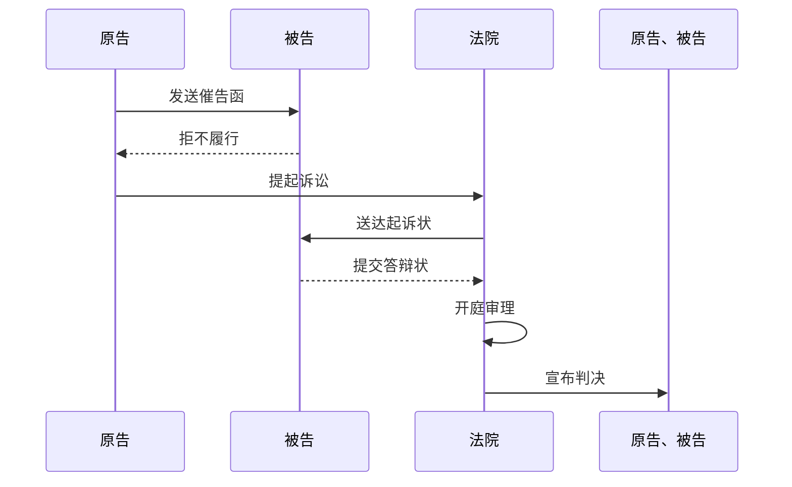
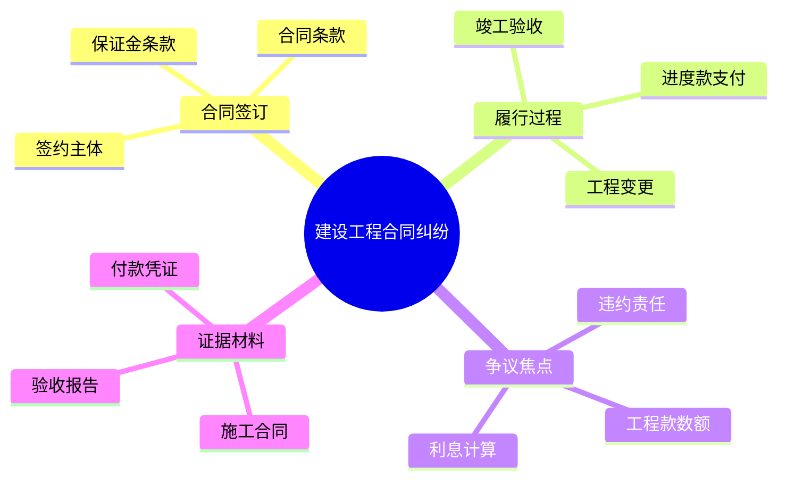
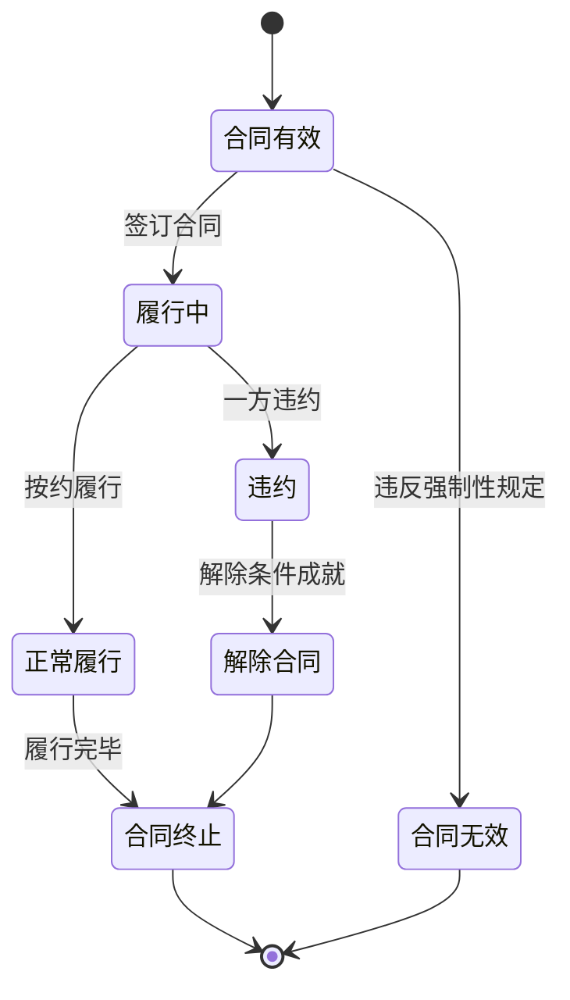
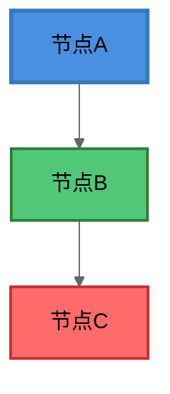

# 诉讼可视化 Skill

## 概述

本 skill 提供诉讼案件的可视化分析方法，帮助制作案件事实图和法律关系图，采用 Mermaid 语言生成图表代码块。

## 核心特点

### 1. 两张图工作法
- 案件事实图：以时间线为基础，客观反映案件事实
- 法律关系图：以主体关系为核心，展示法律关系结构

### 2. 图表说话
- 通过图表结构、位置、颜色传达观点

### 3. 促进良性循环
- 提升专业能力 → 获得认可 → 建立信任

### 4. 色彩与美观设计
- 使用颜色区分不同主体、不同性质的行为/关系
- 确保所有节点文字为黑色，保证可读性
- 避免单色输出，使用丰富配色方案
- 遵循配色原则：不超过5-6种颜色，保持同一案件配色一致

### 5. 智能分析
- 用户未指定图表类型时：分析案情，推荐多种图表组合
- 用户指定图表类型时：仅制作指定的图表

---

## 支持的 Mermaid 图表类型

### 1. Flowchart (流程图)
**语法**: `flowchart TD` 或 `LR`

**用途**: 用于程序梳理、决策流程、行为分析

**示例**:


### 2. Graph (关系图)
**语法**: `graph TD` 或 `LR`

**用途**: 用于展示主体之间的法律关系、交易结构

**示例**:


### 3. Sequence (序列图)
**语法**: `sequenceDiagram`

**用途**: 用于展示时序、交互过程、程序流转

**示例**:


### 4. Mindmap (思维导图)
**语法**: `mindmap`

**用途**: 用于证据整理、思路梳理、案件分析框架

**示例**:


### 5. Timechart (时序图)
**语法**: `timechart`

**用途**: 用于案件阶段划分、状态变化展示

**示例**:
```mermaid
%%{init: {'themeVariables': {
  'primaryColor': '#FFF3E0',
  'primaryTextColor': '#000000',
  'primaryBorderColor': '#FF9800',
  'sectionBkgColor': '#FF7043',
  'altSectionBkgColor': '#8BC34A',
  'tertiaryColor': '#42A5F5'
}}}%%
timechart
    title 诉讼程序时间线
    section 一审程序
        起诉阶段 : 2023-01-15 : 提交起诉状
        立案阶段 : 2023-01-20 : 法院立案
        审理阶段 : 2023-02-10 : 开庭审理
    section 二审程序
        上诉阶段 : 2023-03-05 : 提交上诉状
        二审审理 : 2023-04-20 : 二审开庭
    section 执行程序
        申请执行 : 2023-05-15 : 立案执行
        执行到位 : 2023-06-30 : 款项到账
```

### 6. StateDiagram (状态图)
**语法**: `stateDiagram-v2`

**用途**: 用于展示法律状态变化、条件触发关系

**示例**:


---

## 配色系统

### 全局主题配置

使用 `%%{init: {'themeVariables': {...}}` 设置全局主题变量：



### 样式类定义

使用 `classDef` 定义可复用的样式类：

```mermaid
classDef partyA fill:#42A5F5,stroke:#1565C0,color:#000000,stroke-width:3px
classDef partyB fill:#26A69A,stroke:#00695C,color:#000000,stroke-width:3px
classDef highlight fill:#FF6B6B,stroke:#c92a2a,color:#000000,stroke-width:3px
```

### 关键配色原则

1. **所有节点文字黑色**: `color:#000000` 确保在任何背景色上都清晰可读
2. **主体区分**: 不同主体使用不同色系
3. **情感表达**: 争议/违约用警示色（红色），正常履行用安全色（绿色/蓝色）
4. **一致性**: 同一案件中多张图表配色保持一致
5. **色彩限制**: 不超过 5-6 种主色，避免视觉混乱

### 用户自定义颜色

如果用户在请求中指定了颜色需求，使用用户指定的颜色方案。用户可以通过以下方式指定：

- "用红色突出争议焦点"
- "甲方用蓝色，乙方用绿色"
- "违约行为用红色，正常履行用绿色"

---

## 可执行步骤

### 第一步：明确目标与对象
- 确定图表呈送对象（法官、客户、团队内部）
- 根据对象选择图表类型和内容侧重

### 第二步：收集素材
- 全面罗列：收集所有相关事件、主体、时间节点
- 逻辑整合：按时间、主体、事件性质归类
- 精简内容：删除无关信息，保留核心事实

### 第三步：设计图表结构
- 时间图：确定时间轴方向、设计纵向/横向划分
- 关系图：确定主体节点布局、设计关系连线和箭头
- 流程图：确定节点顺序、设计决策节点、设计分支

### 第四步：确定配色方案
- **配色原则**：
  1. 主体区分：不同主体使用不同颜色
  2. 突出重点：关键内容使用醒目颜色
  3. 表达情感：争议/违约用警示色（红色），正常履行用安全色（绿色/蓝色）
  4. 保持一致性：同一案件中多张图表配色一致

---

## 智能分析逻辑

### 用户未指定图表类型时

分析案情要素，推荐合适的图表组合：

1. **时间要素为主** → 推荐时间图 + 状态图
2. **主体关系为主** → 推荐关系图 + 思维导图
3. **程序流程为主** → 推荐流程图 + 序列图
4. **综合复杂案件** → 推荐多图组合

### 用户指定图表类型时

仅制作用户指定的图表类型，不再分析推荐其他类型。

---

## 使用场景

### 案件事实可视化
### 法律关系分析
### 庭审准备
### 合同风险可视化（与合同审查/起草结合）

---

## 自动触发场景

当用户输入包含以下关键词时，自动激活本 skill：

### 直接请求类（动词触发）
- "帮我画一个XX关系图"
- "画一个XX案件事实图"
- "用可视化的方式梳理一下XX的关系"
- "制作一张时间图"
- "设计一个流程图"
- "可视化XX案情"

### 分析描述类
- "这个案件关系复杂，梳理一下"
- "主体太多，画图说明"
- "时间线很乱，可视化一下"
- "交易结构复杂，画图展示"

### 结合场景类
- "需要准备庭审图表"
- "向法官/客户展示这个关系"

---

## 部署路径

```
/Users/ziyang/Desktop/contract review/contract-skills/litigation-visualization
```

本 skill 是绝对独立的 skill，可单独部署到 AGENT 中调用，不依赖合同审查/起草 skill。

---

## 注意事项

1. **文字可读性**：所有节点必须设置黑色文字 `color:#000000`，确保在任何背景色上都能清晰显示
2. **配色一致性**：使用 `%%{init: {'themeVariables': {...}}` 全局主题，保持统一配色
3. **输出格式**：输出直接是 mermaid 代码块，不写入文件
4. **图表类型选择**：根据案件核心要素选择合适的图表类型
5. **避免过度复杂**：保持图表简洁，重点突出核心信息
6. **自定义颜色**：用户指定颜色需求时，优先使用用户指定的配色方案
