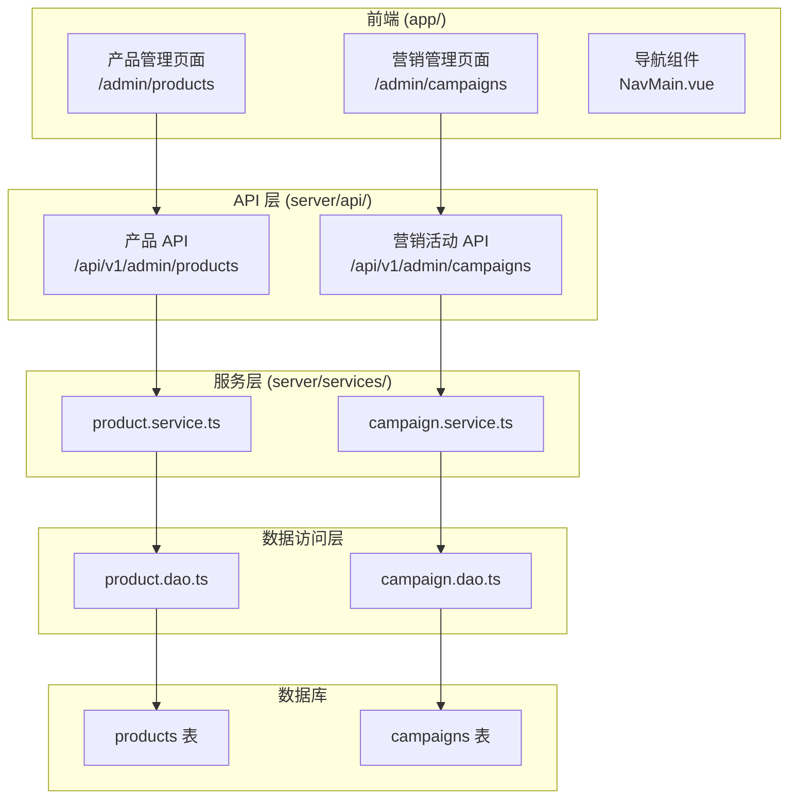

# 设计文档

## 概述

本设计文档描述管理后台产品管理和营销管理功能的技术实现方案。该功能基于现有的 Nuxt.js 4 全栈架构，使用 Vue 3 Composition API、Shadcn-vue UI 组件库和 Prisma ORM。

## 架构

### 整体架构



### 页面路由结构

```
/admin/products          - 产品管理列表页
/admin/campaigns         - 营销活动管理列表页
```

## 组件和接口

### 前端组件

#### 1. 产品管理页面 (`app/pages/admin/products/index.vue`)

**职责**：展示产品列表，提供 CRUD 操作入口

**状态管理**：
- `products`: 产品列表数据
- `pagination`: 分页信息
- `filters`: 筛选条件（类型、状态）
- `loading`: 加载状态
- `dialogOpen`: 对话框开关状态
- `editingProduct`: 当前编辑的产品

**主要方法**：
- `loadProducts()`: 加载产品列表
- `handleCreate()`: 创建产品
- `handleEdit(product)`: 编辑产品
- `handleToggleStatus(product)`: 切换状态
- `handleDelete(product)`: 删除产品

#### 2. 营销活动管理页面 (`app/pages/admin/campaigns/index.vue`)

**职责**：展示营销活动列表，提供 CRUD 操作入口

**状态管理**：
- `campaigns`: 营销活动列表数据
- `pagination`: 分页信息
- `filters`: 筛选条件（类型、状态）
- `loading`: 加载状态
- `dialogOpen`: 对话框开关状态
- `editingCampaign`: 当前编辑的营销活动

**主要方法**：
- `loadCampaigns()`: 加载营销活动列表
- `handleCreate()`: 创建营销活动
- `handleEdit(campaign)`: 编辑营销活动
- `handleToggleStatus(campaign)`: 切换状态
- `handleDelete(campaign)`: 删除营销活动

### API 接口

#### 产品管理 API

| 方法 | 路径 | 描述 |
|------|------|------|
| GET | `/api/v1/admin/products` | 获取产品列表（分页、筛选） |
| GET | `/api/v1/admin/products/:id` | 获取单个产品详情 |
| POST | `/api/v1/admin/products` | 创建产品 |
| PUT | `/api/v1/admin/products/:id` | 更新产品 |
| PATCH | `/api/v1/admin/products/:id/status` | 切换产品状态 |
| DELETE | `/api/v1/admin/products/:id` | 删除产品 |

#### 营销活动管理 API

| 方法 | 路径 | 描述 |
|------|------|------|
| GET | `/api/v1/admin/campaigns` | 获取营销活动列表（分页、筛选） |
| GET | `/api/v1/admin/campaigns/:id` | 获取单个营销活动详情 |
| POST | `/api/v1/admin/campaigns` | 创建营销活动 |
| PUT | `/api/v1/admin/campaigns/:id` | 更新营销活动 |
| PATCH | `/api/v1/admin/campaigns/:id/status` | 切换营销活动状态 |
| DELETE | `/api/v1/admin/campaigns/:id` | 删除营销活动 |

### 服务层扩展

#### ProductService 扩展

```typescript
// 获取产品列表（管理后台用）
getProductsForAdminService(options: {
    page?: number
    pageSize?: number
    type?: ProductType
    status?: ProductStatus
}): Promise<{ list: ProductInfo[]; total: number }>

// 创建产品
createProductService(data: CreateProductParams): Promise<ProductInfo>

// 更新产品
updateProductService(id: number, data: UpdateProductParams): Promise<ProductInfo>

// 切换产品状态
toggleProductStatusService(id: number): Promise<ProductInfo>

// 删除产品
deleteProductService(id: number): Promise<void>
```

#### CampaignService 扩展

```typescript
// 获取营销活动列表（管理后台用）
getCampaignsForAdminService(options: {
    page?: number
    pageSize?: number
    type?: CampaignType
    status?: CampaignStatus
}): Promise<{ list: CampaignInfo[]; total: number }>

// 创建营销活动
createCampaignService(data: CreateCampaignParams): Promise<CampaignInfo>

// 更新营销活动
updateCampaignService(id: number, data: UpdateCampaignParams): Promise<CampaignInfo>

// 切换营销活动状态
toggleCampaignStatusService(id: number): Promise<CampaignInfo>

// 删除营销活动
deleteCampaignService(id: number): Promise<void>
```

## 数据模型

### 产品数据模型（已存在）

```typescript
interface ProductInfo {
    id: number
    name: string
    description: string | null
    type: ProductType           // 1-会员商品, 2-积分商品
    category: string | null
    levelId: number | null      // 关联会员级别
    levelName: string | null
    priceMonthly: number | null // 月度价格
    priceYearly: number | null  // 年度价格
    defaultDuration: number | null
    unitPrice: number | null    // 积分单价
    originalPriceMonthly: number | null
    originalPriceYearly: number | null
    originalUnitPrice: number | null
    minQuantity: number | null
    maxQuantity: number | null
    purchaseLimit: number | null
    pointAmount: number | null
    giftPoint: number | null
    status: ProductStatus       // 0-下架, 1-上架
    sortOrder: number
}
```

### 营销活动数据模型（已存在）

```typescript
interface CampaignInfo {
    id: number
    name: string
    type: CampaignType          // 1-注册赠送, 2-邀请奖励, 3-活动奖励
    levelId: number | null      // 赠送会员级别
    levelName: string | null
    duration: number | null     // 赠送会员时长（天）
    giftPoint: number | null    // 赠送积分
    startAt: string             // 活动开始时间
    endAt: string | null        // 活动结束时间，null 代表长期活动
    status: CampaignStatus      // 0-禁用, 1-启用
    remark: string | null
}
```

### 类型扩展

```typescript
// shared/types/campaign.ts 新增
interface UpdateCampaignParams {
    name?: string
    type?: CampaignType
    levelId?: number | null
    duration?: number | null
    giftPoint?: number | null
    startAt?: Date
    endAt?: Date
    status?: CampaignStatus
    remark?: string | null
}
```

## 正确性属性

*正确性属性是系统在所有有效执行中应保持为真的特征或行为。属性作为人类可读规范和机器可验证正确性保证之间的桥梁。*

### Property 1: 产品筛选结果一致性

*对于任意*产品类型筛选条件和状态筛选条件，API 返回的所有产品都应满足指定的筛选条件。

**Validates: Requirements 1.5, 1.6**

### Property 2: 产品 CRUD 往返一致性

*对于任意*有效的产品创建数据，创建产品后通过 ID 查询应返回相同的数据；更新产品后查询应返回更新后的数据；删除产品后查询应返回空。

**Validates: Requirements 2.4, 3.2, 5.2**

### Property 3: 产品状态切换幂等性

*对于任意*产品，切换状态两次后应恢复到原始状态。

**Validates: Requirements 4.1**

### Property 4: 营销活动筛选结果一致性

*对于任意*营销活动类型筛选条件和状态筛选条件，API 返回的所有营销活动都应满足指定的筛选条件。

**Validates: Requirements 6.5, 6.6**

### Property 5: 营销活动 CRUD 往返一致性

*对于任意*有效的营销活动创建数据，创建营销活动后通过 ID 查询应返回相同的数据；更新营销活动后查询应返回更新后的数据；删除营销活动后查询应返回空。

**Validates: Requirements 7.2, 8.2, 10.2**

### Property 6: 营销活动时间验证

*对于任意*填写了结束时间且结束时间早于开始时间的营销活动数据，创建或更新操作应被拒绝；结束时间留空代表长期活动，应被允许。

**Validates: Requirements 7.4**

### Property 7: 营销活动状态切换幂等性

*对于任意*营销活动，切换状态两次后应恢复到原始状态。

**Validates: Requirements 9.1**

### Property 8: 分页数据完整性

*对于任意*分页参数（page, pageSize），返回的数据条数应不超过 pageSize，且 total 应等于所有符合条件的记录总数。

**Validates: Requirements 1.4, 6.4**

## 错误处理

### API 响应格式

所有 API 接口统一返回 HTTP 200 状态码，通过响应体中的业务错误码区分成功和失败：

**成功响应**：
```typescript
{
    success: true,
    message: "操作成功",
    data: { ... }
}
```

**失败响应**：
```typescript
{
    success: false,
    code: 400,  // 业务错误码
    message: "错误描述"
}
```

### 业务错误码

| 错误码 | 描述 |
|--------|------|
| 400 | 请求参数验证失败 |
| 401 | 未授权访问 |
| 404 | 资源不存在 |
| 500 | 服务器内部错误 |

### 验证规则

**产品验证**：
- `name`: 必填，最大 100 字符
- `type`: 必填，枚举值 1 或 2
- `priceMonthly/priceYearly`: 会员商品至少填写一个
- `unitPrice`: 积分商品必填
- `status`: 枚举值 0 或 1

**营销活动验证**：
- `name`: 必填，最大 100 字符
- `type`: 必填，枚举值 1、2 或 3
- `startAt`: 必填，有效日期
- `endAt`: 可选，有效日期；如果填写则必须晚于 startAt；留空代表长期活动
- `status`: 枚举值 0 或 1

## 测试策略

### 单元测试

- 测试服务层的业务逻辑
- 测试验证规则的边界情况
- 测试数据转换函数

### 属性测试

使用 fast-check 进行属性测试，每个属性测试运行 100 次迭代。

**测试框架**: vitest + fast-check

**测试文件位置**: 
- `tests/server/product/product.admin.service.test.ts`
- `tests/server/campaign/campaign.admin.service.test.ts`

### 测试标注格式

```typescript
/**
 * Feature: admin-product-campaign-management
 * Property N: [属性标题]
 * Validates: Requirements X.Y
 */
```
