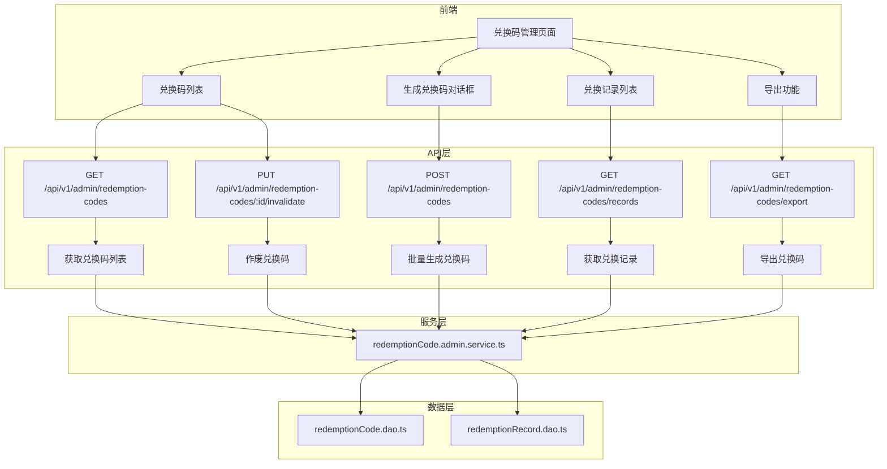

# 设计文档

## 概述

管理后台兑换码管理功能的技术设计，包括 API 接口设计、数据层扩展、前端页面实现。该功能允许管理员生成兑换码、查看兑换码列表、作废兑换码、查看兑换记录以及导出兑换码数据。

## 架构

### 整体架构



### 技术栈

- 前端：Vue 3 + Nuxt 4 + shadcn-vue + TailwindCSS v4
- 后端：Nuxt Server API + Prisma ORM
- 数据验证：Zod
- 日期处理：dayjs

## 组件和接口

### API 接口设计

#### 1. 获取兑换码列表

```
GET /api/v1/admin/redemption-codes
```

**请求参数：**
| 参数 | 类型 | 必填 | 说明 |
|------|------|------|------|
| page | number | 否 | 页码，默认 1 |
| pageSize | number | 否 | 每页数量，默认 20，最大 100 |
| status | number | 否 | 状态筛选：1-有效，2-已使用，3-已过期，4-已作废 |
| type | number | 否 | 类型筛选：1-仅会员，2-仅积分，3-会员和积分 |
| code | string | 否 | 兑换码搜索 |

**响应数据：**
```typescript
{
  success: true,
  message: "获取成功",
  data: {
    items: RedemptionCodeAdminInfo[],
    total: number,
    page: number,
    pageSize: number,
    totalPages: number
  }
}
```

#### 2. 批量生成兑换码

```
POST /api/v1/admin/redemption-codes
```

**请求参数：**
| 参数 | 类型 | 必填 | 说明 |
|------|------|------|------|
| type | number | 是 | 类型：1-仅会员，2-仅积分，3-会员和积分 |
| quantity | number | 是 | 生成数量，1-1000 |
| levelId | number | 条件 | 会员级别 ID（type=1或3时必填） |
| duration | number | 条件 | 会员时长天数（type=1或3时必填） |
| pointAmount | number | 条件 | 积分数量（type=2或3时必填） |
| expiredAt | string | 否 | 过期时间，ISO 格式 |
| remark | string | 否 | 备注 |

**响应数据：**
```typescript
{
  success: true,
  message: "生成成功",
  data: {
    codes: string[],  // 生成的兑换码列表
    count: number     // 生成数量
  }
}
```

#### 3. 作废兑换码

```
PUT /api/v1/admin/redemption-codes/:id/invalidate
```

**路径参数：**
| 参数 | 类型 | 说明 |
|------|------|------|
| id | number | 兑换码 ID |

**响应数据：**
```typescript
{
  success: true,
  message: "作废成功"
}
```

#### 4. 获取兑换记录列表

```
GET /api/v1/admin/redemption-codes/records
```

**请求参数：**
| 参数 | 类型 | 必填 | 说明 |
|------|------|------|------|
| page | number | 否 | 页码，默认 1 |
| pageSize | number | 否 | 每页数量，默认 20，最大 100 |
| userId | number | 否 | 用户 ID 筛选 |
| code | string | 否 | 兑换码搜索 |

**响应数据：**
```typescript
{
  success: true,
  message: "获取成功",
  data: {
    items: RedemptionRecordAdminInfo[],
    total: number,
    page: number,
    pageSize: number,
    totalPages: number
  }
}
```

#### 5. 导出兑换码

```
GET /api/v1/admin/redemption-codes/export
```

**请求参数：**
| 参数 | 类型 | 必填 | 说明 |
|------|------|------|------|
| status | number | 否 | 状态筛选 |
| type | number | 否 | 类型筛选 |
| code | string | 否 | 兑换码搜索 |
| limit | number | 否 | 导出数量限制，默认 10000 |

**响应：** CSV 文件下载

### 服务层设计

#### redemptionCode.admin.service.ts

新建管理员专用服务文件，避免与现有用户端服务混淆：

```typescript
// 批量生成兑换码
generateRedemptionCodesService(params: GenerateCodesParams): Promise<GenerateCodesResult>

// 获取兑换码列表（管理员）
getRedemptionCodesAdminService(options: QueryOptions): Promise<PaginatedResult>

// 作废兑换码
invalidateRedemptionCodeService(id: number): Promise<void>

// 获取兑换记录列表（管理员）
getRedemptionRecordsAdminService(options: QueryOptions): Promise<PaginatedResult>

// 导出兑换码
exportRedemptionCodesService(options: ExportOptions): Promise<ExportResult>
```

### 数据层扩展

在现有 `redemptionCode.dao.ts` 中添加管理员专用方法（复用现有方法，扩展筛选条件）。

## 数据模型

### 复用现有类型定义

项目已在 `shared/types/redemption.ts` 中定义了以下类型，可直接复用：

- `RedemptionCodeType` - 兑换码类型枚举
- `RedemptionCodeStatus` - 兑换码状态枚举
- `RedemptionCodeInfo` - 兑换码信息接口
- `RedemptionRecordInfo` - 兑换记录信息接口
- `CreateRedemptionCodeParams` - 创建兑换码参数接口

### 新增管理员视角的扩展类型

在 `shared/types/redemption.ts` 中扩展以下类型：

```typescript
/** 管理员视角的兑换码信息（扩展基础信息） */
export interface RedemptionCodeAdminInfo extends RedemptionCodeInfo {
    typeName: string      // 类型名称（仅会员/仅积分/会员和积分）
    statusName: string    // 状态名称（有效/已使用/已过期/已作废）
    createdAt: string     // 创建时间
    updatedAt: string     // 更新时间
}

/** 管理员视角的兑换记录信息（扩展基础信息） */
export interface RedemptionRecordAdminInfo extends RedemptionRecordInfo {
    userName: string | null  // 用户名
    userPhone: string        // 用户手机号
    typeName: string         // 类型名称
}

/** 批量生成兑换码参数 */
export interface GenerateCodesParams {
    type: RedemptionCodeType
    quantity: number
    levelId?: number
    duration?: number
    pointAmount?: number
    expiredAt?: Date
    remark?: string
}

/** 批量生成兑换码结果 */
export interface GenerateCodesResult {
    codes: string[]
    count: number
}
```

### 复用现有 DAO 方法

现有 `redemptionCode.dao.ts` 已实现以下方法，可直接复用：

- `createRedemptionCodeDao` - 创建单个兑换码
- `findRedemptionCodeByCodeDao` - 通过码值查询
- `findRedemptionCodeByIdDao` - 通过 ID 查询
- `updateRedemptionCodeStatusDao` - 更新状态
- `findAllRedemptionCodesDao` - 分页查询（需扩展筛选条件）

### 需要新增的 DAO 方法

```typescript
// 批量创建兑换码
bulkCreateRedemptionCodesDao(codes: Prisma.redemptionCodesCreateManyInput[]): Promise<number>

// 查询兑换码列表（扩展筛选条件）
findRedemptionCodesWithFiltersDao(options: {
    page?: number
    pageSize?: number
    status?: RedemptionCodeStatus
    type?: RedemptionCodeType
    code?: string
}): Promise<{ list: redemptionCodes[]; total: number }>

// 查询兑换记录列表（管理员视角）
findRedemptionRecordsAdminDao(options: {
    page?: number
    pageSize?: number
    userId?: number
    code?: string
}): Promise<{ list: any[]; total: number }>
```

## 正确性属性

*正确性属性是系统在所有有效执行中应保持为真的特征或行为，是人类可读规范与机器可验证正确性保证之间的桥梁。*

### Property 1: 兑换码唯一性

*对于任意* 批量生成的兑换码集合，所有生成的兑换码值应互不相同，且与数据库中已存在的兑换码不重复。

**Validates: Requirements 2.8**

### Property 2: 生成数量一致性

*对于任意* 有效的生成请求，返回的兑换码数量应等于请求的 quantity 参数值。

**Validates: Requirements 2.7**

### Property 3: 类型参数完整性

*对于任意* 生成请求，当 type 为仅会员(1)或会员和积分(3)时，levelId 和 duration 必须存在且有效；当 type 为仅积分(2)或会员和积分(3)时，pointAmount 必须存在且大于 0。

**Validates: Requirements 2.1, 2.2, 2.3**

### Property 4: 作废状态转换

*对于任意* 兑换码，只有状态为有效(1)的兑换码才能被作废，作废后状态变为已作废(4)。

**Validates: Requirements 3.1, 3.2, 3.3**

### Property 5: 分页数据完整性

*对于任意* 分页查询请求，返回的 items 数量应不超过 pageSize，且 total 应等于符合筛选条件的总记录数。

**Validates: Requirements 1.5, 4.4**

### Property 6: 导出数量限制

*对于任意* 导出请求，导出的记录数量应不超过 10000 条。

**Validates: Requirements 5.3**

## 错误处理

### API 业务错误码

API 统一返回 HTTP 200，通过响应体中的 `success` 和 `code` 字段区分成功/失败：

```typescript
// 成功响应
{
  success: true,
  message: "操作成功",
  data: { ... }
}

// 失败响应
{
  success: false,
  code: 400,
  message: "错误信息"
}
```

| 业务码 | 说明 |
|--------|------|
| 400 | 参数错误（缺少必填参数、参数格式错误等） |
| 401 | 未登录 |
| 403 | 无权限 |
| 404 | 兑换码不存在 |
| 409 | 状态冲突（如已使用的兑换码不能作废） |
| 500 | 服务器内部错误 |

### 业务错误处理

1. **生成兑换码失败**：记录日志，返回错误信息，不创建任何兑换码
2. **作废失败**：返回具体原因（已使用、已作废等）
3. **导出失败**：返回错误信息，不生成文件

## 测试策略

### 单元测试

使用 vitest 进行单元测试，覆盖：

1. **服务层测试**
   - 兑换码生成逻辑
   - 作废逻辑的状态校验
   - 分页查询逻辑

2. **数据层测试**
   - 批量创建兑换码
   - 筛选查询
   - 状态更新

### 属性测试

使用 fast-check 进行属性测试，验证：

1. **兑换码唯一性**：生成的兑换码不重复
2. **生成数量一致性**：生成数量与请求一致
3. **类型参数完整性**：参数验证逻辑正确
4. **状态转换正确性**：只有有效状态可作废

### 测试配置

- 每个属性测试运行 100 次迭代
- 测试文件位置：`tests/server/redemption/`
- 测试标签格式：`Feature: admin-redemption-codes, Property N: {property_text}`

### API 测试

使用 vitest 进行 API 集成测试：

1. 权限验证测试
2. 参数验证测试
3. 业务流程测试

## 前端页面设计

### 页面结构

```
app/pages/admin/redemption-codes/
├── index.vue          # 兑换码列表页面
└── records.vue        # 兑换记录页面
```

### 兑换码列表页面功能

1. **筛选区域**
   - 状态下拉选择
   - 类型下拉选择
   - 兑换码搜索输入框
   - 搜索按钮
   - 导出按钮
   - 生成兑换码按钮

2. **数据表格**
   - 兑换码
   - 类型
   - 会员级别
   - 时长
   - 积分数量
   - 状态
   - 过期时间
   - 备注
   - 创建时间
   - 操作（作废）

3. **生成兑换码对话框**
   - 类型选择
   - 会员级别选择（条件显示）
   - 时长输入（条件显示）
   - 积分数量输入（条件显示）
   - 生成数量输入
   - 过期时间选择
   - 备注输入

4. **分页组件**
   - 使用全局分页组件 `<GeneralPagination>`
   - Props: `currentPage`, `pageSize`, `total`
   - Event: `@change` 处理页码变化

### 兑换记录页面功能

1. **筛选区域**
   - 用户搜索
   - 兑换码搜索
   - 搜索按钮

2. **数据表格**
   - 用户信息
   - 兑换码
   - 类型
   - 兑换内容
   - 兑换时间

3. **分页组件**
   - 使用全局分页组件 `<GeneralPagination>`
