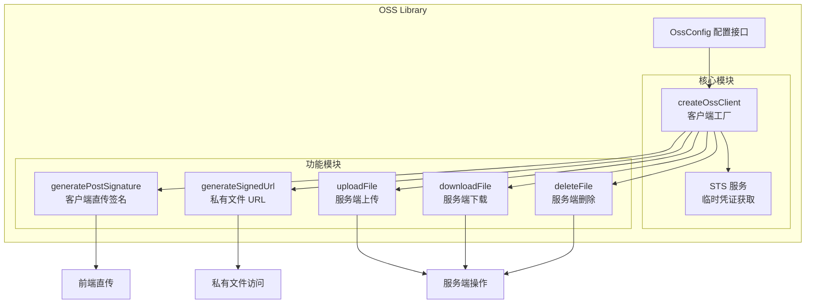

# 设计文档

## 概述

本设计文档描述阿里云 OSS 通用库的架构和实现方案。该库采用纯函数式设计，所有配置在调用时传入，不依赖环境变量或全局状态。库将提供客户端直传签名生成、服务端文件操作（上传/下载/删除）以及私有文件 URL 签名等功能。

## 架构



## 组件和接口

### 配置接口

```typescript
/**
 * OSS 基础配置
 */
interface OssBaseConfig {
  /** Access Key ID */
  accessKeyId: string
  /** Access Key Secret */
  accessKeySecret: string
  /** Bucket 名称 */
  bucket: string
  /** 区域，如 'cn-hangzhou' */
  region: string
}

/**
 * STS 配置（可选）
 */
interface OssStsConfig {
  /** STS 角色 ARN */
  roleArn: string
  /** 会话名称（可选） */
  roleSessionName?: string
  /** 凭证有效期（秒），默认 3600 */
  durationSeconds?: number
}

/**
 * 完整 OSS 配置
 */
interface OssConfig extends OssBaseConfig {
  /** STS 配置，提供时使用 STS 临时凭证 */
  sts?: OssStsConfig
}

/**
 * 回调配置
 */
interface CallbackConfig {
  /** 回调 URL */
  callbackUrl: string
  /** 回调体模板，支持 OSS 变量如 ${object}、${size} 等 */
  callbackBody?: string
  /** 回调体类型，默认 'application/x-www-form-urlencoded' */
  callbackBodyType?: 'application/x-www-form-urlencoded' | 'application/json'
  /** 自定义回调参数 */
  callbackVar?: Record<string, string>
}

/**
 * 策略条件
 */
interface PolicyConditions {
  /** 文件大小范围 [最小, 最大]（字节） */
  contentLengthRange?: [number, number]
  /** 允许的 Content-Type 列表 */
  contentType?: string[]
  /** 其他自定义条件 */
  [key: string]: unknown
}

/**
 * 客户端直传签名选项
 */
interface PostSignatureOptions {
  /** 文件目录前缀 */
  dir?: string
  /** 签名过期时间（分钟），默认 10 */
  expirationMinutes?: number
  /** 回调配置 */
  callback?: CallbackConfig
  /** 策略条件 */
  conditions?: PolicyConditions
}

/**
 * 客户端直传签名结果
 */
interface PostSignatureResult {
  /** OSS 上传地址 */
  host: string
  /** Base64 编码的策略 */
  policy: string
  /** 签名版本 */
  signatureVersion: string
  /** 凭证信息 */
  credential: string
  /** 签名日期 */
  date: string
  /** 签名 */
  signature: string
  /** 文件目录前缀 */
  dir: string
  /** Base64 编码的回调配置（可选） */
  callback?: string
  /** STS 安全令牌（使用 STS 时） */
  securityToken?: string
}

/**
 * 签名 URL 选项
 */
interface SignedUrlOptions {
  /** URL 过期时间（秒），默认 3600 */
  expires?: number
  /** HTTP 方法，默认 'GET' */
  method?: 'GET' | 'PUT' | 'HEAD'
  /** 响应头设置 */
  response?: {
    contentType?: string
    contentDisposition?: string
  }
}

/**
 * 上传选项
 */
interface UploadOptions {
  /** Content-Type */
  contentType?: string
  /** 自定义元数据 */
  meta?: Record<string, string>
  /** 存储类型 */
  storageClass?: 'Standard' | 'IA' | 'Archive'
}

/**
 * 上传结果
 */
interface UploadResult {
  /** 文件路径 */
  name: string
  /** ETag */
  etag: string
  /** 文件 URL */
  url: string
}

/**
 * 下载选项
 */
interface DownloadOptions {
  /** 下载范围，格式 'bytes=0-100' */
  range?: string
}

/**
 * 删除结果
 */
interface DeleteResult {
  /** 删除的文件路径列表 */
  deleted: string[]
}
```

### 核心函数

```typescript
/**
 * 创建 OSS 客户端实例
 * 如果配置了 STS，会自动获取临时凭证
 */
async function createOssClient(config: OssConfig): Promise<OssClientInstance>

/**
 * 生成客户端直传签名
 * @param config OSS 配置
 * @param options 签名选项
 * @returns 签名结果，用于前端直传
 */
async function generatePostSignature(
  config: OssConfig,
  options?: PostSignatureOptions
): Promise<PostSignatureResult>

/**
 * 生成私有文件的签名 URL
 * @param config OSS 配置
 * @param objectPath 文件路径
 * @param options URL 选项
 * @returns 带签名的 URL
 */
async function generateSignedUrl(
  config: OssConfig,
  objectPath: string,
  options?: SignedUrlOptions
): Promise<string>

/**
 * 上传文件到 OSS
 * @param config OSS 配置
 * @param objectPath 目标文件路径
 * @param data 文件数据（Buffer 或 Readable 流）
 * @param options 上传选项
 * @returns 上传结果
 */
async function uploadFile(
  config: OssConfig,
  objectPath: string,
  data: Buffer | Readable,
  options?: UploadOptions
): Promise<UploadResult>

/**
 * 从 OSS 下载文件
 * @param config OSS 配置
 * @param objectPath 文件路径
 * @param options 下载选项
 * @returns 文件数据 Buffer
 */
async function downloadFile(
  config: OssConfig,
  objectPath: string,
  options?: DownloadOptions
): Promise<Buffer>

/**
 * 从 OSS 下载文件（流式）
 * @param config OSS 配置
 * @param objectPath 文件路径
 * @param options 下载选项
 * @returns 可读流
 */
async function downloadFileStream(
  config: OssConfig,
  objectPath: string,
  options?: DownloadOptions
): Promise<Readable>

/**
 * 删除 OSS 文件
 * @param config OSS 配置
 * @param objectPath 文件路径或路径数组
 * @returns 删除结果
 */
async function deleteFile(
  config: OssConfig,
  objectPath: string | string[]
): Promise<DeleteResult>
```

## 数据模型

### OSS 客户端实例

```typescript
interface OssClientInstance {
  /** ali-oss 客户端实例 */
  client: any
  /** 配置信息 */
  config: OssConfig
  /** STS 临时凭证（如果使用 STS） */
  credentials?: {
    accessKeyId: string
    accessKeySecret: string
    securityToken: string
    expiration: Date
  }
}
```

### 内部工具函数

```typescript
// 格式化日期为 UTC 字符串（OSS V4 签名格式）
function formatDateToUTC(date: Date): string

// 获取标准区域名称（移除 'oss-' 前缀）
function getStandardRegion(region: string): string

// 生成 x-oss-credential
function getCredential(date: string, region: string, accessKeyId: string): string

// 验证配置完整性
function validateConfig(config: OssConfig): void
```


## 正确性属性

*正确性属性是系统在所有有效执行中应该保持为真的特征或行为——本质上是关于系统应该做什么的形式化陈述。属性作为人类可读规范和机器可验证正确性保证之间的桥梁。*

### Property 1: 配置验证完整性

*对于任意* 配置对象，如果缺少 accessKeyId、accessKeySecret、bucket 或 region 中的任何一个必需字段，validateConfig 函数应该抛出包含缺少字段名称的错误。

**验证: 需求 1.1, 1.2**

### Property 2: 签名结果结构完整性

*对于任意* 有效的 OSS 配置和签名选项，generatePostSignature 返回的对象应该包含 host、policy、signatureVersion、credential、date、signature 和 dir 字段，且当使用 STS 配置时还应包含 securityToken 字段。

**验证: 需求 2.1, 2.4**

### Property 3: 签名过期时间一致性

*对于任意* 指定的过期时间（分钟），生成的 policy 中的 expiration 字段应该等于当前时间加上指定的分钟数（允许 1 秒误差）。

**验证: 需求 2.2**

### Property 4: 回调配置编码正确性

*对于任意* 包含 callbackUrl 的回调配置，返回的 callback 字段应该是有效的 Base64 编码字符串，解码后的 JSON 对象应该包含原始的 callbackUrl 和所有自定义参数。

**验证: 需求 3.1, 3.2**

### Property 5: 无回调时结果不含 callback 字段

*对于任意* 不包含回调配置的签名请求，返回的结果对象不应该包含 callback 字段或其值应为 undefined。

**验证: 需求 3.3**

### Property 6: 目录前缀传递正确性

*对于任意* 指定的目录前缀字符串，返回结果的 dir 字段应该与输入的目录前缀完全一致。

**验证: 需求 4.1**

### Property 7: 策略条件合并正确性

*对于任意* 包含 contentLengthRange 或 contentType 的策略条件，生成的 policy 解码后应该包含对应的 content-length-range 或 content-type 条件。

**验证: 需求 5.1, 5.2, 5.3**

### Property 8: 签名 URL 结构正确性

*对于任意* 有效的文件路径（包括特殊字符），generateSignedUrl 返回的 URL 应该是有效的 URL 格式，包含签名相关的查询参数，且路径部分被正确编码。

**验证: 需求 6.1, 6.4**

### Property 9: 签名 URL 过期时间正确性

*对于任意* 指定的过期时间（秒），生成的签名 URL 中的过期参数应该反映指定的过期时间。

**验证: 需求 6.2**

### Property 10: 上传结果结构正确性

*对于任意* 成功的上传操作，返回的结果对象应该包含 name（文件路径）、etag 和 url 字段。

**验证: 需求 7.3**

### Property 11: 下载返回类型正确性

*对于任意* 成功的下载操作，downloadFile 应该返回 Buffer 类型，downloadFileStream 应该返回 Readable 流类型。

**验证: 需求 8.1, 8.2**

### Property 12: 删除结果结构正确性

*对于任意* 删除操作（无论文件是否存在），返回的结果对象应该包含 deleted 数组，列出请求删除的文件路径。

**验证: 需求 9.3, 9.4**

## 错误处理

### 配置错误

| 错误场景 | 错误类型 | 错误信息 |
|---------|---------|---------|
| 缺少必需配置字段 | `OssConfigError` | `Missing required config field: {fieldName}` |
| 无效的区域格式 | `OssConfigError` | `Invalid region format: {region}` |
| STS 角色 ARN 格式错误 | `OssConfigError` | `Invalid STS role ARN format` |

### 操作错误

| 错误场景 | 错误类型 | 错误信息 |
|---------|---------|---------|
| STS 获取凭证失败 | `OssStsError` | `Failed to assume role: {detail}` |
| 文件不存在 | `OssNotFoundError` | `Object not found: {objectPath}` |
| 上传失败 | `OssUploadError` | `Upload failed: {detail}` |
| 下载失败 | `OssDownloadError` | `Download failed: {detail}` |
| 删除失败 | `OssDeleteError` | `Delete failed: {detail}` |
| 网络错误 | `OssNetworkError` | `Network error: {detail}` |

## 测试策略

### 单元测试

单元测试用于验证特定示例和边界情况：

1. **配置验证测试**
   - 测试缺少各个必需字段时的错误抛出
   - 测试有效配置的接受

2. **签名生成测试**
   - 测试默认过期时间（10 分钟）
   - 测试默认回调体类型
   - 测试空目录前缀默认值

3. **URL 生成测试**
   - 测试默认过期时间（1 小时）
   - 测试特殊字符路径编码

4. **错误处理测试**
   - 测试文件不存在错误
   - 测试上传失败错误
   - 测试 STS 获取失败错误

### 属性测试

使用 fast-check 进行属性测试，每个属性测试至少运行 100 次迭代：

1. **Property 1**: 配置验证完整性
2. **Property 2**: 签名结果结构完整性
3. **Property 3**: 签名过期时间一致性
4. **Property 4**: 回调配置编码正确性
5. **Property 5**: 无回调时结果不含 callback 字段
6. **Property 6**: 目录前缀传递正确性
7. **Property 7**: 策略条件合并正确性
8. **Property 8**: 签名 URL 结构正确性
9. **Property 9**: 签名 URL 过期时间正确性
10. **Property 10**: 上传结果结构正确性
11. **Property 11**: 下载返回类型正确性
12. **Property 12**: 删除结果结构正确性

### 测试框架

- 单元测试和属性测试：Vitest + fast-check
- Mock：vitest 内置 mock 功能
- 测试文件位置：`shared/utils/oss/__tests__/`
