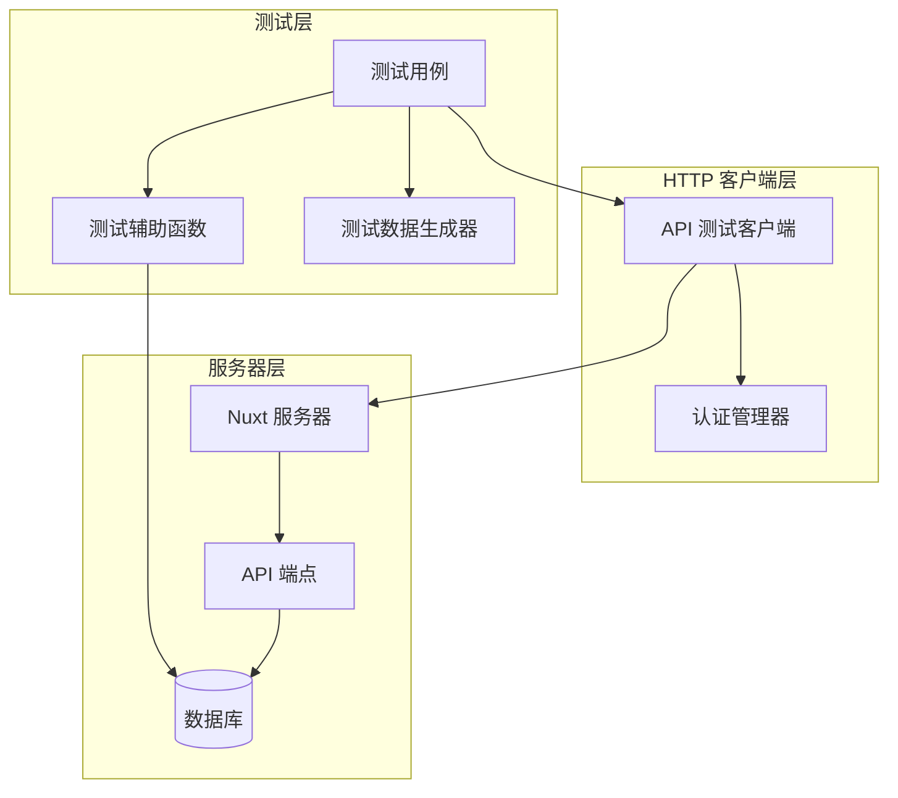
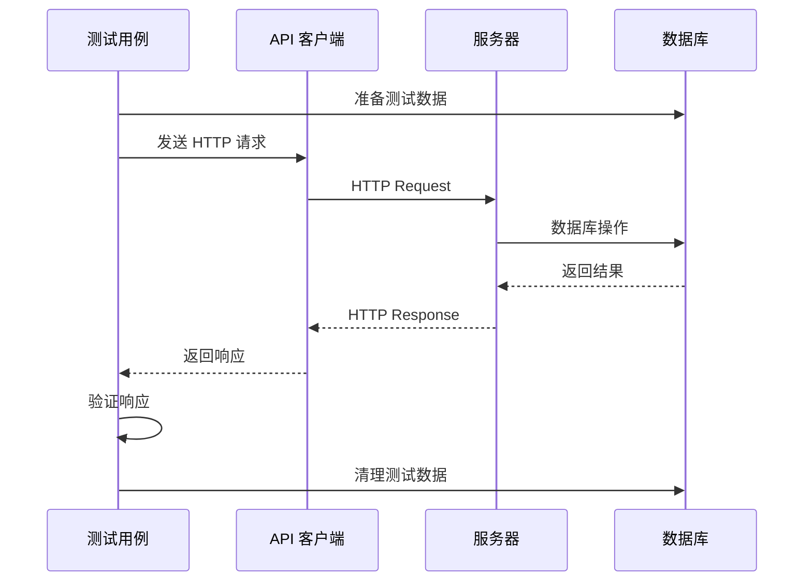

# Design Document: API 集成测试

## Overview

本设计文档描述了 LexSeek 项目 server/api 目录下所有 API 端点的集成测试方案。测试将发送真实的 HTTP 请求到运行中的 Nuxt 服务器，按照用户实际使用场景的顺序组织测试用例。

### 设计原则

1. **真实请求**: 所有测试都发送真实的 HTTP 请求，不使用 mock
2. **场景驱动**: 测试按用户使用场景组织，模拟真实用户操作流程
3. **数据隔离**: 每个测试使用独立的测试数据，测试后清理
4. **可重复执行**: 测试可以多次运行，不依赖特定的数据库状态

## Architecture

### 测试架构图



### 测试流程



## Components and Interfaces

### 1. API 测试客户端 (ApiTestClient)

负责发送 HTTP 请求到服务器。

```typescript
interface ApiTestClient {
  // 基础请求方法
  get<T>(url: string, options?: RequestOptions): Promise<ApiResponse<T>>
  post<T>(url: string, body?: any, options?: RequestOptions): Promise<ApiResponse<T>>
  put<T>(url: string, body?: any, options?: RequestOptions): Promise<ApiResponse<T>>
  delete<T>(url: string, options?: RequestOptions): Promise<ApiResponse<T>>
  
  // 认证相关
  setAuthToken(token: string): void
  clearAuthToken(): void
  
  // 获取完整响应（包含状态码和头）
  getFullResponse(): FullResponse
}

interface RequestOptions {
  headers?: Record<string, string>
  query?: Record<string, string>
}

interface ApiResponse<T> {
  success: boolean
  message: string
  data: T
}

interface FullResponse {
  status: number
  headers: Record<string, string>
  body: any
}
```

### 2. 测试辅助函数 (TestHelpers)

提供测试数据创建和清理功能。

```typescript
interface TestHelpers {
  // 用户相关
  createTestUserWithPassword(phone: string, password: string): Promise<TestUser>
  createSmsCode(phone: string, type: SmsType, code: string): Promise<void>
  
  // 认证相关
  registerAndLogin(userData: RegisterData): Promise<{ token: string; user: User }>
  loginWithPassword(phone: string, password: string): Promise<{ token: string; user: User }>
  
  // 数据清理
  cleanupTestUser(userId: number): Promise<void>
  cleanupAllTestData(): Promise<void>
}
```

### 3. 测试数据生成器 (TestDataGenerator)

生成测试所需的各种数据。

```typescript
interface TestDataGenerator {
  // 生成唯一手机号
  generatePhone(): string
  
  // 生成有效密码
  generatePassword(): string
  
  // 生成验证码
  generateSmsCode(): string
  
  // 生成用户名
  generateUsername(): string
}
```

## Data Models

### 测试用户数据

```typescript
interface TestUser {
  id: number
  phone: string
  name: string
  password: string  // 明文密码，用于登录测试
  token?: string    // 登录后的 token
}
```

### API 响应格式

```typescript
// 成功响应
interface SuccessResponse<T> {
  success: true
  message: string
  data: T
}

// 错误响应
interface ErrorResponse {
  success: false
  message: string
  data: null
}
```

### 测试上下文

```typescript
interface TestContext {
  // 当前测试用户
  user?: TestUser
  
  // 当前认证 token
  token?: string
  
  // 需要清理的数据 ID
  cleanupIds: {
    userIds: number[]
    membershipIds: number[]
    pointRecordIds: number[]
    // ...
  }
}
```

## Correctness Properties

*A property is a characteristic or behavior that should hold true across all valid executions of a system-essentially, a formal statement about what the system should do. Properties serve as the bridge between human-readable specifications and machine-verifiable correctness guarantees.*

由于 API 集成测试主要是验证具体的 API 行为，大部分测试用例是针对特定场景的示例测试，而非属性测试。以下是可以抽象为属性的测试：

### Property 1: 认证令牌有效性

*For any* 有效的用户凭证（手机号+密码或手机号+验证码），登录后返回的 token 应该能够成功访问受保护的 API 端点。

**Validates: Requirements 2.4, 2.6, 4.1**

### Property 2: 未认证请求拒绝

*For any* 受保护的 API 端点，不带有效 token 的请求应该返回 401 未授权错误。

**Validates: Requirements 4.2**

### Property 3: 密码重置后登录一致性

*For any* 用户重置密码操作，重置成功后应该能够使用新密码登录，且旧密码应该失效。

**Validates: Requirements 2.9, 2.10**

### Property 4: 邀请注册奖励一致性

*For any* 通过邀请链接注册的用户，推荐人信息应该被正确记录，且邀请奖励活动应该被触发。

**Validates: Requirements 2.3, 8.4, 8.5**

## Error Handling

### HTTP 错误码处理

| 状态码 | 含义 | 测试场景 |
|--------|------|----------|
| 200 | 成功 | 正常请求 |
| 400 | 请求参数错误 | 无效参数、格式错误 |
| 401 | 未授权 | 未登录、token 过期 |
| 403 | 禁止访问 | 权限不足 |
| 404 | 资源不存在 | 查询不存在的数据 |
| 429 | 请求过于频繁 | 频率限制 |
| 500 | 服务器错误 | 内部错误 |

### 测试错误处理策略

1. **网络错误**: 重试机制，最多重试 3 次
2. **超时错误**: 设置合理的超时时间（30 秒）
3. **数据清理失败**: 记录日志，不影响测试结果

## Testing Strategy

### 测试框架

- **vitest**: 测试运行器
- **ofetch**: HTTP 客户端（Nuxt 内置）
- **fast-check**: 属性测试库（用于生成测试数据）

### 测试组织结构

```
tests/server/api/
├── README.md                    # 模块说明
├── test-api-client.ts           # API 测试客户端
├── test-api-helpers.ts          # 测试辅助函数
├── 01-health.test.ts            # 健康检查测试
├── 02-auth.test.ts              # 认证流程测试
├── 03-sms.test.ts               # 短信验证码测试
├── 04-users.test.ts             # 用户信息测试
├── 05-memberships.test.ts       # 会员系统测试
├── 06-points.test.ts            # 积分系统测试
├── 07-redemption.test.ts        # 兑换码测试
├── 08-campaigns.test.ts         # 营销活动测试
├── 09-products.test.ts          # 产品信息测试
├── 10-payments.test.ts          # 支付系统测试
├── 11-storage.test.ts           # 文件存储测试
└── 12-encryption.test.ts        # 加密配置测试
```

### 测试执行顺序

测试按照用户使用场景的顺序组织：

1. **健康检查** - 确保服务器可用
2. **认证流程** - 注册、登录、登出
3. **短信验证码** - 发送验证码
4. **用户信息** - 获取和修改用户信息
5. **会员系统** - 查看会员等级和权益
6. **积分系统** - 查看积分信息
7. **兑换码** - 使用兑换码
8. **营销活动** - 查看活动信息
9. **产品信息** - 查看产品列表
10. **支付系统** - 创建支付订单
11. **文件存储** - 上传下载文件
12. **加密配置** - 管理加密设置

### 测试配置

```typescript
// vitest 配置
{
  testTimeout: 60000,  // 60秒超时
  setupFiles: ['./tests/server/api/test-setup.ts'],
}
```

### 运行命令

```bash
# 运行所有 API 测试
bun run test:api

# 运行特定模块测试
npx vitest run tests/server/api/02-auth.test.ts --reporter=verbose
```

### 单元测试与属性测试的平衡

- **单元测试**: 验证具体的 API 行为和边界条件
- **属性测试**: 验证跨多个输入的通用属性（如认证一致性）

由于 API 集成测试主要关注具体的请求-响应行为，大部分测试用例是单元测试形式。属性测试用于验证一些通用的系统属性，如认证机制的一致性。
