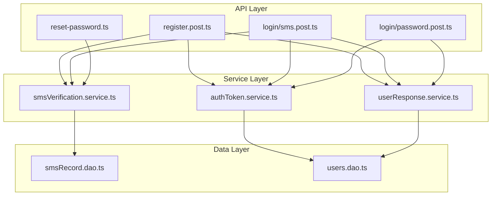

# Design Document

## Overview

本设计文档描述了对 `server/api/v1/auth` 目录下认证 API 的重构方案。通过抽取公共服务、统一响应格式、增强安全防护来优化现有代码。

重构目标：
- 消除验证码验证、JWT 处理、用户信息格式化的重复代码
- 增加验证码错误次数限制，防止暴力破解
- 使用时间安全的字符串比较，防止时序攻击
- 遵循现有编码风格，添加清晰的代码注释

## Architecture



## Components and Interfaces

### 1. SMS Verification Service（短信验证码服务）

**文件位置**: `server/services/sms/smsVerification.service.ts`

```typescript
/**
 * 验证码验证结果
 */
interface VerificationResult {
  /** 验证是否成功 */
  success: boolean;
  /** 错误信息（验证失败时） */
  error?: string;
  /** 错误码（验证失败时） */
  errorCode?: number;
  /** 验证码记录（验证成功时） */
  record?: SmsRecord;
}

/**
 * 验证验证码
 * @param phone 手机号
 * @param code 验证码
 * @param type 验证码类型
 * @returns 验证结果
 */
function verifySmsCode(phone: string, code: string, type: SmsType): Promise<VerificationResult>

/**
 * 时间安全的字符串比较
 * @param a 字符串a
 * @param b 字符串b
 * @returns 是否相等
 */
function timingSafeEqual(a: string, b: string): boolean

/**
 * 检查验证码是否被锁定
 * @param phone 手机号
 * @param type 验证码类型
 * @returns 是否被锁定
 */
function isVerificationLocked(phone: string, type: SmsType): Promise<boolean>

/**
 * 记录验证失败
 * @param phone 手机号
 * @param type 验证码类型
 */
function recordVerificationFailure(phone: string, type: SmsType): Promise<void>

/**
 * 重置验证失败计数
 * @param phone 手机号
 * @param type 验证码类型
 */
function resetVerificationFailures(phone: string, type: SmsType): Promise<void>
```

### 2. Auth Token Service（认证令牌服务）

**文件位置**: `server/services/auth/authToken.service.ts`

```typescript
/**
 * Token 用户信息
 */
interface TokenUserInfo {
  id: number;
  phone: string;
  role: string;
  status: number;
}

/**
 * 生成 token 并设置 cookie
 * @param event H3Event 对象
 * @param user 用户信息
 * @returns 生成的 token
 */
function generateAuthToken(event: H3Event, user: TokenUserInfo): string

/**
 * Cookie 配置
 */
interface CookieConfig {
  httpOnly: boolean;
  secure: boolean;
  sameSite: 'lax' | 'strict' | 'none';
  maxAge: number;
}

/**
 * 获取 Cookie 配置
 * @returns Cookie 配置对象
 */
function getCookieConfig(): CookieConfig
```

### 3. User Response Service（用户响应服务）

**文件位置**: `server/services/users/userResponse.service.ts`

```typescript
/**
 * 安全的用户信息（排除敏感字段）
 */
interface SafeUserInfo {
  id: number;
  name: string | null;
  username: string | null;
  phone: string;
  email: string | null;
  role: string;
  status: number;
  company: string | null;
  profile: string | null;
  inviteCode: string | null;
}

/**
 * 格式化用户信息为安全响应格式
 * @param user 完整用户对象
 * @returns 安全的用户信息
 */
function formatUserResponse(user: User): SafeUserInfo
```

## Data Models

### 验证失败记录（内存缓存）

```typescript
/**
 * 验证失败记录
 * 使用内存 Map 存储，key 格式: `${phone}:${type}`
 */
interface VerificationFailureRecord {
  /** 失败次数 */
  count: number;
  /** 首次失败时间 */
  firstFailureAt: Date;
  /** 锁定截止时间（如果被锁定） */
  lockedUntil?: Date;
}

// 内存存储
const verificationFailures = new Map<string, VerificationFailureRecord>();
```

### 常量配置

验证码安全配置通过 `nuxt.config.ts` 的 `runtimeConfig` 和环境变量进行管理：

**nuxt.config.ts 配置**:
```typescript
runtimeConfig: {
  aliyun: {
    sms: {
      // ... 现有配置 ...
      maxFailures: 5,        // 最大失败次数，环境变量: NUXT_ALIYUN_SMS_MAX_FAILURES
      lockDurationMs: 900,   // 锁定时间（秒），环境变量: NUXT_ALIYUN_SMS_LOCK_DURATION_MS
    }
  }
}
```

**环境变量**:
```bash
# .env
NUXT_ALIYUN_SMS_MAX_FAILURES=5        # 验证码最大失败次数
NUXT_ALIYUN_SMS_LOCK_DURATION_MS=900  # 锁定时间（秒）- 15分钟
```

**服务中使用**:
```typescript
const config = useRuntimeConfig();
const maxFailures = config.aliyun.sms.maxFailures;
const lockDurationMs = config.aliyun.sms.lockDurationMs * 1000; // 转换为毫秒
```

**Cookie 配置（nuxt.config.ts）**:
```typescript
runtimeConfig: {
  jwt: {
    secret: 'lexseek_jwt_secret',
    expiresIn: '30d',
  },
  auth: {
    cookieName: 'auth_token',     // Cookie 名称，环境变量: NUXT_AUTH_COOKIE_NAME
    cookieMaxAge: 2592000,        // Cookie 过期时间（秒），环境变量: NUXT_AUTH_COOKIE_MAX_AGE，默认 30 天
  }
}
```

**环境变量**:
```bash
# .env
NUXT_AUTH_COOKIE_NAME=auth_token    # Cookie 名称
NUXT_AUTH_COOKIE_MAX_AGE=2592000    # Cookie 过期时间（秒）- 30天
```

**服务中使用**:
```typescript
const config = useRuntimeConfig();
const cookieName = config.auth.cookieName;
const cookieMaxAge = config.auth.cookieMaxAge;
```


## Correctness Properties

*A property is a characteristic or behavior that should hold true across all valid executions of a system-essentially, a formal statement about what the system should do. Properties serve as the bridge between human-readable specifications and machine-verifiable correctness guarantees.*

### Property Reflection

经过分析，以下属性可以合并或简化：
- 1.1 和 1.5 可以合并为一个完整的验证流程属性
- 3.1 和 3.2 可以合并为一个用户信息格式化属性
- 4.1 和 4.4 可以合并为一个失败计数管理属性

### Properties

**Property 1: 验证码验证流程完整性**

*For any* 有效的手机号、验证码和类型组合，当验证码记录存在且未过期时，验证服务应返回成功状态并删除该记录；当验证码不存在、已过期或不正确时，应返回相应的错误状态。

**Validates: Requirements 1.1, 1.5**

---

**Property 2: JWT Token 字段完整性**

*For any* 包含 id、phone、role、status 的用户信息，生成的 JWT token 解码后应包含 id、phone、role 字段，且值与输入一致。

**Validates: Requirements 2.1**

---

**Property 3: 用户信息格式化安全性**

*For any* 完整的用户对象（包含敏感字段），格式化后的结果应包含 id、name、username、phone、email、role、status、company、profile、inviteCode 字段，且不包含 password、deletedAt 等敏感字段。

**Validates: Requirements 3.1, 3.2**

---

**Property 4: 验证失败计数管理**

*For any* 手机号和验证码类型，每次验证失败后失败计数应增加 1；验证成功后失败计数应重置为 0。

**Validates: Requirements 4.1, 4.4**

---

**Property 5: 时间安全字符串比较正确性**

*For any* 两个字符串 a 和 b，时间安全比较函数应在 a === b 时返回 true，在 a !== b 时返回 false。

**Validates: Requirements 6.1**

## Error Handling

### 验证码验证错误

| 错误场景 | 错误码 | 错误信息 |
|---------|-------|---------|
| 验证码不存在 | 400 | 验证码不存在,请先获取验证码! |
| 验证码已过期 | 400 | 验证码已过期 |
| 验证码不正确 | 400 | 验证码不正确 |
| 验证码已锁定 | 400 | 验证码已锁定，请稍后再试 |

### 用户状态错误

| 错误场景 | 错误码 | 错误信息 |
|---------|-------|---------|
| 用户不存在 | 401 | 用户不存在 |
| 用户被禁用 | 401 | 用户被禁用 |

### 错误处理原则

1. 所有错误使用 `resError(event, code, message)` 格式返回
2. 验证相关错误使用 400 状态码
3. 认证相关错误使用 401 状态码
4. 错误信息使用中文，清晰描述问题

## Testing Strategy

### 测试框架

- 单元测试：Vitest（项目已配置）
- 属性测试：fast-check（需要安装）

### 单元测试

单元测试覆盖以下场景：

1. **SMS Verification Service**
   - 验证码不存在时返回正确错误
   - 验证码过期时删除记录并返回错误
   - 验证码锁定时返回锁定错误
   - 达到最大失败次数时触发锁定

2. **Auth Token Service**
   - 生产环境 Cookie secure 属性为 true
   - Cookie maxAge 为 30 天

3. **User Response Service**
   - 格式化结果不包含 password 字段

### 属性测试

属性测试使用 fast-check 库，每个测试运行 100 次迭代。

测试文件位置：`server/services/__tests__/`

每个属性测试必须包含注释引用设计文档中的属性：
```typescript
// **Feature: auth-api-refactor, Property 1: 验证码验证流程完整性**
// **Validates: Requirements 1.1, 1.5**
```

### 测试文件结构

```
server/services/
├── __tests__/
│   ├── smsVerification.service.test.ts
│   ├── authToken.service.test.ts
│   └── userResponse.service.test.ts
├── sms/
│   ├── smsRecord.dao.ts
│   └── smsVerification.service.ts
├── auth/
│   └── authToken.service.ts
└── users/
    ├── users.dao.ts
    └── userResponse.service.ts
```
