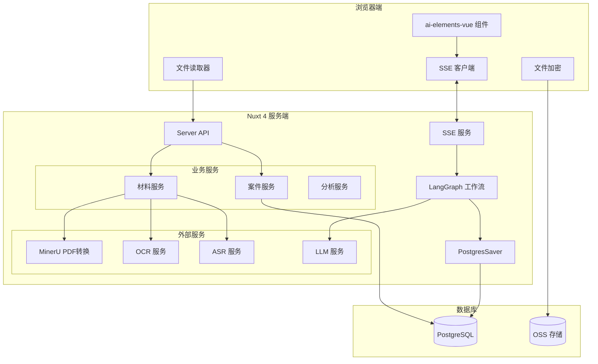

# 设计文档

## 概述

本设计文档描述案件分析功能的技术架构和实现方案。该功能基于 LangGraph 构建统一的人机协同工作流，使用 SSE 实现实时通信，通过 @ai-sdk/langchain 适配器转换流式数据，前端使用 ai-elements-vue 组件库构建 AI 交互界面。

核心技术栈：
- **后端**: Nuxt 4 Server API + LangGraph + PostgresSaver
- **前端**: Vue 3 + ai-elements-vue + AI SDK
- **通信**: SSE (Server-Sent Events)
- **持久化**: PostgreSQL + Prisma ORM

## 架构

### 整体架构图



### LangGraph 工作流架构

```mermaid
stateDiagram-v2
    [*] --> MaterialProcess: 创建案件
    
    MaterialProcess --> CaseInfoCheck: 材料处理完成
    note right of MaterialProcess
        浏览器端: md/txt/docx/doc
        服务端: PDF/图片/音频
    end note
    
    CaseInfoCheck --> Interrupt1: 检查案情信息
    Interrupt1 --> CaseInfoCheck: 用户补充案情
    Interrupt1 --> ExtractInfo: 案情信息充足
    note right of Interrupt1: 中断点1: 案情信息检查（循环）
    
    ExtractInfo --> Interrupt2: 提取完成
    Interrupt2 --> ModuleSelect: 用户确认/修改
    note right of Interrupt2: 中断点2: 基本信息确认
    
    ModuleSelect --> Interrupt3: 返回模块列表
    Interrupt3 --> AnalysisTask: 用户选择模块
    note right of Interrupt3: 中断点3: 选择分析模块
    
    AnalysisTask --> AnalysisTask: 执行下一个模块
    AnalysisTask --> Complete: 所有模块完成
    
    Complete --> [*]
```

## 组件和接口

### 已有服务（可直接复用 ✅）

系统中已实现以下服务，案件分析功能可直接复用：

#### 1. 积分服务（已实现 ✅）

位置：`server/services/point/`

```typescript
// pointRecords.service.ts - 积分记录服务
export const getUserPointSummary: (userId: number) => Promise<PointSummary>
export const getUserPointRecords: (userId: number, options) => Promise<PaginatedResult>
export const createPointRecordService: (params: CreatePointRecordParams, tx?) => Promise<pointRecords>
export const consumePoints: (userId: number, itemId: number, amount?, sourceId?) => Promise<PointConsumptionResult>

// pointConsumptionRecords.service.ts - 积分消耗记录服务
export const getUserConsumptionRecords: (userId: number, options) => Promise<PaginatedResult>
```

**积分扣减已实现 FIFO 策略**：按过期时间升序依次扣减，支持事务保证一致性。

#### 2. 模型服务（已实现 ✅）

位置：`server/services/model/`

```typescript
// models.service.ts - 模型配置服务
export const getModelByIdService: (id: number) => Promise<Model>
export const getModelsService: (options) => Promise<PaginatedResult>
export const getDefaultModelByTypeService: (modelType: ModelType) => Promise<Model>
```

#### 3. 文件存储服务（已实现 ✅）

位置：`server/services/files/` 和 `server/lib/oss/`

```typescript
// files.service.ts - 文件服务
// oss/ - OSS 操作封装（上传、下载、签名URL等）
```

#### 4. 手机号脱敏工具（已实现 ✅）

位置：`shared/utils/phone.ts`

```typescript
export const maskPhone: (phone: string) => string  // 手机号脱敏
export const maskTel: (tel: string) => string      // 通用电话脱敏
```

### 待实现服务

#### 1. CaseService（案件服务）

```typescript
interface CaseService {
  // 创建案件
  createCase(data: CreateCaseInput): Promise<{ caseId: number; sessionId: string }>
  
  // 获取案件信息
  getCase(caseId: number): Promise<Case>
  
  // 更新案件基本信息
  updateCaseInfo(caseId: number, data: UpdateCaseInput): Promise<Case>
  
  // 恢复工作流
  resumeWorkflow(sessionId: string, command: ResumeCommand): Promise<void>
  
  // 获取工作流状态
  getWorkflowState(sessionId: string): Promise<WorkflowState>
}
```

#### 2. MaterialService（材料服务）

```typescript
interface MaterialService {
  // 保存材料信息
  saveMaterial(data: MaterialInput): Promise<Material>
  
  // 处理 PDF 文件（调用 MinerU）
  processPDF(materialId: number, fileUrl: string): Promise<string>
  
  // 处理图片（调用 OCR）
  processImage(materialId: number, fileUrl: string): Promise<string>
  
  // 处理音频（调用 ASR）
  processAudio(materialId: number, fileUrl: string): Promise<string>
  
  // 获取材料内容
  getMaterialContent(materialId: number): Promise<string>
  
  // 向量化材料内容
  embedMaterial(materialId: number, content: string, metadata: MaterialMetadata): Promise<void>
  
  // 检索材料
  searchMaterials(caseId: number, query: string, k?: number): Promise<MaterialSearchResult[]>
}

interface MaterialMetadata {
  caseId: number
  materialId: number
  sessionId: string
  materialName: string
  materialType: number
}

interface MaterialSearchResult {
  content: string           // 内容片段
  materialId: number
  materialName: string
  score: number             // 相似度分数
}
```

#### 2.1 MaterialSearchTool（材料检索工具）

```typescript
// LangGraph 工具定义
interface MaterialSearchTool {
  name: 'search_case_materials'
  description: '检索当前案件的材料内容，用于查找与分析相关的材料片段'
  
  // 输入参数
  input: {
    query: string           // 查询内容
    k?: number              // 返回结果数量，默认 5
  }
  
  // 输出结果
  output: MaterialSearchResult[]
}
```

#### 3. NodeService（节点服务）

```typescript
interface NodeService {
  // 获取节点列表
  getNodes(filter?: NodeFilter): Promise<Node[]>
  
  // 创建节点
  createNode(data: CreateNodeInput): Promise<Node>
  
  // 更新节点
  updateNode(nodeId: number, data: UpdateNodeInput): Promise<Node>
  
  // 删除节点
  deleteNode(nodeId: number): Promise<void>
  
  // 获取用户可用节点（根据会员级别）
  getUserAvailableNodes(userId: number): Promise<Node[]>
}
```

#### 4. PromptService（提示词服务）

```typescript
interface PromptService {
  // 获取节点的提示词
  getPromptsByNode(nodeId: number): Promise<Prompt[]>
  
  // 创建提示词版本
  createPrompt(data: CreatePromptInput): Promise<Prompt>
  
  // 激活提示词版本
  activatePrompt(promptId: number): Promise<void>
  
  // 渲染提示词（替换变量）
  renderPrompt(promptId: number, variables: Record<string, string>): Promise<string>
  
  // 获取提示词历史版本
  getPromptVersions(name: string, type: string): Promise<Prompt[]>
}
```

#### 5. AccessService（权限服务）

```typescript
interface AccessService {
  // 获取会员级别的节点权限
  getLevelNodeAccess(levelId: number): Promise<LevelNodeAccess[]>
  
  // 授权会员级别访问节点
  grantAccess(levelId: number, nodeId: number): Promise<void>
  
  // 撤销会员级别节点权限
  revokeAccess(levelId: number, nodeId: number): Promise<void>
  
  // 检查用户是否有节点访问权限
  checkAccess(userId: number, nodeId: number): Promise<boolean>
  
  // 批量更新权限
  batchUpdateAccess(levelId: number, nodeIds: number[]): Promise<void>
}
```

### 前端组件

#### 1. 案件分析页面组件

```typescript
// 案件分析主页面
interface CaseAnalysisPage {
  // 材料上传区域
  MaterialUploader: Component
  // 对话消息列表
  ConversationList: Component
  // 分析结果展示
  AnalysisResults: Component
}

// 消息组件（使用 ai-elements-vue）
interface MessageComponents {
  Message: Component          // 消息容器
  MessageResponse: Component  // AI 响应内容
  Reasoning: Component        // 推理过程
  Tool: Component            // 工具调用
  Confirmation: Component    // 确认交互
  Loader: Component          // 加载状态
}
```

#### 2. 后台管理页面组件

```typescript
// 节点管理页面
interface NodeManagementPage {
  NodeList: Component        // 节点列表
  NodeForm: Component        // 节点表单
  NodeDetail: Component      // 节点详情
}

// 提示词管理页面
interface PromptManagementPage {
  PromptList: Component      // 提示词列表
  PromptEditor: Component    // 提示词编辑器
  PromptVersions: Component  // 版本历史
  PromptPreview: Component   // 预览渲染
}

// 权限配置页面
interface AccessConfigPage {
  AccessMatrix: Component    // 权限矩阵
  LevelSelector: Component   // 会员级别选择
  NodeSelector: Component    // 节点选择
}

// 示范案例管理页面
interface DemoCaseManagementPage {
  DemoCaseList: Component    // 示范案例列表
  DemoCaseForm: Component    // 示范案例表单
  MaterialUploader: Component // 材料上传
}
```

#### 3. 任务清单组件

```typescript
// 任务清单组件
interface TaskListComponent {
  // 任务项
  tasks: TaskItem[]
  // 当前活动任务
  activeTaskId: string | null
}

interface TaskItem {
  id: string                 // 任务ID
  name: string               // 任务名称
  type: 'checkpoint' | 'analysis'  // 任务类型：中断点或分析模块
  status: 'pending' | 'active' | 'completed'  // 状态
  order: number              // 排序
  resultId?: number          // 关联的分析结果ID（用于跳转）
}

// 预定义的中断点任务
const checkpointTasks = [
  { id: 'case-info-check', name: '案情信息检查', type: 'checkpoint', order: 1 },    // 中断点1
  { id: 'basic-info-confirm', name: '基本信息确认', type: 'checkpoint', order: 2 }, // 中断点2
  { id: 'module-select', name: '选择分析模块', type: 'checkpoint', order: 3 }       // 中断点3
]
```

### API 响应规范

所有 API 接口必须使用系统封装的响应方法，确保响应格式统一：

```typescript
// 成功响应 - 使用 resSuccess
import { resSuccess, resError } from '#shared/utils/apiResponse'

export default defineEventHandler(async (event) => {
    try {
        const data = await someService()
        return resSuccess(event, '操作成功', data)
    } catch (error) {
        return resError(event, 500, '操作失败')
    }
})

// 响应格式
interface ApiBaseResponse<T = any> {
    requestId: string    // 请求ID（自动生成）
    success: boolean     // 是否成功
    code: number         // 业务码（0 表示成功）
    message: string      // 消息
    timestamp: number    // 时间戳
    data?: T            // 数据
}
```

### API 接口设计

#### 案件分析 API（待实现）

```typescript
// POST /api/v1/case/create - 创建案件
// POST /api/v1/case/resume/[sessionId] - 恢复工作流
// GET /api/v1/case/state/[sessionId] - 获取工作流状态
// GET /api/v1/case/[caseId] - 获取案件信息
// POST /api/v1/case/analysis/stream/[caseId] - SSE 流式分析

// POST /api/v1/material/upload - 上传材料
// POST /api/v1/material/process/[id] - 处理材料
// GET /api/v1/material/content/[id] - 获取材料内容

// GET /api/v1/demo-cases - 获取示范案例列表
// POST /api/v1/demo-cases/create-case/[id] - 使用示范案例创建案件
```

#### 积分 API（已实现 ✅）

系统已实现以下积分相关 API，可直接复用：

```typescript
// ✅ GET /api/v1/points/info - 获取用户积分汇总信息
// ✅ GET /api/v1/points/records - 获取积分记录列表
// ✅ GET /api/v1/points/usage - 获取积分消耗记录列表
```

#### 后台管理 API

```typescript
// 节点管理（待实现）
// GET /api/v1/admin/nodes - 获取节点列表
// POST /api/v1/admin/nodes - 创建节点
// PUT /api/v1/admin/nodes/[id] - 更新节点
// DELETE /api/v1/admin/nodes/[id] - 删除节点

// 节点分组（待实现）
// GET /api/v1/admin/node-groups - 获取分组列表
// POST /api/v1/admin/node-groups - 创建分组
// PUT /api/v1/admin/node-groups/[id] - 更新分组

// 提示词管理（待实现）
// GET /api/v1/admin/prompts - 获取提示词列表
// POST /api/v1/admin/prompts - 创建提示词
// PUT /api/v1/admin/prompts/activate/[id] - 激活提示词
// GET /api/v1/admin/prompts/versions/[id] - 获取版本历史
// POST /api/v1/admin/prompts/preview - 预览渲染

// 权限管理（待实现）
// GET /api/v1/admin/access/matrix - 获取权限矩阵
// POST /api/v1/admin/access/grant - 授权
// POST /api/v1/admin/access/revoke - 撤销
// POST /api/v1/admin/access/batch - 批量更新

// 积分消耗项目管理（待实现）
// GET /api/v1/admin/point-consumption-items - 列表
// POST /api/v1/admin/point-consumption-items - 创建
// PUT /api/v1/admin/point-consumption-items/[id] - 更新
// DELETE /api/v1/admin/point-consumption-items/[id] - 删除
// PUT /api/v1/admin/point-consumption-items/status/[id] - 切换状态

// 示范案例管理（待实现）
// GET /api/v1/admin/demo-cases - 获取示范案例列表
// POST /api/v1/admin/demo-cases - 创建示范案例
// PUT /api/v1/admin/demo-cases/[id] - 更新示范案例
// DELETE /api/v1/admin/demo-cases/[id] - 删除示范案例
// PUT /api/v1/admin/demo-cases/status/[id] - 切换状态
```


## 数据模型

### 已有数据表（可直接复用 ✅）

以下数据表已在系统中定义，位于 `prisma/models/` 目录：

#### 积分相关表（已实现 ✅）

位置：`prisma/models/point.prisma`

- `pointRecords` - 积分记录表
- `pointConsumptionItems` - 积分消耗项目表
- `pointConsumptionRecords` - 积分消耗记录表

#### 模型相关表（已实现 ✅）

位置：`prisma/models/model.prisma`

- `modelProviders` - 模型提供商表
- `modelApiKeys` - 模型 API 密钥表
- `models` - 模型配置表

### 待创建数据表

#### 1. 案件相关表

```prisma
// 案件表
model cases {
  id          Int       @id @default(autoincrement())
  title       String    @db.VarChar(500)
  content     String?
  userId      Int       @map("user_id")
  caseTypeId  Int       @map("case_type_id")
  plaintiff   Json?
  defendant   Json?
  status      Int       @default(1)  // 1-进行中，2-已完成，3-已关闭
  createdAt   DateTime  @default(now())
  updatedAt   DateTime  @default(now())
  deletedAt   DateTime?
}

// 案件会话表
model caseSessions {
  id          Int       @id @default(autoincrement())
  sessionId   String    @unique  // 对应 LangGraph thread_id
  caseId      Int       @map("case_id")
  status      Int       @default(1)
  createdAt   DateTime  @default(now())
  updatedAt   DateTime  @default(now())
  deletedAt   DateTime?
}

// 案件材料表
model caseMaterials {
  id              Int       @id @default(autoincrement())
  caseId          Int       @map("case_id")
  name            String    @db.VarChar(255)
  type            Int       // 1-文本，2-文档，3-图片，4-音频
  content         String?   // 材料内容
  originalContent String?   // 原始内容（加密存储）
  ossFileId       Int?      @map("oss_file_id")
  isEncrypted     Boolean   @default(false)
  status          Int       @default(1)
  createdAt       DateTime  @default(now())
  updatedAt       DateTime  @default(now())
  deletedAt       DateTime?
}

// 案件分析结果表
model caseAnalyses {
  id              Int       @id @default(autoincrement())
  caseId          Int       @map("case_id")
  sessionId       String
  nodeId          Int       @map("node_id")
  analysisType    String    @db.VarChar(100)
  analysisResult  String?   // 分析结果
  originalResult  String?   // 还原后的结果
  version         Int       @default(1)
  status          Int       @default(1)
  createdAt       DateTime  @default(now())
  updatedAt       DateTime  @default(now())
  deletedAt       DateTime?
}
```

#### 2. 节点与提示词表

```prisma
// 节点表
model nodes {
  id          Int       @id @default(autoincrement())
  name        String    @db.VarChar(100)
  title       String?   @db.VarChar(100)
  description String?   @db.VarChar(255)
  type        String    @db.VarChar(100)  // analysis-分析，document-文书
  priority    Int       @default(100)
  modelId     Int
  tools       Json?     @default("[]")
  groupId     Int?      @map("group_id")
  createdAt   DateTime  @default(now())
  updatedAt   DateTime  @default(now())
  deletedAt   DateTime?
}

// 节点分组表
model nodeGroups {
  id          Int       @id @default(autoincrement())
  name        String    @db.VarChar(100)
  description String?   @db.VarChar(255)
  createdAt   DateTime  @default(now())
  updatedAt   DateTime  @default(now())
  deletedAt   DateTime?
}

// 提示词表
model prompts {
  id        Int       @id @default(autoincrement())
  name      String    @db.VarChar(100)
  title     String?   @db.VarChar(100)
  content   String    @db.Text
  variables Json?     @default("[]")
  version   String    @db.VarChar(100)
  type      String    @db.VarChar(100)  // system, user, assistant
  status    Int       @default(0)  // 0-未生效，1-生效
  nodeId    Int
  createdAt DateTime  @default(now())
  updatedAt DateTime  @default(now())
  deletedAt DateTime?
}

// 会员节点权限表
model levelNodeAccess {
  id        Int       @id @default(autoincrement())
  levelId   Int       @map("level_id")
  nodeId    Int       @map("node_id")
  createdAt DateTime  @default(now())
  updatedAt DateTime  @default(now())
  deletedAt DateTime?
}
```

#### 3. 材料向量表

材料向量化使用已有的向量存储服务（`server/services/legal/vectorStore.service.ts`），需要在 Prisma 中定义向量表：

```prisma
// 案件材料向量表（使用 pgvector 扩展）
// 注意：必须在 Prisma 中定义，否则迁移时会被删除
model caseMaterialEmbeddings {
  id        String   @id @default(uuid())
  text      String   @db.Text              // 材料内容片段
  embedding Unsupported("vector(1536)")    // 向量数据
  metadata  Json     @default("{}")        // 元数据
  createdAt DateTime @default(now()) @map("created_at")
  
  @@map("case_material_embeddings")
  @@index([embedding], type: Hnsw(ops: VectorCosineOps))
}

// metadata 结构：
// {
//   caseId: number,        // 案件 ID
//   materialId: number,    // 材料 ID
//   sessionId: string,     // 会话 ID
//   materialName: string,  // 材料名称
//   materialType: number,  // 材料类型
//   chunkIndex: number     // 分块索引
// }
```

**向量存储配置**：

```typescript
// 材料向量存储配置
const caseMaterialVectorConfig = {
  tableName: 'case_material_embeddings',
  vectorColumnName: 'embedding',
  contentColumnName: 'text',
  metadataColumnName: 'metadata',
}
```

#### 4. 积分相关表（已存在 ✅）

积分相关表已在系统中定义，位于 `prisma/models/point.prisma`，无需重复创建：

- `pointRecords` - 积分记录表
- `pointConsumptionItems` - 积分消耗项目表
- `pointConsumptionRecords` - 积分消耗记录表

**案件分析功能只需在 `pointConsumptionItems` 表中添加对应的消耗项目配置即可。**

#### 5. 示范案例表

```prisma
// 示范案例表
model demoCases {
  id          Int       @id @default(autoincrement())
  title       String    @db.VarChar(200)   // 案例标题
  description String?   @db.VarChar(500)   // 案例简介
  caseTypeId  Int       @map("case_type_id")  // 案件类型
  materials   Json      @default("[]")     // 预设材料列表
  coverImage  String?   @db.VarChar(500)   // 封面图片
  priority    Int       @default(100)      // 排序优先级
  status      Int       @default(1)        // 1-启用，0-禁用
  createdAt   DateTime  @default(now())
  updatedAt   DateTime  @default(now())
  deletedAt   DateTime?
}
```

### 积分扣减服务设计（已实现 ✅）

系统已实现完整的积分扣减服务，位于 `server/services/point/pointRecords.service.ts`。

#### 已实现功能

```typescript
// 消耗积分（FIFO 策略）- 已实现
export const consumePoints = async (
    userId: number,
    itemId: number,      // 消耗项目 ID
    amount?: number,     // 消耗数量（可选，默认使用项目配置）
    sourceId?: number    // 资源 ID（可选）
): Promise<PointConsumptionResult>

// 功能特性：
// ✅ 按过期时间升序依次扣减（FIFO）
// ✅ 支持折扣计算
// ✅ 事务保证一致性
// ✅ 自动创建消耗记录
```

#### 案件分析中的积分扣减调用示例

```typescript
// 在分析任务执行前扣减积分
import { consumePoints } from '~/server/services/point/pointRecords.service'

// 扣减分析模块积分
const result = await consumePoints(
    userId,
    itemId,           // 对应的积分消耗项目 ID
    undefined,        // 使用项目配置的积分数量
    caseAnalysisId    // 关联的分析记录 ID
)

if (!result.success) {
    throw new Error('积分不足')
}
```

### 积分消耗项目管理 API（待实现）

```typescript
// GET /api/v1/admin/point-consumption-items - 获取消耗项目列表
// POST /api/v1/admin/point-consumption-items - 创建消耗项目
// PUT /api/v1/admin/point-consumption-items/[id] - 更新消耗项目
// DELETE /api/v1/admin/point-consumption-items/[id] - 删除消耗项目
// PUT /api/v1/admin/point-consumption-items/status/[id] - 切换状态

interface PointConsumptionItemInput {
  group: string           // 分组
  name: string            // 名称
  description?: string    // 描述
  unit: string            // 单位
  pointAmount: number     // 积分数量
  discount?: number       // 折扣 (0-1)
  status?: number         // 状态
}
```

### 会员中心积分 API（已实现 ✅）

系统已实现以下 API，位于 `server/api/v1/points/`：

```typescript
// ✅ GET /api/v1/points/info - 获取用户积分信息
// ✅ GET /api/v1/points/records - 获取积分获取记录列表
// ✅ GET /api/v1/points/usage - 获取积分消费记录列表
```


## 正确性属性

*正确性属性是系统在所有有效执行中都应保持为真的特征或行为——本质上是关于系统应该做什么的形式化陈述。属性作为人类可读规范和机器可验证正确性保证之间的桥梁。*

### Property 1: 工作流中断-恢复往返一致性
*For any* 工作流执行，当工作流在中断点暂停后，使用 `Command(resume=...)` 恢复执行时，工作流应从中断点继续执行，不重复已完成的步骤，且状态与中断前一致。
**Validates: Requirements 1.3, 1.4, 2.3**

### Property 2: 检查点持久化完整性
*For any* 工作流状态变化，Checkpointer 保存的检查点应能完整恢复工作流状态，包括所有已完成节点的结果和当前执行位置。
**Validates: Requirements 2.2, 2.3, 2.6**

### Property 3: 积分扣减数据一致性
*For any* 积分扣减操作，扣减前的总可用积分减去扣减数量应等于扣减后的总可用积分，且所有积分记录的 remaining 字段之和应保持一致。
**Validates: Requirements 16.9, 16.16**

### Property 4: 积分扣减优先级正确性
*For any* 涉及多条积分记录的扣减操作，应优先扣减到期时间最早的积分记录，直到该记录的 remaining 为 0 后再扣减下一条。
**Validates: Requirements 16.8, 16.15**

### Property 5: 积分不足阻止操作
*For any* 积分扣减请求，当用户可用积分小于所需积分时，操作应被阻止且不产生任何积分变动。
**Validates: Requirements 16.6, 16.7**

### Property 6: 提示词版本互斥性
*For any* 提示词激活操作，同一节点、同一类型下只能有一个版本处于生效状态，激活新版本时其他版本应自动设为未生效。
**Validates: Requirements 14.12**

### Property 7: 节点权限访问控制
*For any* 用户执行分析任务时，只能访问其会员级别被授权的节点，未授权节点应被过滤。
**Validates: Requirements 14.18**

### Property 8: 材料内容提取完整性
*For any* 支持的文件格式（md/txt/docx/doc），浏览器端提取的文本内容应包含文件的所有可读文本。
**Validates: Requirements 3.6, 3.7**

## 错误处理

### 错误类型定义

系统使用 HTTP 状态码作为错误码，与 `resError(event, code, message)` 保持一致：

```typescript
// 常用 HTTP 状态码
// 400 - 请求参数错误、业务逻辑错误
// 401 - 未授权（未登录）
// 403 - 禁止访问（无权限）
// 404 - 资源不存在
// 500 - 服务器内部错误

// 使用示例
return resError(event, 400, '手机号已存在')
return resError(event, 400, '积分不足')
return resError(event, 404, '案件不存在')
return resError(event, 403, '无权访问该节点')
return resError(event, 500, '材料处理失败')
```

### 业务错误消息规范

| 错误场景 | HTTP 状态码 | 错误消息示例 |
|---------|------------|-------------|
| 案件不存在 | 404 | 案件不存在 |
| 案件已完成 | 400 | 案件已完成，无法继续操作 |
| 材料处理失败 | 500 | 材料处理失败 |
| 不支持的文件类型 | 400 | 不支持的文件类型 |
| 文件过大 | 400 | 文件大小超出限制 |
| 工作流不存在 | 404 | 工作流不存在 |
| 工作流已完成 | 400 | 工作流已完成 |
| 无效的中断响应 | 400 | 无效的中断响应 |
| 积分不足 | 400 | 积分不足，请充值 |
| 无效的消耗项目 | 400 | 无效的积分消耗项目 |
| 节点访问被拒绝 | 403 | 无权访问该分析模块 |
| MinerU 服务错误 | 500 | PDF 转换服务异常 |
| OCR 服务错误 | 500 | 图片识别服务异常 |
| ASR 服务错误 | 500 | 音频转录服务异常 |
| LLM 服务错误 | 500 | AI 服务异常 |

### 错误处理策略

| 错误类型 | 处理策略 | 用户提示 |
|---------|---------|---------|
| 积分不足 | 阻止操作，返回错误 | 提示充值或升级会员 |
| 材料处理失败 | 保存错误状态，允许重试 | 显示具体错误，提供重试按钮 |
| 工作流执行失败 | 保存检查点，支持从失败点恢复 | 显示错误信息，提供重试选项 |
| 外部服务超时 | 自动重试（最多3次） | 显示处理中状态 |

## 测试策略

### 单元测试

单元测试用于验证具体示例和边界情况：

1. **积分服务测试**
   - 测试积分余额计算
   - 测试折扣应用
   - 测试边界情况（积分刚好足够、积分为0）

2. **节点服务测试**
   - 测试 CRUD 操作
   - 测试权限过滤
   - 测试提示词版本管理

### 属性测试

属性测试用于验证通用属性在所有输入上的正确性：

```typescript
// 使用 fast-check 进行属性测试
import fc from 'fast-check'

// Property 3: 积分扣减数据一致性
// Feature: case-analysis, Property 3: 积分扣减数据一致性
describe('Point Deduction Consistency', () => {
  it('should maintain point balance after deduction', () => {
    fc.assert(
      fc.property(
        fc.integer({ min: 1, max: 1000 }), // 扣减数量
        fc.array(fc.record({
          remaining: fc.integer({ min: 0, max: 500 }),
          expiredAt: fc.date()
        }), { minLength: 1, maxLength: 10 }), // 积分记录
        (deductAmount, records) => {
          const totalBefore = records.reduce((sum, r) => sum + r.remaining, 0)
          if (totalBefore < deductAmount) return true // 积分不足时跳过
          
          const result = simulateDeduction(records, deductAmount)
          const totalAfter = result.reduce((sum, r) => sum + r.remaining, 0)
          
          return totalBefore - deductAmount === totalAfter
        }
      ),
      { numRuns: 100 }
    )
  })
})

// Property 4: 积分扣减优先级正确性
// Feature: case-analysis, Property 4: 积分扣减优先级正确性
describe('Point Deduction Priority', () => {
  it('should deduct from earliest expiring records first', () => {
    fc.assert(
      fc.property(
        fc.integer({ min: 1, max: 100 }),
        fc.array(fc.record({
          id: fc.integer(),
          remaining: fc.integer({ min: 1, max: 100 }),
          expiredAt: fc.date()
        }), { minLength: 2, maxLength: 5 }),
        (deductAmount, records) => {
          const sorted = [...records].sort((a, b) => 
            a.expiredAt.getTime() - b.expiredAt.getTime()
          )
          const result = simulateDeduction(records, deductAmount)
          
          // 验证扣减顺序
          let consumed = 0
          for (const record of sorted) {
            if (consumed >= deductAmount) break
            const original = records.find(r => r.id === record.id)!
            const updated = result.find(r => r.id === record.id)!
            const deducted = original.remaining - updated.remaining
            if (deducted > 0) {
              consumed += deducted
            }
          }
          return consumed === Math.min(deductAmount, records.reduce((s, r) => s + r.remaining, 0))
        }
      ),
      { numRuns: 100 }
    )
  })
})
```

### 集成测试

1. **工作流集成测试**
   - 测试完整的案件分析流程
   - 测试中断-恢复流程
   - 测试并发执行

2. **SSE 通信测试**
   - 测试流式数据传输
   - 测试连接断开重连
   - 测试中断事件处理

3. **外部服务集成测试**
   - 测试 MinerU PDF 转换
   - 测试 OCR/ASR 服务调用
   - 测试 LLM 服务调用
