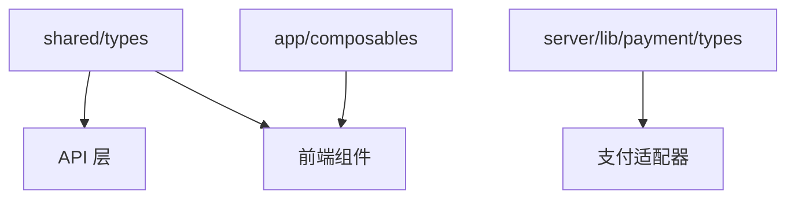

# Design Document

## Overview

本设计文档描述了 lexseek 项目代码去重和统一的技术方案。主要包括：
1. 清理重复的类型定义
2. 创建通用的 Composables
3. 重构现有组件使用新的 Composables

## Architecture

### 类型定义分层

```
shared/types/           # 共享类型（前后端通用）
├── payment.ts          # 支付相关类型（枚举、API 接口）
├── membership.ts       # 会员相关类型
├── point.types.ts      # 积分相关类型
└── product.ts          # 商品相关类型

server/lib/payment/     # 支付适配器内部类型
└── types.ts            # 适配器专用类型（不导出到 shared）

app/composables/        # 前端 Composables
├── useFormatters.ts    # 格式化工具
├── useOrderStatus.ts   # 订单状态处理
├── useMembershipStatus.ts  # 会员状态处理
└── usePointStatus.ts   # 积分状态处理
```

### 数据流



## Components and Interfaces

### 1. useFormatters Composable

```typescript
// app/composables/useFormatters.ts
export const useFormatters = () => {
    /**
     * 格式化日期（标准格式）
     * @param dateString 日期字符串
     * @returns 格式化后的日期字符串，格式：YYYY-MM-DD HH:mm
     */
    const formatDate = (dateString: string): string => {
        if (!dateString) return "—"
        return dayjs(dateString).format("YYYY-MM-DD HH:mm")
    }

    /**
     * 格式化日期（仅日期）
     * @param dateString 日期字符串
     * @returns 格式化后的日期字符串，格式：YY/MM/DD
     */
    const formatDateOnly = (dateString: string): string => {
        if (!dateString) return "—"
        return dayjs(dateString).format("YY/MM/DD")
    }

    /**
     * 格式化日期（中文格式）
     * @param dateString 日期字符串
     * @returns 格式化后的日期字符串，格式：YYYY年MM月DD日 HH:mm
     */
    const formatDateChinese = (dateString: string): string => {
        if (!dateString) return "—"
        return dayjs(dateString).format("YYYY年MM月DD日 HH:mm")
    }

    /**
     * 格式化金额
     * @param amount 金额数字
     * @returns 格式化后的金额字符串，带两位小数
     */
    const formatAmount = (amount: number | null | undefined): string => {
        if (amount === null || amount === undefined) return "0.00"
        return amount.toFixed(2)
    }

    return { formatDate, formatDateOnly, formatDateChinese, formatAmount }
}
```

### 2. useOrderStatus Composable

```typescript
// app/composables/useOrderStatus.ts
import { OrderStatus, DurationUnit } from '#shared/types/payment'

export const useOrderStatus = () => {
    /**
     * 获取订单状态文本
     */
    const getStatusText = (status: OrderStatus): string => {
        const statusMap: Record<OrderStatus, string> = {
            [OrderStatus.PENDING]: '待支付',
            [OrderStatus.PAID]: '已支付',
            [OrderStatus.CANCELLED]: '已取消',
            [OrderStatus.REFUNDED]: '已退款',
        }
        return statusMap[status] || '未知'
    }

    /**
     * 获取订单状态样式类
     */
    const getStatusClass = (status: OrderStatus): string => {
        const classMap: Record<OrderStatus, string> = {
            [OrderStatus.PENDING]: 'bg-yellow-100 text-yellow-800 border-yellow-200',
            [OrderStatus.PAID]: 'bg-green-100 text-green-800 border-green-200',
            [OrderStatus.CANCELLED]: 'bg-gray-100 text-gray-800 border-gray-200',
            [OrderStatus.REFUNDED]: 'bg-blue-100 text-blue-800 border-blue-200',
        }
        return classMap[status] || ''
    }

    /**
     * 格式化时长
     */
    const formatDuration = (duration: number, unit: DurationUnit): string => {
        if (unit === DurationUnit.MONTH) {
            return `${duration} 个月`
        } else if (unit === DurationUnit.YEAR) {
            return `${duration} 年`
        }
        return `${duration}`
    }

    return { getStatusText, getStatusClass, formatDuration }
}
```

### 3. useMembershipStatus Composable

```typescript
// app/composables/useMembershipStatus.ts
import dayjs from 'dayjs'

/** 会员级别接口 */
export interface MembershipLevel {
    id: number
    name: string
    sortOrder: number
}

export const useMembershipStatus = (membershipLevels: Ref<MembershipLevel[]>) => {
    /**
     * 判断会员是否未生效（startDate > now）
     */
    const isNotEffective = (startDate: string): boolean => {
        if (!startDate) return false
        return dayjs(startDate).isAfter(dayjs())
    }

    /**
     * 判断是否是最高级别
     */
    const isHighestLevel = (levelId: number): boolean => {
        if (membershipLevels.value.length === 0) return false
        const realLevels = membershipLevels.value.filter((l) =>
            l.id === 1 || l.id === 2 || l.id === 3 ||
            l.name === '基础版' || l.name === '专业版' || l.name === '旗舰版'
        )
        if (realLevels.length === 0) return false
        const maxSortOrder = Math.max(...realLevels.map((l) => l.sortOrder))
        const currentLevel = membershipLevels.value.find((l) => l.id === levelId)
        return currentLevel ? currentLevel.sortOrder >= maxSortOrder : false
    }

    return { isNotEffective, isHighestLevel }
}
```

### 4. usePointStatus Composable

```typescript
// app/composables/usePointStatus.ts

/** 积分记录接口 */
export interface PointRecord {
    effectiveAt: string
    expiredAt: string
}

export const usePointStatus = () => {
    /**
     * 判断积分记录是否可用
     */
    const isAvailable = (record: PointRecord): boolean => {
        const now = new Date()
        const effectiveAt = new Date(record.effectiveAt)
        const expiredAt = new Date(record.expiredAt)
        return effectiveAt < now && expiredAt > now
    }

    /**
     * 判断积分记录是否未生效
     */
    const isNotEffective = (record: PointRecord): boolean => {
        const now = new Date()
        const effectiveAt = new Date(record.effectiveAt)
        return effectiveAt > now
    }

    return { isAvailable, isNotEffective }
}
```

## Data Models

### 新增的共享类型定义

```typescript
// shared/types/membership.ts - 新增
/** 会员记录（用于前端展示） */
export interface MembershipRecord {
    id: number
    levelId: number
    levelName: string
    startDate: string
    endDate: string
    sourceTypeName: string
    status: number
    createdAt: string
    settlementAt?: string
    remark?: string
}

/** 会员级别（用于前端展示） */
export interface MembershipLevelDisplay {
    id: number
    name: string
    sortOrder: number
}
```

```typescript
// shared/types/payment.ts - 新增
/** 订单项（用于前端展示） */
export interface OrderItem {
    id: number
    orderNo: string
    productName: string
    productType: number
    amount: number
    duration: number
    durationUnit: DurationUnit
    status: OrderStatus
    paidAt: string | null
    expiredAt: string
    createdAt: string
}
```

```typescript
// shared/types/point.types.ts - 新增
/** 积分历史记录（用于前端展示） */
export interface PointHistoryRecord {
    id: number
    sourceType: number
    sourceTypeName: string
    pointAmount: number
    used: number
    remaining: number
    effectiveAt: string
    expiredAt: string
    status: number
    remark?: string
}
```

### 需要删除的重复类型

从 `shared/types/payment.ts` 中删除以下类型（它们在 `server/lib/payment/types.ts` 中有更完整的定义）：

1. `CreatePaymentParams` - 与适配器层的定义重复
2. `PaymentResult` - 与适配器层的定义重复
3. `CallbackVerifyResult` - 只在服务端使用

## Correctness Properties

*A property is a characteristic or behavior that should hold true across all valid executions of a system-essentially, a formal statement about what the system should do. Properties serve as the bridge between human-readable specifications and machine-verifiable correctness guarantees.*

### Property 1: 日期格式化一致性

*For any* 有效的日期字符串，`formatDate` 方法应返回符合 `YYYY-MM-DD HH:mm` 格式的字符串，`formatDateOnly` 方法应返回符合 `YY/MM/DD` 格式的字符串，`formatDateChinese` 方法应返回符合 `YYYY年MM月DD日 HH:mm` 格式的字符串。

**Validates: Requirements 2.2, 2.3, 2.4**

### Property 2: 金额格式化精度

*For any* 数字，`formatAmount` 方法应返回带两位小数的字符串表示。

**Validates: Requirements 2.5**

### Property 3: 订单状态映射完整性

*For any* `OrderStatus` 枚举值，`getStatusText` 方法应返回非空的中文文本，`getStatusClass` 方法应返回非空的 CSS 类名字符串。

**Validates: Requirements 3.2, 3.3**

### Property 4: 时长格式化正确性

*For any* 正整数时长和 `DurationUnit` 枚举值，`formatDuration` 方法应返回包含数字和单位的中文描述字符串。

**Validates: Requirements 3.4**

### Property 5: 会员未生效判断正确性

*For any* 日期字符串，当该日期在当前时间之后时，`isNotEffective` 方法应返回 `true`；否则返回 `false`。

**Validates: Requirements 4.2**

### Property 6: 最高级别判断正确性

*For any* 会员级别列表和级别 ID，当该级别的 `sortOrder` 大于等于列表中所有真实会员级别的最大 `sortOrder` 时，`isHighestLevel` 方法应返回 `true`。

**Validates: Requirements 4.3**

### Property 7: 积分可用性判断正确性

*For any* 积分记录，当当前时间在 `effectiveAt` 和 `expiredAt` 之间时，`isAvailable` 方法应返回 `true`；否则返回 `false`。

**Validates: Requirements 5.2**

### Property 8: 积分未生效判断正确性

*For any* 积分记录，当 `effectiveAt` 在当前时间之后时，`isNotEffective` 方法应返回 `true`；否则返回 `false`。

**Validates: Requirements 5.3**

## Error Handling

1. **空值处理**：所有格式化方法在接收到空值或 `undefined` 时，应返回默认值（如 `—` 或 `0.00`）
2. **无效日期处理**：日期格式化方法在接收到无效日期字符串时，应返回 `—`
3. **空列表处理**：`isHighestLevel` 方法在会员级别列表为空时，应返回 `false`

## Testing Strategy

### 单元测试

使用 Vitest 进行单元测试，测试文件位于 `tests/shared/composables/` 目录。

### 属性测试

使用 fast-check 进行属性测试，验证 Composables 的正确性：

1. **日期格式化测试**：生成随机有效日期，验证格式化输出符合预期格式
2. **金额格式化测试**：生成随机数字，验证输出为两位小数字符串
3. **状态映射测试**：遍历所有枚举值，验证映射完整性
4. **日期比较测试**：生成随机日期对，验证比较逻辑正确性

### 测试配置

- 每个属性测试运行 100 次迭代
- 使用 `fc.date()` 生成随机日期，过滤无效日期
- 使用 `fc.double()` 生成随机金额
