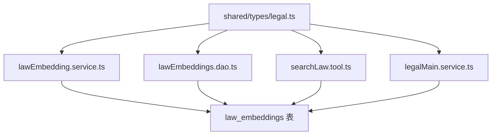
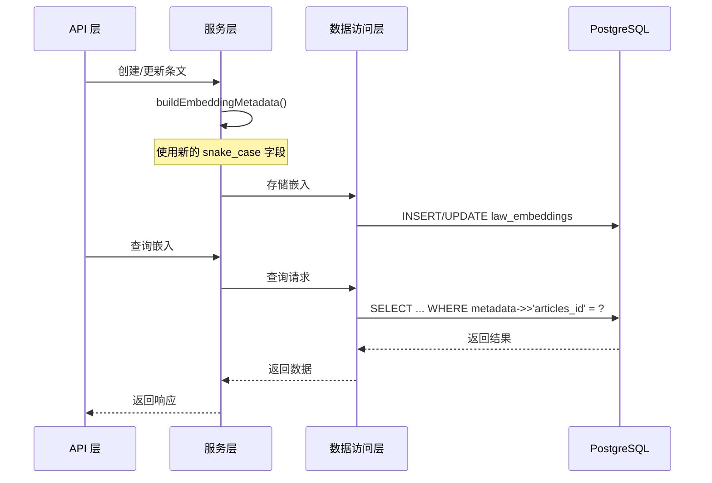

# 设计文档

## 概述

本设计文档描述如何将当前项目的 `law_embeddings` 表 metadata 结构调整为与旧项目一致，以支持数据迁移。主要涉及类型定义更新、服务层代码修改、数据访问层查询调整。

## 架构

### 影响范围



### 数据流



## 组件和接口

### 1. 类型定义更新 (shared/types/legal.ts)

#### 旧结构 vs 新结构对比

| 当前字段 (camelCase) | 新字段 (snake_case) | 类型变更 |
|---------------------|---------------------|---------|
| articleId | articles_id | 无 |
| legalId | legal_id | 无 |
| legalName | legal_name | 无 |
| legalCode | (移除) | - |
| legalType | legal_type | string → 中文 |
| articleType | article_type | 无 |
| hierarchyPath | chapter_hierarchy | string → string[] |
| publishDate | publish_date | YYYY-MM-DD → ISO 8601 |
| effectiveDate | effective_date | YYYY-MM-DD → ISO 8601 |
| invalidDate | invalid_date | YYYY-MM-DD → ISO 8601 |
| isValid | (移除) | - |
| - | issuing_authority | 新增 |
| - | document_number | 新增 |
| - | last_edited_at | 新增 |
| - | loc | 新增 |

#### 新的 LawEmbeddingMetadata 接口

```typescript
/** 文本位置信息 */
interface TextLocation {
    lines: {
        from: number
        to: number
    }
}

/** 法律嵌入元数据（与旧项目兼容） */
interface LawEmbeddingMetadata {
    /** 条文 ID */
    articles_id: string
    /** 法律 ID */
    legal_id: string
    /** 法律名称 */
    legal_name: string
    /** 法律类型（中文：法律、法规、司法解释、指导意见） */
    legal_type: string
    /** 条文类型 */
    article_type: string
    /** 章节层级数组 */
    chapter_hierarchy: string[]
    /** 发文机关 */
    issuing_authority: string
    /** 文号 */
    document_number: string
    /** 发布日期（ISO 8601 格式） */
    publish_date: string | null
    /** 生效日期（ISO 8601 格式） */
    effective_date: string | null
    /** 失效日期（ISO 8601 格式） */
    invalid_date: string | null
    /** 最后编辑时间（ISO 8601 格式） */
    last_edited_at: string | null
    /** 最后嵌入时间（ISO 8601 格式） */
    last_embedding_at: string
    /** 文本位置信息 */
    loc?: TextLocation
}
```

### 2. 服务层修改 (lawEmbedding.service.ts)

#### buildEmbeddingMetadata 函数重构

```typescript
function buildEmbeddingMetadata(
    legal: legalMain,
    article: legalArticles
): LawEmbeddingMetadata {
    // 构建章节层级数组
    const chapter_hierarchy: string[] = []
    if (article.l1) chapter_hierarchy.push(article.l1)
    if (article.l2) chapter_hierarchy.push(article.l2)
    if (article.l3) chapter_hierarchy.push(article.l3)
    if (article.l4) chapter_hierarchy.push(article.l4)
    if (article.l5) chapter_hierarchy.push(article.l5)

    // 格式化日期为 ISO 8601 格式
    const formatDateISO = (date: Date | null): string | null => {
        if (!date) return null
        return dayjs(date).format('YYYY-MM-DDTHH:mm:ss+08:00')
    }

    return {
        articles_id: article.id,
        legal_id: legal.id,
        legal_name: legal.name,
        legal_type: getLegalTypeName(legal.type), // 转换为中文
        article_type: article.type,
        chapter_hierarchy,
        issuing_authority: legal.issuingAuthority || '',
        document_number: legal.documentNumber || '',
        publish_date: formatDateISO(article.publishDate),
        effective_date: formatDateISO(article.effectiveDate),
        invalid_date: formatDateISO(article.invalidDate),
        last_edited_at: formatDateISO(article.lastEditedAt),
        last_embedding_at: dayjs().format('YYYY-MM-DDTHH:mm:ss+08:00'),
    }
}
```

#### 法律类型转换函数

```typescript
function getLegalTypeName(type: string): string {
    const typeMap: Record<string, string> = {
        'law': '法律',
        'regulation': '法规',
        'judicial_interp': '司法解释',
        'guideline': '指导意见',
    }
    return typeMap[type] || '其他'
}
```

### 3. 数据访问层修改 (lawEmbeddings.dao.ts)

#### SQL 查询字段名更新

所有 SQL 查询中的 metadata 字段访问需要从 camelCase 改为 snake_case：

```sql
-- 旧查询
WHERE metadata->>'legalId' = $1
WHERE metadata->>'articleId' = $2

-- 新查询
WHERE metadata->>'legal_id' = $1
WHERE metadata->>'articles_id' = $2
```

### 4. 搜索工具修改 (searchLaw.tool.ts)

#### 向量搜索过滤器更新

```typescript
const filter: Record<string, string | number | boolean> = {}

if (params.legalId) {
    filter.legal_id = params.legalId  // 改为 snake_case
}
if (params.legalName) {
    filter.legal_name = params.legalName  // 改为 snake_case
}
if (params.legalType) {
    filter.legal_type = params.legalType  // 改为 snake_case
}
if (params.articleType) {
    filter.article_type = params.articleType  // 改为 snake_case
}
```

#### SQL 查询字段名更新

```sql
-- 旧查询
AND metadata->>'legalId' = $1
AND metadata->>'legalName' = $2

-- 新查询
AND metadata->>'legal_id' = $1
AND metadata->>'legal_name' = $2
```

## 数据模型

### law_embeddings 表 metadata 字段结构

```json
{
    "loc": {
        "lines": {
            "to": 4,
            "from": 1
        }
    },
    "legal_id": "uuid",
    "legal_name": "法律名称",
    "legal_type": "司法解释",
    "articles_id": "uuid",
    "article_type": "l4",
    "invalid_date": null,
    "publish_date": "2020-12-29T08:00:00+08:00",
    "effective_date": "2021-01-01T08:00:00+08:00",
    "last_edited_at": "2025-10-18T18:56:05+08:00",
    "document_number": "法〔2020〕347 号",
    "chapter_hierarchy": ["第一编", "第一章", "第一条"],
    "issuing_authority": "最高人民法院",
    "last_embedding_at": "2025-10-18T18:57:47+08:00"
}
```

## 正确性属性

*正确性属性是指在系统所有有效执行中都应保持为真的特征或行为——本质上是关于系统应该做什么的形式化陈述。属性作为人类可读规范和机器可验证正确性保证之间的桥梁。*

### Property 1: Metadata 字段命名符合 snake_case 规范

*对于任意* 法律法规和条文组合，调用 buildEmbeddingMetadata 函数生成的元数据对象，其所有字段名都应使用 snake_case 命名（包含下划线分隔），不应包含 camelCase 字段名。

**验证: 需求 1.1-1.9**

### Property 2: Metadata 包含所有必需的旧项目字段

*对于任意* 法律法规和条文组合，调用 buildEmbeddingMetadata 函数生成的元数据对象，必须包含以下字段：`articles_id`、`legal_id`、`legal_name`、`legal_type`、`article_type`、`chapter_hierarchy`、`issuing_authority`、`document_number`、`publish_date`、`effective_date`、`invalid_date`、`last_edited_at`、`last_embedding_at`。

**验证: 需求 2.1-2.4**

### Property 3: Metadata 不包含已移除的字段

*对于任意* 法律法规和条文组合，调用 buildEmbeddingMetadata 函数生成的元数据对象，不应包含以下字段：`isValid`、`legalCode`、`hierarchyPath`、`articleId`、`legalId`、`legalName`、`legalType`、`articleType`、`invalidDate`、`publishDate`、`effectiveDate`。

**验证: 需求 3.1-3.3**

### Property 4: legal_type 字段值为中文

*对于任意* 法律类型枚举值（law、regulation、judicial_interp、guideline），buildEmbeddingMetadata 函数生成的 legal_type 字段值应为对应的中文名称（法律、法规、司法解释、指导意见）。

**验证: 需求 4.1-4.4**

### Property 5: 日期字段格式符合 ISO 8601 带时区格式

*对于任意* 非空日期值，buildEmbeddingMetadata 函数生成的日期字段（publish_date、effective_date、invalid_date、last_edited_at、last_embedding_at）应符合 `YYYY-MM-DDTHH:mm:ss+08:00` 格式。

**验证: 需求 5.1-5.5**

### Property 6: chapter_hierarchy 为字符串数组

*对于任意* 条文的层级信息（l1-l5），buildEmbeddingMetadata 函数生成的 chapter_hierarchy 字段应为字符串数组，包含所有非空的层级标题，顺序为 l1 → l2 → l3 → l4 → l5。

**验证: 需求 1.9**

## 错误处理

### 数据迁移兼容性

- 新代码应能正确处理旧格式的 metadata（向后兼容读取）
- 查询时应同时支持新旧字段名（过渡期）
- 写入时只使用新格式

### 空值处理

- 日期字段为空时保持 null
- issuing_authority 和 document_number 为空时使用空字符串 ''
- chapter_hierarchy 在所有层级都为空时返回空数组 []

## 测试策略

### 单元测试

1. **buildEmbeddingMetadata 函数测试**
   - 验证字段命名规范
   - 验证必需字段存在
   - 验证已移除字段不存在
   - 验证法律类型转换
   - 验证日期格式化
   - 验证 chapter_hierarchy 数组构建

2. **getLegalTypeName 函数测试**
   - 验证所有枚举值的转换
   - 验证未知类型的默认值

### 属性测试

使用 fast-check 进行属性测试，每个属性测试至少运行 100 次迭代。

1. **Property 1 测试**: 生成随机的法律法规和条文数据，验证输出字段名符合 snake_case
2. **Property 2 测试**: 生成随机数据，验证所有必需字段存在
3. **Property 3 测试**: 生成随机数据，验证已移除字段不存在
4. **Property 4 测试**: 生成随机法律类型，验证转换为中文
5. **Property 5 测试**: 生成随机日期，验证格式符合 ISO 8601
6. **Property 6 测试**: 生成随机层级数据，验证数组构建正确

### 集成测试

1. **数据访问层测试**
   - 验证 SQL 查询使用正确的字段名
   - 验证数据写入和读取的一致性

2. **搜索功能测试**
   - 验证向量搜索过滤器使用正确的字段名
   - 验证 SQL 查询模式使用正确的字段名
