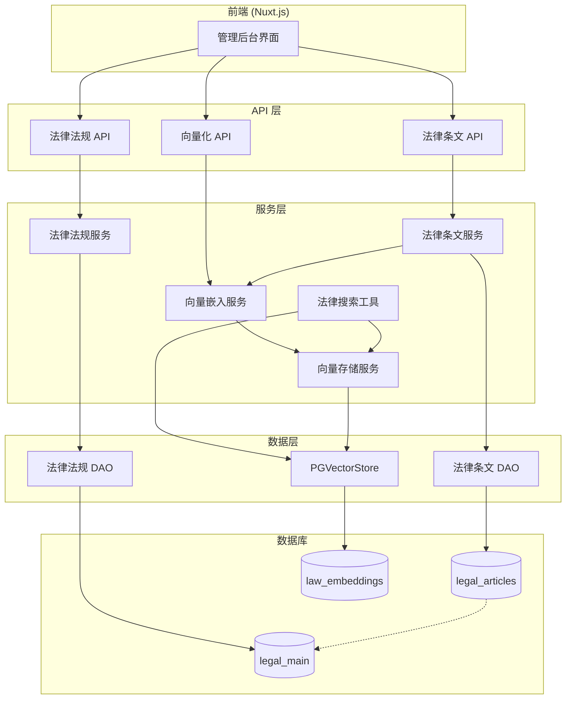

# 设计文档

## 概述

本设计文档描述法律知识库功能的技术实现方案。该功能包括数据库模型定义、API 接口设计、向量化服务、搜索工具以及管理后台界面。系统采用 Nuxt.js 4 全栈架构，使用 PostgreSQL + pgvector 作为向量数据库，集成 LangChain 进行向量化处理。

## 架构



## 组件和接口

### 1. 数据库模型

#### 1.1 legal_main 表

```prisma
model legalMain {
  id               String          @id @default(uuid(7))
  name             String          // 法律名称
  code             String          // 法律代码
  type             String          // 法律类型：law, regulation, judicial_interp, guideline
  category         String?         // 法律分类
  content          String          // 法律内容
  issuingAuthority String?         @map("issuing_authority") // 发文机关
  documentNumber   String?         @map("document_number")   // 文号
  publishDate      DateTime?       @map("publish_date") @db.Date()
  effectiveDate    DateTime?       @map("effective_date") @db.Date()
  invalidDate      DateTime?       @map("invalid_date") @db.Date()
  lastEditedAt     DateTime?       @default(now()) @map("last_edited_at") @db.Timestamptz()
  lastEmbeddingAt  DateTime?       @map("last_embedding_at") @db.Timestamptz()
  createdAt        DateTime?       @default(now()) @map("created_at") @db.Timestamptz()
  updatedAt        DateTime?       @default(now()) @map("updated_at") @db.Timestamptz()
  deletedAt        DateTime?       @map("deleted_at") @db.Timestamptz()
  legalArticles    legalArticles[]

  @@index([type], map: "idx_legal_main_type")
  @@index([code], map: "idx_legal_main_code")
  @@index([issuingAuthority], map: "idx_legal_main_issuing_authority")
  @@index([deletedAt], map: "idx_legal_main_deleted_at")
  @@map("legal_main")
}
```

#### 1.2 legal_articles 表

```prisma
model legalArticles {
  id              String    @id @default(uuid(7))
  legalId         String    @map("legal_id")
  type            String    // 条文类型：notice, header, footer, annex, l1-l5
  l1              String?   // 一级标题(编)
  l1I             Int?      @map("l1_i")
  l2              String?   // 二级标题(分编)
  l2I             Int?      @map("l2_i")
  l3              String?   // 三级标题(章)
  l3I             Int?      @map("l3_i")
  l4              String?   // 四级标题(节)
  l4I             Int?      @map("l4_i")
  l5              String?   // 五级标题(条)
  l5I             Int?      @map("l5_i")
  order           Int?      // 块排序
  content         String?   // 条文内容
  publishDate     DateTime? @map("publish_date") @db.Date()
  effectiveDate   DateTime? @map("effective_date") @db.Date()
  invalidDate     DateTime? @map("invalid_date") @db.Date()
  lastEditedAt    DateTime? @default(now()) @map("last_edited_at") @db.Timestamptz()
  lastEmbeddingAt DateTime? @map("last_embedding_at") @db.Timestamptz()
  createdAt       DateTime? @default(now()) @map("created_at") @db.Timestamptz()
  updatedAt       DateTime? @default(now()) @map("updated_at") @db.Timestamptz()
  deletedAt       DateTime? @map("deleted_at") @db.Timestamptz()
  legalMain       legalMain @relation(fields: [legalId], references: [id], onDelete: NoAction, onUpdate: NoAction)

  @@index([legalId], map: "idx_legal_articles_legal_id")
  @@index([deletedAt], map: "idx_legal_articles_deleted_at")
  @@map("legal_articles")
}
```

#### 1.3 law_embeddings 表（保持原有设计）

```prisma
model lawEmbeddings {
  id        String                 @id @default(dbgenerated("gen_random_uuid()")) @db.Uuid
  text      String?
  metadata  Json?
  embedding Unsupported("vector")?

  @@map("law_embeddings")
}
```

### 2. API 接口设计

#### 2.1 法律法规管理 API

| 方法 | 路径 | 描述 |
|------|------|------|
| GET | /api/v1/admin/legal-main | 获取法律法规列表（分页） |
| GET | /api/v1/admin/legal-main/:id | 获取法律法规详情 |
| POST | /api/v1/admin/legal-main | 创建法律法规 |
| PUT | /api/v1/admin/legal-main/:id | 更新法律法规 |
| DELETE | /api/v1/admin/legal-main/:id | 删除法律法规（软删除） |

#### 2.2 法律条文管理 API

| 方法 | 路径 | 描述 |
|------|------|------|
| GET | /api/v1/admin/legal-articles | 获取条文列表（按 legalId） |
| GET | /api/v1/admin/legal-articles/:id | 获取条文详情 |
| POST | /api/v1/admin/legal-articles | 创建条文 |
| PUT | /api/v1/admin/legal-articles/:id | 更新条文 |
| DELETE | /api/v1/admin/legal-articles/:id | 删除条文（软删除） |
| POST | /api/v1/admin/legal-articles/:id/embed | 手动触发向量化 |

### 3. 服务层设计

#### 3.1 向量嵌入服务 (EmbeddingService)

```typescript
interface EmbeddingService {
  // 为法律条文生成向量嵌入
  embedLawArticle(legalMain: LegalMain, article: LegalArticles): Promise<string>
  
  // 删除指定条文的向量嵌入
  deleteEmbeddingsByArticleId(articleId: string): Promise<void>
  
  // 更新法律的所有条文嵌入
  updateLegalEmbeddings(legalId: string): Promise<void>
  
  // 批量更新失效状态
  updateInvalidStatus(legalId: string, invalidDate: Date): Promise<void>
}
```

#### 3.2 向量存储服务 (VectorStoreService)

```typescript
interface VectorStoreConfig {
  tableName: string
  vectorColumnName: string
  contentColumnName: string
  metadataColumnName: string
}

interface VectorStoreService {
  // 获取或创建向量存储实例
  getVectorStore(config: VectorStoreConfig): Promise<PGVectorStore>
  
  // 添加文档到向量存储
  addDocuments(documents: Document[], ids: string[]): Promise<void>
  
  // 删除向量嵌入
  deleteByMetadata(field: string, value: string): Promise<void>
  
  // 相似度搜索
  similaritySearch(query: string, k: number, filter?: Record<string, any>): Promise<SearchResult[]>
}
```

#### 3.3 法律搜索工具 (SearchLawTool)

```typescript
interface SearchLawParams {
  k?: number           // 返回结果数量
  query?: string       // 语义搜索关键词
  legalId?: string     // 法律 ID
  legalName?: string   // 法律名称
  articleType?: string // 条文类型
  chapterHierarchy?: string[]
  keywords?: string[]
  page?: number        // 分页页码
  isEffective?: boolean // 是否有效
  invalidDateFilter?: DateFilter
  publishDateFilter?: DateFilter
  effectiveDateFilter?: DateFilter
}

interface DateFilter {
  date: string         // YYYY-MM-DD 格式
  operator: '>' | '<' | '=' | '>=' | '<='
}

interface SearchLawResult {
  score: number
  content: string
  metadata: {
    articles_id: string
    legal_id: string
    legal_name: string
    legal_type: string
    issuing_authority: string
    document_number: string
    publish_date: string
    effective_date: string
    invalid_date: string
    last_edited_at: string
    last_embedding_at: string
    article_type: string
    chapter_hierarchy: string[]
  }
}
```

## 数据模型

### 嵌入文本格式

```
文件：{legal.name}
类型：{legalType(legal.type)}
章节：{chapter.join(' - ')}
内容：{article.content}
```

### 嵌入元数据结构

```typescript
interface EmbeddingMetadata {
  articles_id: string
  legal_id: string
  legal_name: string
  legal_type: string
  issuing_authority: string
  document_number: string
  publish_date: string      // ISO 格式
  effective_date: string    // ISO 格式
  invalid_date: string      // ISO 格式
  last_edited_at: string    // ISO 格式
  last_embedding_at: string // ISO 格式
  article_type: string
  chapter_hierarchy: string[]
}
```

### 法律类型映射

| 代码 | 中文名称 |
|------|----------|
| law | 法律 |
| regulation | 行政法规 |
| judicial_interp | 司法解释 |
| guideline | 指导意见 |

### 条文类型映射

| 代码 | 中文名称 |
|------|----------|
| notice | 通知 |
| header | 正文头部 |
| footer | 正文尾部 |
| annex | 附件 |
| l1 | 一级标题(编) |
| l2 | 二级标题(分编) |
| l3 | 三级标题(章) |
| l4 | 四级标题(节) |
| l5 | 五级标题(条) |

## 正确性属性

*正确性属性是系统在所有有效执行中应保持为真的特征或行为——本质上是关于系统应该做什么的形式化陈述。属性作为人类可读规范和机器可验证正确性保证之间的桥梁。*

### Property 1: 法律法规 CRUD 操作一致性

*对于任意* 有效的法律法规数据，创建后通过 ID 查询应返回相同的数据（除自动生成字段外）

**验证: 需求 2.2, 2.3**

### Property 2: 法律条文与法律法规关联完整性

*对于任意* 法律条文，其 legalId 必须对应一个存在且未删除的法律法规记录

**验证: 需求 1.4, 3.1**

### Property 3: 软删除一致性

*对于任意* 被软删除的法律法规，其 deletedAt 字段应为非空时间戳，且通过常规查询不应返回该记录

**验证: 需求 2.5, 3.5**

### Property 4: 向量嵌入元数据完整性

*对于任意* 成功生成的向量嵌入，其 metadata 应包含所有必需字段：articles_id、legal_id、legal_name、legal_type、article_type、chapter_hierarchy

**验证: 需求 4.4**

### Property 5: 条文更新触发重新嵌入

*对于任意* 法律条文更新操作，更新后的 lastEditedAt 应大于更新前的值，且应触发新的向量嵌入生成

**验证: 需求 3.4, 4.2**

### Property 6: 失效状态级联更新

*对于任意* 被标记为失效的法律法规，其所有关联条文的 invalidDate 应更新为相同值，且对应的向量嵌入 metadata.invalid_date 也应更新

**验证: 需求 5.1, 5.2**

### Property 7: 搜索结果格式一致性

*对于任意* 法律搜索查询，返回的每个结果应包含 score、content 和完整的 metadata 对象

**验证: 需求 8.6**

### Property 8: 向量搜索与 SQL 搜索模式切换

*对于任意* 搜索请求，当提供 query 参数时应使用向量语义搜索，否则应使用 SQL 元数据筛选

**验证: 需求 8.1**

### Property 9: 日期过滤时区一致性

*对于任意* 日期过滤操作，系统应使用东八区时区（Asia/Shanghai）处理日期比较

**验证: 需求 8.7**

### Property 10: 分页结果数量约束

*对于任意* 分页查询，返回结果数量应不超过指定的 k 值（每页大小）

**验证: 需求 8.5**

### Property 11: 向量存储实例复用

*对于任意* 相同表名的向量存储请求，应返回相同的 PGVectorStore 实例

**验证: 需求 7.5**

### Property 12: 空内容跳过嵌入

*对于任意* 内容为空或仅包含空白字符的法律条文，系统应跳过向量嵌入生成

**验证: 需求 4.6**

## 错误处理

### API 响应格式

所有 API 响应 HTTP 状态码统一为 200，通过业务 code 字段区分成功和失败：

```typescript
interface ApiBaseResponse<T = any> {
    requestId: string    // 请求 ID
    success: boolean     // 是否成功
    code: number         // 业务码，0 表示成功，非 0 表示失败
    message: string      // 响应消息
    timestamp: number    // 时间戳
    data?: T             // 响应数据
}
```

### 业务错误码

| 错误码 | 描述 | 场景 |
|--------|------|------|
| 0 | 成功 | 操作成功 |
| 400 | 参数验证失败 | 请求参数不符合 zod schema |
| 401 | 未授权 | 未登录或 token 过期 |
| 403 | 权限不足 | 无管理员权限 |
| 404 | 资源不存在 | 法律法规或条文 ID 不存在 |
| 500 | 服务器错误 | 数据库或向量化服务异常 |

### 响应示例

成功响应：
```json
{
    "requestId": "01234567-89ab-cdef-0123-456789abcdef",
    "success": true,
    "code": 0,
    "message": "获取法律法规列表成功",
    "timestamp": 1704067200000,
    "data": { ... }
}
```

失败响应：
```json
{
    "requestId": "01234567-89ab-cdef-0123-456789abcdef",
    "success": false,
    "code": 404,
    "message": "法律法规不存在",
    "timestamp": 1704067200000,
    "data": null
}
```

### 向量化错误处理

1. **嵌入 API 调用失败**: 记录错误日志，抛出异常，不更新 lastEmbeddingAt
2. **内容为空**: 记录警告日志，跳过嵌入，返回 null
3. **数据库连接失败**: 记录错误日志，抛出异常

## 测试策略

### 单元测试

- 测试 DAO 层的 CRUD 操作
- 测试服务层的业务逻辑
- 测试日期过滤和时区处理
- 测试嵌入文本构建逻辑

### 属性测试

使用 fast-check 进行属性测试，每个属性测试运行 100 次迭代：

1. **法律法规 CRUD 往返测试**: 创建 -> 查询 -> 验证数据一致性
2. **软删除测试**: 删除 -> 查询 -> 验证不可见
3. **失效状态级联测试**: 设置失效 -> 验证条文和嵌入更新
4. **搜索结果格式测试**: 搜索 -> 验证结果结构
5. **分页约束测试**: 分页查询 -> 验证结果数量

### 集成测试

- 测试完整的条文创建和向量化流程
- 测试法律失效状态同步流程
- 测试搜索工具的两种模式

### 测试框架

- **vitest**: 测试运行器
- **fast-check**: 属性测试库
- 测试文件位置: `tests/server/legal/`

