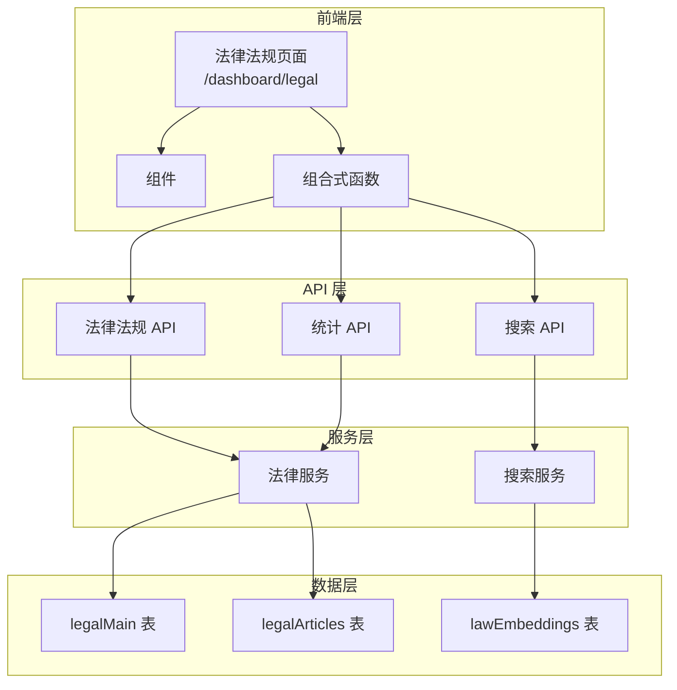
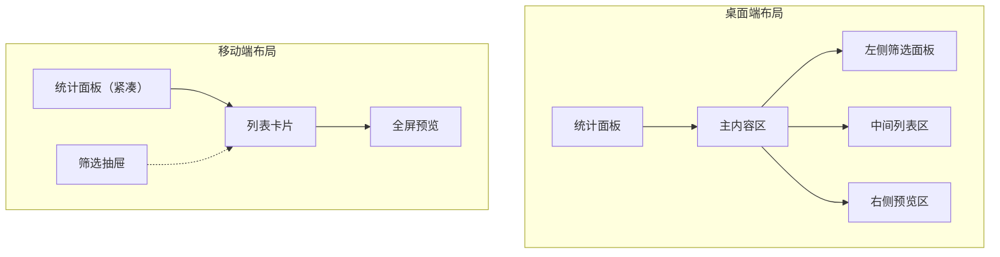

# 设计文档

## 概述

法律法规搜索功能为用户提供一个专业的法律检索界面，支持法律法规和法条的多维度搜索与浏览。系统复用现有的法律数据模型（legalMain、legalArticles）和向量搜索服务（lawEmbeddings），在 dashboard 中新增独立的法律法规页面。

## 架构

### 整体架构



### 页面布局架构



## 组件和接口

### 前端组件

#### 1. 页面组件

```
app/pages/dashboard/legal/
├── index.vue          # 法律法规搜索主页面
└── [id].vue           # 法律法规详情页面（可选）
```

#### 2. 业务组件

```
app/components/legal-search/
├── StatisticsPanel.vue      # 统计面板组件
├── FilterPanel.vue          # 筛选面板组件
├── LegalList.vue            # 法律法规列表组件
├── LegalListItem.vue        # 列表项组件
├── LegalListMobile.vue      # 移动端列表组件
├── ArticleSearchPanel.vue   # 法条搜索面板组件
├── ArticleSearchResult.vue  # 法条搜索结果组件
└── LegalPreviewPanel.vue    # 法律全文预览面板
```

#### 3. 组合式函数

```typescript
// app/composables/useLegalSearch.ts
interface UseLegalSearchReturn {
    // 状态
    loading: Ref<boolean>
    error: Ref<string | null>
    legalList: Ref<LegalMainListItem[]>
    statistics: Ref<LegalStatistics | null>
    pagination: Ref<PaginationState>
    filters: Ref<LegalSearchFilters>
    selectedLegal: Ref<LegalMainInfo | null>
    
    // 方法
    search: (keyword?: string) => Promise<void>
    loadStatistics: () => Promise<void>
    loadLegalDetail: (id: string) => Promise<void>
    setFilters: (filters: Partial<LegalSearchFilters>) => void
    resetFilters: () => void
    setPage: (page: number) => void
}

// app/composables/useArticleSearch.ts
interface UseArticleSearchReturn {
    // 状态
    loading: Ref<boolean>
    results: Ref<LawSearchResultItem[]>
    
    // 方法
    searchArticles: (query: string, filters?: ArticleSearchFilters) => Promise<void>
}
```

### API 接口

#### 1. 法律法规列表接口

```typescript
// GET /api/v1/legal/list
interface LegalListRequest {
    page?: number
    pageSize?: number
    keyword?: string
    type?: LegalType
    issuingAuthority?: string
    validOnly?: boolean
    publishDateFrom?: string
    publishDateTo?: string
    sortBy?: 'publishDate' | 'effectiveDate' | 'name' | 'createdAt'
    sortOrder?: 'asc' | 'desc'
}

interface LegalListResponse {
    items: LegalMainListItem[]
    total: number
    page: number
    pageSize: number
    totalPages: number
}
```

#### 2. 法律法规统计接口

```typescript
// GET /api/v1/legal/statistics
interface LegalStatisticsResponse {
    total: number
    byType: {
        law: number
        regulation: number
        judicial_interp: number
        guideline: number
    }
    byStatus: {
        valid: number
        invalid: number
    }
}
```

#### 3. 法律法规详情接口

```typescript
// GET /api/v1/legal/:id
interface LegalDetailResponse extends LegalMainInfo {
    articles: LegalArticleInfo[]
}
```

#### 4. 法条搜索接口

```typescript
// POST /api/v1/legal/search-articles
interface ArticleSearchRequest {
    query: string
    legalType?: LegalType
    validOnly?: boolean
    limit?: number
}

interface ArticleSearchResponse {
    items: LawSearchResultItem[]
    total: number
}
```

#### 5. 发文机关列表接口

```typescript
// GET /api/v1/legal/issuing-authorities
interface IssuingAuthoritiesResponse {
    items: string[]
}
```

## 数据模型

### 筛选条件类型

```typescript
// shared/types/legal-search.ts
interface LegalSearchFilters {
    keyword: string
    type: LegalType | null
    issuingAuthority: string | null
    validOnly: boolean | null
    publishDateFrom: string | null
    publishDateTo: string | null
}

interface ArticleSearchFilters {
    legalType: LegalType | null
    validOnly: boolean
}

interface PaginationState {
    page: number
    pageSize: number
    total: number
    totalPages: number
}
```

### 统计数据类型

```typescript
interface LegalSearchStatistics {
    total: number
    byType: Record<LegalType, number>
    byStatus: {
        valid: number
        invalid: number
    }
}
```

## 正确性属性

*正确性属性是指在系统所有有效执行中都应保持为真的特征或行为——本质上是关于系统应该做什么的形式化陈述。属性作为人类可读规范和机器可验证正确性保证之间的桥梁。*

### Property 1: 统计数据正确性

*对于任意* 法律法规数据集，统计接口返回的各类型数量之和应等于总数量，且每个类型的数量应与数据库中该类型的实际记录数一致。

**验证: 需求 2.1**

### Property 2: 搜索结果匹配性

*对于任意* 搜索关键词，返回的法律法规列表中每一项的名称或文号应包含该关键词（不区分大小写）。

**验证: 需求 3.2, 3.3**

### Property 3: 分页逻辑正确性

*对于任意* 分页请求，返回的结果数量应不超过请求的 pageSize，且 totalPages 应等于 ceil(total / pageSize)。

**验证: 需求 3.5**

### Property 4: 筛选结果正确性

*对于任意* 筛选条件组合：
- 若指定 type，则所有结果的 type 字段应等于指定值
- 若指定 issuingAuthority，则所有结果的 issuingAuthority 字段应等于指定值
- 若 validOnly 为 true，则所有结果应为有效状态（effectiveDate <= 当前日期 且 (invalidDate 为空 或 invalidDate > 当前日期)）
- 若指定日期范围，则所有结果的 publishDate 应在指定范围内

**验证: 需求 4.1, 4.2, 4.3, 4.4**

### Property 5: 返回数据完整性

*对于任意* 法律法规列表项或法条搜索结果，返回的数据应包含所有必要字段：
- 法律法规列表项：id, name, type, issuingAuthority, publishDate, effectiveDate
- 法条搜索结果：articles_id, legal_id, legal_name, content, chapter_hierarchy

**验证: 需求 5.2, 7.3**

### Property 6: 条文层级顺序正确性

*对于任意* 法律法规的条文列表，条文应按 order 字段升序排列，且层级结构（l1 -> l2 -> l3 -> l4 -> l5）应保持正确的父子关系。

**验证: 需求 6.2**

## 错误处理

### 前端错误处理

```typescript
// 统一错误处理
const handleApiError = (error: any) => {
    if (error.statusCode === 401) {
        // 未授权，跳转登录
        navigateTo('/login')
    } else if (error.statusCode === 404) {
        // 资源不存在
        toast.error('请求的资源不存在')
    } else if (error.statusCode >= 500) {
        // 服务器错误
        toast.error('服务器错误，请稍后重试')
    } else {
        // 其他错误
        toast.error(error.message || '请求失败')
    }
}
```

### 后端错误处理

```typescript
// API 错误响应格式
interface ApiErrorResponse {
    code: number
    message: string
    details?: Record<string, any>
}

// 常见错误码
const ErrorCodes = {
    INVALID_PARAMS: 400,
    UNAUTHORIZED: 401,
    NOT_FOUND: 404,
    INTERNAL_ERROR: 500,
}
```

## 测试策略

### 单元测试

1. **组合式函数测试**
   - 测试 `useLegalSearch` 的状态管理和方法
   - 测试 `useArticleSearch` 的搜索逻辑
   - 测试筛选条件的组合逻辑

2. **工具函数测试**
   - 测试日期范围验证
   - 测试生效状态判断逻辑

### 属性测试

使用 fast-check 进行属性测试，每个属性测试至少运行 100 次迭代。

```typescript
// 测试标签格式: Feature: legal-search, Property N: 属性描述
```

1. **Property 1 测试**: 生成随机法律数据，验证统计结果正确性
2. **Property 2 测试**: 生成随机关键词，验证搜索结果匹配性
3. **Property 3 测试**: 生成随机分页参数，验证分页逻辑
4. **Property 4 测试**: 生成随机筛选条件组合，验证筛选结果
5. **Property 5 测试**: 验证返回数据包含所有必要字段
6. **Property 6 测试**: 验证条文排序和层级关系

### 集成测试

1. **API 集成测试**
   - 测试法律法规列表接口
   - 测试统计接口
   - 测试法条搜索接口

2. **端到端测试**
   - 测试完整的搜索流程
   - 测试筛选和分页交互
   - 测试法律全文预览功能
