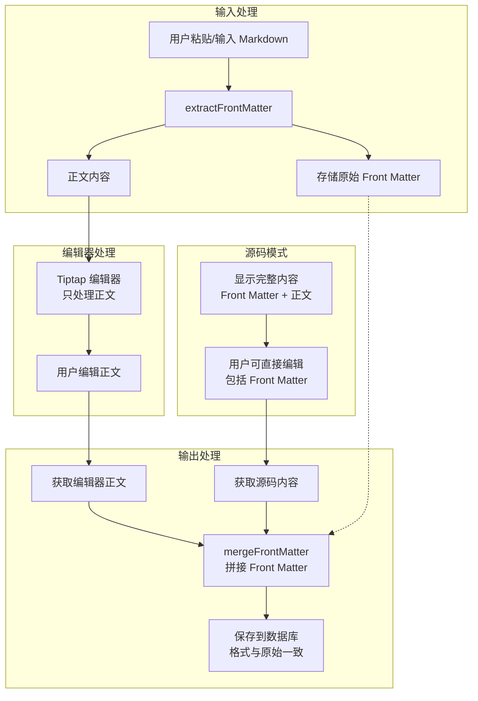

# 设计文档

## 概述

本设计解决 RichTextEditor 组件在处理包含 YAML front matter 的 Markdown 内容时格式被破坏的问题。

**问题根源**：`tiptap-markdown` 扩展在将 Markdown 转换为 HTML DOM 时，会将 YAML front matter 当作普通文本处理，导致格式被破坏、特殊符号被转义。

**解决方案**：在编辑器输入/输出时，将 front matter 与正文分离处理。编辑器只处理正文部分，front matter 原样保存，最终输出时再拼接回去。这样用户在所见即所得模式下编辑正文，front matter 保持原始格式不变。

## 架构



## 组件与接口

### Front Matter 解析工具函数

创建独立的工具函数用于解析和处理 YAML front matter：

```typescript
// shared/utils/markdownFrontMatter.ts

/**
 * Front Matter 解析结果
 */
interface FrontMatterResult {
  /** 原始 front matter 字符串（包含 --- 分隔符和结尾换行） */
  frontMatter: string | null
  /** 正文内容（不包含 front matter） */
  content: string
  /** front matter 是否有效 */
  hasFrontMatter: boolean
}

/**
 * 从 Markdown 内容中提取 YAML front matter
 * 
 * 规则：
 * 1. 文档必须以 `---` 开头（允许前导空白）
 * 2. 必须存在第二个 `---` 作为结束标记
 * 3. 提取的 front matter 包含完整的 `---` 分隔符
 * 
 * @param markdown 原始 Markdown 内容
 * @returns 解析结果
 */
export function extractFrontMatter(markdown: string): FrontMatterResult

/**
 * 将 front matter 和正文内容合并
 * 
 * @param frontMatter front matter 字符串（包含 --- 分隔符）
 * @param content 正文内容
 * @returns 合并后的 Markdown 内容
 */
export function mergeFrontMatter(frontMatter: string | null, content: string): string
```

### 解析规则

YAML front matter 必须满足以下条件才被识别：
1. 文档以 `---` 开头（可以有前导空白行，但通常不应有）
2. 存在第二个 `---` 作为结束标记
3. 两个 `---` 之间的内容为 YAML 格式

```typescript
// 正则表达式匹配 front matter
// 匹配：开头的 ---，中间任意内容，结束的 ---，以及可选的换行
const FRONT_MATTER_REGEX = /^(---\r?\n[\s\S]*?\r?\n---\r?\n?)/
```

### RichTextEditor 组件修改

在组件内部维护 front matter 状态，实现输入输出时的分离与合并：

```typescript
// 组件内部状态
const frontMatter = ref<string | null>(null)

/**
 * 获取编辑器内容（根据输出格式）
 * 如果是 markdown 格式且有 front matter，自动拼接
 */
function getEditorContent(editorInstance: any): string {
  if (!editorInstance) return ''
  
  let content = ''
  if (props.outputFormat === 'markdown') {
    content = editorInstance.storage?.markdown?.getMarkdown?.() || ''
    // 拼接 front matter
    if (frontMatter.value) {
      return mergeFrontMatter(frontMatter.value, content)
    }
  } else {
    content = editorInstance.getHTML()
  }
  
  return content
}

/**
 * 设置编辑器内容
 * 如果是 markdown 格式，先提取 front matter
 */
function setEditorContent(content: string, emitUpdate = false) {
  if (!editor.value) return
  
  if (props.outputFormat === 'markdown') {
    const result = extractFrontMatter(content)
    frontMatter.value = result.frontMatter
    editor.value.commands.setContent(result.content, { emitUpdate })
  } else {
    editor.value.commands.setContent(content, { emitUpdate })
  }
}
```

### 源码模式处理

源码模式需要显示完整内容（包含 front matter），并在切换回所见即所得模式时重新解析：

```typescript
/**
 * 切换源码模式
 */
function toggleSourceMode() {
  if (!editor.value) return

  if (isSourceMode.value) {
    // 从源码模式切换到所见即所得模式
    // 重新解析 front matter
    const result = extractFrontMatter(sourceContent.value)
    frontMatter.value = result.frontMatter
    editor.value.commands.setContent(result.content, { emitUpdate: false })
    emit('update:modelValue', mergeFrontMatter(frontMatter.value, result.content))
    isSourceMode.value = false
  } else {
    // 从所见即所得模式切换到源码模式
    // 显示完整内容（包含 front matter）
    const bodyContent = editor.value.storage?.markdown?.getMarkdown?.() || ''
    sourceContent.value = mergeFrontMatter(frontMatter.value, bodyContent)
    isSourceMode.value = true
  }
}
```

### v-model 同步处理

监听外部 modelValue 变化时，需要正确处理 front matter：

```typescript
watch(() => props.modelValue, (newValue) => {
  if (editor.value) {
    if (isSourceMode.value) {
      // 源码模式：直接更新源码内容
      if (sourceContent.value !== newValue) {
        sourceContent.value = newValue || ''
      }
    } else {
      // 所见即所得模式：提取 front matter 后更新编辑器
      const result = extractFrontMatter(newValue || '')
      const currentBody = editor.value.storage?.markdown?.getMarkdown?.() || ''
      
      // 更新 front matter
      frontMatter.value = result.frontMatter
      
      // 只有正文内容变化时才更新编辑器
      if (currentBody !== result.content) {
        editor.value.commands.setContent(result.content, { emitUpdate: false })
      }
    }
  }
})
```

## 数据模型

### FrontMatterResult 接口

| 字段 | 类型 | 说明 |
|------|------|------|
| frontMatter | `string \| null` | 原始 front matter 字符串，包含 `---` 分隔符 |
| content | `string` | 正文内容，不包含 front matter |
| hasFrontMatter | `boolean` | 是否包含有效的 front matter |

### 组件状态

| 状态 | 类型 | 说明 |
|------|------|------|
| frontMatter | `Ref<string \| null>` | 当前存储的 front matter |
| sourceContent | `Ref<string>` | 源码模式下的完整内容（包含 front matter） |

## 正确性属性

*正确性属性是在系统所有有效执行中都应该成立的特征或行为——本质上是关于系统应该做什么的形式化陈述。属性作为人类可读规范和机器可验证正确性保证之间的桥梁。*

### Property 1: Front Matter 解析正确性

*对于任意* 以 `---` 开头并包含第二个 `---` 的 Markdown 字符串，`extractFrontMatter` 函数应该正确提取 front matter 部分，且 `hasFrontMatter` 为 `true`。

**验证: 需求 1.1, 2.1**

### Property 2: Front Matter 往返一致性

*对于任意* 包含有效 YAML front matter 的 Markdown 内容，执行 `extractFrontMatter` 提取后再用 `mergeFrontMatter` 合并，应该产生与原始输入等价的内容。

**验证: 需求 1.2, 4.3**

### Property 3: 正文编辑不影响 Front Matter

*对于任意* 包含 front matter 的 Markdown 内容，在编辑器中修改正文内容后，获取输出时 front matter 部分应该与原始输入完全一致。

**验证: 需求 2.2**

### Property 4: 源码模式内容完整性

*对于任意* 包含 front matter 的 Markdown 内容，切换到源码模式时显示的内容应该包含完整的 front matter 和正文。

**验证: 需求 2.3, 3.1**

### Property 5: 外部更新同步正确性

*对于任意* 通过 v-model 更新的包含 front matter 的 Markdown 内容，编辑器应该正确解析并存储 front matter，后续获取内容时应该保持 front matter 完整。

**验证: 需求 4.1**

## 错误处理

| 场景 | 处理方式 |
|------|----------|
| Front matter 格式不完整（缺少结束 `---`） | 将整个内容作为普通正文处理，`hasFrontMatter` 为 `false` |
| Front matter 为空（只有两个 `---`） | 保留空的 front matter |
| 内容为空字符串 | 返回 `{ frontMatter: null, content: '', hasFrontMatter: false }` |
| 内容只有 front matter 没有正文 | 正常提取 front matter，content 为空字符串 |

## 测试策略

### 单元测试

1. **extractFrontMatter 函数测试**
   - 测试有效 front matter 的提取
   - 测试无 front matter 的内容
   - 测试不完整 front matter 的处理
   - 测试包含特殊字符的 front matter

2. **mergeFrontMatter 函数测试**
   - 测试有 front matter 的合并
   - 测试无 front matter 的合并
   - 测试空内容的处理

### 属性测试

使用 fast-check 进行属性测试：

1. **往返一致性测试** (Property 2)
   - 生成包含各种 YAML 内容的 front matter
   - 验证 extract → merge 后内容等价

2. **解析正确性测试** (Property 1)
   - 生成各种格式的 Markdown 内容
   - 验证 front matter 识别的正确性

### 测试配置

- 属性测试最少运行 100 次迭代
- 每个属性测试必须引用设计文档中的属性编号
- 标签格式: **Feature: markdown-frontmatter-preserve, Property {number}: {property_text}**
