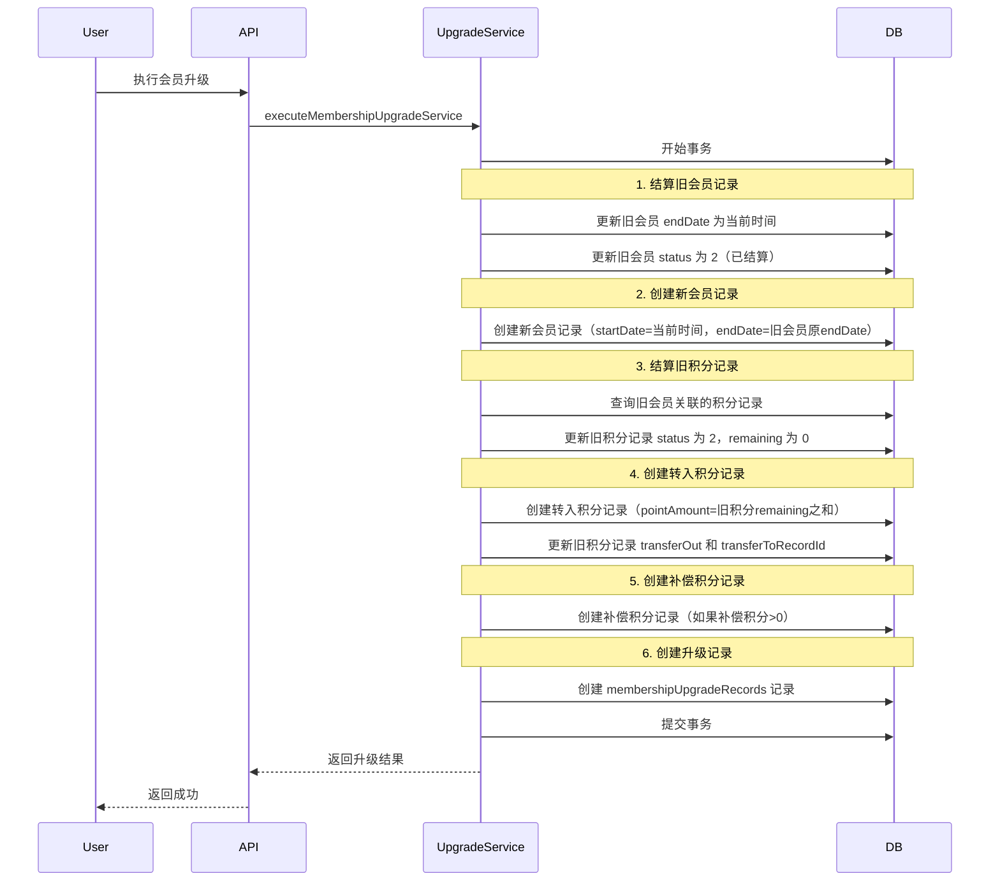

# 设计文档

## 概述

本设计文档描述了会员升级结算功能的技术方案。当用户升级会员时，需要对旧会员记录和关联的积分记录进行结算，生成新的会员记录和积分记录，确保数据的完整性和可追溯性。

## 架构

### 升级流程图



## 组件和接口

### 需要修改的组件

#### 1. 数据模型修改

**文件路径：** `prisma/models/point.prisma`

新增字段：
```prisma
model pointRecords {
    // ... 现有字段 ...
    
    /// 转出积分数量
    transferOut        Int?      @default(0) @map("transfer_out")
    /// 转出目标记录ID
    transferToRecordId Int?      @map("transfer_to_record_id")
}
```

**文件路径：** `prisma/models/order.prisma`

新增字段：
```prisma
model membershipUpgradeRecords {
    // ... 现有字段 ...
    
    /// 转入积分数量
    transferPoints Int       @default(0) @map("transfer_points")
    /// 升级详情（JSON）
    details        Json?     @map("details")
}
```

#### 2. 类型定义

**文件路径：** `shared/types/membership.ts`

新增状态常量：
```typescript
/** 会员状态 */
export const MembershipStatus = {
    ACTIVE: 1,      // 有效
    INACTIVE: 0,    // 无效
    SETTLED: 2,     // 已结算
} as const

/** 积分记录状态 */
export const PointRecordStatus = {
    VALID: 1,       // 有效
    INVALID: 0,     // 无效
    SETTLED: 2,     // 已结算
} as const

/** 积分来源类型 */
export const PointSourceType = {
    // ... 现有类型 ...
    UPGRADE_COMPENSATION: 8,  // 会员升级补偿
    UPGRADE_TRANSFER: 9,      // 会员升级转入
} as const
```

#### 3. 会员升级服务重构

**文件路径：** `server/services/membership/membershipUpgrade.service.ts`

重构 `executeMembershipUpgradeService` 函数：

```typescript
export const executeMembershipUpgradeService = async (
    userId: number,
    targetLevelId: number,
    orderId: number,
    orderNo: string,
    tx?: PrismaClient
): Promise<UpgradeResult> => {
    const client = tx || prisma

    return await client.$transaction(async (tx) => {
        // 1. 获取当前会员和目标级别信息
        const currentMembership = await findCurrentUserMembershipDao(userId, tx)
        const targetLevel = await findMembershipLevelByIdDao(targetLevelId, tx)
        
        // 2. 计算升级价格和补偿积分
        const priceResult = calculateUpgradePrice(...)
        
        // 3. 结算旧会员记录
        const settlementDate = new Date()
        const originalEndDate = currentMembership.endDate
        await settleOldMembership(currentMembership.id, settlementDate, tx)
        
        // 4. 创建新会员记录
        const newMembership = await createNewMembership(
            userId, targetLevelId, settlementDate, originalEndDate, orderId, tx
        )
        
        // 5. 结算旧积分记录并创建转入积分记录
        const { transferRecordId, totalTransferPoints, oldPointRecords } = 
            await settleAndTransferPoints(
                currentMembership.id, newMembership.id, 
                settlementDate, originalEndDate, tx
            )
        
        // 6. 创建补偿积分记录
        let compensationRecordId = null
        if (priceResult.pointCompensation > 0) {
            compensationRecordId = await createCompensationPoints(
                userId, newMembership.id, priceResult.pointCompensation,
                settlementDate, originalEndDate, orderNo, tx
            )
        }
        
        // 7. 创建升级记录
        await createUpgradeRecord(
            userId, currentMembership.id, newMembership.id, orderId,
            priceResult.upgradePrice, priceResult.pointCompensation,
            totalTransferPoints, {
                oldMembership: { id: currentMembership.id, ... },
                newMembership: { id: newMembership.id, ... },
                oldPointRecords,
                newPointRecords: { transferRecordId, compensationRecordId }
            },
            tx
        )
        
        return { success: true, newMembership }
    })
}
```

## 数据模型

### Point_Record 数据模型变更

| 字段 | 类型 | 说明 | 变更 |
|------|------|------|------|
| transferOut | Int? | 转出积分数量 | 新增 |
| transferToRecordId | Int? | 转出目标记录 ID | 新增 |

### Membership_Upgrade_Records 数据模型变更

| 字段 | 类型 | 说明 | 变更 |
|------|------|------|------|
| transferPoints | Int | 转入积分数量 | 新增 |
| details | Json? | 升级详情 | 新增 |

### details JSON 结构

```json
{
    "oldMembership": {
        "id": 1,
        "levelId": 1,
        "levelName": "基础版",
        "startDate": "2025-01-01",
        "endDate": "2025-12-31",
        "settlementDate": "2025-06-15"
    },
    "newMembership": {
        "id": 2,
        "levelId": 2,
        "levelName": "专业版",
        "startDate": "2025-06-15",
        "endDate": "2025-12-31"
    },
    "oldPointRecords": [
        {
            "id": 1,
            "remaining": 100,
            "transferOut": 100,
            "transferToRecordId": 3
        }
    ],
    "newPointRecords": {
        "transferRecordId": 3,
        "compensationRecordId": 4
    }
}
```

## 正确性属性

*正确性属性是一种特征或行为，应该在系统的所有有效执行中保持为真——本质上是关于系统应该做什么的正式声明。属性作为人类可读规范和机器可验证正确性保证之间的桥梁。*

### Property 1: 会员记录结算正确性

*对于任意* 会员升级操作：
- 预购场景（结算日期 < 原会员开始日期）：旧会员记录的 endDate 保持不变，新会员记录的 startDate 等于原会员的 startDate
- 正常升级场景（结算日期 >= 原会员开始日期）：旧会员记录的 endDate 等于结算日期前一天，新会员记录的 startDate 等于结算日期
- 两种场景下：旧会员 status 应为 2（已结算），settlementAt 应记录结算时间，新会员 endDate 应等于旧会员原来的 endDate

**Validates: Requirements 1.1-1.8**

### Property 2: 积分记录结算正确性

*对于任意* 会员升级操作，旧会员关联的所有积分记录的 status 应为 2（已结算），remaining 应为 0，transferOut 应等于结算前的 remaining，transferToRecordId 应指向转入积分记录。

**Validates: Requirements 2.1, 2.2, 2.3, 2.4**

### Property 3: 转入积分记录正确性

*对于任意* 会员升级操作且旧会员有剩余积分，应创建一条转入积分记录，其 pointAmount 等于旧积分 remaining 之和，effectiveAt 根据场景确定（预购场景为原会员 startDate，正常升级场景为结算日期），expiredAt 等于新会员 endDate，sourceType 为 9。

**Validates: Requirements 3.1, 3.2, 3.3, 3.4, 3.6**

### Property 4: 补偿积分记录正确性

*对于任意* 会员升级操作且补偿积分大于 0，应创建一条补偿积分记录，其 effectiveAt 根据场景确定（预购场景为原会员 startDate，正常升级场景为结算日期），expiredAt 等于新会员 endDate，sourceType 为 8，remark 包含订单号。

**Validates: Requirements 4.1, 4.2, 4.3, 4.4, 4.5**

### Property 5: 升级记录正确性

*对于任意* 会员升级操作，应创建一条升级记录，包含正确的 fromMembershipId、toMembershipId、orderId、upgradePrice、pointCompensation、transferPoints 和 details JSON。

**Validates: Requirements 7.1-7.8, 8.1-8.4**

### Property 6: 积分总量守恒

*对于任意* 会员升级操作，旧积分记录的 transferOut 之和应等于转入积分记录的 pointAmount。

**Validates: Requirements 3.2, 5.3**

### Property 7: 状态过滤正确性

*对于任意* 有效积分/会员查询，应只返回 status = 1 的记录，不应返回 status = 2（已结算）的记录。

**Validates: Requirements 6.3, 6.4**

## 错误处理

### 事务回滚

- 如果任何操作失败，整个事务回滚
- 记录详细的错误日志
- 返回明确的错误信息

### 边界情况

- 旧会员没有关联积分记录：跳过积分结算和转入步骤
- 补偿积分为 0：跳过补偿积分记录创建
- 目标级别不存在或已禁用：返回错误

## 测试策略

### 单元测试

1. 测试会员记录结算逻辑
2. 测试积分记录结算逻辑
3. 测试转入积分记录创建
4. 测试补偿积分记录创建
5. 测试升级记录创建

### 属性测试

使用 fast-check 进行属性测试，验证：

1. **Property 1-5 测试**：生成随机的升级场景，验证各项记录是否正确创建
2. **Property 6 测试**：验证积分总量守恒
3. **Property 7 测试**：验证状态过滤正确性

### 测试配置

- 属性测试运行次数：100 次
- 测试框架：vitest + fast-check
