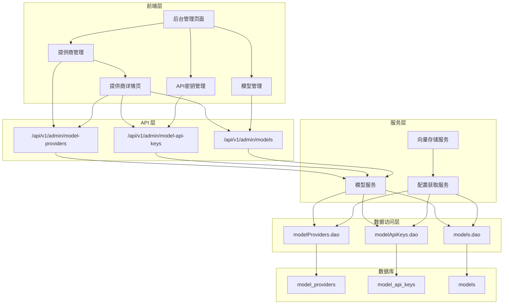
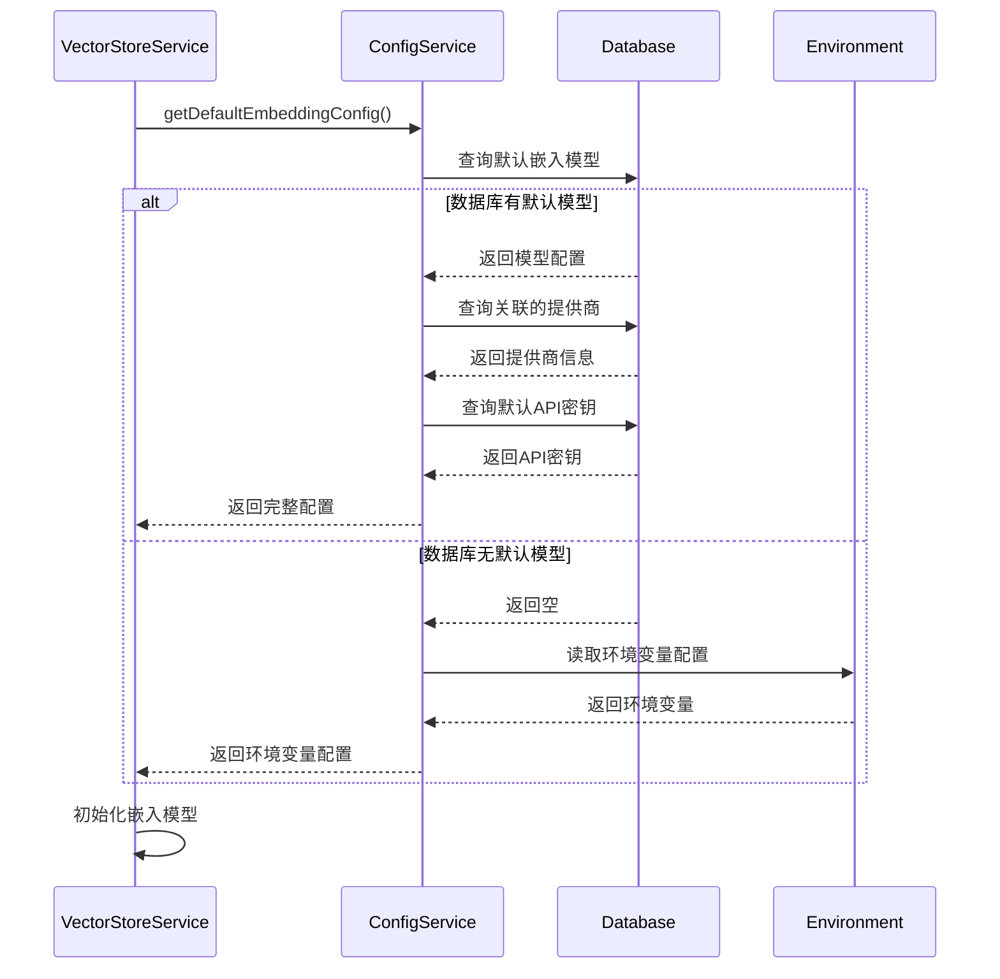

# Design Document: Model Management

## Overview

本设计文档描述了模型管理功能的技术实现方案，包括数据模型设计、服务层架构、API 接口设计和前端页面设计。该功能将从 lexseekApi 项目移植模型管理能力，并改造向量存储服务以支持动态配置。

## Architecture

### 系统架构图



### 配置获取流程



## Components and Interfaces

### 1. 数据访问层 (DAO)

#### modelProviders.dao.ts

```typescript
// 模型提供商数据访问层
interface ModelProviderDAO {
  // 创建提供商
  create(data: CreateModelProviderInput): Promise<ModelProvider>
  // 根据 ID 查询
  findById(id: number): Promise<ModelProvider | null>
  // 根据名称查询
  findByName(name: string): Promise<ModelProvider | null>
  // 查询列表
  findMany(params: FindManyParams): Promise<ModelProvider[]>
  // 更新
  update(id: number, data: UpdateModelProviderInput): Promise<ModelProvider>
  // 软删除
  softDelete(id: number): Promise<void>
}
```

#### modelApiKeys.dao.ts

```typescript
// 模型 API 密钥数据访问层
interface ModelApiKeyDAO {
  // 创建 API 密钥
  create(data: CreateModelApiKeyInput): Promise<ModelApiKey>
  // 根据 ID 查询
  findById(id: number): Promise<ModelApiKey | null>
  // 根据提供商 ID 查询列表
  findByProviderId(providerId: number): Promise<ModelApiKey[]>
  // 查询默认密钥
  findDefaultByProviderId(providerId: number): Promise<ModelApiKey | null>
  // 更新
  update(id: number, data: UpdateModelApiKeyInput): Promise<ModelApiKey>
  // 设置默认密钥
  setDefault(id: number, providerId: number): Promise<void>
  // 软删除
  softDelete(id: number): Promise<void>
}
```

#### models.dao.ts

```typescript
// 模型配置数据访问层
interface ModelDAO {
  // 创建模型
  create(data: CreateModelInput): Promise<Model>
  // 根据 ID 查询
  findById(id: number): Promise<Model | null>
  // 根据类型查询列表
  findByType(modelType: ModelType): Promise<Model[]>
  // 根据提供商 ID 查询列表
  findByProviderId(providerId: number): Promise<Model[]>
  // 查询默认模型
  findDefaultByType(modelType: ModelType): Promise<Model | null>
  // 查询列表
  findMany(params: FindManyParams): Promise<Model[]>
  // 更新
  update(id: number, data: UpdateModelInput): Promise<Model>
  // 设置默认模型
  setDefault(id: number, modelType: ModelType): Promise<void>
  // 软删除
  softDelete(id: number): Promise<void>
}
```

### 2. 服务层 (Service)

#### modelConfig.service.ts

```typescript
// 模型配置获取服务 - 提供抽象的配置获取方法
interface ModelConfigService {
  // 通过 ID 获取完整模型配置
  getModelConfigById(id: number): Promise<FullModelConfig | null>
  
  // 通过类型获取模型配置列表
  getModelsByType(
    modelType: ModelType,
    options?: { status?: number; orderBy?: 'priority' | 'name' }
  ): Promise<FullModelConfig[]>
  
  // 通过提供商 ID 获取模型列表
  getModelsByProviderId(providerId: number): Promise<FullModelConfig[]>
  
  // 获取默认嵌入模型配置
  getDefaultEmbeddingConfig(): Promise<FullModelConfig | null>
  
  // 获取默认聊天模型配置
  getDefaultChatConfig(): Promise<FullModelConfig | null>
  
  // 获取默认 ASR 模型配置
  getDefaultAsrConfig(): Promise<FullModelConfig | null>
  
  // 获取嵌入模型配置（优先数据库，回退环境变量）
  getEmbeddingConfigWithFallback(): Promise<EmbeddingConfig>
}

// 完整模型配置类型
interface FullModelConfig {
  model: Model
  provider: ModelProvider
  apiKey: ModelApiKey | null
}

// 嵌入模型配置类型
interface EmbeddingConfig {
  apiKey: string
  baseUrl: string
  model: string
  dimensions: number
  batchSize: number
  source: 'database' | 'environment'
}
```

### 3. API 接口

#### 模型提供商 API

| 方法 | 路径 | 描述 |
|------|------|------|
| GET | /api/v1/admin/model-providers | 获取提供商列表 |
| GET | /api/v1/admin/model-providers/:id | 获取提供商详情 |
| POST | /api/v1/admin/model-providers | 创建提供商 |
| PUT | /api/v1/admin/model-providers/:id | 更新提供商 |
| DELETE | /api/v1/admin/model-providers/:id | 删除提供商 |

#### 模型 API 密钥 API

| 方法 | 路径 | 描述 |
|------|------|------|
| GET | /api/v1/admin/model-api-keys | 获取密钥列表 |
| GET | /api/v1/admin/model-api-keys/:id | 获取密钥详情 |
| POST | /api/v1/admin/model-api-keys | 创建密钥 |
| PUT | /api/v1/admin/model-api-keys/:id | 更新密钥 |
| DELETE | /api/v1/admin/model-api-keys/:id | 删除密钥 |
| PUT | /api/v1/admin/model-api-keys/:id/default | 设置默认密钥 |

#### 模型配置 API

| 方法 | 路径 | 描述 |
|------|------|------|
| GET | /api/v1/admin/models | 获取模型列表 |
| GET | /api/v1/admin/models/:id | 获取模型详情 |
| POST | /api/v1/admin/models | 创建模型 |
| PUT | /api/v1/admin/models/:id | 更新模型 |
| DELETE | /api/v1/admin/models/:id | 删除模型 |
| PUT | /api/v1/admin/models/:id/default | 设置默认模型 |

### 4. 前端页面设计

#### 模型供应商详情页面

**页面路由**: `/admin/model-providers/[id]`

**页面结构**:

```vue
<template>
  <div class="space-y-6">
    <!-- 面包屑导航 -->
    <Breadcrumb>
      <BreadcrumbItem>模型提供商</BreadcrumbItem>
      <BreadcrumbItem>{{ provider.name }}</BreadcrumbItem>
    </Breadcrumb>
    
    <!-- 提供商基本信息卡片 -->
    <Card>
      <CardHeader>
        <div class="flex justify-between items-start">
          <div>
            <CardTitle>{{ provider.name }}</CardTitle>
            <CardDescription>{{ provider.description }}</CardDescription>
          </div>
          <Button @click="editProvider">编辑提供商</Button>
        </div>
      </CardHeader>
      <CardContent>
        <div class="grid grid-cols-2 gap-4">
          <div>
            <Label>API 基础 URL</Label>
            <p class="text-sm">{{ provider.baseUrl }}</p>
          </div>
          <div>
            <Label>创建时间</Label>
            <p class="text-sm">{{ formatDate(provider.createdAt) }}</p>
          </div>
        </div>
      </CardContent>
    </Card>
    
    <!-- API 密钥管理区域 -->
    <Card>
      <CardHeader>
        <div class="flex justify-between items-center">
          <CardTitle>API 密钥</CardTitle>
          <Button @click="createApiKey">新增密钥</Button>
        </div>
      </CardHeader>
      <CardContent>
        <ApiKeyTable :provider-id="providerId" />
      </CardContent>
    </Card>
    
    <!-- 模型管理区域 -->
    <Card>
      <CardHeader>
        <div class="flex justify-between items-center">
          <CardTitle>模型配置</CardTitle>
          <Button @click="createModel">新增模型</Button>
        </div>
      </CardHeader>
      <CardContent>
        <ModelTable :provider-id="providerId" />
      </CardContent>
    </Card>
  </div>
</template>
```

**组件功能**:

1. **提供商信息展示**: 显示提供商的基本信息，包括名称、描述、API基础URL、创建时间等
2. **API密钥管理**: 在详情页内嵌 API 密钥列表，支持新增、编辑、删除、设置默认操作
3. **模型管理**: 在详情页内嵌模型列表，支持新增、编辑、删除、设置默认操作
4. **面包屑导航**: 提供清晰的导航路径
5. **编辑功能**: 支持直接编辑提供商基本信息

**数据获取**:

```typescript
// 获取提供商详情
const { data: provider } = await useApi(`/api/v1/admin/model-providers/${providerId}`)

// 获取该提供商下的 API 密钥列表
const { data: apiKeys } = await useApi('/api/v1/admin/model-api-keys', {
  query: { providerId }
})

// 获取该提供商下的模型列表
const { data: models } = await useApi('/api/v1/admin/models', {
  query: { providerId }
})
```

## Data Models

### Prisma Schema

```prisma
// prisma/models/model.prisma

/// 模型提供商表
model modelProviders {
  /// 模型提供商ID，主键，自增
  id           Int            @id @default(autoincrement())
  /// 模型提供商名称，唯一
  name         String         @unique @db.VarChar(100)
  /// 模型提供商API基础URL
  baseUrl      String         @map("base_url") @db.VarChar(255)
  /// 模型提供商描述
  description  String?
  /// 创建时间
  createdAt    DateTime?      @default(now()) @map("created_at") @db.Timestamptz(6)
  /// 最后更新时间
  updatedAt    DateTime?      @default(now()) @updatedAt @map("updated_at") @db.Timestamptz(6)
  /// 删除时间，为NULL表示未删除
  deletedAt    DateTime?      @map("deleted_at") @db.Timestamptz(6)
  /// 关联的 API 密钥
  modelApiKeys modelApiKeys[]
  /// 关联的模型
  models       models[]

  @@index([deletedAt], map: "idx_model_providers_deleted_at")
  @@index([name], map: "idx_model_providers_name")
  @@map("model_providers")
}

/// 模型API密钥表
model modelApiKeys {
  /// 模型API密钥ID，主键，自增
  id             Int            @id @default(autoincrement())
  /// 关联的模型提供商ID
  providerId     Int            @map("provider_id")
  /// API密钥名称
  name           String         @db.VarChar(100)
  /// API密钥值
  apiKey         String         @map("api_key") @db.VarChar(255)
  /// 是否默认：true-是，false-否
  isDefault      Boolean        @default(false) @map("is_default")
  /// 状态：1-启用，0-禁用
  status         Int            @default(1)
  /// 日调用限制次数
  dailyLimit     Int?           @map("daily_limit")
  /// 月调用限制次数
  monthlyLimit   Int?           @map("monthly_limit")
  /// 创建时间
  createdAt      DateTime?      @default(now()) @map("created_at") @db.Timestamptz(6)
  /// 最后更新时间
  updatedAt      DateTime?      @default(now()) @updatedAt @map("updated_at") @db.Timestamptz(6)
  /// 删除时间，为NULL表示未删除
  deletedAt      DateTime?      @map("deleted_at") @db.Timestamptz(6)
  /// 关联的提供商
  modelProvider  modelProviders @relation(fields: [providerId], references: [id], onDelete: NoAction, onUpdate: NoAction)

  @@unique([providerId, name])
  @@index([providerId], map: "idx_model_api_keys_provider_id")
  @@index([isDefault], map: "idx_model_api_keys_is_default")
  @@index([status], map: "idx_model_api_keys_status")
  @@index([deletedAt], map: "idx_model_api_keys_deleted_at")
  @@map("model_api_keys")
}

/// 模型配置表
model models {
  /// 模型ID，主键，自增
  id                         Int            @id @default(autoincrement())
  /// 关联的模型提供商ID
  providerId                 Int            @map("provider_id")
  /// 模型名称
  name                       String         @db.VarChar(100)
  /// 模型显示名称
  displayName                String         @map("display_name") @db.VarChar(100)
  /// 模型类型：chat-对话模型，embedding-嵌入模型，asr-音频识别模型
  modelType                  String         @map("model_type") @db.VarChar(20)
  /// 模型版本
  modelVersion               String?        @map("model_version") @db.VarChar(50)
  /// 上下文窗口大小
  contextWindow              Int?           @map("context_window")
  /// 嵌入维度（embedding 模型专用）
  dimensions                 Int?
  /// 批处理大小
  batchSize                  Int?           @map("batch_size")
  /// 是否默认：true-是，false-否
  isDefault                  Boolean        @default(false) @map("is_default")
  /// 状态：1-启用，0-禁用
  status                     Int            @default(1)
  /// 优先级，数字越小优先级越高
  priority                   Int            @default(10)
  /// 输入成本（每百万tokens）
  inputCostPerMillionTokens  Decimal?       @map("input_cost_per_million_tokens") @db.Decimal(12, 4)
  /// 输出成本（每百万tokens）
  outputCostPerMillionTokens Decimal?       @map("output_cost_per_million_tokens") @db.Decimal(12, 4)
  /// 创建时间
  createdAt                  DateTime?      @default(now()) @map("created_at") @db.Timestamptz(6)
  /// 最后更新时间
  updatedAt                  DateTime?      @default(now()) @updatedAt @map("updated_at") @db.Timestamptz(6)
  /// 删除时间，为NULL表示未删除
  deletedAt                  DateTime?      @map("deleted_at") @db.Timestamptz(6)
  /// 关联的提供商
  modelProvider              modelProviders @relation(fields: [providerId], references: [id], onDelete: NoAction, onUpdate: NoAction)

  @@unique([providerId, name])
  @@index([providerId], map: "idx_models_provider_id")
  @@index([modelType], map: "idx_models_model_type")
  @@index([isDefault], map: "idx_models_is_default")
  @@index([status], map: "idx_models_status")
  @@index([priority], map: "idx_models_priority")
  @@index([deletedAt], map: "idx_models_deleted_at")
  @@map("models")
}
```

### TypeScript 类型定义

```typescript
// shared/types/model.ts

// 从 Prisma 导入基础类型
import type { 
  modelProviders, 
  modelApiKeys, 
  models 
} from '~~/generated/prisma/client'

// 模型类型枚举
export type ModelType = 'chat' | 'embedding' | 'asr'

// 模型类型标签
export const ModelTypeLabels: Record<ModelType, string> = {
  chat: '对话模型',
  embedding: '嵌入模型',
  asr: '音频识别',
}

// 重导出 Prisma 类型（便于使用）
export type ModelProvider = modelProviders
export type ModelApiKey = modelApiKeys
export type Model = models

// 完整模型配置（包含关联数据）
export interface FullModelConfig {
  model: Model
  provider: ModelProvider
  apiKey: ModelApiKey | null
}

// 嵌入模型配置
export interface EmbeddingConfig {
  apiKey: string
  baseUrl: string
  model: string
  dimensions: number
  batchSize: number
  source: 'database' | 'environment'
}

// 创建模型提供商输入类型
export type CreateModelProviderInput = Pick<ModelProvider, 'name' | 'baseUrl'> & 
  Partial<Pick<ModelProvider, 'description'>>

// 更新模型提供商输入类型
export type UpdateModelProviderInput = Partial<CreateModelProviderInput>

// 创建 API 密钥输入类型
export type CreateModelApiKeyInput = Pick<ModelApiKey, 'providerId' | 'name' | 'apiKey'> &
  Partial<Pick<ModelApiKey, 'isDefault' | 'status' | 'dailyLimit' | 'monthlyLimit'>>

// 更新 API 密钥输入类型
export type UpdateModelApiKeyInput = Partial<Omit<CreateModelApiKeyInput, 'providerId'>>

// 创建模型输入类型
export type CreateModelInput = Pick<Model, 'providerId' | 'name' | 'displayName' | 'modelType'> &
  Partial<Pick<Model, 'modelVersion' | 'contextWindow' | 'dimensions' | 'batchSize' | 
    'isDefault' | 'status' | 'priority' | 'inputCostPerMillionTokens' | 'outputCostPerMillionTokens'>>

// 更新模型输入类型
export type UpdateModelInput = Partial<Omit<CreateModelInput, 'providerId'>>
```

## Runtime Configuration

### nuxt.config.ts 配置

```typescript
// nuxt.config.ts 中的 runtimeConfig 配置
runtimeConfig: {
  // ... 其他配置
  
  // 嵌入模型配置（环境变量保底）
  embedding: {
    apiKey: '',      // NUXT_EMBEDDING_API_KEY
    baseUrl: '',     // NUXT_EMBEDDING_BASE_URL
    model: 'text-embedding-v3',  // NUXT_EMBEDDING_MODEL
    dimensions: 1536,  // NUXT_EMBEDDING_DIMENSIONS
    batchSize: 5,      // NUXT_EMBEDDING_BATCH_SIZE
  },
}
```


## Correctness Properties

*A property is a characteristic or behavior that should hold true across all valid executions of a system-essentially, a formal statement about what the system should do. Properties serve as the bridge between human-readable specifications and machine-verifiable correctness guarantees.*

### Property 1: 数据模型结构完整性

*For any* 创建的模型提供商、API 密钥或模型记录，返回的对象应包含所有必需字段，且字段类型正确。

**Validates: Requirements 1.1, 2.1, 3.1**

### Property 2: 唯一性约束验证

*For any* 模型提供商名称、同一提供商下的 API 密钥名称、同一提供商下的模型名称，创建重复记录时应抛出唯一性约束错误。

**Validates: Requirements 1.2, 2.2, 3.2**

### Property 3: 软删除功能

*For any* 被删除的记录，deletedAt 字段应被设置为当前时间，且该记录在常规查询中不可见。

**Validates: Requirements 1.3**

### Property 4: 外键关联完整性

*For any* API 密钥或模型记录，其关联的提供商 ID 必须指向一个存在的提供商记录。

**Validates: Requirements 2.3, 3.3**

### Property 5: 模型类型区分

*For any* 创建的模型，modelType 字段应为 'chat'、'embedding' 或 'asr' 之一，且按类型查询时应返回正确类型的模型列表。

**Validates: Requirements 3.4**

### Property 6: 默认标识唯一性

*For any* 模型类型，同一时间只能有一个默认模型；*For any* 提供商，同一时间只能有一个默认 API 密钥。设置新的默认时，旧的默认应被取消。

**Validates: Requirements 2.4, 3.5**

### Property 7: 配置获取回退机制

*For any* 嵌入模型配置获取请求，如果数据库中存在默认嵌入模型，应返回数据库配置；如果不存在，应返回环境变量配置。返回的配置对象应包含 source 字段标识配置来源。

**Validates: Requirements 4.1, 4.2, 4.3, 5.3, 7.1, 7.2, 7.3**

### Property 8: 完整配置对象

*For any* 通过 ID 或类型获取的模型配置，返回的对象应包含完整的提供商信息和默认 API 密钥（如果存在）。

**Validates: Requirements 4.4, 6.5, 8.1, 8.7**

### Property 9: CRUD 操作完整性

*For any* 模型提供商、API 密钥或模型的 CRUD 操作，创建应返回新记录，读取应返回正确记录，更新应反映新值，删除应使记录不可见。

**Validates: Requirements 6.1, 6.2, 6.3**

### Property 10: 默认模型获取

*For any* 模型类型（chat/embedding/asr），获取默认模型的方法应返回该类型中 isDefault 为 true 的模型配置，如果不存在则返回 null。

**Validates: Requirements 6.4, 8.4, 8.5, 8.6**

### Property 11: 列表排序和过滤

*For any* 模型列表查询，按优先级排序时应返回按 priority 字段升序排列的列表；按状态过滤时应只返回匹配状态的记录。

**Validates: Requirements 8.8, 8.9**

### Property 12: 按提供商查询

*For any* 提供商 ID，查询该提供商下的模型列表应只返回 providerId 匹配的模型记录。

**Validates: Requirements 8.2, 8.3**

### Property 13: 详情页面信息展示完整性

*For any* 提供商详情页面，页面应包含提供商的所有基本信息字段（名称、API基础URL、描述、创建时间等）。

**Validates: Requirements 10.2**

### Property 14: 关联数据展示完整性

*For any* 提供商详情页面，该提供商下的所有 API 密钥和模型都应正确显示，包含所有必需的信息字段。

**Validates: Requirements 10.3, 10.4**

### Property 15: 详情页面管理操作有效性

*For any* 在详情页面执行的 API 密钥或模型管理操作（新增、编辑、删除、设置默认），操作后的数据状态应与预期一致。

**Validates: Requirements 10.5, 10.6**

### Property 16: 详情页面编辑功能

*For any* 在详情页面编辑提供商基本信息的操作，编辑后的信息应正确保存并在页面上实时反映。

**Validates: Requirements 10.8**

### Property 17: 敏感信息隐藏

*For any* 在详情页面显示的 API 密钥，密钥值应被部分隐藏，只显示前几位和后几位字符。

**Validates: Requirements 10.10**

## Error Handling

### 响应格式

所有 API 响应的 HTTP 状态码统一为 200，通过响应体中的 `code` 字段区分业务状态：

```typescript
// 成功响应
interface SuccessResponse<T> {
  success: true
  message: string
  data: T
}

// 错误响应
interface ErrorResponse {
  success: false
  code: number
  message: string
}
```

### 业务错误码定义

| 错误码 | 错误类型 | 描述 |
|--------|---------|------|
| 400 | 参数错误 | 请求参数验证失败 |
| 401 | 未授权 | 用户未登录或 token 无效 |
| 403 | 禁止访问 | 用户无权限执行此操作 |
| 404 | 资源不存在 | 请求的记录不存在 |
| 409 | 冲突 | 唯一性约束冲突（如名称已存在） |
| 500 | 服务器错误 | 服务器内部错误 |

### 数据库错误处理

| 错误类型 | 业务错误码 | 错误信息 |
|---------|-----------|---------|
| 唯一性约束冲突 | 409 | "名称已存在" |
| 外键约束冲突 | 400 | "关联的提供商不存在" |
| 记录不存在 | 404 | "记录不存在" |
| 数据库连接失败 | 500 | "服务暂时不可用" |

### 配置获取错误

| 场景 | 处理方式 |
|------|---------|
| 数据库查询失败 | 记录警告日志，回退到环境变量配置 |
| 环境变量未配置 | 抛出配置错误，阻止服务启动 |
| API 密钥无效 | 在首次使用时验证，记录错误日志 |

### API 参数验证

使用 Zod 进行参数验证，设置中文错误信息：

```typescript
// 创建模型提供商参数验证
const createProviderSchema = z.object({
  name: z.string({ required_error: '名称不能为空' })
    .min(1, '名称不能为空')
    .max(100, '名称不能超过100个字符'),
  baseUrl: z.string({ required_error: 'API基础URL不能为空' })
    .url('请输入有效的URL地址')
    .max(255, 'URL不能超过255个字符'),
  description: z.string()
    .max(500, '描述不能超过500个字符')
    .optional(),
})

// 创建 API 密钥参数验证
const createApiKeySchema = z.object({
  providerId: z.number({ required_error: '提供商ID不能为空' })
    .int('提供商ID必须是整数')
    .positive('提供商ID必须是正整数'),
  name: z.string({ required_error: '密钥名称不能为空' })
    .min(1, '密钥名称不能为空')
    .max(100, '密钥名称不能超过100个字符'),
  apiKey: z.string({ required_error: 'API密钥不能为空' })
    .min(1, 'API密钥不能为空')
    .max(255, 'API密钥不能超过255个字符'),
  isDefault: z.boolean().optional(),
  status: z.number()
    .int('状态必须是整数')
    .min(0, '状态值无效')
    .max(1, '状态值无效')
    .optional(),
  dailyLimit: z.number()
    .int('日限制必须是整数')
    .positive('日限制必须是正整数')
    .optional(),
  monthlyLimit: z.number()
    .int('月限制必须是整数')
    .positive('月限制必须是正整数')
    .optional(),
})

// 创建模型参数验证
const createModelSchema = z.object({
  providerId: z.number({ required_error: '提供商ID不能为空' })
    .int('提供商ID必须是整数')
    .positive('提供商ID必须是正整数'),
  name: z.string({ required_error: '模型名称不能为空' })
    .min(1, '模型名称不能为空')
    .max(100, '模型名称不能超过100个字符'),
  displayName: z.string({ required_error: '显示名称不能为空' })
    .min(1, '显示名称不能为空')
    .max(100, '显示名称不能超过100个字符'),
  modelType: z.enum(['chat', 'embedding', 'asr'], {
    required_error: '模型类型不能为空',
    invalid_type_error: '模型类型必须是 chat、embedding 或 asr',
  }),
  modelVersion: z.string()
    .max(50, '版本号不能超过50个字符')
    .optional(),
  contextWindow: z.number()
    .int('上下文窗口必须是整数')
    .positive('上下文窗口必须是正整数')
    .optional(),
  dimensions: z.number()
    .int('嵌入维度必须是整数')
    .positive('嵌入维度必须是正整数')
    .optional(),
  batchSize: z.number()
    .int('批处理大小必须是整数')
    .positive('批处理大小必须是正整数')
    .optional(),
  isDefault: z.boolean().optional(),
  status: z.number()
    .int('状态必须是整数')
    .min(0, '状态值无效')
    .max(1, '状态值无效')
    .optional(),
  priority: z.number()
    .int('优先级必须是整数')
    .min(1, '优先级最小为1')
    .optional(),
  inputCostPerMillionTokens: z.number()
    .positive('输入成本必须是正数')
    .optional(),
  outputCostPerMillionTokens: z.number()
    .positive('输出成本必须是正数')
    .optional(),
})
```

## Testing Strategy

### 测试框架

- **单元测试**: Vitest
- **属性测试**: fast-check
- **测试配置**: 每个属性测试运行 100 次迭代

### 单元测试

单元测试用于验证特定示例和边界情况：

1. **DAO 层测试**
   - 测试 CRUD 操作的基本功能
   - 测试唯一性约束错误处理
   - 测试软删除功能

2. **服务层测试**
   - 测试配置获取逻辑
   - 测试默认模型设置
   - 测试回退机制

3. **API 层测试**
   - 测试参数验证
   - 测试权限控制
   - 测试错误响应格式

### 属性测试

属性测试用于验证通用属性在所有有效输入下都成立：

```typescript
// 示例：唯一性约束属性测试
// **Feature: model-management, Property 2: 唯一性约束验证**
// **Validates: Requirements 1.2, 2.2, 3.2**
describe('唯一性约束', () => {
  it('创建重复名称的提供商应失败', () => {
    fc.assert(
      fc.asyncProperty(
        fc.string({ minLength: 1, maxLength: 100 }),
        async (name) => {
          // 创建第一个提供商
          await createProvider({ name, baseUrl: 'https://api.example.com' })
          // 尝试创建同名提供商应抛出错误
          await expect(
            createProvider({ name, baseUrl: 'https://api2.example.com' })
          ).rejects.toThrow()
        }
      ),
      { numRuns: 100 }
    )
  })
})
```

### 测试目录结构

```
tests/server/model/
├── README.md
├── modelProviders.dao.test.ts
├── modelApiKeys.dao.test.ts
├── models.dao.test.ts
├── modelConfig.service.test.ts
└── vectorStore.integration.test.ts
```
