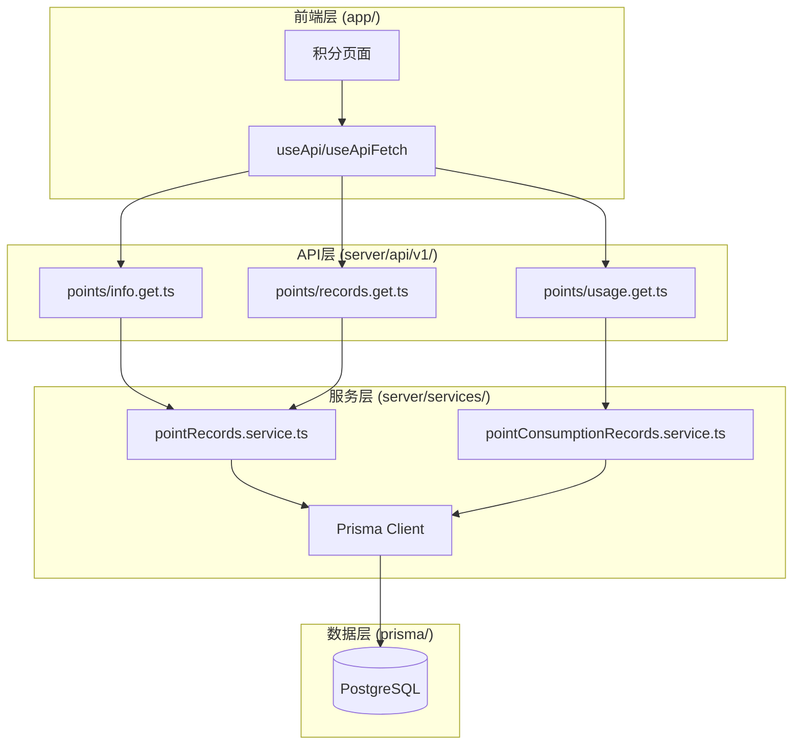

# 设计文档

## 概述

本设计文档描述了 LexSeek 积分系统的技术实现方案。积分系统基于 Nuxt.js 4 全栈架构，使用 PostgreSQL + Prisma ORM 进行数据持久化，遵循项目现有的编码规范和架构模式。

## 架构

### 系统架构图



### 目录结构

```
lexseek/
├── prisma/
│   └── schema.prisma              # 添加积分相关表定义
├── server/
│   ├── api/v1/points/
│   │   ├── info.get.ts            # 获取积分汇总信息
│   │   ├── records.get.ts         # 获取积分记录列表
│   │   └── usage.get.ts           # 获取积分消耗记录
│   └── services/
│       └── point/
│           ├── pointRecords.service.ts           # 积分记录服务
│           └── pointConsumptionRecords.service.ts # 积分消耗服务
└── shared/
    └── types/
        ├── pointRecords.types.ts           # 已存在，需补充接口类型
        ├── pointConsumptionItems.types.ts  # 积分消耗项目类型
        └── pointConsumptionRecords.types.ts # 积分消耗记录类型
```

## 组件和接口

### API 接口设计

#### GET /api/v1/points/info

获取用户积分汇总信息。

**请求参数：** 无（从认证信息获取用户ID）

**响应格式：**
```typescript
interface PointInfoResponse {
  code: number;
  message: string;
  data: {
    pointAmount: number;    // 总积分
    used: number;           // 已使用积分
    remaining: number;      // 剩余积分
    purchasePoint: number;  // 购买获得的积分
    otherPoint: number;     // 其他来源积分
  };
}
```

#### GET /api/v1/points/records

获取用户积分记录列表（分页）。

**请求参数：**
```typescript
interface PointRecordsQuery {
  page?: number;      // 页码，默认 1
  pageSize?: number;  // 每页数量，默认 10
  sourceType?: number; // 来源类型筛选
}
```

**响应格式：**
```typescript
interface PointRecordsResponse {
  code: number;
  message: string;
  data: {
    list: PointRecord[];
    total: number;
    page: number;
    pageSize: number;
  };
}
```

#### GET /api/v1/points/usage

获取用户积分消耗记录列表（分页）。

**请求参数：**
```typescript
interface PointUsageQuery {
  page?: number;      // 页码，默认 1
  pageSize?: number;  // 每页数量，默认 10
}
```

**响应格式：**
```typescript
interface PointUsageResponse {
  code: number;
  message: string;
  data: {
    list: PointConsumptionRecord[];
    total: number;
    page: number;
    pageSize: number;
  };
}
```

### 服务层接口

#### pointRecords.service.ts

```typescript
// 获取用户可用积分汇总
async function getUserPointSummary(userId: number): Promise<PointSummary>

// 获取用户积分记录列表
async function getUserPointRecords(userId: number, options: QueryOptions): Promise<PaginatedResult<PointRecord>>

// 创建积分记录
async function createPointRecord(data: CreatePointRecordInput, tx?: PrismaTransaction): Promise<PointRecord>

// 消耗积分（FIFO策略）
async function consumePoints(userId: number, itemId: number, amount: number, sourceId?: number, tx?: PrismaTransaction): Promise<PointConsumptionResult>

// 作废积分记录
async function invalidatePointRecords(userId: number, sourceType: number, sourceId: number): Promise<void>
```

#### pointConsumptionRecords.service.ts

```typescript
// 获取用户积分消耗记录列表
async function getUserConsumptionRecords(userId: number, options: QueryOptions): Promise<PaginatedResult<PointConsumptionRecord>>

// 创建积分消耗记录
async function createConsumptionRecord(data: CreateConsumptionRecordInput, tx?: PrismaTransaction): Promise<PointConsumptionRecord>
```

## 数据模型

### Prisma Schema 定义

```prisma
/// 积分记录表
model pointRecords {
  /// 积分记录ID，主键，自增
  id                      Int                       @id @default(autoincrement())
  /// 关联的用户ID，外键关联用户表
  userId                  Int                       @map("user_id")
  /// 积分数量
  pointAmount             Int                       @map("point_amount")
  /// 已使用积分数量
  used                    Int                       @default(0) @map("used")
  /// 剩余积分数量
  remaining               Int                       @map("remaining")
  /// 积分来源类型
  sourceType              Int                       @map("source_type")
  /// 积分来源ID
  sourceId                Int?                      @map("source_id")
  /// 用户会员记录ID
  userMembershipId        Int?                      @map("user_membership_id")
  /// 生效时间
  effectiveAt             DateTime                  @map("effective_at") @db.Timestamptz(6)
  /// 过期时间
  expiredAt               DateTime                  @map("expired_at") @db.Timestamptz(6)
  /// 结算时间
  settlementAt            DateTime?                 @map("settlement_at") @db.Timestamptz(6)
  /// 积分状态：1-有效，2-会员升级结算，3-已作废
  status                  Int                       @default(1) @map("status")
  /// 备注
  remark                  String?                   @map("remark")
  /// 创建时间
  createdAt               DateTime                  @default(now()) @map("created_at") @db.Timestamptz(6)
  /// 最后更新时间
  updatedAt               DateTime                  @default(now()) @updatedAt @map("updated_at") @db.Timestamptz(6)
  /// 删除时间
  deletedAt               DateTime?                 @map("deleted_at") @db.Timestamptz(6)
  /// 关联用户
  user                    users                     @relation(fields: [userId], references: [id], onDelete: NoAction, onUpdate: NoAction)
  /// 关联消耗记录
  pointConsumptionRecords pointConsumptionRecords[]

  @@index([userId], map: "idx_point_records_user_id")
  @@index([sourceType], map: "idx_point_records_source_type")
  @@index([sourceId], map: "idx_point_records_source_id")
  @@index([effectiveAt], map: "idx_point_records_effective_at")
  @@index([expiredAt], map: "idx_point_records_expired_at")
  @@index([settlementAt], map: "idx_point_records_settlement_at")
  @@index([deletedAt], map: "idx_point_records_deleted_at")
  @@map("point_records")
}

/// 积分消耗项目表
model pointConsumptionItems {
  /// 积分消耗项目ID，主键，自增
  id                      Int                       @id @default(autoincrement())
  /// 分组
  group                   String                    @db.VarChar(100)
  /// 项目名称
  name                    String                    @db.VarChar(100)
  /// 项目描述
  description             String?                   @db.VarChar(255)
  /// 计量单位
  unit                    String                    @db.VarChar(10)
  /// 消耗积分数量
  pointAmount             Int                       @map("point_amount")
  /// 折扣
  discount                Decimal?                  @default(1) @map("discount") @db.Decimal(3, 2)
  /// 状态：1-启用，0-禁用
  status                  Int                       @default(1)
  /// 创建时间
  createdAt               DateTime                  @default(now()) @map("created_at") @db.Timestamptz(6)
  /// 最后更新时间
  updatedAt               DateTime                  @default(now()) @updatedAt @map("updated_at") @db.Timestamptz(6)
  /// 删除时间
  deletedAt               DateTime?                 @map("deleted_at") @db.Timestamptz(6)
  /// 关联消耗记录
  pointConsumptionRecords pointConsumptionRecords[]

  @@index([name], map: "idx_point_consumption_items_name")
  @@index([status], map: "idx_point_consumption_items_status")
  @@index([deletedAt], map: "idx_point_consumption_items_deleted_at")
  @@map("point_consumption_items")
}

/// 积分消耗记录表
model pointConsumptionRecords {
  /// 积分消耗记录ID，主键，自增
  id                    Int                   @id @default(autoincrement())
  /// 关联的用户ID
  userId                Int                   @map("user_id")
  /// 关联的积分记录ID
  pointRecordId         Int                   @map("point_record_id")
  /// 积分消耗项目ID
  itemId                Int                   @map("item_id")
  /// 消耗积分数量
  pointAmount           Int                   @map("point_amount")
  /// 状态：0-无效，1-预扣，2-已结算
  status                Int                   @default(1)
  /// 资源ID
  sourceId              Int?                  @map("source_id")
  /// 备注
  remark                String?               @map("remark")
  /// 创建时间
  createdAt             DateTime              @default(now()) @map("created_at") @db.Timestamptz(6)
  /// 最后更新时间
  updatedAt             DateTime              @default(now()) @updatedAt @map("updated_at") @db.Timestamptz(6)
  /// 删除时间
  deletedAt             DateTime?             @map("deleted_at") @db.Timestamptz(6)
  /// 关联用户
  user                  users                 @relation(fields: [userId], references: [id], onDelete: NoAction, onUpdate: NoAction)
  /// 关联积分记录
  pointRecord           pointRecords          @relation(fields: [pointRecordId], references: [id], onDelete: NoAction, onUpdate: NoAction)
  /// 关联消耗项目
  pointConsumptionItem  pointConsumptionItems @relation(fields: [itemId], references: [id], onDelete: NoAction, onUpdate: NoAction)

  @@index([userId], map: "idx_point_consumption_records_user_id")
  @@index([itemId], map: "idx_point_consumption_records_item_id")
  @@index([status], map: "idx_point_consumption_records_status")
  @@index([deletedAt], map: "idx_point_consumption_records_deleted_at")
  @@map("point_consumption_records")
}
```

### 类型定义补充

#### shared/types/pointConsumptionItems.types.ts

```typescript
/**
 * 积分消耗项目状态
 */
export enum PointConsumptionItemStatus {
  /** 禁用 */
  DISABLED = 0,
  /** 启用 */
  ENABLED = 1,
}

/**
 * 积分消耗项目接口
 */
export interface PointConsumptionItem {
  id: number;
  group: string;
  name: string;
  description?: string | null;
  unit: string;
  pointAmount: number;
  discount?: number | null;
  status: PointConsumptionItemStatus;
  createdAt?: Date | null;
  updatedAt?: Date | null;
  deletedAt?: Date | null;
}
```

#### shared/types/pointConsumptionRecords.types.ts

```typescript
/**
 * 积分消耗记录状态
 */
export enum PointConsumptionRecordStatus {
  /** 无效 */
  INVALID = 0,
  /** 预扣 */
  PRE_DEDUCT = 1,
  /** 已结算 */
  SETTLED = 2,
}

/**
 * 积分消耗记录接口
 */
export interface PointConsumptionRecord {
  id: number;
  userId: number;
  pointRecordId: number;
  itemId: number;
  pointAmount: number;
  status: PointConsumptionRecordStatus;
  sourceId?: number | null;
  remark?: string | null;
  createdAt?: Date | null;
  updatedAt?: Date | null;
  deletedAt?: Date | null;
  pointConsumptionItem?: PointConsumptionItem;
}
```


## 正确性属性

*正确性属性是一种特征或行为，应该在系统的所有有效执行中保持为真——本质上是关于系统应该做什么的正式声明。属性作为人类可读规范和机器可验证正确性保证之间的桥梁。*


### Property 1: 积分记录创建不变量

*对于任意* 新创建的积分记录，remaining 字段应该等于 pointAmount，used 字段应该为 0。

**Validates: Requirements 1.4**

### Property 2: 积分统计过滤属性

*对于任意* 用户的积分汇总查询，返回的 remaining 总和应该只包含状态为 VALID 且 expiredAt > 当前时间的积分记录。

**Validates: Requirements 4.4**

### Property 3: 积分余额验证属性

*对于任意* 积分消耗请求，如果请求消耗的积分数量大于用户的可用积分余额，系统应该拒绝该请求并返回错误。

**Validates: Requirements 5.1, 5.2**

### Property 4: FIFO 消耗策略属性

*对于任意* 积分消耗操作，系统应该按照积分记录的 expiredAt 升序依次消耗，即先到期的积分先被消耗。

**Validates: Requirements 5.3, 5.4**

### Property 5: 消耗操作完整性属性

*对于任意* 成功的积分消耗操作，系统应该：
1. 创建对应的 pointConsumptionRecords 记录
2. 更新相关 pointRecords 的 used 和 remaining 字段
3. 确保消耗记录的 pointAmount 总和等于实际消耗的积分数量

**Validates: Requirements 5.5, 5.6**

### Property 6: 积分记录数据一致性属性

*对于任意* 积分记录，以下不变量应该始终成立：
1. remaining = pointAmount - used
2. 该记录关联的所有 pointConsumptionRecords 的 pointAmount 总和等于 used 字段

**Validates: Requirements 7.3, 7.4**

## 错误处理

### 错误码定义

| 错误码 | 错误信息 | 说明 |
|--------|----------|------|
| 400 | 积分不足 | 用户可用积分不足以完成消耗操作 |
| 400 | 消耗项目不存在或已禁用 | 请求的积分消耗项目无效 |
| 401 | 未授权 | 用户未登录或 token 无效 |
| 500 | 服务器内部错误 | 数据库操作失败等 |

### 错误处理策略

1. **参数验证错误**：使用 Zod 进行请求参数验证，返回 400 错误
2. **业务逻辑错误**：如积分不足，返回 400 错误并附带明确的错误信息
3. **认证错误**：未登录或 token 无效，返回 401 错误
4. **系统错误**：数据库操作失败等，返回 500 错误，记录日志

## 测试策略

### 单元测试

1. **积分记录服务测试**
   - 测试 getUserPointSummary 正确计算积分汇总
   - 测试 createPointRecord 正确创建记录并设置默认值
   - 测试 consumePoints 的 FIFO 消耗逻辑
   - 测试积分不足时的错误处理

2. **积分消耗记录服务测试**
   - 测试 getUserConsumptionRecords 正确返回分页数据
   - 测试 createConsumptionRecord 正确创建记录

### 属性测试

使用 Vitest 配合 fast-check 进行属性测试，每个属性测试至少运行 100 次迭代。

1. **Property 1 测试**：生成随机 pointAmount，创建记录后验证 remaining 和 used
2. **Property 2 测试**：生成随机积分记录集合（包含不同状态和过期时间），验证统计结果
3. **Property 3 测试**：生成随机积分余额和消耗请求，验证余额验证逻辑
4. **Property 4 测试**：生成多条不同过期时间的积分记录，消耗后验证消耗顺序
5. **Property 5 测试**：执行消耗操作后验证消耗记录和积分记录的更新
6. **Property 6 测试**：对任意积分记录验证数据一致性不变量

### 集成测试

1. **API 接口测试**
   - 测试 GET /api/v1/points/info 返回正确的积分汇总
   - 测试 GET /api/v1/points/records 返回正确的分页数据
   - 测试 GET /api/v1/points/usage 返回正确的消耗记录

2. **事务测试**
   - 测试消耗操作的事务性，模拟失败场景验证回滚

### 测试配置

```typescript
// vitest.config.ts 中配置属性测试
export default defineConfig({
  test: {
    // 属性测试配置
    testTimeout: 30000, // 属性测试可能需要更长时间
  },
});
```
