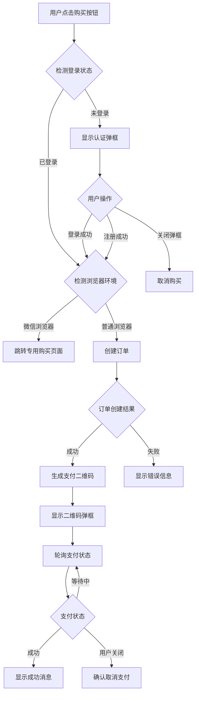

# 设计文档

## 概述

本设计文档描述了 `/pricing` 页面会员购买功能的技术实现方案。核心挑战是处理未登录用户的购买流程，需要在不中断用户购买意向的前提下完成登录引导。

## 架构

### 整体流程



### 组件架构

购买功能设计为可复用的组件和 composable，可以在任意页面中使用。

```
app/components/
├── auth/
│   └── AuthModal.vue (新增 - 认证弹框)
│       ├── 登录 Tab
│       │   ├── 密码登录表单
│       │   └── 验证码登录表单（可选）
│       └── 注册 Tab
│           ├── 手机号输入
│           ├── 验证码输入
│           ├── 密码设置
│           └── 服务条款确认
├── membership/
│   └── MembershipQRCodeDialog.vue (已存在 - 复用)
│       ├── 二维码显示
│       ├── 加载状态
│       └── 支付成功状态
└── purchase/
    └── PurchaseFlow.vue (新增 - 购买流程容器组件)
        ├── AuthModal 集成
        ├── QRCodeDialog 集成
        └── 购买状态管理

app/composables/
└── usePurchaseFlow.ts (新增 - 购买流程逻辑)
    ├── 登录状态检测
    ├── 订单创建
    ├── 支付轮询
    └── 错误处理

使用示例（pricing.vue 或其他页面）:
├── 引入 PurchaseFlow 组件
├── 调用 usePurchaseFlow composable
└── 触发 buy(productId) 方法
```

### 使用方式

```vue
<!-- 任意页面中使用 -->
<template>
  <div>
    <!-- 商品列表 -->
    <button @click="purchaseFlow.buy(productId)">购买</button>
    
    <!-- 购买流程组件（包含认证弹框和支付弹框） -->
    <PurchaseFlow ref="purchaseFlowRef" @success="onPurchaseSuccess" />
  </div>
</template>

<script setup>
const purchaseFlow = usePurchaseFlow();

const onPurchaseSuccess = () => {
  // 购买成功后的处理
  toast.success('购买成功！');
};
</script>
```

## 组件和接口

### 1. AuthModal 组件

新增一个可复用的认证弹框组件，支持在任意页面内完成登录或注册。

```typescript
// app/components/auth/AuthModal.vue
interface AuthModalProps {
  open: boolean;           // 弹框是否打开
  title?: string;          // 弹框标题，默认"登录"
  description?: string;    // 弹框描述
  defaultTab?: 'login' | 'register';  // 默认显示的 Tab
}

interface AuthModalEmits {
  (e: 'update:open', value: boolean): void;
  (e: 'success'): void;    // 登录/注册成功事件
  (e: 'cancel'): void;     // 用户取消
}
```

组件内部包含两个 Tab：
- **登录 Tab**: 支持密码登录和验证码登录
- **注册 Tab**: 支持手机号注册，包含验证码验证

### 2. usePurchaseFlow Composable

封装购买流程的核心逻辑，可在任意页面中复用。

```typescript
// app/composables/usePurchaseFlow.ts
interface UsePurchaseFlowOptions {
  onSuccess?: () => void;  // 购买成功回调
  onCancel?: () => void;   // 取消购买回调
}

interface UsePurchaseFlowReturn {
  // 状态
  showAuthModal: Ref<boolean>;
  authModalTab: Ref<'login' | 'register'>;
  showQRCodeDialog: Ref<boolean>;
  qrCodeUrl: Ref<string>;
  paymentLoading: Ref<boolean>;
  paymentPaid: Ref<boolean>;
  pendingProductId: Ref<number | null>;
  currentTransactionNo: Ref<string>;
  
  // 方法
  buy: (productId: number) => Promise<void>;
  handleAuthSuccess: () => void;
  handleAuthCancel: () => void;
  closeQRCodeDialog: () => void;
  
  // 内部方法（供 PurchaseFlow 组件使用）
  startPollingPaymentStatus: () => void;
  stopPollingPaymentStatus: () => void;
}

export function usePurchaseFlow(options?: UsePurchaseFlowOptions): UsePurchaseFlowReturn
```

### 3. PurchaseFlow 组件

封装购买流程的 UI 组件，包含认证弹框和支付弹框。

```typescript
// app/components/purchase/PurchaseFlow.vue
interface PurchaseFlowProps {
  // 无需 props，通过 composable 控制
}

interface PurchaseFlowEmits {
  (e: 'success'): void;    // 购买成功
  (e: 'cancel'): void;     // 取消购买
  (e: 'error', message: string): void;  // 购买失败
}

// 组件内部使用 usePurchaseFlow composable
// 并渲染 AuthModal 和 MembershipQRCodeDialog
```

### 4. 微信浏览器检测工具

```typescript
// app/utils/wechat.ts
/**
 * 检测是否在微信浏览器中
 */
export function isWeChatBrowser(): boolean {
  if (typeof window === 'undefined') return false;
  const ua = window.navigator.userAgent.toLowerCase();
  return ua.includes('micromessenger');
}

/**
 * 获取微信授权 URL
 */
export function getWechatAuthUrl(redirectPath: string): string {
  const config = useRuntimeConfig();
  const appId = config.public.wechatAppId;
  const redirectUri = encodeURIComponent(`${config.public.baseUrl}${redirectPath}`);
  return `https://open.weixin.qq.com/connect/oauth2/authorize?appid=${appId}&redirect_uri=${redirectUri}&response_type=code&scope=snsapi_base&state=STATE#wechat_redirect`;
}
```

## 数据模型

### 商品信息（已存在）

```typescript
interface ProductInfo {
  id: number;
  name: string;
  levelId: number | null;
  priceMonthly: number | null;
  priceYearly: number | null;
  originalPriceMonthly: number | null;
  originalPriceYearly: number | null;
  giftPoint: number | null;
  description: string | null;
  defaultDuration: number;
  purchaseLimit: number | null;
}
```

### 支付创建响应（已存在）

```typescript
interface PaymentCreateResponse {
  orderNo: string;
  transactionNo: string;
  amount: number;
  codeUrl: string;
  h5Url: string;
}
```

## 正确性属性

*正确性属性是一种特征或行为，应该在系统的所有有效执行中保持为真——本质上是关于系统应该做什么的形式化陈述。属性作为人类可读规范和机器可验证正确性保证之间的桥梁。*

### Property 1: 未登录用户购买触发登录弹框

*对于任意* 未登录状态和任意商品 ID，当用户点击购买按钮时，系统应该显示登录弹框而不是直接进入支付流程。

**Validates: Requirements 1.1, 2.1**

### Property 2: 已登录用户直接进入支付流程

*对于任意* 已登录用户和任意有效商品 ID，当用户点击购买按钮时，系统应该直接创建订单并进入支付流程，不显示登录弹框。

**Validates: Requirements 1.2**

### Property 3: 登录成功后继续购买流程

*对于任意* 在登录弹框中成功登录的用户，登录成功后应该自动继续之前选择的商品的购买流程，且商品 ID 保持不变。

**Validates: Requirements 2.4, 2.5**

### Property 4: 限购商品购买限制

*对于任意* 有购买限制的商品和已达到购买限制的用户，尝试购买该商品时应该返回错误信息而不是创建订单。

**Validates: Requirements 3.3, 3.4**

### Property 5: 订单价格计算正确性

*对于任意* 有效商品和购买时长配置，创建的订单金额应该等于商品配置的对应价格。

**Validates: Requirements 3.5**

### Property 6: 支付成功后会员状态更新

*对于任意* 支付成功的订单，用户的会员状态应该被正确更新为对应的会员等级。

**Validates: Requirements 4.5**

## 错误处理

### 错误类型和处理策略

| 错误类型 | 处理策略 | 用户提示 |
|---------|---------|---------|
| 未登录 | 显示登录弹框 | 无（静默处理） |
| 商品不存在 | 显示错误 toast | "商品不存在或已下架" |
| 已达购买限制 | 显示错误 toast | "该商品每人限购 X 次，您已达到购买上限" |
| 订单创建失败 | 显示错误 toast | 服务器返回的错误信息 |
| 支付创建失败 | 显示错误 toast，允许重试 | "创建支付失败，请重试" |
| 网络错误 | 显示错误 toast | "网络错误，请检查网络连接" |

### 错误恢复

- 订单创建失败：用户可以重新点击购买按钮
- 支付创建失败：在错误提示中提供重试按钮
- 支付超时：提示用户可以在订单列表中继续支付

## 测试策略

### 单元测试

使用 Vitest 进行单元测试，重点测试：

1. `isWeChatBrowser()` 函数的浏览器检测逻辑
2. `usePricingPurchase` composable 的状态管理
3. 登录状态检测逻辑

### 属性测试

使用 fast-check 进行属性测试，配置每个测试运行 100 次迭代。

测试标签格式：**Feature: pricing-purchase, Property {number}: {property_text}**

### 集成测试

1. 完整购买流程测试（模拟登录 → 创建订单 → 支付）
2. 微信浏览器环境下的跳转测试
3. 错误处理流程测试

### 测试框架

- 单元测试：Vitest
- 属性测试：fast-check
- E2E 测试：Vibium（浏览器自动化）
