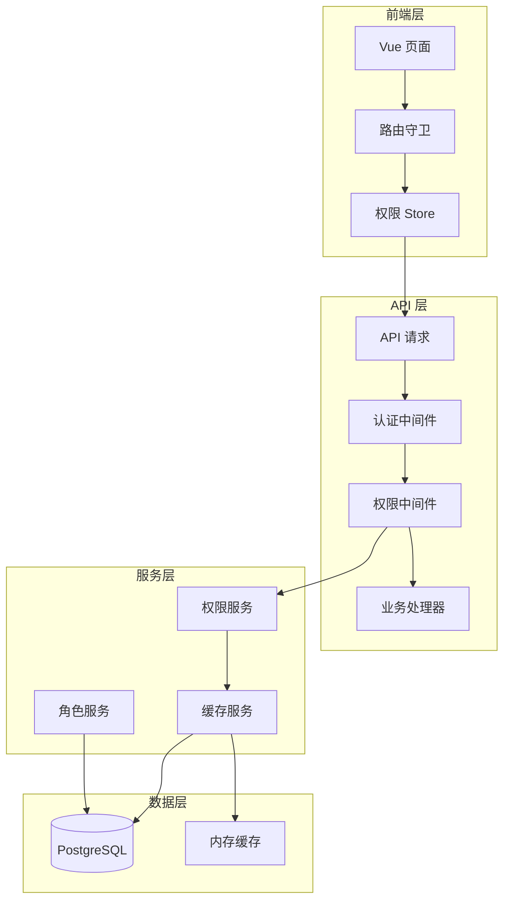
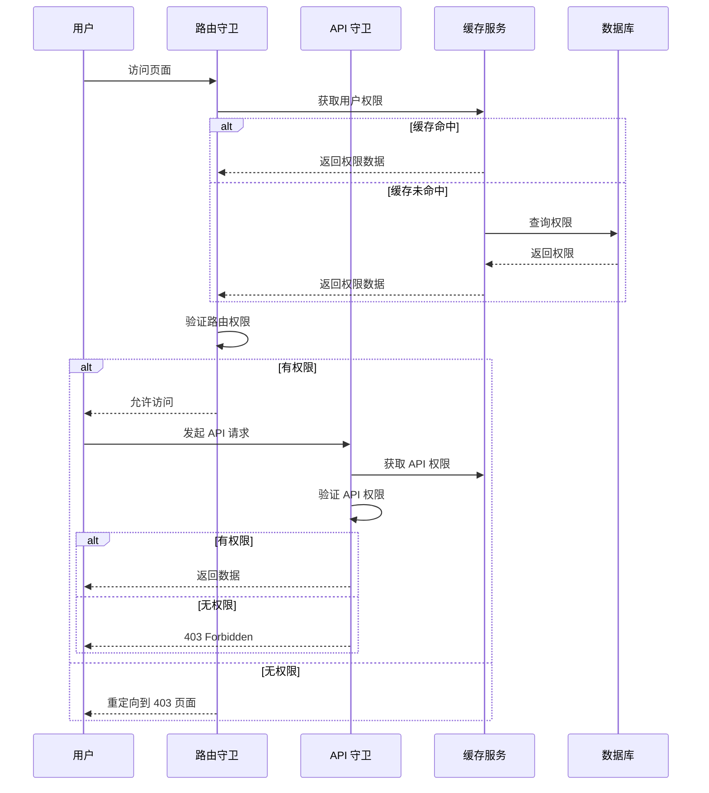

# Design Document

## Overview

本设计文档描述 LexSeek RBAC 权限管理系统的完善方案。系统将在现有的角色-路由权限基础上，新增 API 权限管理、动态公共资源配置、权限缓存机制以及管理员后台界面。

### 设计目标

1. **安全性**: 确保前端路由和 API 接口都受到权限保护
2. **灵活性**: 支持动态配置权限资源，无需修改代码
3. **性能**: 通过缓存机制确保权限验证不影响系统响应速度
4. **易用性**: 提供直观的管理后台，方便管理员操作

### 技术选型

- **后端**: Nuxt.js 4 Server API + Prisma ORM
- **前端**: Vue 3 + Shadcn-vue + Tailwind CSS
- **缓存**: 内存缓存（Map）+ 可选 Redis 扩展
- **测试**: Vitest + fast-check

## Architecture

### 系统架构图



### 权限验证流程



## Components and Interfaces

### 1. 数据访问层 (DAO)

#### API 权限 DAO

```typescript
// server/services/rbac/apiPermission.dao.ts

interface ApiPermissionCreateInput {
  path: string           // API 路径，如 /api/v1/users
  method: string         // 请求方法：GET, POST, PUT, DELETE, *
  name: string           // 权限名称
  description?: string   // 权限描述
  isPublic: boolean      // 是否公开
  groupId?: number       // 权限分组 ID
}

// 创建 API 权限
function createApiPermissionDao(data: ApiPermissionCreateInput): Promise<apiPermissions>

// 批量创建 API 权限
function createManyApiPermissionsDao(data: ApiPermissionCreateInput[]): Promise<number>

// 根据 ID 查询 API 权限
function findApiPermissionByIdDao(id: number): Promise<apiPermissions | null>

// 根据路径和方法查询 API 权限
function findApiPermissionByPathMethodDao(path: string, method: string): Promise<apiPermissions | null>

// 查询 API 权限列表（分页）
function findApiPermissionsDao(options: {
  page?: number
  pageSize?: number
  search?: string
  method?: string
  isPublic?: boolean
  groupId?: number
}): Promise<{ data: apiPermissions[], total: number }>

// 查询所有公开的 API 权限
function findPublicApiPermissionsDao(): Promise<apiPermissions[]>

// 更新 API 权限
function updateApiPermissionDao(id: number, data: Partial<ApiPermissionCreateInput>): Promise<apiPermissions>

// 删除 API 权限（软删除）
function deleteApiPermissionDao(id: number): Promise<apiPermissions>
```

#### 角色 API 权限关联 DAO

```typescript
// server/services/rbac/roleApiPermission.dao.ts

// 为角色分配 API 权限
function assignApiPermissionsToRoleDao(roleId: number, permissionIds: number[]): Promise<void>

// 移除角色的 API 权限
function removeApiPermissionsFromRoleDao(roleId: number, permissionIds: number[]): Promise<void>

// 查询角色的所有 API 权限
function findRoleApiPermissionsDao(roleId: number): Promise<apiPermissions[]>

// 查询用户的所有 API 权限（通过角色）
function findUserApiPermissionsDao(userId: number): Promise<apiPermissions[]>

// 检查用户是否有指定 API 权限
function checkUserApiPermissionDao(userId: number, path: string, method: string): Promise<boolean>
```

### 2. 服务层 (Service)

#### 权限服务

```typescript
// server/services/rbac/permission.service.ts

// 验证用户 API 权限
function validateUserApiPermission(userId: number, path: string, method: string): Promise<{
  allowed: boolean
  reason?: string
}>

// 验证用户路由权限
function validateUserRoutePermission(userId: number, routePath: string): Promise<{
  allowed: boolean
  reason?: string
}>

// 获取用户完整权限数据（用于缓存）
function getUserPermissions(userId: number): Promise<{
  apiPermissions: string[]  // 格式: "METHOD:/path"
  routePermissions: string[] // 路由路径列表
  isSuperAdmin: boolean
}>

// 刷新用户权限缓存
function refreshUserPermissionCache(userId: number): Promise<void>

// 刷新全局公共资源缓存
function refreshPublicResourceCache(): Promise<void>
```

#### 缓存服务

```typescript
// server/services/rbac/cache.service.ts

interface PermissionCache {
  apiPermissions: Set<string>
  routePermissions: Set<string>
  isSuperAdmin: boolean
  expireAt: number
}

// 获取用户权限缓存
function getUserPermissionCache(userId: number): PermissionCache | null

// 设置用户权限缓存
function setUserPermissionCache(userId: number, data: PermissionCache): void

// 清除用户权限缓存
function clearUserPermissionCache(userId: number): void

// 清除所有用户权限缓存
function clearAllUserPermissionCache(): void

// 获取公共资源缓存
function getPublicResourceCache(): { apis: Set<string>, routes: Set<string> } | null

// 设置公共资源缓存
function setPublicResourceCache(data: { apis: Set<string>, routes: Set<string> }): void

// 清除公共资源缓存
function clearPublicResourceCache(): void
```

### 3. 中间件层

#### API 权限中间件

```typescript
// server/middleware/03.permission.ts

// 权限验证中间件
// 在认证中间件之后执行
// 验证流程：
// 1. 检查是否为公开 API
// 2. 检查用户是否为超级管理员
// 3. 验证用户是否有该 API 的访问权限
```

### 4. 前端组件

#### 权限 Store

```typescript
// app/store/permission.ts

interface PermissionState {
  apiPermissions: string[]
  routePermissions: string[]
  isSuperAdmin: boolean
  loaded: boolean
}

// 初始化用户权限
function initUserPermissions(): Promise<void>

// 检查 API 权限
function hasApiPermission(path: string, method: string): boolean

// 检查路由权限
function hasRoutePermission(routePath: string): boolean

// 刷新权限数据
function refreshPermissions(): Promise<void>

// 清除权限数据
function clearPermissions(): void
```

#### 管理后台页面

```
app/pages/admin/
├── index.vue                    # 管理后台首页
├── roles/
│   ├── index.vue               # 角色列表
│   ├── [id].vue                # 角色详情/编辑
│   └── create.vue              # 创建角色
├── permissions/
│   ├── api/
│   │   ├── index.vue           # API 权限列表
│   │   └── [id].vue            # API 权限详情/编辑
│   └── routes/
│       └── index.vue           # 路由权限列表
├── users/
│   └── index.vue               # 用户角色管理
└── audit/
    └── index.vue               # 审计日志
```

## Data Models

### 新增数据模型

#### API 权限表 (apiPermissions)

```prisma
model apiPermissions {
    id          Int       @id @default(autoincrement())
    path        String    @db.VarChar(200)           // API 路径
    method      String    @db.VarChar(10)            // 请求方法
    name        String    @db.VarChar(100)           // 权限名称
    description String?   @db.VarChar(200)           // 权限描述
    isPublic    Boolean   @default(false)            // 是否公开
    groupId     Int?      @map("group_id")           // 权限分组
    status      Int       @default(1)                // 状态
    createdAt   DateTime? @default(now())
    updatedAt   DateTime? @default(now())
    deletedAt   DateTime?

    group       apiPermissionGroups? @relation(fields: [groupId], references: [id])
    roleApiPermissions roleApiPermissions[]

    @@unique([path, method], name: "idx_api_permission_unique")
    @@map("api_permissions")
}
```

#### API 权限分组表 (apiPermissionGroups)

```prisma
model apiPermissionGroups {
    id          Int       @id @default(autoincrement())
    name        String    @unique @db.VarChar(100)   // 分组名称
    description String?   @db.VarChar(200)           // 分组描述
    sort        Int       @default(0)                // 排序
    status      Int       @default(1)                // 状态
    createdAt   DateTime? @default(now())
    updatedAt   DateTime? @default(now())
    deletedAt   DateTime?

    apiPermissions apiPermissions[]

    @@map("api_permission_groups")
}
```

#### 角色 API 权限关联表 (roleApiPermissions)

```prisma
model roleApiPermissions {
    id           Int       @id @default(autoincrement())
    roleId       Int       @map("role_id")
    permissionId Int       @map("permission_id")
    createdAt    DateTime? @default(now())
    updatedAt    DateTime? @default(now())
    deletedAt    DateTime?

    role       roles          @relation(fields: [roleId], references: [id])
    permission apiPermissions @relation(fields: [permissionId], references: [id])

    @@unique([roleId, permissionId], name: "idx_role_api_permission_unique")
    @@map("role_api_permissions")
}
```

#### 权限审计日志表 (permissionAuditLogs)

```prisma
model permissionAuditLogs {
    id          Int       @id @default(autoincrement())
    operatorId  Int       @map("operator_id")        // 操作人 ID
    action      String    @db.VarChar(50)            // 操作类型
    targetType  String    @db.VarChar(50)            // 目标类型
    targetId    Int?      @map("target_id")          // 目标 ID
    oldValue    Json?     @map("old_value")          // 变更前值
    newValue    Json?     @map("new_value")          // 变更后值
    ip          String?   @db.VarChar(50)            // 操作 IP
    userAgent   String?   @db.VarChar(500)           // User Agent
    createdAt   DateTime? @default(now())

    operator    users     @relation(fields: [operatorId], references: [id])

    @@index([operatorId])
    @@index([action])
    @@index([targetType])
    @@index([createdAt])
    @@map("permission_audit_logs")
}
```

### 修改现有模型

#### 角色表 (roles) - 新增关联

```prisma
model roles {
    // ... 现有字段 ...
    
    // 新增关联
    roleApiPermissions roleApiPermissions[]
}
```

#### 用户表 (users) - 新增关联

```prisma
model users {
    // ... 现有字段 ...
    
    // 新增关联
    permissionAuditLogs permissionAuditLogs[]
}
```


## Correctness Properties

*A property is a characteristic or behavior that should hold true across all valid executions of a system-essentially, a formal statement about what the system should do. Properties serve as the bridge between human-readable specifications and machine-verifiable correctness guarantees.*

### Property 1: API 权限 CRUD 完整性

*For any* API 权限资源，创建后应能被正确读取，更新后应反映新值，删除后应不可查询（软删除）。同时，相同路径和方法的 API 权限不能重复创建。

**Validates: Requirements 1.2, 1.3**

### Property 2: 角色 API 权限关联完整性

*For any* 角色和 API 权限集合，批量分配权限后，查询该角色的权限应返回所有已分配的权限；反向查询权限所属角色也应正确返回。移除权限后，关联应被正确删除。

**Validates: Requirements 2.2, 2.3, 2.4**

### Property 3: API 权限验证正确性

*For any* 用户和 API 请求，如果用户未登录访问受保护 API 应返回 401；如果用户已登录但无权限应返回 403；如果用户有权限或 API 为公开则应允许访问。

**Validates: Requirements 3.1, 3.2, 3.3, 3.4, 3.5**

### Property 4: 通配符路径匹配正确性

*For any* 通配符路径模式和具体请求路径，匹配算法应正确判断路径是否匹配。例如 `/api/v1/users/*` 应匹配 `/api/v1/users/123` 但不匹配 `/api/v1/roles/123`。

**Validates: Requirements 3.6**

### Property 5: 公共资源配置生效性

*For any* 被标记为公开的 API 或路由，未登录用户应能正常访问；取消公开标记后，未登录用户应被拒绝访问。

**Validates: Requirements 5.1, 5.3**

### Property 6: 角色删除保护

*For any* 已被用户关联的角色，删除操作应被拒绝并返回错误信息；未被关联的角色应能正常删除。

**Validates: Requirements 6.5**

### Property 7: 批量权限状态更新

*For any* API 权限集合，批量设置公开状态后，所有权限的 isPublic 字段应被正确更新。

**Validates: Requirements 7.4**

### Property 8: 用户角色分配

*For any* 用户和角色集合，分配角色后用户应拥有这些角色；取消分配后用户应不再拥有这些角色。

**Validates: Requirements 9.2, 9.3**

### Property 9: 权限变更即时生效

*For any* 用户权限变更（角色变更或权限分配变更），变更后的权限应立即生效，无需重新登录。

**Validates: Requirements 9.4**

### Property 10: 缓存一致性

*For any* 用户权限数据，缓存应与数据库保持一致。权限变更时缓存应被正确失效，后续请求应获取最新数据。

**Validates: Requirements 10.1, 10.2, 10.3, 10.4**

### Property 11: 超级管理员权限

*For any* 拥有超级管理员角色的用户，应能访问所有 API 接口，无论是否有显式权限分配。超级管理员角色不能被删除或禁用。

**Validates: Requirements 11.2, 11.4**

### Property 12: 审计日志完整性

*For any* 角色、权限资源或权限分配的变更操作，应生成对应的审计日志记录，包含操作人、操作类型、变更前后值等信息。

**Validates: Requirements 12.1, 12.2, 12.3, 12.4**

## Error Handling

### API 层错误处理

项目使用业务层面的 `code` 字段表示错误类型，而非 HTTP 状态码。响应格式：

```typescript
{
  requestId: string,
  success: boolean,
  code: number,      // 业务码：0 表示成功，非 0 表示失败
  message: string,
  timestamp: number,
  data?: any
}
```

| 错误场景 | 业务码 (code) | 错误消息 |
|---------|--------------|---------|
| 未登录访问受保护 API | 401 | 未授权 |
| 已登录但无权限 | 403 | 无权限访问该资源 |
| API 权限不存在 | 404 | API 权限不存在 |
| 路径方法重复 | 400 | API 权限已存在 |
| 角色被用户关联无法删除 | 400 | 角色已被用户关联，无法删除 |
| 超级管理员角色无法删除 | 400 | 超级管理员角色不能删除 |
| 参数验证失败 | 400 | 具体验证错误信息 |

注意：虽然业务码与 HTTP 状态码数值相同，但它们是业务层面的错误码，通过 `resError(event, code, message)` 返回。

### 缓存错误处理

- 缓存读取失败时，降级为数据库查询
- 缓存写入失败时，记录日志但不影响业务流程
- 缓存清除失败时，设置较短的过期时间确保数据最终一致

### 前端错误处理

- 403 错误：显示无权限页面，提供返回首页或联系管理员的选项
- 网络错误：显示重试按钮
- 权限数据加载失败：使用空权限集合，所有受保护资源不可访问

## Testing Strategy

### 测试框架

- **单元测试**: Vitest
- **属性测试**: fast-check
- **API 集成测试**: Vitest + 真实数据库

### 测试目录结构

```
tests/server/rbac/
├── README.md
├── api-permission.test.ts      # API 权限 CRUD 测试
├── role-api-permission.test.ts # 角色权限关联测试
├── permission-guard.test.ts    # 权限验证中间件测试
├── path-matcher.test.ts        # 路径匹配算法测试
├── cache.test.ts               # 缓存机制测试
├── audit-log.test.ts           # 审计日志测试
└── super-admin.test.ts         # 超级管理员测试
```

### 属性测试配置

每个属性测试运行 100 次迭代，使用 fast-check 生成随机测试数据：

```typescript
import * as fc from 'fast-check'

fc.assert(
  fc.property(
    // 生成器
    fc.string(),
    // 属性验证
    (input) => {
      // 验证逻辑
    }
  ),
  { numRuns: 100 }
)
```

### 测试数据生成器

```typescript
// API 路径生成器
const apiPathArb = fc.stringMatching(/^\/api\/v1\/[a-z]+(?:\/[a-z0-9]+)*$/)

// HTTP 方法生成器
const httpMethodArb = fc.constantFrom('GET', 'POST', 'PUT', 'DELETE', 'PATCH')

// API 权限生成器
const apiPermissionArb = fc.record({
  path: apiPathArb,
  method: httpMethodArb,
  name: fc.string({ minLength: 1, maxLength: 100 }),
  description: fc.option(fc.string({ maxLength: 200 })),
  isPublic: fc.boolean()
})

// 角色生成器
const roleArb = fc.record({
  name: fc.string({ minLength: 1, maxLength: 100 }),
  code: fc.stringMatching(/^[a-z_]+$/),
  description: fc.option(fc.string({ maxLength: 200 }))
})
```

### 单元测试与属性测试的分工

| 测试类型 | 适用场景 |
|---------|---------|
| 单元测试 | 边界条件、错误处理、特定示例验证 |
| 属性测试 | CRUD 完整性、权限验证逻辑、缓存一致性 |

### 测试覆盖要求

- DAO 层：100% 函数覆盖
- Service 层：100% 函数覆盖
- 中间件：核心逻辑 100% 覆盖
- 属性测试：每个正确性属性对应一个测试
