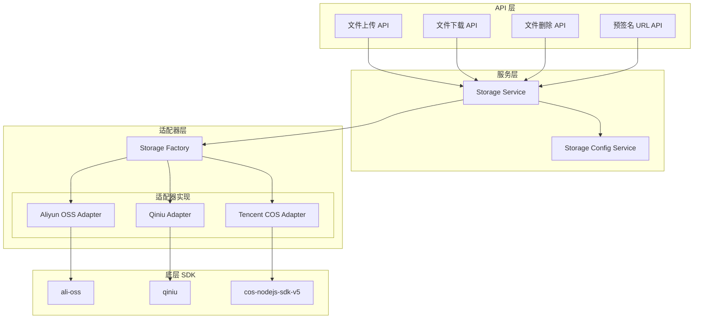

# 设计文档

## 概述

本设计文档描述了一个通用的文件存储适配器系统，用于将现有的阿里云 OSS 紧耦合实现抽象为可扩展的适配器架构。该系统采用策略模式和工厂模式，支持多种云存储服务商，并允许用户配置自己的存储服务。

### 设计目标

1. **向后兼容**：确保现有阿里云 OSS 功能正常运行
2. **可扩展性**：轻松添加新的存储服务商支持
3. **统一接口**：所有存储操作使用统一的 API
4. **类型安全**：完整的 TypeScript 类型定义
5. **渐进式迁移**：支持新旧代码并行运行

## 架构

### 整体架构图



### 目录结构

```
server/
├── lib/
│   └── storage/                    # 存储适配器库
│       ├── index.ts                # 统一导出
│       ├── types.ts                # 类型定义
│       ├── errors.ts               # 错误类型
│       ├── factory.ts              # 适配器工厂
│       ├── base.ts                 # 基础适配器抽象类
│       ├── adapters/               # 适配器实现
│       │   ├── aliyun-oss.ts       # 阿里云 OSS 适配器
│       │   ├── qiniu.ts            # 七牛云适配器
│       │   └── tencent-cos.ts      # 腾讯云 COS 适配器
│       └── callback/               # 回调处理
│           ├── handler.ts          # 统一回调处理器
│           └── validators/         # 各服务商回调验证
│               ├── aliyun.ts
│               ├── qiniu.ts
│               └── tencent.ts
├── services/
│   └── storage/                    # 存储服务
│       ├── storage.service.ts      # 存储服务
│       └── storage-config.dao.ts   # 存储配置数据访问
└── api/v1/
    └── storage/                    # 存储 API（新）
        ├── presigned-url/
        ├── callback/
        └── config/
```

## 组件和接口

### 核心接口定义

#### StorageAdapter 接口

```typescript
/**
 * 存储适配器接口
 * 定义所有存储服务商必须实现的方法
 */
interface StorageAdapter {
  /** 适配器类型标识 */
  readonly type: StorageProviderType

  /**
   * 上传文件
   * @param path 目标路径
   * @param data 文件数据
   * @param options 上传选项
   */
  upload(path: string, data: Buffer | Readable, options?: UploadOptions): Promise<UploadResult>

  /**
   * 下载文件
   * @param path 文件路径
   * @param options 下载选项
   */
  download(path: string, options?: DownloadOptions): Promise<Buffer>

  /**
   * 流式下载文件
   * @param path 文件路径
   * @param options 下载选项
   */
  downloadStream(path: string, options?: DownloadOptions): Promise<Readable>

  /**
   * 删除文件
   * @param paths 文件路径或路径数组
   */
  delete(paths: string | string[]): Promise<DeleteResult>

  /**
   * 生成签名 URL（用于私有文件访问）
   * @param path 文件路径
   * @param options 签名选项
   */
  generateSignedUrl(path: string, options?: SignedUrlOptions): Promise<string>

  /**
   * 生成客户端直传签名
   * @param options 签名选项
   */
  generatePostSignature(options: PostSignatureOptions): Promise<PostSignatureResult>

  /**
   * 测试连接
   */
  testConnection(): Promise<boolean>
}
```

#### 存储配置类型

```typescript
/**
 * 存储服务商类型
 */
enum StorageProviderType {
  ALIYUN_OSS = 'aliyun_oss',
  QINIU = 'qiniu',
  TENCENT_COS = 'tencent_cos'
}

/**
 * 基础存储配置
 */
interface BaseStorageConfig {
  /** 配置 ID */
  id?: number
  /** 服务商类型 */
  type: StorageProviderType
  /** 配置名称 */
  name: string
  /** Bucket 名称 */
  bucket: string
  /** 区域 */
  region: string
  /** 自定义域名 */
  customDomain?: string
  /** 是否启用 */
  enabled: boolean
}

/**
 * 阿里云 OSS 配置
 */
interface AliyunOssConfig extends BaseStorageConfig {
  type: StorageProviderType.ALIYUN_OSS
  accessKeyId: string
  accessKeySecret: string
  /** STS 配置 */
  sts?: {
    roleArn: string
    roleSessionName?: string
    durationSeconds?: number
  }
}

/**
 * 七牛云配置
 */
interface QiniuConfig extends BaseStorageConfig {
  type: StorageProviderType.QINIU
  accessKey: string
  secretKey: string
  /** 上传区域 */
  zone?: 'z0' | 'z1' | 'z2' | 'na0' | 'as0'
}

/**
 * 腾讯云 COS 配置
 */
interface TencentCosConfig extends BaseStorageConfig {
  type: StorageProviderType.TENCENT_COS
  secretId: string
  secretKey: string
  appId: string
  /** STS 配置 */
  sts?: {
    roleArn: string
    durationSeconds?: number
  }
}

/**
 * 存储配置联合类型
 */
type StorageConfig = AliyunOssConfig | QiniuConfig | TencentCosConfig
```

### 适配器工厂

```typescript
/**
 * 存储适配器工厂
 * 负责创建和缓存适配器实例
 */
class StorageFactory {
  private static adapters: Map<string, StorageAdapter> = new Map()
  private static customAdapters: Map<StorageProviderType, AdapterConstructor> = new Map()

  /**
   * 获取适配器实例
   * @param config 存储配置
   */
  static getAdapter(config: StorageConfig): StorageAdapter

  /**
   * 注册自定义适配器
   * @param type 适配器类型
   * @param constructor 适配器构造函数
   */
  static registerAdapter(type: StorageProviderType, constructor: AdapterConstructor): void

  /**
   * 清除适配器缓存
   * @param configId 配置 ID（可选，不传则清除所有）
   */
  static clearCache(configId?: string): void
}
```

### 回调处理器

```typescript
/**
 * 统一回调数据结构
 */
interface CallbackData {
  /** 文件路径 */
  filePath: string
  /** 文件大小 */
  fileSize: number
  /** MIME 类型 */
  mimeType: string
  /** 自定义变量 */
  customVars: Record<string, string>
  /** 原始回调数据 */
  rawData: unknown
}

/**
 * 回调处理器接口
 */
interface CallbackHandler {
  /**
   * 验证回调请求
   * @param request 请求对象
   * @param config 存储配置
   */
  verify(request: H3Event, config: StorageConfig): Promise<boolean>

  /**
   * 解析回调数据
   * @param request 请求对象
   */
  parse(request: H3Event): Promise<CallbackData>
}
```

## 数据模型

### 存储配置表（新增）

```prisma
model storageConfigs {
  id            Int       @id @default(autoincrement())
  userId        Int?      // null 表示系统配置
  name          String    @db.VarChar(100)
  type          String    @db.VarChar(50)  // aliyun_oss, qiniu, tencent_cos
  config        Json      // 加密存储的配置信息
  isDefault     Boolean   @default(false)
  enabled       Boolean   @default(true)
  createdAt     DateTime  @default(now())
  updatedAt     DateTime  @updatedAt
  deletedAt     DateTime?

  user          users?    @relation(fields: [userId], references: [id])

  @@index([userId])
  @@index([type])
}
```

### 现有 ossFiles 表保持不变

现有的 `ossFiles` 表结构保持不变，仅在需要时添加 `storageConfigId` 字段用于关联存储配置。

## 正确性属性

*正确性属性是指在系统所有有效执行中都应该保持为真的特征或行为。属性作为人类可读规范和机器可验证正确性保证之间的桥梁。*

### Property 1: 适配器接口完整性

*对于任意* 实现了 StorageAdapter 接口的适配器，该适配器必须实现所有必需的方法（upload、download、downloadStream、delete、generateSignedUrl、generatePostSignature、testConnection）

**Validates: Requirements 1.1, 1.2, 1.3, 1.4, 1.5, 2.1, 3.1, 4.1**

### Property 2: 统一结果格式

*对于任意* 适配器的任意方法调用，返回的结果对象必须符合对应的类型定义（UploadResult、DeleteResult、PostSignatureResult 等）

**Validates: Requirements 1.6**

### Property 3: 统一错误处理

*对于任意* 适配器在操作失败时，必须抛出继承自 StorageError 的错误类型，且错误对象必须包含 code、message 和 cause 属性

**Validates: Requirements 1.7, 8.1, 8.2, 8.3**

### Property 4: 工厂适配器创建

*对于任意* 有效的存储配置，StorageFactory.getAdapter() 必须返回与配置类型匹配的适配器实例

**Validates: Requirements 5.1**

### Property 5: 适配器缓存一致性

*对于任意* 相同的存储配置，多次调用 StorageFactory.getAdapter() 必须返回相同的适配器实例（引用相等）

**Validates: Requirements 5.4**

### Property 6: 配置验证完整性

*对于任意* 存储配置，如果缺少必填字段，StorageConfigService 必须拒绝该配置并抛出 StorageConfigError

**Validates: Requirements 6.3**

### Property 7: 用户配置隔离

*对于任意* 用户 A 和用户 B，用户 A 只能访问自己的存储配置，不能访问用户 B 的配置

**Validates: Requirements 7.5**

### Property 8: 回调数据解析一致性

*对于任意* 有效的回调请求，CallbackHandler.parse() 必须返回包含 filePath、fileSize、mimeType 和 customVars 的 CallbackData 对象

**Validates: Requirements 9.1, 9.3**

### Property 9: 回调验证正确性

*对于任意* 回调请求，如果签名验证失败，CallbackHandler.verify() 必须返回 false

**Validates: Requirements 9.2, 9.4**

### Property 10: 阿里云签名格式正确性

*对于任意* 阿里云 OSS 适配器生成的 PostSignatureResult，必须包含 host、policy、signatureVersion、credential、date、signature 和 dir 字段

**Validates: Requirements 2.7**

### Property 11: 七牛云凭证格式正确性

*对于任意* 七牛云适配器生成的 PostSignatureResult，必须包含符合七牛云上传规范的 uploadToken 字段

**Validates: Requirements 3.5**

### Property 12: 腾讯云签名格式正确性

*对于任意* 腾讯云 COS 适配器生成的 PostSignatureResult，必须包含符合腾讯云规范的签名字段

**Validates: Requirements 4.5**

## 错误处理

### 错误类型层次

```typescript
/**
 * 存储错误基类
 */
class StorageError extends Error {
  code: string
  cause?: Error

  constructor(message: string, code: string, cause?: Error)
}

/**
 * 配置错误
 */
class StorageConfigError extends StorageError {
  constructor(message: string, cause?: Error)
}

/**
 * 文件不存在错误
 */
class StorageNotFoundError extends StorageError {
  path: string
  constructor(path: string, cause?: Error)
}

/**
 * 权限错误
 */
class StoragePermissionError extends StorageError {
  constructor(message: string, cause?: Error)
}

/**
 * 网络错误
 */
class StorageNetworkError extends StorageError {
  constructor(message: string, cause?: Error)
}

/**
 * 上传错误
 */
class StorageUploadError extends StorageError {
  constructor(message: string, cause?: Error)
}

/**
 * 下载错误
 */
class StorageDownloadError extends StorageError {
  constructor(message: string, cause?: Error)
}

/**
 * 删除错误
 */
class StorageDeleteError extends StorageError {
  constructor(message: string, cause?: Error)
}
```

### 错误转换策略

各适配器需要将底层 SDK 的错误转换为统一的错误类型：

| 场景 | 阿里云 OSS | 七牛云 | 腾讯云 COS | 统一错误类型 |
|------|-----------|--------|-----------|-------------|
| 文件不存在 | NoSuchKey | 612 | NoSuchKey | StorageNotFoundError |
| 权限不足 | AccessDenied | 401/403 | AccessDenied | StoragePermissionError |
| 配置错误 | InvalidAccessKeyId | - | InvalidAccessKeyId | StorageConfigError |
| 网络错误 | NetworkError | - | NetworkError | StorageNetworkError |

## 测试策略

### 单元测试

1. **适配器接口测试**：验证每个适配器实现了所有必需方法
2. **工厂测试**：验证工厂正确创建和缓存适配器
3. **配置验证测试**：验证配置验证逻辑
4. **错误转换测试**：验证错误正确转换

### 属性测试

使用 fast-check 进行属性测试，每个属性测试至少运行 100 次迭代：

1. **Property 1-3**：使用 mock 适配器验证接口完整性和结果格式
2. **Property 4-5**：验证工厂行为
3. **Property 6**：生成随机配置验证验证逻辑
4. **Property 7**：验证用户隔离
5. **Property 8-9**：验证回调处理
6. **Property 10-12**：验证各服务商签名格式

### 集成测试

1. **阿里云 OSS 集成测试**：使用真实或模拟的 OSS 服务测试完整流程
2. **回调处理测试**：模拟各服务商回调请求
3. **端到端测试**：验证文件上传、下载、删除完整流程

## 迁移策略

### 第一阶段：创建适配器层

1. 创建 `server/lib/storage` 目录结构
2. 定义所有接口和类型
3. 实现阿里云 OSS 适配器（复用现有 `server/lib/oss` 代码）
4. 创建适配器工厂

### 第二阶段：创建服务层

1. 创建 StorageService，封装适配器调用
2. 创建 StorageConfigService，管理存储配置
3. 添加数据库迁移（storageConfigs 表）

### 第三阶段：迁移 API

1. 创建新的 `/api/v1/storage` 路由
2. 逐步将现有 `/api/v1/files` 路由迁移到新服务
3. 保持旧路由可用，标记为废弃

### 第四阶段：实现其他适配器

1. 实现七牛云适配器
2. 实现腾讯云 COS 适配器
3. 添加用户自定义存储配置功能

### 第五阶段：清理

1. 移除废弃的旧路由
2. 移除兼容层代码
3. 更新文档
