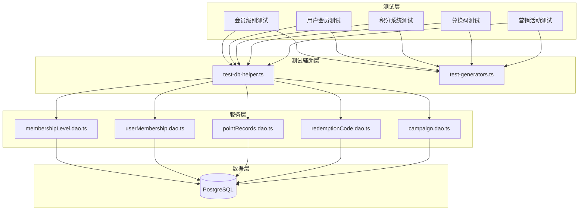

# 设计文档

## 概述

本设计文档描述如何将现有的模拟测试重构为真正的集成测试。核心思路是：

1. 创建统一的测试辅助模块，提供真实数据库操作的测试数据管理
2. 重构现有测试文件，使用真实的 DAO/Service 函数
3. 保留 fast-check 属性测试能力，但使用真实数据库操作
4. 删除所有模拟相关的代码

## 架构

### 测试架构图



## 组件和接口

### 1. 测试数据库辅助模块 (test-db-helper.ts)

提供测试数据的创建和清理功能，直接操作真实数据库。

```typescript
// 测试数据库辅助模块接口
interface TestDbHelper {
    // 创建测试用户
    createTestUser(data?: Partial<UserCreateInput>): Promise<users>
    
    // 创建测试会员级别
    createTestMembershipLevel(data?: Partial<MembershipLevelCreateInput>): Promise<membershipLevels>
    
    // 创建测试用户会员记录
    createTestUserMembership(
        userId: number,
        levelId: number,
        data?: Partial<UserMembershipCreateInput>
    ): Promise<userMemberships>
    
    // 创建测试积分记录
    createTestPointRecord(
        userId: number,
        data?: Partial<PointRecordCreateInput>
    ): Promise<pointRecords>
    
    // 创建测试兑换码
    createTestRedemptionCode(
        levelId?: number,
        data?: Partial<RedemptionCodeCreateInput>
    ): Promise<redemptionCodes>
    
    // 创建测试营销活动
    createTestCampaign(
        levelId?: number,
        data?: Partial<CampaignCreateInput>
    ): Promise<campaigns>
    
    // 清理测试数据（按外键顺序删除）
    cleanupTestData(testIds: TestIds): Promise<void>
    
    // 清理所有测试数据（使用测试标记）
    cleanupAllTestData(): Promise<void>
}

// 测试数据 ID 追踪
interface TestIds {
    userIds: number[]
    membershipLevelIds: number[]
    userMembershipIds: number[]
    pointRecordIds: number[]
    redemptionCodeIds: number[]
    campaignIds: number[]
}
```

### 2. 测试数据生成器模块 (test-generators.ts)

保留 fast-check 生成器，用于属性测试的随机数据生成。

```typescript
// fast-check 生成器
import * as fc from 'fast-check'

// 会员级别数据生成器
export const membershipLevelDataArb = fc.record({
    name: fc.string({ minLength: 2, maxLength: 20 }),
    description: fc.option(fc.string({ maxLength: 100 }), { nil: null }),
    sortOrder: fc.integer({ min: 1, max: 100 }),
    status: fc.constantFrom(0, 1),
})

// 用户会员记录数据生成器
export const userMembershipDataArb = fc.record({
    duration: fc.integer({ min: 1, max: 365 }),
    autoRenew: fc.boolean(),
    sourceType: fc.constantFrom(1, 2, 3, 4, 5, 6, 7, 8),
    remark: fc.option(fc.string({ maxLength: 100 }), { nil: null }),
})

// 积分记录数据生成器
export const pointRecordDataArb = fc.record({
    pointAmount: fc.integer({ min: 1, max: 10000 }),
    sourceType: fc.constantFrom(1, 2, 3, 4, 5, 6, 7),
    daysUntilExpiry: fc.integer({ min: 1, max: 365 }),
})

// 兑换码数据生成器
export const redemptionCodeDataArb = fc.record({
    type: fc.constantFrom(1, 2, 3),
    duration: fc.option(fc.integer({ min: 1, max: 365 }), { nil: null }),
    pointAmount: fc.option(fc.integer({ min: 1, max: 10000 }), { nil: null }),
    daysUntilExpiry: fc.integer({ min: 1, max: 365 }),
})

// 营销活动数据生成器
export const campaignDataArb = fc.record({
    name: fc.string({ minLength: 2, maxLength: 50 }),
    type: fc.constantFrom(1, 2, 3),
    duration: fc.option(fc.integer({ min: 1, max: 365 }), { nil: null }),
    giftPoint: fc.option(fc.integer({ min: 1, max: 10000 }), { nil: null }),
    daysActive: fc.integer({ min: 1, max: 30 }),
})
```

## 数据模型

### 测试数据标记策略

为了区分测试数据和生产数据，使用以下策略：

1. 测试用户使用特定前缀：`test_user_` + 时间戳
2. 测试会员级别使用特定前缀：`测试级别_` + 时间戳
3. 测试兑换码使用特定前缀：`TEST_` + 随机字符串
4. 测试营销活动使用特定前缀：`测试活动_` + 时间戳

### 数据清理顺序

由于外键约束，清理测试数据必须按以下顺序：

1. 积分消费记录 (pointConsumptionRecords)
2. 积分消费明细 (pointConsumptionItems)
3. 积分记录 (pointRecords)
4. 兑换记录 (redemptionRecords)
5. 用户会员记录 (userMemberships)
6. 兑换码 (redemptionCodes)
7. 营销活动 (campaigns)
8. 会员级别 (membershipLevels)
9. 用户 (users)

## 正确性属性

*正确性属性是系统在所有有效执行中应保持为真的特征或行为——本质上是关于系统应该做什么的形式化陈述。属性作为人类可读规范和机器可验证正确性保证之间的桥梁。*

### Property 1: CRUD 往返一致性

*对于任意*有效的实体数据，创建后立即查询应返回等价的数据（除了自动生成的字段如 id、createdAt、updatedAt）。

**Validates: Requirements 1.1, 1.2, 2.1, 3.1, 4.1, 5.1**

### Property 2: 查询筛选正确性

*对于任意*用户和任意数量的会员记录（包含有效和无效的），查询当前有效会员应只返回状态为 ACTIVE 且 endDate 大于当前时间的记录。

**Validates: Requirements 2.2**

### Property 3: 积分消费计算正确性

*对于任意*用户的有效积分记录集合和任意消费金额（不超过总可用积分），消费后所有记录的 remaining 之和应等于原始 remaining 之和减去消费金额。

**Validates: Requirements 3.2**

### Property 4: 积分查询排序正确性

*对于任意*用户的多条有效积分记录，查询结果应按 expiredAt 升序排列（先到期的排在前面）。

**Validates: Requirements 3.4**

### Property 5: 兑换码状态变更正确性

*对于任意*有效兑换码，使用后状态应变为 USED，且不能再次使用。

**Validates: Requirements 4.2**

### Property 5.1: 兑换码类型处理正确性 - 仅会员

*对于任意*类型为 MEMBERSHIP_ONLY 的有效兑换码，兑换后应：
- 创建一条用户会员记录
- 会员记录的 levelId 应等于兑换码的 levelId
- 会员记录的有效期应等于兑换码的 duration 天
- 不应创建积分记录

**Validates: Requirements 4.2**

### Property 5.2: 兑换码类型处理正确性 - 仅积分

*对于任意*类型为 POINTS_ONLY 的有效兑换码，兑换后应：
- 创建一条积分记录
- 积分记录的 pointAmount 应等于兑换码的 pointAmount
- 积分记录的有效期应为 1 年
- 不应创建会员记录

**Validates: Requirements 4.2**

### Property 5.3: 兑换码类型处理正确性 - 会员和积分

*对于任意*类型为 MEMBERSHIP_AND_POINTS 的有效兑换码，兑换后应：
- 创建一条用户会员记录
- 创建一条积分记录
- 积分记录的有效期应跟随会员有效期
- 积分记录应关联到新创建的会员记录

**Validates: Requirements 4.2**

### Property 5.4: 兑换码验证 - 已使用

*对于任意*状态为 USED 的兑换码，验证应返回失败，错误信息为"兑换码已被使用"。

**Validates: Requirements 4.2, 4.3**

### Property 5.5: 兑换码验证 - 已过期

*对于任意*状态为 EXPIRED 或 expiredAt 早于当前时间的兑换码，验证应返回失败，错误信息为"兑换码已过期"。

**Validates: Requirements 4.3**

### Property 5.6: 兑换码验证 - 已作废

*对于任意*状态为 INVALID 的兑换码，验证应返回失败，错误信息为"兑换码已作废"。

**Validates: Requirements 4.2**

### Property 5.7: 兑换码验证 - 不存在

*对于任意*不存在的兑换码，验证应返回失败，错误信息为"兑换码不存在"。

**Validates: Requirements 4.2**

### Property 5.8: 兑换记录创建正确性

*对于任意*成功的兑换操作，应创建一条兑换记录，包含：
- userId（用户 ID）
- redemptionCodeId（兑换码 ID）
- 创建时间

**Validates: Requirements 4.2**

### Property 5.9: 兑换码过期自动更新

*对于任意*状态为 VALID 但 expiredAt 早于当前时间的兑换码，验证时应自动将状态更新为 EXPIRED。

**Validates: Requirements 4.3**

### Property 6: 活动时间范围验证

*对于任意*营销活动，只有当前时间在 startAt 和 endAt 之间且状态为 ENABLED 时，活动才能被触发。

**Validates: Requirements 5.4**

### Property 7: 会员升级有效期计算正确性

*对于任意*用户从低级别会员升级到高级别会员：
- 升级后原会员记录状态应变为 INACTIVE
- 新会员记录的 endDate 应继承原会员的 endDate
- 新会员记录的 startDate 应为升级时间
- 新会员记录的 sourceType 应为 MEMBERSHIP_UPGRADE

**Validates: Requirements 2.1, 2.2**

### Property 8: 会员升级积分转移正确性

*对于任意*会员升级操作，原会员关联的所有积分记录应转移到新会员记录，且：
- 积分总额不变
- 积分的 userMembershipId 应更新为新会员记录 ID
- 积分的过期时间不变

**Validates: Requirements 3.1, 3.2**

### Property 9: 会员升级价格计算正确性

*对于任意*会员升级，升级价格应等于：
- 目标级别剩余价值 - 原级别剩余价值
- 升级价格不能为负数（取 max(0, 计算值)）
- 积分补偿 = 升级价格 × 10

**Validates: Requirements 2.1**

### Property 10: 会员升级级别验证

*对于任意*会员升级请求，只有当目标级别的 sortOrder 大于当前级别的 sortOrder 时才能升级（sortOrder 越大级别越高）。

**Validates: Requirements 2.1**

### Property 11: 多段会员有效期合并正确性

*对于任意*用户购买相同级别的会员，新购买的会员时长应叠加到现有会员的 endDate 上。

**Validates: Requirements 2.2, 2.3**

### Property 12: 不同级别会员购买处理正确性

*对于任意*用户购买不同级别的会员：
- 如果购买更高级别，应触发升级流程
- 如果购买相同级别，应延长有效期
- 如果购买更低级别，应创建独立的会员记录

**Validates: Requirements 2.1, 2.2**

### Property 13: 会员状态一致性

*对于任意*用户，在任意时刻最多只能有一个同级别的会员记录处于 ACTIVE 状态且未过期。

**Validates: Requirements 2.2, 2.4**

### Property 14: 积分与会员关联正确性

*对于任意*用户会员记录，关联的积分记录在会员升级时应正确转移到新会员记录，且积分总额不变。

**Validates: Requirements 3.1, 3.2**

### Property 15: 软删除一致性

*对于任意*被软删除的记录（deletedAt 不为 null），所有查询操作应排除该记录。

**Validates: Requirements 1.4, 2.4**

### Property 16: 会员升级记录完整性

*对于任意*成功的会员升级操作，应创建一条升级记录，包含：
- fromMembershipId（原会员记录 ID）
- toMembershipId（新会员记录 ID）
- upgradePrice（升级价格）
- pointCompensation（积分补偿）

**Validates: Requirements 2.1**

## 错误处理

### 测试数据创建失败

- 如果创建测试数据失败，应抛出明确的错误信息
- 使用 try-catch 包装数据库操作，记录详细错误日志
- 在 afterAll/afterEach 中确保清理已创建的数据

### 测试数据清理失败

- 清理失败不应导致测试失败，但应记录警告日志
- 使用软删除而非硬删除，避免外键约束问题
- 提供手动清理脚本用于清理残留测试数据

### 数据库连接问题

- 测试开始前验证数据库连接
- 如果连接失败，跳过所有数据库相关测试并输出提示信息
- 参考 OSS 集成测试的条件跳过模式

## 测试策略

### 单元测试 vs 属性测试

本重构采用双重测试策略：

1. **单元测试**：验证特定示例和边界情况
   - 空输入处理
   - 无效数据拒绝
   - 错误条件处理

2. **属性测试**：验证通用属性在所有输入上成立
   - 使用 fast-check 生成随机数据
   - 每个属性运行 100 次迭代
   - 测试后清理所有生成的数据

### 测试文件结构

```
tests/server/membership/
├── test-db-helper.ts          # 测试数据库辅助模块
├── test-generators.ts         # fast-check 数据生成器
├── membership-level.test.ts   # 会员级别集成测试
├── user-membership.test.ts    # 用户会员集成测试
├── point-system.test.ts       # 积分系统集成测试
├── redemption.test.ts         # 兑换码集成测试
├── campaign.test.ts           # 营销活动集成测试
└── README.md                  # 测试模块说明
```

### 属性测试配置

```typescript
// 属性测试配置
const PBT_CONFIG = { numRuns: 100 }

// 属性测试模板
it('Property N: [属性名称]', async () => {
    await fc.assert(
        fc.asyncProperty(
            dataGenerator,
            async (data) => {
                // 1. 创建测试数据
                const record = await testHelper.createTestXxx(data)
                testIds.xxxIds.push(record.id)
                
                // 2. 执行被测操作
                const result = await xxxDao(record.id)
                
                // 3. 验证属性
                expect(result).toSatisfy(property)
                
                return true
            }
        ),
        PBT_CONFIG
    )
})
```

### 测试生命周期

```typescript
describe('Xxx 集成测试', () => {
    const testIds: TestIds = {
        userIds: [],
        membershipLevelIds: [],
        // ...
    }

    beforeAll(async () => {
        // 验证数据库连接
        await prisma.$connect()
    })

    afterEach(async () => {
        // 清理本次测试创建的数据
        await cleanupTestData(testIds)
        // 重置 ID 追踪
        Object.keys(testIds).forEach(key => {
            testIds[key as keyof TestIds] = []
        })
    })

    afterAll(async () => {
        // 断开数据库连接
        await prisma.$disconnect()
    })

    // 测试用例...
})
```

### 测试框架配置

- 使用 vitest 作为测试运行器
- 使用 fast-check 进行属性测试
- 配置 `{ numRuns: 100 }` 运行 100 次迭代
- 每个属性测试标注 Feature 和 Validates 信息
