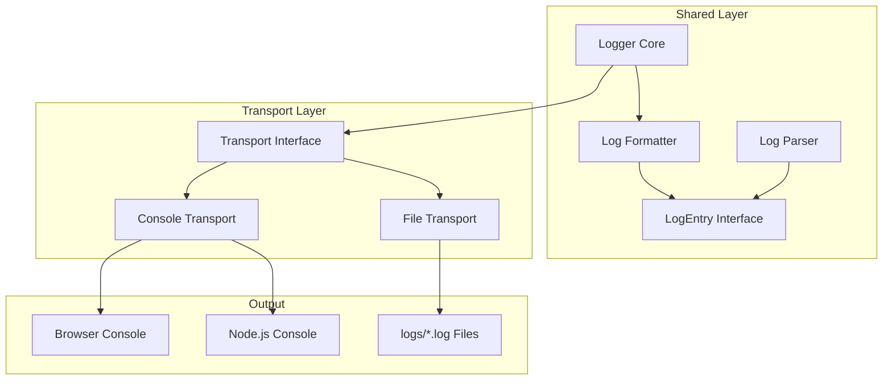

# Design Document

## Overview

通用日志工具采用分层架构设计，核心 Logger 类负责日志格式化和级别控制，Transport 层负责将日志输出到不同目标。通过运行时环境检测，自动选择合适的 Transport：浏览器环境使用 ConsoleTransport，Node.js 服务端环境同时使用 ConsoleTransport 和 FileTransport。

## Architecture



## Components and Interfaces

### 1. LogEntry Interface

日志条目的数据结构，用于在组件间传递日志信息。

```typescript
interface LogEntry {
  timestamp: Date
  level: LogLevel
  prefix: string
  message: string
  args: unknown[]
}
```

### 2. Transport Interface

传输层抽象接口，定义日志输出的统一契约。

```typescript
interface Transport {
  write(entry: LogEntry): void
}
```

### 3. ConsoleTransport

控制台传输实现，支持浏览器和 Node.js 环境。

```typescript
class ConsoleTransport implements Transport {
  write(entry: LogEntry): void
  private formatForBrowser(entry: LogEntry): void
  private formatForNode(entry: LogEntry): void
}
```

### 4. FileTransport

文件传输实现，仅在 Node.js 环境可用。

```typescript
class FileTransport implements Transport {
  private logsDir: string
  private writeStreams: Map<string, WriteStream>
  
  write(entry: LogEntry): void
  private ensureLogsDir(): void
  private getLogFilePath(level: LogLevel, date: Date): string
  private getOrCreateStream(filePath: string): WriteStream
}
```

### 5. LogFormatter

日志格式化工具，负责将 LogEntry 转换为字符串。

```typescript
class LogFormatter {
  static format(entry: LogEntry): string
  static formatTimestamp(date: Date): string
}
```

### 6. LogParser

日志解析工具，负责将格式化的日志字符串解析回 LogEntry。

```typescript
class LogParser {
  static parse(logString: string): LogEntry | null
}
```

### 7. Logger Class

核心日志类，管理日志级别、前缀和传输层。

```typescript
class Logger {
  level: LogLevel
  prefix: string
  enableTimestamp: boolean
  private transports: Transport[]
  
  constructor(options?: LoggerOptions)
  setLevel(level: LogLevel): void
  setPrefix(prefix: string): void
  debug(...args: unknown[]): void
  info(...args: unknown[]): void
  warn(...args: unknown[]): void
  error(...args: unknown[]): void
  createNamespace(namespace: string): Logger
}
```

## Data Models

### LogLevel Enum

```typescript
export const LOG_LEVELS = {
  DEBUG: 0,
  INFO: 1,
  WARN: 2,
  ERROR: 3,
  SILENT: 4
} as const

export type LogLevel = typeof LOG_LEVELS[keyof typeof LOG_LEVELS]
```

### LoggerOptions Interface

```typescript
interface LoggerOptions {
  level?: LogLevel
  prefix?: string
  enableTimestamp?: boolean
  transports?: Transport[]
}
```

### Log File Naming Convention

- 文件路径: `logs/{level}-{YYYY-MM-DD}.log`
- 示例: `logs/error-2025-12-19.log`, `logs/info-2025-12-19.log`

### Log Entry Format

```
[HH:mm:ss.SSS][Prefix][LEVEL] message
```

示例:
```
[14:30:25.123][LexSeek][INFO] User logged in successfully
[14:30:26.456][LexSeek][SMS][ERROR] Failed to send SMS: timeout
```


## Correctness Properties

*A property is a characteristic or behavior that should hold true across all valid executions of a system-essentially, a formal statement about what the system should do. Properties serve as the bridge between human-readable specifications and machine-verifiable correctness guarantees.*

### Property 1: Log Format Round-Trip Consistency

*For any* valid LogEntry with timestamp, level, prefix, and message, formatting the entry to a string and then parsing it back SHALL recover the original timestamp, level, prefix, and message components.

**Validates: Requirements 7.1, 7.2, 7.3**

### Property 2: Log Level Filtering

*For any* Logger with a set log level L, and *for any* log call at level M, the log SHALL be output if and only if M >= L (where DEBUG=0 < INFO=1 < WARN=2 < ERROR=3 < SILENT=4).

**Validates: Requirements 4.3**

### Property 3: File Naming Pattern

*For any* log level and *for any* date, the generated log file path SHALL match the pattern `logs/{levelName}-{YYYY-MM-DD}.log` where levelName is the lowercase string representation of the level.

**Validates: Requirements 3.3**

### Property 4: Date-Based File Rotation

*For any* two log entries with different dates, the FileTransport SHALL write them to different log files (one file per date per level).

**Validates: Requirements 3.4**

### Property 5: Append-Only File Writing

*For any* sequence of log entries written to the same file, all entries SHALL be preserved in order, with no content overwritten or lost.

**Validates: Requirements 3.5**

### Property 6: Namespace Prefix Inheritance

*For any* parent Logger with prefix P and *for any* namespace N, creating a child logger SHALL result in a logger with prefix containing both P and N, and the child SHALL inherit the parent's log level.

**Validates: Requirements 5.1, 5.2, 5.3**

### Property 7: Safe Serialization

*For any* input value (including objects, Error instances, circular references, undefined, null, symbols), the Logger SHALL serialize it to a string without throwing an exception.

**Validates: Requirements 6.3**

## Error Handling

### File System Errors

1. **Directory Creation Failure**
   - Catch EACCES, ENOENT errors when creating `logs/` directory
   - Log warning to console
   - Disable FileTransport, continue with ConsoleTransport only

2. **File Write Failure**
   - Catch write errors (disk full, permission denied)
   - Fall back to console output for that entry
   - Attempt to recover on next write

3. **Stream Errors**
   - Handle stream 'error' events
   - Close and recreate stream on error

### Serialization Errors

1. **Circular References**
   - Use try-catch around JSON.stringify
   - Fall back to `[Circular]` placeholder

2. **Non-Serializable Values**
   - Convert symbols to `Symbol(description)`
   - Convert functions to `[Function: name]`
   - Convert undefined to `undefined`

## Testing Strategy

### Property-Based Testing

使用 `fast-check` 库进行属性测试，验证核心正确性属性。

**测试配置:**
- 每个属性测试运行最少 100 次迭代
- 使用 `fc.assert` 进行断言
- 每个测试标注对应的设计文档属性

**属性测试覆盖:**
1. Round-trip consistency (Property 1)
2. Log level filtering (Property 2)
3. File naming pattern (Property 3)
4. Namespace inheritance (Property 6)
5. Safe serialization (Property 7)

### Unit Tests

**LogFormatter 测试:**
- 验证时间戳格式化
- 验证各级别的格式输出
- 验证带前缀的格式输出

**LogParser 测试:**
- 验证解析有效日志字符串
- 验证解析无效字符串返回 null

**Logger 测试:**
- 验证默认日志级别（生产/开发环境）
- 验证 setLevel 方法
- 验证 createNamespace 方法

**FileTransport 测试:**
- 验证目录创建
- 验证文件命名
- 验证追加写入

### Test File Structure

```
shared/utils/__tests__/
├── logger.test.ts           # Logger 核心功能测试
├── logger.property.test.ts  # 属性测试
├── logFormatter.test.ts     # 格式化器测试
├── logParser.test.ts        # 解析器测试
└── fileTransport.test.ts    # 文件传输测试
```
