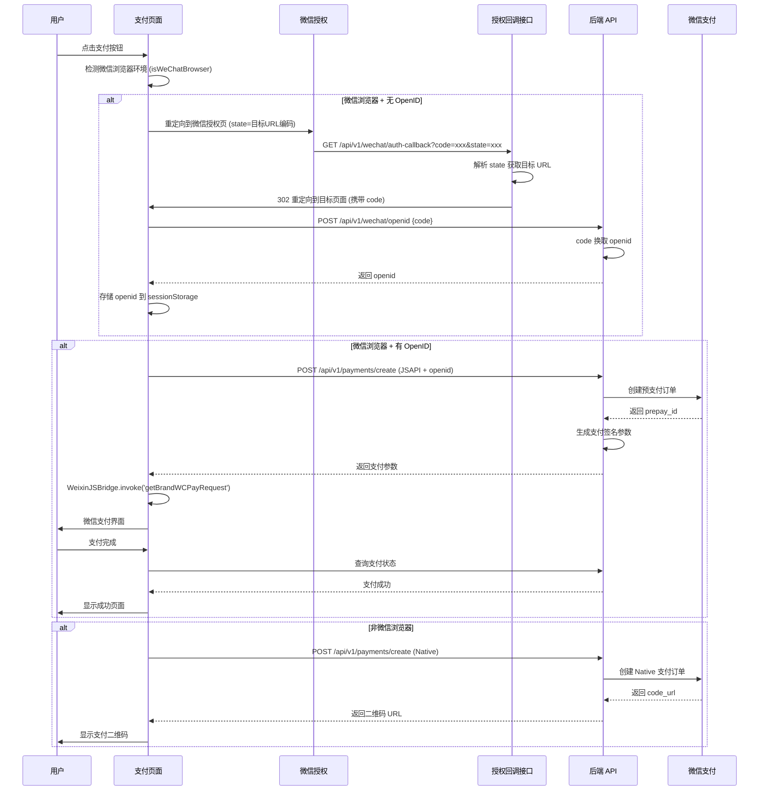

# Design Document: 微信 JSAPI 支付

## Overview

本设计文档描述微信 JSAPI 支付功能的技术实现方案。该功能允许用户在微信浏览器内直接唤起微信支付，无需扫码，提供更流畅的支付体验。

核心设计原则：
1. **最小改动** - 复用现有支付适配器和服务层代码，仅扩展前端支付流程
2. **渐进增强** - 微信环境使用 JSAPI 支付，非微信环境回退到扫码支付
3. **用户无感** - 自动检测环境并选择最佳支付方式
4. **复用现有代码** - 复用 `app/utils/wechat.ts` 中的 `isWeChatBrowser()` 和 `getWechatAuthUrl()` 函数

## Architecture

### 整体架构

```
┌─────────────────────────────────────────────────────────────────┐
│                        前端 (Nuxt 3)                             │
├─────────────────────────────────────────────────────────────────┤
│  ┌─────────────┐  ┌─────────────────────────────────────────┐   │
│  │ 支付页面     │  │ 支付组件                                 │   │
│  │ level.vue   │  │ PaymentQRCodeDialog.vue (扩展 JSAPI)    │   │
│  │ point.vue   │  │                                         │   │
│  │ order.vue   │  │                                         │   │
│  └──────┬──────┘  └───────────────┬─────────────────────────┘   │
│         │                         │                             │
│  ┌──────┴─────────────────────────┴───────────────────────────┐ │
│  │                    useWechatPayment composable              │ │
│  │  - isWeChatBrowser() (复用现有)                              │ │
│  │  - ensureOpenId()    获取/缓存 OpenID                       │ │
│  │  - invokeJsapiPay()  调用 WeixinJSBridge 支付               │ │
│  └─────────────────────────────────────────────────────────────┘ │
│                              │                                   │
│  ┌───────────────────────────┴───────────────────────────────┐   │
│  │              app/utils/wechat.ts (现有)                    │   │
│  │  - isWeChatBrowser()      检测微信环境                      │   │
│  │  - getWechatAuthUrl()     构建授权 URL (需扩展)             │   │
│  └───────────────────────────────────────────────────────────┘   │
└─────────────────────────────────────────────────────────────────┘
                              │
                              ▼
┌─────────────────────────────────────────────────────────────────┐
│                        后端 (Nuxt Server)                        │
├─────────────────────────────────────────────────────────────────┤
│  ┌─────────────────────────────┐  ┌─────────────────────────┐   │
│  │ /api/v1/wechat/             │  │ /api/v1/payments/       │   │
│  │   openid.post.ts (新增)      │  │   create.post.ts (现有)  │   │
│  │   auth-callback.get.ts(新增) │  │   callback/ (现有)       │   │
│  └──────────────┬──────────────┘  └───────────┬─────────────┘   │
│                 │                             │                 │
│  ┌──────────────┴─────────────────────────────┴─────────────┐   │
│  │                    Services Layer                         │   │
│  │  wechat.service.ts (新增)  │  payment.service.ts (现有)    │   │
│  └───────────────────────────────────────────────────────────┘   │
│                              │                                   │
│  ┌───────────────────────────┴───────────────────────────────┐   │
│  │                Payment Adapter (现有)                      │   │
│  │  WechatPayAdapter.createJsapiPayment() - 已支持公众号支付   │   │
│  └───────────────────────────────────────────────────────────┘   │
└─────────────────────────────────────────────────────────────────┘
                              │
                              ▼
┌─────────────────────────────────────────────────────────────────┐
│                      微信开放平台                                │
│  - OAuth 授权接口 (获取 code)                                    │
│  - sns/oauth2/access_token (code 换 openid)                     │
│  - 微信支付 JSAPI 接口 (创建预支付订单)                           │
└─────────────────────────────────────────────────────────────────┘
```

### 支付流程时序图



## Components and Interfaces

### 1. 前端组件

#### 1.1 useWechatPayment Composable

新增 composable 封装微信支付相关逻辑，复用现有的 `isWeChatBrowser()` 函数：

```typescript
// app/composables/useWechatPayment.ts

interface WechatPaymentParams {
  appId: string
  timeStamp: string
  nonceStr: string
  package: string
  signType: string
  paySign: string
}

interface UseWechatPaymentReturn {
  /** 是否在微信浏览器中（复用 isWeChatBrowser） */
  isInWechat: ComputedRef<boolean>
  /** 当前 OpenID */
  openId: Ref<string | null>
  /** 是否正在获取 OpenID */
  isGettingOpenId: Ref<boolean>
  /** 获取 OpenID（如果没有则触发授权） */
  ensureOpenId: () => Promise<string | null>
  /** 调用 JSAPI 支付 */
  invokeJsapiPay: (params: WechatPaymentParams) => Promise<'ok' | 'cancel' | 'fail'>
  /** 构建授权 URL 并重定向 */
  redirectToAuth: (targetPath: string) => void
}

export function useWechatPayment(): UseWechatPaymentReturn
```

#### 1.2 扩展现有 wechat.ts 工具函数

扩展 `app/utils/wechat.ts`，新增支持通用回调的授权 URL 构建函数：

```typescript
// app/utils/wechat.ts (扩展)

/**
 * 授权回调 state 参数结构
 */
interface AuthCallbackState {
  /** 目标重定向 URL（完整 URL） */
  targetUrl: string
  /** 可选：来源标识 */
  source?: string
}

/**
 * 获取微信 OAuth 授权 URL（通用回调模式）
 * 支持多公众号、多环境共用同一个回调地址
 * @param targetUrl - 授权后重定向的完整目标 URL
 * @param source - 可选的来源标识
 * @returns 微信授权 URL
 */
export function getWechatAuthUrlWithCallback(targetUrl: string, source?: string): string {
    const config = useRuntimeConfig();
    const appId = config.public.wechatAppId || '';
    const authCallbackUrl = config.public.wechatAuthCallbackUrl || '';

    if (!appId) {
        console.warn('[wechat] 未配置微信公众号 appId');
        return '';
    }

    if (!authCallbackUrl) {
        console.warn('[wechat] 未配置微信授权回调地址 wechatAuthCallbackUrl');
        return '';
    }

    // 构建 state 参数（JSON + base64 编码）
    const stateObj: AuthCallbackState = { targetUrl, source };
    const state = btoa(JSON.stringify(stateObj));

    // 回调地址指向通用回调接口
    const redirectUri = encodeURIComponent(authCallbackUrl);

    return `https://open.weixin.qq.com/connect/oauth2/authorize?appid=${appId}&redirect_uri=${redirectUri}&response_type=code&scope=snsapi_base&state=${state}#wechat_redirect`;
}
```

#### 1.3 支付组件扩展

扩展现有 `PaymentQRCodeDialog.vue` 组件，支持 JSAPI 支付模式：

```typescript
// 新增 props
interface Props {
  // ... 现有 props
  /** 是否使用 JSAPI 支付 */
  useJsapi?: boolean
  /** JSAPI 支付参数 */
  jsapiParams?: WechatPaymentParams
  /** JSAPI 支付回调 */
  onJsapiResult?: (result: 'ok' | 'cancel' | 'fail') => void
}
```

### 2. 后端接口

#### 2.1 通用授权回调接口（支持多公众号跨环境）

设计一个通用的授权回调接口，支持多个微信公众号和多个环境共用同一个回调地址：

```typescript
// server/api/v1/wechat/auth-callback.get.ts

// 请求参数（微信回调）
// GET /api/v1/wechat/auth-callback?code=xxx&state=xxx

// state 参数格式（JSON 编码后 base64）：
interface AuthCallbackState {
  /** 目标重定向 URL（完整 URL，支持跨域） */
  targetUrl: string
  /** 可选：来源标识，用于日志追踪 */
  source?: string
}

// 行为：
// 1. 解析 state 参数（base64 解码 + JSON 解析）
// 2. 验证 targetUrl 是否在白名单中（安全考虑）
// 3. 将 code 参数附加到 targetUrl
// 4. 302 重定向到 targetUrl

// 白名单配置（环境变量）：
// WECHAT_AUTH_REDIRECT_WHITELIST=https://lexseek.cn,https://dev.lexseek.cn,http://localhost:3000
```

**设计优势**：
- 一个回调地址支持多个环境（生产、测试、本地开发）
- 一个回调地址支持多个公众号（通过 state 参数区分目标）
- 节省微信公众号回调地址配额
- 支持跨域重定向（前端可以在任意域名下使用）

**安全措施**：
- 白名单验证：只允许重定向到配置的域名
- state 参数使用 base64 编码，防止 URL 特殊字符问题

#### 2.2 获取 OpenID 接口

```typescript
// server/api/v1/wechat/openid.post.ts

// 请求
interface GetOpenIdRequest {
  code: string  // 微信授权 code
}

// 响应
interface GetOpenIdResponse {
  openid: string
  unionid?: string
}
```

#### 2.3 支付创建接口（现有，无需修改）

现有 `/api/v1/payments/create` 接口已支持 `PaymentMethod.MINI_PROGRAM`，
前端传入 `openid` 参数即可使用 JSAPI 支付。

### 3. 服务层

#### 3.1 微信服务

新增微信服务处理 OAuth 相关逻辑（参考旧项目 `LexSeek/lexseekApi/src/services/wechat/wechat.service.ts`）：

```typescript
// server/services/wechat/wechat.service.ts

/**
 * 使用授权码获取用户 OpenID
 * @param code 微信授权 code
 * @returns openid 和 unionid
 */
export async function getMpOpenid(code: string): Promise<{
  openid: string
  unionid?: string
}>
```

## Data Models

### 配置扩展

需要在 `nuxt.config.ts` 和 `.env` 中添加微信公众号相关配置：

```typescript
// nuxt.config.ts runtimeConfig
runtimeConfig: {
  // 私有配置（仅服务端可用）
  wechat: {
    mpSecret: process.env.WECHAT_MP_SECRET || '',  // 公众号 AppSecret
    // 授权回调重定向白名单（逗号分隔）
    authRedirectWhitelist: process.env.WECHAT_AUTH_REDIRECT_WHITELIST || '',
  },
  // 公开配置（客户端可用）
  public: {
    wechatAppId: process.env.WECHAT_APP_ID || '',  // 公众号 AppID
    // 通用授权回调地址（用于多环境共用）
    wechatAuthCallbackUrl: process.env.WECHAT_AUTH_CALLBACK_URL || '',
  }
}
```

```bash
# .env
WECHAT_APP_ID=wx...                    # 微信公众号 AppID
WECHAT_MP_SECRET=...                   # 微信公众号 AppSecret
# 通用授权回调地址（配置在微信公众号后台）
WECHAT_AUTH_CALLBACK_URL=https://lexseek.cn/api/v1/wechat/auth-callback
# 授权回调重定向白名单（安全限制）
WECHAT_AUTH_REDIRECT_WHITELIST=https://lexseek.cn,https://dev.lexseek.cn,http://localhost:3000
```

### 前端存储

OpenID 存储在 sessionStorage 中：

```typescript
// 存储键名
const OPENID_STORAGE_KEY = 'wechat_openid'

// 存储格式
interface StoredOpenId {
  openid: string
  timestamp: number  // 存储时间戳，用于判断是否过期
}
```

### State 参数格式

授权回调的 state 参数使用 JSON + base64 编码：

```typescript
// state 参数结构
interface AuthCallbackState {
  /** 目标重定向 URL（完整 URL，支持跨域） */
  targetUrl: string
  /** 可选：来源标识，用于日志追踪 */
  source?: string
}

// 编码示例
const state = btoa(JSON.stringify({ targetUrl: 'https://lexseek.cn/dashboard/buy/1' }))
// 结果: eyJ0YXJnZXRVcmwiOiJodHRwczovL2xleHNlZWsuY24vZGFzaGJvYXJkL2J1eS8xIn0=
```


## Correctness Properties

*A property is a characteristic or behavior that should hold true across all valid executions of a system—essentially, a formal statement about what the system should do. Properties serve as the bridge between human-readable specifications and machine-verifiable correctness guarantees.*

基于 prework 分析，以下是可测试的正确性属性：

### Property 1: 微信浏览器检测 - 包含 MicroMessenger 返回 true

*For any* User-Agent 字符串，如果该字符串包含 "micromessenger"（不区分大小写），则 `isWeChatBrowser()` 函数应返回 `true`。

**Validates: Requirements 1.2**

### Property 2: 微信浏览器检测 - 不包含 MicroMessenger 返回 false

*For any* User-Agent 字符串，如果该字符串不包含 "micromessenger"（不区分大小写），则 `isWeChatBrowser()` 函数应返回 `false`。

**Validates: Requirements 1.3**

### Property 3: OAuth 授权 URL 构建 - scope 参数正确

*For any* 目标页面 URL，生成的微信授权 URL 应包含 `scope=snsapi_base` 参数。

**Validates: Requirements 2.2**

### Property 4: State 参数编解码 - 往返一致性

*For any* 有效的 AuthCallbackState 对象，编码后再解码应得到与原始对象等价的结果。

**Validates: Requirements 2.3, 2.4**

### Property 5: 授权回调白名单验证

*For any* 不在白名单中的 targetUrl，授权回调接口应拒绝重定向并返回错误。

**Validates: Requirements 2.4, 2.5**

### Property 6: 授权回调 code 参数传递

*For any* 包含 code 和有效 state 参数的回调请求，重定向 URL 应包含原始 code 参数。

**Validates: Requirements 2.4, 2.5**

### Property 7: JSAPI 支付参数完整性

*For any* 成功创建的 JSAPI 支付，返回的支付参数对象应包含以下所有字段：appId、timeStamp、nonceStr、package、signType、paySign。

**Validates: Requirements 3.3**

### Property 8: WeixinJSBridge 支付参数格式

*For any* 传入 WeixinJSBridge.invoke 的支付参数对象，应包含 appId、timeStamp、nonceStr、package、signType、paySign 字段，且 package 字段应以 "prepay_id=" 开头。

**Validates: Requirements 5.3**

## Error Handling

### 1. OAuth 授权错误

| 错误场景 | 处理方式 |
|---------|---------|
| 授权码无效或过期 | 返回错误信息，提示用户重新授权 |
| 微信 API 调用失败 | 记录错误日志，返回友好错误提示 |
| state 参数解析失败 | 使用默认跳转地址 |

### 2. 支付创建错误

| 错误场景 | 处理方式 |
|---------|---------|
| 缺少 OpenID | 返回 400 错误，提示需要 OpenID |
| 微信支付 API 调用失败 | 记录错误日志，返回错误信息 |
| 订单不存在或状态异常 | 返回对应错误信息 |

### 3. 前端支付错误

| 错误场景 | 处理方式 |
|---------|---------|
| WeixinJSBridge 未就绪 | 监听 WeixinJSBridgeReady 事件 |
| 支付调用失败 | 显示错误提示，允许重试 |
| 用户取消支付 | 保持在支付页面，允许重新支付 |

## Testing Strategy

### 测试框架

- **单元测试**: Vitest
- **属性测试**: fast-check
- **E2E 测试**: 手动测试（需要真实微信环境）

### 单元测试

1. **微信浏览器检测函数**
   - 测试各种 User-Agent 字符串的检测结果
   - 测试 SSR 环境下的行为

2. **OAuth URL 构建函数**
   - 测试生成的 URL 格式和参数
   - 测试 state 参数的编码/解码

3. **URL 参数解析函数**
   - 测试 code 和 state 参数的提取
   - 测试各种边界情况

### 属性测试

使用 fast-check 进行属性测试，每个属性测试运行 100 次迭代：

```typescript
// 示例：微信浏览器检测属性测试
fc.assert(
  fc.property(
    fc.string().filter(s => s.toLowerCase().includes('micromessenger')),
    (ua) => {
      // 模拟 navigator.userAgent
      return isWeChatBrowser(ua) === true
    }
  ),
  { numRuns: 100 }
)
```

### 集成测试

1. **OpenID 获取接口**
   - 需要有效的微信授权码
   - 建议在开发环境手动测试

2. **支付创建接口**
   - 测试 JSAPI 支付方式的参数验证
   - 测试返回的支付参数格式

### E2E 测试

由于涉及微信浏览器环境和真实支付，E2E 测试需要：
1. 在微信开发者工具中测试
2. 在真实微信浏览器中测试
3. 使用微信支付沙箱环境

### 测试文件结构

```
tests/server/
├── wechat/
│   ├── wechat-browser-detection.test.ts  # 浏览器检测测试
│   ├── oauth-url-builder.test.ts         # OAuth URL 构建测试
│   └── README.md
```
