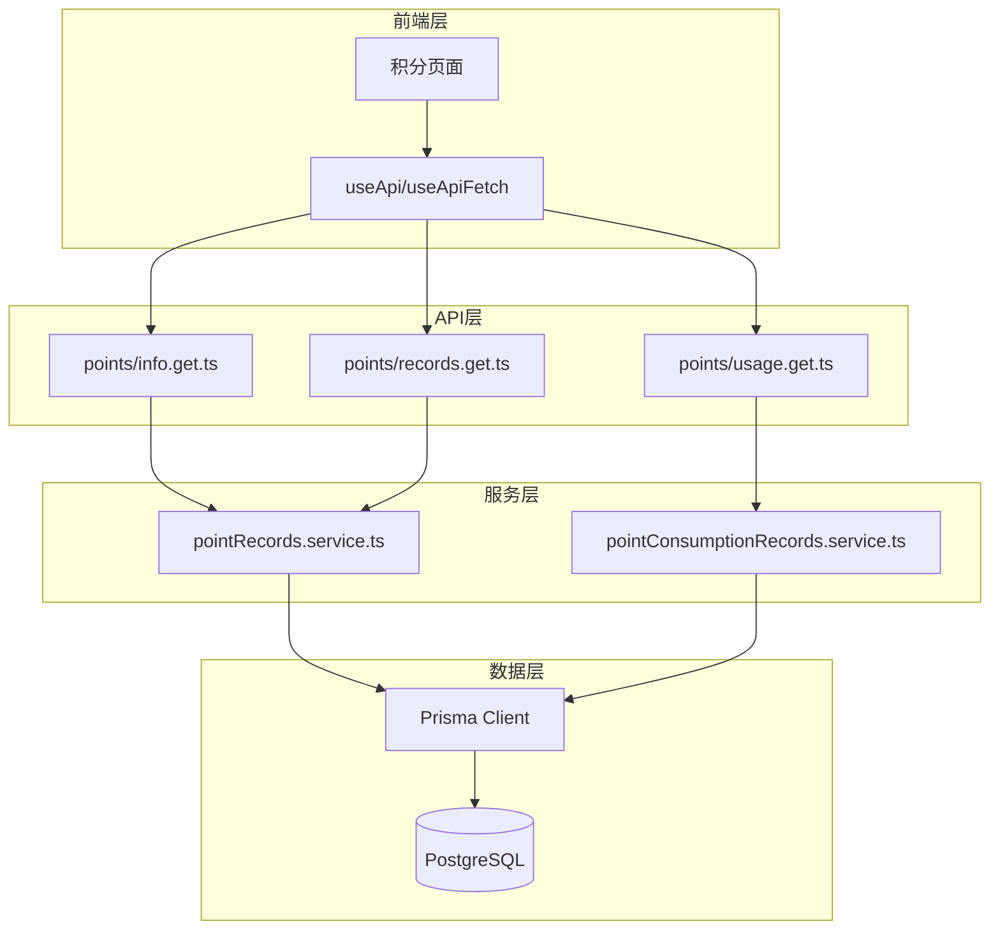

# 设计文档

## 概述

本设计文档描述了 LexSeek 积分系统的技术实现方案。积分系统基于 Nuxt.js 4 全栈架构，使用 PostgreSQL + Prisma ORM 进行数据持久化。

## 架构

### 系统架构图



### 目录结构

```
server/
├── api/v1/points/
│   ├── info.get.ts            # 获取积分汇总信息
│   ├── records.get.ts         # 获取积分记录列表
│   └── usage.get.ts           # 获取积分消耗记录
└── services/point/
    ├── pointRecords.dao.ts
    ├── pointRecords.service.ts
    ├── pointConsumptionItems.dao.ts
    ├── pointConsumptionRecords.dao.ts
    └── pointConsumptionRecords.service.ts
```

## 组件和接口

### 积分服务接口

```typescript
// server/services/point/pointRecords.service.ts
export interface PointRecordsService {
  getUserPointSummary(userId: number): Promise<PointSummary>;
  getUserPointRecords(userId: number, options: QueryOptions): Promise<PaginatedResult<PointRecord>>;
  createPointRecord(data: CreatePointRecordInput, tx?: Prisma.TransactionClient): Promise<PointRecord>;
  consumePoints(userId: number, itemId: number, amount: number, sourceId?: number, tx?: Prisma.TransactionClient): Promise<PointConsumptionResult>;
}
```

### API 接口设计

#### GET /api/v1/points/info

获取用户积分汇总信息。

**响应格式：**
```typescript
interface PointInfoResponse {
  code: number;
  message: string;
  data: {
    pointAmount: number;
    used: number;
    remaining: number;
    purchasePoint: number;
    otherPoint: number;
  };
}
```

#### GET /api/v1/points/records

获取用户积分记录列表（分页）。

#### GET /api/v1/points/usage

获取用户积分消耗记录列表（分页）。

## 数据模型

### 积分记录表 (pointRecords)

```prisma
model pointRecords {
    id               Int       @id @default(autoincrement())
    userId           Int       @map("user_id")
    pointAmount      Int       @map("point_amount")
    used             Int       @default(0)
    remaining        Int
    sourceType       Int       @map("source_type")
    sourceId         Int?      @map("source_id")
    userMembershipId Int?      @map("user_membership_id")
    effectiveAt      DateTime  @map("effective_at")
    expiredAt        DateTime  @map("expired_at")
    settlementAt     DateTime? @map("settlement_at")
    status           Int       @default(1)
    remark           String?   @db.VarChar(255)
    createdAt        DateTime  @default(now()) @map("created_at")
    updatedAt        DateTime  @default(now()) @map("updated_at")
    deletedAt        DateTime? @map("deleted_at")
    
    user users @relation(fields: [userId], references: [id])
    
    @@map("point_records")
}
```

### 积分消耗项目表 (pointConsumptionItems)

```prisma
model pointConsumptionItems {
    id          Int       @id @default(autoincrement())
    group       String    @db.VarChar(50)
    name        String    @db.VarChar(100)
    description String?   @db.VarChar(255)
    unit        String    @db.VarChar(20)
    pointAmount Int       @map("point_amount")
    discount    Decimal   @default(1) @db.Decimal(3, 2)
    status      Int       @default(1)
    createdAt   DateTime  @default(now()) @map("created_at")
    updatedAt   DateTime  @default(now()) @map("updated_at")
    deletedAt   DateTime? @map("deleted_at")
    
    @@map("point_consumption_items")
}
```

### 积分消耗记录表 (pointConsumptionRecords)

```prisma
model pointConsumptionRecords {
    id            Int       @id @default(autoincrement())
    userId        Int       @map("user_id")
    pointRecordId Int       @map("point_record_id")
    itemId        Int       @map("item_id")
    pointAmount   Int       @map("point_amount")
    status        Int       @default(1)
    sourceId      Int?      @map("source_id")
    remark        String?   @db.VarChar(255)
    createdAt     DateTime  @default(now()) @map("created_at")
    updatedAt     DateTime  @default(now()) @map("updated_at")
    deletedAt     DateTime? @map("deleted_at")
    
    user users @relation(fields: [userId], references: [id])
    pointRecord pointRecords @relation(fields: [pointRecordId], references: [id])
    item pointConsumptionItems @relation(fields: [itemId], references: [id])
    
    @@map("point_consumption_records")
}
```

## 正确性属性

### Property 1: 积分记录创建不变量

*For any* 新创建的积分记录，remaining 字段应该等于 pointAmount，used 字段应该为 0。

**Validates: Requirements 1.4**

### Property 2: 积分统计过滤属性

*For any* 用户的积分汇总查询，返回的 remaining 总和应该只包含状态为 VALID 且 expiredAt > 当前时间 且 effectiveAt <= 当前时间 的积分记录。

**Validates: Requirements 4.4, 8.2**

### Property 3: 积分余额验证属性

*For any* 积分消耗请求，如果请求消耗的积分数量大于用户的可用积分余额，系统应该拒绝该请求。

**Validates: Requirements 5.1, 5.2**

### Property 4: FIFO 消耗策略属性

*For any* 积分消耗操作，系统应该按照积分记录的 expiredAt 升序依次消耗。

**Validates: Requirements 5.3, 5.4**

### Property 5: 消耗操作完整性属性

*For any* 成功的积分消耗操作，系统应该创建对应的消耗记录并更新积分记录的 used 和 remaining 字段。

**Validates: Requirements 5.5, 5.6**

### Property 6: 积分记录数据一致性属性

*For any* 积分记录，remaining = pointAmount - used 应该始终成立。

**Validates: Requirements 7.3, 7.4**

## 错误处理

| 错误码 | 错误信息 | 说明 |
|--------|----------|------|
| 400 | 积分不足 | 用户可用积分不足以完成消耗操作 |
| 400 | 消耗项目不存在或已禁用 | 请求的积分消耗项目无效 |
| 401 | 未授权 | 用户未登录或 token 无效 |

## 测试策略

### 单元测试

- 测试 getUserPointSummary 正确计算积分汇总
- 测试 createPointRecord 正确创建记录并设置默认值
- 测试 consumePoints 的 FIFO 消耗逻辑
- 测试积分不足时的错误处理

### 属性测试

使用 Vitest 配合 fast-check 进行属性测试，每个属性测试至少运行 100 次迭代。

## 实现状态

所有组件已完成实现和测试。

### 相关文件

**服务层**:
- `server/services/point/pointRecords.dao.ts`
- `server/services/point/pointRecords.service.ts`
- `server/services/point/pointConsumptionItems.dao.ts`
- `server/services/point/pointConsumptionRecords.dao.ts`
- `server/services/point/pointConsumptionRecords.service.ts`

**API 层**:
- `server/api/v1/points/info.get.ts`
- `server/api/v1/points/records.get.ts`
- `server/api/v1/points/usage.get.ts`

**前端**:
- `app/pages/admin/point-items/*.vue`
