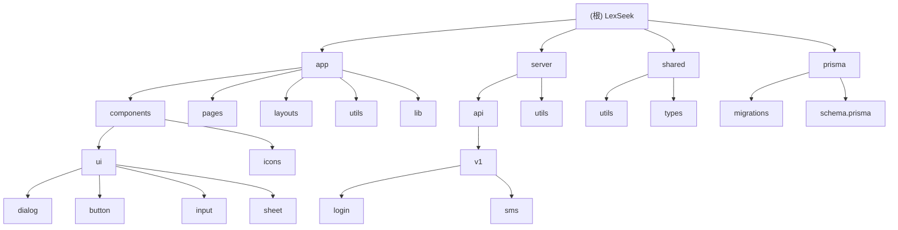

# LexSeek - 法律服务AI应用

## 变更记录 (Changelog)

**2025-12-19**: 初始化项目AI上下文文档，生成模块索引和架构概览

## 项目愿景

LexSeek 是一个基于 Nuxt.js 4 的全栈法律服务AI应用，旨在通过人工智能技术赋能法律分析，为律师提供全面的案件分析工具，提升工作效率。

## 架构总览

### 技术栈
- **前端框架**: Nuxt.js 4 (Vue 3)
- **UI组件**: Shadcn-vue + Tailwind CSS
- **数据库**: PostgreSQL + Prisma ORM
- **部署**: 支持 SSR/SSG 双模式

### 核心功能模块
- 用户认证系统（登录、注册、密码重置）
- 短信验证码服务
- 法律AI分析工具（案情概要、权利分析、时间线等）
- 价格方案展示
- 隐私协议和服务条款

## 模块结构图



## 模块索引

| 模块 | 路径 | 语言/技术 | 职责描述 |
|------|------|-----------|----------|
| app | /app | Vue/TypeScript | 前端页面、组件和UI库 |
| server | /server | TypeScript | API接口和服务端逻辑 |
| shared | /shared | TypeScript | 共享工具和类型定义 |
| prisma | /prisma | Prisma/SQL | 数据库模式和迁移 |

## 运行与开发

### 环境变量
需要配置 `.env` 文件（参考 `.env.example`）：
- `DATABASE_URL`: PostgreSQL数据库连接
- 短信服务相关配置

### 开发命令
```bash
# 安装依赖
npm install

# 启动开发服务器
npm run dev

# 构建生产版本
npm run build

# 预览生产版本
npm run preview

# Prisma相关
npm run prisma:studio     # 打开数据库管理界面
npm run prisma:generate   # 生成Prisma客户端
npm run prisma:push       # 推送模式到数据库
npm run prisma:migrate    # 运行数据库迁移
```

## 测试策略

### 后端API测试
- API接口应返回标准格式：`{ code, message, data? }`
- 使用 Zod 进行请求数据验证
- 统一的错误处理机制

### 前端测试
- UI组件遵循 Shadcn-vue 规范
- 响应式设计支持移动端适配
- 组件需支持 SSR 渲染

## 编码规范

### TypeScript
- 严格模式，所有类型需明确定义
- 使用 Prisma 生成的类型进行数据库操作
- API路由使用 `defineEventHandler` 包装

### Vue/Nuxt
- 组合式 API (Composition API) 优先
- 使用 `<script setup>` 语法
- 自动导入组件和组合式函数

### 数据库
- 使用 Prisma ORM 进行数据操作
- 所有表需包含 `createdAt`, `updatedAt`, `deletedAt` 字段
- 索引命名规范：`idx_{table}_{column}`

## AI 使用指引

### 代码生成规范
1. 新增API接口需遵循 `/api/v1` 路径规范
2. 使用统一的错误处理和返回格式
3. 数据验证使用 Zod Schema
4. 数据库操作通过 Prisma Client

### 组件开发规范
1. UI组件放在 `components/ui` 目录
2. 使用 Tailwind CSS 进行样式开发
3. 响应式设计优先
4. 组件需支持深色模式

### 数据库操作规范
1. 优先使用 Prisma Client 方法
2. 查询需包含必要的 `select` 或 `include`
3. 删除操作使用软删除（更新 `deletedAt`）
4. 敏感数据需要脱敏处理

### 安全注意事项
1. 所有用户输入必须验证和清理
2. 敏感接口需要身份验证
3. 使用参数化查询防止SQL注入
4. 手机号等敏感信息需要脱敏显示