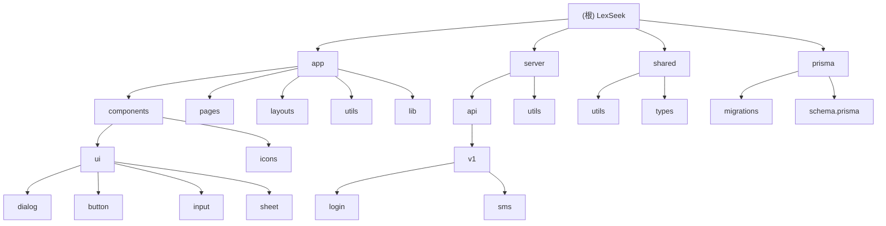

# LexSeek - 法律服务AI应用

## 变更记录 (Changelog)

**2025-12-19**: 初始化项目AI上下文文档，生成模块索引和架构概览
**2025-12-20**: 合并所有模块文档到根目录
**2025-12-23**: 更新项目架构文档，包含最新的Store优化、导航重构和安全设置功能

## 项目愿景

LexSeek 是一个基于 Nuxt.js 4 的全栈法律服务AI应用，旨在通过人工智能技术赋能法律分析，为律师提供全面的案件分析工具，提升工作效率。

## 架构总览

### 技术栈

- **前端框架**: Nuxt.js 4 (Vue 3)
- **UI组件**: Shadcn-vue + Tailwind CSS
- **数据库**: PostgreSQL + Prisma ORM
- **部署**: 支持 SSR/SSG 双模式

### 核心功能模块

- 用户认证系统（登录、注册、密码重置）
- 短信验证码服务
- 法律AI分析工具（案情概要、权利分析、时间线等）
- 价格方案展示
- 隐私协议和服务条款

## 模块结构图



## 模块索引

| 模块   | 路径    | 语言/技术      | 职责描述             |
| ------ | ------- | -------------- | -------------------- |
| app    | /app    | Vue/TypeScript | 前端页面、组件和UI库 |
| server | /server | TypeScript     | API接口和服务端逻辑  |
| shared | /shared | TypeScript     | 共享工具和类型定义   |
| prisma | /prisma | Prisma/SQL     | 数据库模式和迁移     |

## 运行与开发

### 环境变量

需要配置 `.env` 文件（参考 `.env.example`）：

- `DATABASE_URL`: PostgreSQL数据库连接
- 短信服务相关配置

### 开发命令

```bash
# 安装依赖
bun install

# 启动开发服务器
bun dev

# 构建生产版本
bun build

# 预览生产版本
bun preview

# Prisma相关
bun run prisma:studio     # 打开数据库管理界面
bun run prisma:generate   # 生成Prisma客户端
bun run prisma:push       # 推送模式到数据库
bun run prisma:migrate    # 运行数据库迁移
```

## 模块详细说明

### App 模块

App 模块是 LexSeek 的前端核心模块，负责：

- Vue 页面组件和路由
- UI 组件库（基于 Shadcn-vue）
- 前端工具函数和共享逻辑
- 静态资源管理

#### 目录结构

```
app/
├── assets/          # 静态资源
│   ├── css/        # 样式文件
│   └── features/   # 功能展示图片
├── components/      # Vue组件
│   ├── ui/         # UI组件库
│   ├── icons/      # 图标组件
│   └── dashboard/  # 仪表板专用组件
├── composables/     # 组合式函数
│   ├── useApi.ts   # API请求封装
│   └── useUserNavigation.ts # 用户导航逻辑
├── layouts/         # 布局模板
├── lib/            # 库文件
├── middleware/      # 路由中间件
├── pages/          # 页面路由
├── plugins/        # Nuxt插件
├── store/          # Pinia状态管理
│   ├── auth.ts     # 认证状态
│   ├── user.ts     # 用户信息
│   ├── role.ts     # 角色权限
│   └── alertDialog.ts # 对话框状态
└── utils/          # 工具函数
```

#### 页面路由

**公共路由**
- `/` - 首页
- `/features` - 产品功能展示
- `/privacy-agreement` - 隐私协议
- `/terms-of-use` - 服务条款
- `/reset-password` - 密码重置
- `/register` - 用户注册
- `/login` - 用户登录

**仪表板路由**
- `/dashboard` - 用户仪表板首页
- `/dashboard/cases` - 案件管理
- `/dashboard/analysis` - 法律分析工具
- `/dashboard/tools` - 法律计算工具
- `/dashboard/settings` - 设置中心
  - `/dashboard/settings/profile` - 个人资料
  - `/dashboard/settings/security` - 安全设置
- `/dashboard/membership` - 会员权益
- `/dashboard/disk-space` - 存储空间

#### UI组件库

- **基础组件**: Button, Input, Dialog, AlertDialog, Sheet, Tooltip, Skeleton, Separator
- **复合组件**: Sidebar, Breadcrumb

### Server 模块

Server 模块负责 LexSeek 的后端API服务，提供：

- RESTful API 接口
- 数据库操作封装
- 业务逻辑处理
- 中间件和工具函数

#### 目录结构

```
server/
├── api/            # API路由
│   └── v1/        # API版本1
│       ├── auth/      # 认证相关接口
│       │   ├── login/
│       │   ├── register/
│       │   ├── reset-password/
│       │   └── password/
│       ├── users/     # 用户相关接口
│       │   ├── me/
│       │   ├── profile/
│       │   ├── password/
│       │   └── routers/
│       └── sms/       # 短信相关接口
│           └── send.post.ts
└── utils/         # 服务端工具
    ├── db.ts      # 数据库连接
    └── sms.ts     # 短信工具
```

#### API接口规范

通用响应格式：

```typescript
{
  code: number,      // 状态码: 200-成功, 400-客户端错误, 500-服务端错误
  message: string,   // 响应消息
  data?: any        // 响应数据（可选）
}
```

已实现接口：

**认证接口**
- `POST /api/v1/auth/login/password` - 用户密码登录
- `POST /api/v1/auth/register` - 用户注册
- `POST /api/v1/auth/reset-password` - 重置密码
- `PUT /api/v1/auth/password` - 更新密码

**用户接口**
- `GET /api/v1/users/me` - 获取当前用户信息
- `PUT /api/v1/users/profile` - 更新用户资料
- `GET /api/v1/users/routers` - 获取用户权限路由

**短信接口**
- `POST /api/v1/sms/send` - 发送短信验证码

### Shared 模块

Shared 模块存放前后端共享的代码，包括：

- TypeScript 类型定义
- 通用工具函数
- 数据验证规则
- 常量定义

#### 目录结构

```
shared/
├── types/          # 类型定义
│   └── sms.ts     # 短信相关类型
└── utils/          # 工具函数
    ├── phone.ts   # 手机号处理
    └── zod.ts     # Zod验证规则
```

#### 类型定义

```typescript
// sms.ts
export const SmsType = [
  "LOGIN", // 登录验证
  "REGISTER", // 注册验证
  "RESET_PASSWORD", // 重置密码
] as const;

export type SmsType = (typeof SmsType)[number];
```

#### 工具函数

- `maskPhone(phone: string)` - 手机号脱敏
- `validatePhone(phoneNumber: string)` - 手机号验证

### Prisma 模块

Prisma 模块管理 LexSeek 的数据库相关配置，包括：

- 数据库模式定义
- 数据库迁移脚本
- Prisma 客户端配置

#### 目录结构

```
prisma/
├── schema.prisma        # 数据库模式定义
├── migrations/          # 数据库迁移历史
└── migration_lock.toml  # 迁移锁文件
```

#### 数据模型

1. **用户表 (users)**
   - 主要字段：id, name, username, email, phone, password, roleId, status, inviteCode
   - 索引：idx_users_id, idx_users_status, idx_users_deleted_at, idx_users_roleId

2. **短信记录表 (smsRecords)**
   - 主要字段：id, phone, code, type, expiredAt
   - 索引：idx_sms_phone_type, idx_sms_phone, idx_sms_expired_at, idx_sms_type

3. **角色表 (roles)**
   - 主要字段：id, name, description
   - 索引：idx_roles_id, idx_roles_name

4. **路由权限表 (routerPermissions)**
   - 主要字段：id, roleId, router, permissions
   - 索引：idx_router_permissions_role_id, idx_router_permissions_router

#### 枚举类型

```prisma
enum UserStatus {
  ACTIVE   // 活跃用户
  INACTIVE // 非活跃用户
  BANNED   // 封禁用户
}

enum SmsType {
  LOGIN        // 登录验证
  REGISTER     // 注册验证
  RESET_PASSWORD // 重置密码
}
```

## 测试策略

### 后端API测试

- API接口应返回标准格式：`{ code, message, data? }`
- 使用 Zod 进行请求数据验证
- 统一的错误处理机制

### 前端测试

- UI组件遵循 Shadcn-vue 规范
- 响应式设计支持移动端适配
- 组件需支持 SSR 渲染

## 编码规范

### TypeScript

- 严格模式，所有类型需明确定义
- 使用 Prisma 生成的类型进行数据库操作
- API路由使用 `defineEventHandler` 包装

### Vue/Nuxt

- 组合式 API (Composition API) 优先
- 使用 `<script setup>` 语法
- 自动导入组件和组合式函数

### 数据库

- 使用 Prisma ORM 进行数据操作
- 所有表需包含 `createdAt`, `updatedAt`, `deletedAt` 字段
- 索引命名规范：`idx_{table}_{column}`

## AI 使用指引

### 代码生成规范

1. 新增API接口需遵循 `/api/v1` 路径规范
2. 使用统一的错误处理和返回格式
3. 数据验证使用 Zod Schema
4. 数据库操作通过 Prisma Client

### 组件开发规范

1. UI组件放在 `components/ui` 目录
2. 使用 Tailwind CSS 进行样式开发
3. 响应式设计优先
4. 组件需支持深色模式

### 数据库操作规范

1. 优先使用 Prisma Client 方法
2. 查询需包含必要的 `select` 或 `include`
3. 删除操作使用软删除（更新 `deletedAt`）
4. 敏感数据需要脱敏处理

### 安全注意事项

1. 所有用户输入必须验证和清理
2. 敏感接口需要身份验证
3. 使用参数化查询防止SQL注入
4. 手机号等敏感信息需要脱敏显示

## 强制要求

1. 类型定义必须放在 shared/types 目录下
2. API接口必须遵循统一的响应格式
3. 所有数据库操作必须通过 Prisma Client
4. UI组件必须使用 Shadcn-vue 规范

## 命名规范

### 文件命名

- 类型文件使用 PascalCase: `user.ts`
- 工具文件使用 camelCase: `dateHelper.ts`
- API路由: GET请求使用文件名，POST请求使用后缀

### 数据库命名

- 表名：小写字母，复数形式
- 字段名：camelCase
- 索引名：`idx_{table}_{column}`
- 唯一索引：`uk_{table}_{column}`

## 常见问题 (FAQ)

### 1. 如何添加新的UI组件？

```bash
npx shadcn-vue@latest add [组件名]
```

### 2. 如何添加新的API接口？

在 `server/api/v1/` 目录下创建文件，使用 `defineEventHandler` 包装处理函数

### 3. 如何修改数据库结构？

1. 修改 `schema.prisma`
2. 运行 `npm run prisma:migrate`
3. 提交迁移文件

### 4. 如何处理SSR hydration问题？

- 使用 `onMounted` 钩子处理客户端逻辑
- 使用 `<ClientOnly>` 组件包装纯客户端组件

## 相关工具库

### 前端

- `@nuxt/image` - 图片优化
- `@vueuse/core` - Vue组合式工具
- `reka-ui` - 无样式UI组件
- `tailwindcss` - CSS框架

### 后端

- `@prisma/adapter-pg` - PostgreSQL适配器
- `zod` - 数据验证

## 样式系统

### Tailwind CSS

- 主样式文件：`assets/css/tailwind.css`
- 支持深色模式
- 响应式设计（sm/md/lg/xl/2xl）

### 主题定制

- 使用 CSS 变量定义颜色系统
- 组件样式遵循 `class-variance-authority` 规范

## git 操作规范

### 提交规范

- 每次提交时，必须填写 commit message，且必须符合规范，使用中文填写
- 提交时需要分析改动内容，判断是否需要分成多次提交
- 如果需要分成多次提交，应按关注点、文件类型或功能模块进行拆分

### 提交信息格式

使用 Conventional Commits 规范：

```
type(scope): subject

body (可选)

BREAKING CHANGE: (可选)
```

**type 类型说明：**
- `feat` - 新功能
- `fix` - 缺陷修复
- `refactor` - 重构（不新增功能、不修缺陷）
- `style` - 代码格式（不影响代码含义）
- `perf` - 性能优化
- `test` - 测试相关
- `chore` - 构建/工具/杂务
- `docs` - 文档更新

**scope 作用域说明：**
- `ui` - UI组件
- `api` - API接口
- `auth` - 认证模块
- `db` - 数据库
- `stores` - 状态管理
- `navigation` - 导航相关
- `plugins` - 插件系统

### 示例

```bash
# 功能新增
git commit -m "feat(auth): add password reset functionality"

# 缺陷修复
git commit -m "fix(api): resolve 401 error handling race condition"

# 重构优化
git commit -m "refactor(stores): optimize auth store implementation"

# 文档更新
git commit -m "docs: update API documentation"

# 样式调整
git commit -m "style(ui): simplify navigation component styles"
```

### 拆分提交原则

1. **不同关注点** - 互不相关的功能/模块改动应拆分
2. **不同类型** - 不要将 `feat`、`fix`、`refactor` 混在同一提交
3. **文件模式** - 源代码 vs 文档/测试/配置分组提交
4. **规模阈值** - 超大 diff（>300行或跨多个顶级目录）建议拆分
5. **可回滚性** - 确保每个提交可独立回退

### 提交前检查清单

- [ ] 代码是否通过 lint 检查
- [ ] 提交信息是否符合规范
- [ ] 是否需要拆分提交
- [ ] 测试是否通过
- [ ] 是否包含敏感信息

## 项目评估报告

### 架构评估 ✅ 良好

**优点：**
- 清晰的分层架构：前端、API、数据层分离
- 使用 Nuxt 4 的最新特性，支持 SSR
- Prisma ORM 提供类型安全的数据库操作
- Pinia 状态管理，代码组织清晰

**改进建议：**
- 考虑添加 API 响应缓存机制
- 加强错误监控和日志记录
- 增加单元测试覆盖率

### 代码质量 ✅ 良好

- 使用 TypeScript 严格模式，类型安全
- 遵循 Vue 3 Composition API 最佳实践
- 统一的代码格式化（ESLint + Prettier）
- 清晰的目录结构和命名规范

### 安全性 ✅ 良好

- 密码加密存储
- JWT token 认证
- 短信验证码防刷机制
- SQL 注入防护（Prisma ORM）

**改进建议：**
- 增加请求频率限制
- 加强 XSS 防护
- 完善安全头设置
