# LexSeek - 法律服务AI应用

## 变更记录 (Changelog)

**2025-12-19**: 初始化项目AI上下文文档，生成模块索引和架构概览
**2025-12-20**: 合并所有模块文档到根目录
**2025-12-23**: 更新项目架构文档，包含最新的Store优化、导航重构和安全设置功能
**2025-12-30**: 重大更新 - 新增会员系统、订单系统、支付系统、购买流程、主题系统
**2025-12-31**: 完善功能体系 - 新增OSS存储系统、RBAC权限系统、文件加密系统、邀请邀请系统、法律分析Agent

## 项目愿景

LexSeek 是一个基于 Nuxt.js 4 的全栈法律服务AI应用，旨在通过人工智能技术赋能法律分析，为律师提供全面的案件分析工具，提升工作效率。

## 架构总览

### 技术栈

- **前端框架**: Nuxt.js 4 (Vue 3)
- **UI组件**: Shadcn-vue + Tailwind CSS
- **数据库**: PostgreSQL + Prisma ORM
- **部署**: 支持 SSR/SSG 双模式
- **测试**: Vitest

### 核心功能模块

- 用户认证系统（登录、注册、密码重置、短信登录）
- 短信验证码服务（阿里云短信）
- 法律AI分析工具（案情概要、权利分析、时间线、AI Agent智能分析）
- 会员订阅系统（会员级别、升级、积分、兑换码）
- 订单与支付系统（微信支付、订单管理、支付回调）
- 案件管理（案件列表、筛选、CRUD）
- 法律计算工具（利息、诉讼费、律师费、仲裁费、赔偿计算等12种工具）
- 深色模式主题系统
- OSS文件存储（阿里云OSS、腾讯云COS、七牛云）
- RBAC权限系统（角色、权限、API权限控制）
- 文件加密系统（本地加密、密钥恢复）
- 邀请返利系统（邀请码、邀请记录、返利积分）

## 模块结构图

```mermaid
graph TD
    A["(根) LexSeek"] --> B["app"];
    A --> C["server"];
    A --> D["shared"];
    A --> E["prisma"];
    A --> F["tests"];

    B --> B1["components"];
    B1 --> B1a["ui"];
    B1 --> B1b["icons"];
    B1 --> B1c["dashboard"];
    B1 --> B1d["membership"];
    B1 --> B1e["order"];
    B1 --> B1f["points"];
    B1 --> B1g["purchase"];
    B1 --> B1h["cases"];
    B1 --> B1i["diskSpace"];
    B1 --> B1j["general"];
    B1 --> B1k["auth"];
    B --> B2["pages"];
    B --> B3["layouts"];
    B --> B4["composables"];
    B --> B5["plugins"];
    B --> B6["store"];
    B --> B7["utils"];

    C --> C1["api"];
    C1 --> C1a["v1"];
    C1a --> C1a1["auth"];
    C1a --> C1a2["users"];
    C1a --> C1a3["memberships"];
    C1a --> C1a4["payments"];
    C1a --> C1a5["products"];
    C1a --> C1a6["sms"];
    C1a --> C1a7["files"];
    C1a --> C1a8["storage"];
    C1a --> C1a9["encryption"];
    C1a --> C1a10["campaigns"];
    C1a --> C1a11["points"];
    C1a --> C1a12["redemption-codes"];
    C1a --> C1a13["roles"];
    C1 --> C2["services"];
    C2 --> C2a["membership"];
    C2 --> C2b["payment"];
    C2 --> C2c["point"];
    C2 --> C2d["product"];
    C2 --> C2e["users"];
    C2 --> C2f["files"];
    C2 --> C2g["storage"];
    C2 --> C2h["encryption"];
    C2 --> C2i["rbac"];
    C2 --> C2j["sms"];
    C2 --> C2k["auth"];
    C2 --> C2l["system"];
    C2 --> C2m["redemption"];
    C --> C3["middleware"];
    C --> C4["lib"];
    C4 --> C4a["payment"];
    C4 --> C4b["oss"];
    C4 --> C4c["storage"];
    C4 --> C4d["sms"];
    C4 --> C4e["aliSms"];
    C --> C5["utils"];
    C5 --> C5a["db"];
    C5 --> C5b["jwt"];
    C5 --> C5c["password"];

    D --> D1["utils"];
    D1 --> D1a["tools"];
    D1 --> D1b["logger"];
    D1 --> D1c["file"];
    D1 --> D1d["mime"];
    D2 --> D2a["types"];
    D2 --> D2b["prisma"];

    E --> E1["migrations"];
    E --> E2["models"];

    F --> F1["server"];
    F --> F2["client"];
    F --> F3["shared"];
```



## 模块索引

| 模块   | 路径          | 语言/技术      | 职责描述                   |
| ------ | ------------- | -------------- | -------------------------- |
| app    | /app          | Vue/TypeScript | 前端页面、组件和UI库       |
| server | /server       | TypeScript     | API接口和服务端逻辑        |
| shared | /shared       | TypeScript     | 共享工具和类型定义         |
| prisma | /prisma       | Prisma/SQL     | 数据库模式和迁移           |
| tests  | /tests        | TypeScript     | 测试用例（Vitest）         |

## 运行与开发

### 环境变量

需要配置 `.env` 文件（参考 `.env.example`）：

- `DATABASE_URL`: PostgreSQL数据库连接
- 短信服务相关配置
- 微信支付配置（appId, mchId, APIv3密钥等）

### 开发命令

```bash
# 安装依赖
bun install

# 启动开发服务器
bun dev

# 构建生产版本
bun build

# 预览生产版本
bun preview

# 运行测试
bun test
bun test:ui  # UI模式运行测试

# Prisma相关
bun run prisma:studio     # 打开数据库管理界面
bun run prisma:generate   # 生成Prisma客户端
bun run prisma:push       # 推送模式到数据库
bun run prisma:migrate    # 运行数据库迁移
```

## 模块详细说明

### App 模块

App 模块是 LexSeek 的前端核心模块，负责：

- Vue 页面组件和路由
- UI 组件库（基于 Shadcn-vue）
- 前端工具函数和共享逻辑
- 静态资源管理
- 文件加密与解密
- 主题和样式管理

#### 目录结构

```
app/
├── assets/              # 静态资源
│   ├── css/            # 样式文件（含主题变量）
│   └── features/       # 功能展示图片
├── components/          # Vue组件
│   ├── ui/             # UI组件库（Shadcn-vue）
│   │   ├── accordion/  # 手风琴
│   │   ├── alert-dialog/# 确认对话框
│   │   ├── avatar/     # 头像
│   │   ├── breadcrumb/ # 面包屑
│   │   ├── button/     # 按钮
│   │   ├── checkbox/   # 复选框
│   │   ├── collapsible/# 可折叠
│   │   ├── dialog/     # 对话框
│   │   ├── dropdown-menu/# 下拉菜单
│   │   ├── input/      # 输入框
│   │   ├── label/      # 标签
│   │   ├── separator/  # 分割线
│   │   ├── sheet/      # 侧边栏
│   │   ├── sidebar/    # 侧边栏导航
│   │   ├── skeleton/   # 骨架屏
│   │   ├── sonner/     # 通知
│   │   ├── tabs/       # 标签页
│   │   └── tooltip/    # 提示
│   ├── icons/          # 图标组件
│   │   ├── IconAlert.vue
│   │   └── IconInfo.vue
│   ├── dashboard/      # 仪表板组件
│   │   └── navMain.vue # 主导航
│   ├── membership/     # 会员相关组件
│   ├── order/          # 订单相关组件
│   ├── points/         # 积分相关组件
│   ├── purchase/       # 购买流程组件
│   ├── cases/          # 案件管理组件
│   ├── diskSpace/      # 存储空间组件
│   ├── general/        # 通用组件
│   └── auth/           # 认证相关组件
├── composables/         # 组合式函数
│   ├── useApi.ts       # API请求封装
│   ├── useApiFetch.ts  # API请求（fetch封装）
│   ├── useAuth.ts      # 认证逻辑
│   ├── useAgeCrypto.ts # 年龄加密工具
│   ├── useFileEncryption.ts  # 文件加密
│   ├── useFileDecryption.ts  # 文件解密
│   ├── useFileUploadWorker.ts  # 文件上传Worker
│   ├── useUserNavigation.ts   # 用户导航
│   ├── usePayment.ts    # 支付逻辑
│   ├── usePurchaseFlow.ts  # 购买流程
│   ├── useTheme.ts     # 主题管理
│   ├── useColorMode.ts # 颜色模式
│   ├── useFormatters.ts # 格式化工具
│   ├── useOrderStatus.ts   # 订单状态
│   ├── useMembershipStatus.ts # 会员状态
│   └── usePointStatus.ts   # 积分状态
├── layouts/             # 布局模板
│   ├── baseLayout.vue  # 基础布局
│   └── dashboardLayout.vue  # 仪表板布局
├── lib/                # 库文件
├── middleware/         # 路由中间件
├── pages/              # 页面路由
│   ├── index.vue       # 首页
│   ├── about.vue       # 关于我们
│   ├── features.vue    # 产品功能展示
│   ├── pricing.vue     # 价格方案
│   ├── privacy-agreement.vue  # 隐私协议
│   ├── terms-of-use.vue # 服务条款
│   ├── purchase-agreement.vue # 购买协议
│   ├── reset-password.vue # 密码重置
│   ├── register.vue    # 用户注册
│   ├── login.vue       # 用户登录
│   ├── landing/        # 落地页
│   │   └── [invitedBy].vue  # 邀请落地页
│   └── dashboard/      # 仪表板
│       ├── index.vue   # 仪表板首页
│       ├── cases.vue   # 案件管理
│       ├── analysis/   # 法律分析
│       │   ├── index.vue   # 分析首页
│       │   └── agent.vue   # AI分析Agent
│       ├── tools/      # 法律计算工具
│       │   ├── index.vue   # 工具列表
│       │   ├── interest.vue      # 利息计算
│       │   ├── court-fee.vue     # 诉讼费计算
│       │   ├── lawyer-fee.vue    # 律师费计算
│       │   ├── delay-interest.vue # 延迟利息
│       │   ├── bank-rate.vue     # 银行贷款利率
│       │   ├── date-calculator.vue # 日期计算器
│       │   ├── social-insurance.vue # 社保计算
│       │   ├── overtime.vue      # 加班费计算
│       │   ├── divorce-property.vue # 离婚财产
│       │   └── compensation.vue  # 赔偿计算
│       ├── membership/   # 会员中心
│       │   ├── index.vue   # 会员首页
│       │   ├── level.vue   # 会员级别
│       │   ├── point.vue   # 积分中心
│       │   ├── order.vue   # 订单管理
│       │   ├── invitation.vue  # 邀请中心
│       │   └── redeem.vue  # 兑换中心
│       ├── disk-space.vue # 存储空间
│       └── settings/     # 设置
│           ├── index.vue # 设置首页
│           ├── profile.vue   # 个人资料
│           ├── security.vue  # 安全设置
│           └── file-encryption.vue  # 文件加密设置
├── plugins/            # Nuxt插件
│   ├── color-mode.client.ts  # 主题插件
│   └── ssr-width.ts    # SSR宽度插件
├── store/              # Pinia状态管理
│   ├── auth.ts         # 认证状态
│   ├── user.ts         # 用户信息
│   ├── wxSupport.ts    # 微信支持状态
│   └── alertDialog.ts  # 对话框状态
└── utils/              # 工具函数
    ├── auth.ts         # 认证工具
    └── wechat.ts       # 微信工具
```

#### 页面路由

**公共路由**

- `/` - 首页
- `/about` - 关于我们
- `/features` - 产品功能展示
- `/pricing` - 价格方案
- `/privacy-agreement` - 隐私协议
- `/terms-of-use` - 服务条款
- `/purchase-agreement` - 购买协议
- `/reset-password` - 密码重置
- `/register` - 用户注册
- `/login` - 用户登录
- `/landing/:invitedBy` - 邀请落地页

**仪表板路由**

- `/dashboard` - 用户仪表板首页
- `/dashboard/cases` - 案件管理
- `/dashboard/analysis` - 法律分析工具
  - `/dashboard/analysis` - 分析首页
  - `/dashboard/analysis/agent` - AI分析Agent
- `/dashboard/tools` - 法律计算工具列表
  - `/dashboard/tools` - 工具列表
  - `/dashboard/tools/interest` - 利息计算
  - `/dashboard/tools/court-fee` - 诉讼费计算
  - `/dashboard/tools/lawyer-fee` - 律师费计算
  - `/dashboard/tools/delay-interest` - 延迟利息
  - `/dashboard/tools/bank-rate` - 银行贷款利率
  - `/dashboard/tools/date-calculator` - 日期计算器
  - `/dashboard/tools/social-insurance` - 社保计算
  - `/dashboard/tools/overtime` - 加班费计算
  - `/dashboard/tools/divorce-property` - 离婚财产
  - `/dashboard/tools/compensation` - 赔偿计算
- `/dashboard/settings` - 设置中心
  - `/dashboard/settings` - 设置首页
  - `/dashboard/settings/profile` - 个人资料
  - `/dashboard/settings/security` - 安全设置
  - `/dashboard/settings/file-encryption` - 文件加密设置
- `/dashboard/membership` - 会员中心
  - `/dashboard/membership` - 会员首页
  - `/dashboard/membership/level` - 会员级别
  - `/dashboard/membership/point` - 积分中心
  - `/dashboard/membership/order` - 订单管理
  - `/dashboard/membership/invitation` - 邀请中心
  - `/dashboard/membership/redeem` - 兑换中心
- `/dashboard/disk-space` - 存储空间

#### UI组件库

- **基础组件**: Button, Input, Dialog, AlertDialog, Sheet, Tooltip, Skeleton, Separator, Checkbox, Tabs, Label, DropdownMenu, Avatar, Accordion, Collapsible, Sonner
- **复合组件**: Sidebar, Breadcrumb
- **业务组件**: AuthModal, PaymentQRCodeDialog, PurchaseFlow, ThemeToggle, NavMain

### Server 模块

Server 模块负责 LexSeek 的后端API服务，提供：

- RESTful API 接口
- 数据库操作封装
- 业务逻辑处理
- 中间件和工具函数
- 微信支付集成
- OSS存储服务
- 文件加密服务
- RBAC权限控制

#### 目录结构

```
server/
├── api/                    # API路由
│   ├── health.get.ts       # 健康检查
│   └── v1/                # API版本1
│       ├── auth/          # 认证相关
│       │   ├── login/
│       │   │   ├── password.post.ts
│       │   │   └── sms.post.ts
│       │   ├── register.post.ts
│       │   ├── reset-password.ts
│       │   ├── logout.post.ts
│       │   └── password.put.ts
│       ├── users/         # 用户相关
│       │   ├── me.get.ts
│       │   ├── profile.put.ts
│       │   ├── password.put.ts
│       │   ├── routers.get.ts
│       │   ├── roles.get.ts
│       │   └── invitees.get.ts
│       ├── sms/           # 短信相关
│       │   └── send.post.ts
│       ├── memberships/   # 会员相关
│       │   ├── history.get.ts
│       │   ├── levels/
│       │   │   ├── index.get.ts
│       │   │   └── [id].get.ts
│       │   ├── me.get.ts
│       │   ├── upgrade/
│       │   │   ├── options.get.ts
│       │   │   ├── calculate.post.ts
│       │   │   ├── index.post.ts
│       │   │   ├── pay.post.ts
│       │   │   └── records.get.ts
│       │   └── benefits.get.ts
│       ├── payments/      # 支付相关
│       │   ├── create.post.ts
│       │   ├── orders.get.ts
│       │   ├── query.get.ts
│       │   ├── orders/[id]/pay.post.ts
│       │   └── callback/
│       │       └── wechat.post.ts
│       ├── products/      # 商品相关
│       │   ├── index.get.ts
│       │   └── [id].get.ts
│       ├── files/         # 文件相关
│       │   └── oss/
│       │       ├── file-list.ts
│       │       ├── [id].delete.ts
│       │       └── download-url/.post.ts
│       ├── storage/       # 存储配置相关
│       │   ├── config/
│       │   │   ├── .get.ts
│       │   │   ├── .post.ts
│       │   │   ├── [id].delete.ts
│       │   │   ├── [id].put.ts
│       │   │   └── test.post.ts
│       │   ├── presigned-url/
│       │   │   ├── .get.ts
│       │   │   ├── .post.ts
│       │   │   └── config.get.ts
│       │   ├── callback/.post.ts
│       │   └── presigned-url/.get.ts
│       ├── encryption/    # 加密相关
│       │   ├── config.get.ts
│       │   ├── config.post.ts
│       │   ├── config.put.ts
│       │   ├── recovery-key.get.ts
│       │   └── recovery.post.ts
│       ├── campaigns/     # 促销活动相关
│       │   ├── index.get.ts
│       │   └── [id].get.ts
│       ├── points/        # 积分相关
│       │   ├── info.get.ts
│       │   ├── usage.get.ts
│       │   └── records.get.ts
│       ├── redemption-codes/  # 兑换码相关
│       │   └── info.get.ts
│       └── roles/         # 角色相关
│           └── ...
├── services/              # 业务逻辑层
│   ├── membership/       # 会员服务
│   │   ├── membershipLevel.dao.ts
│   │   ├── membershipUpgrade.dao.ts
│   │   ├── membershipUpgrade.service.ts
│   │   ├── userMembership.dao.ts
│   │   ├── userMembership.service.ts
│   │   ├── benefit.dao.ts
│   │   ├── benefit.service.ts
│   │   └── membershipBenefit.dao.ts
│   ├── payment/          # 支付服务
│   │   ├── handlers/     # 支付处理器
│   │   │   ├── index.ts
│   │   │   ├── upgradeHandler.ts
│   │   │   ├── membershipHandler.ts
│   │   │   ├── pointsHandler.ts
│   │   │   └── types.ts
│   │   ├── order.dao.ts
│   │   ├── order.service.ts
│   │   ├── payment.service.ts
│   │   └── paymentTransaction.dao.ts
│   ├── point/            # 积分服务
│   │   ├── pointRecords.dao.ts
│   │   ├── pointRecords.service.ts
│   │   ├── pointConsumptionRecords.dao.ts
│   │   └── pointConsumptionRecords.service.ts
│   ├── product/          # 商品服务
│   │   ├── product.dao.ts
│   │   └── product.service.ts
│   ├── users/            # 用户服务
│   │   ├── users.dao.ts
│   │   ├── users.service.ts
│   │   ├── userResponse.service.ts
│   │   ├── tokenBlacklist.dao.ts
│   │   └── invitees.dao.ts
│   ├── files/            # 文件服务
│   │   ├── files.service.ts
│   │   └── ossFiles.dao.ts
│   ├── storage/          # 存储服务
│   │   ├── storage.service.ts
│   │   └── storage-config.dao.ts
│   ├── encryption/       # 加密服务
│   │   └── encryption.dao.ts
│   ├── rbac/             # 权限服务
│   │   ├── roles.dao.ts
│   │   └── userRoles.dao.ts
│   ├── sms/              # 短信服务
│   │   ├── smsRecord.dao.ts
│   │   └── smsVerification.service.ts
│   ├── auth/             # 认证服务
│   │   └── authToken.service.ts
│   ├── system/           # 系统服务
│   │   └── systemConfig.dao.ts
│   ├── redemption/       # 兑换服务
│   │   └── redemptionRecord.dao.ts
│   └── redempt/          # (保留)
├── lib/                  # 库文件
│   ├── payment/          # 支付库
│   │   ├── types.ts
│   │   ├── errors.ts
│   │   ├── base.ts
│   │   ├── index.ts
│   │   ├── adapters/
│   │   │   └── wechat-pay.ts
│   │   └── factory.ts
│   ├── oss/              # OSS库
│   │   ├── upload.ts
│   │   ├── download.ts
│   │   ├── delete.ts
│   │   ├── validator.ts
│   │   ├── errors.ts
│   │   ├── index.ts
│   │   ├── client.ts
│   │   ├── utils.ts
│   │   └── postSignature.ts
│   ├── storage/          # 存储库
│   │   ├── adapters/
│   │   │   ├── aliyun-oss.ts
│   │   │   ├── tencent-cos.ts
│   │   │   └── qiniu.ts
│   │   ├── base.ts
│   │   ├── types.ts
│   │   ├── errors.ts
│   │   ├── factory.ts
│   │   ├── index.ts
│   │   ├── callback/
│   │   │   ├── handler.ts
│   │   │   ├── index.ts
│   │   │   ├── types.ts
│   │   │   └── validators/
│   │   │       └── aliyun.ts
│   │   └── signedUrl.ts
│   ├── aliSms.ts         # 阿里云短信
│   └── sms.ts            # 短信库
├── plugins/              # 插件
│   └── logger.ts         # 日志插件
├── middleware/           # 中间件
│   ├── 01.requestId.ts   # 请求ID中间件
│   └── 02.auth.ts        # 认证中间件
└── utils/               # 服务端工具
    ├── db.ts            # 数据库连接
    ├── jwt.ts           # JWT工具
    ├── password.ts      # 密码工具
    ├── oss.ts           # OSS工具
    ├── sms.ts           # 短信工具
    ├── serialization.ts # 序列化工具
    └── logger.ts        # 日志工具
```

#### API接口规范

通用响应格式：

```typescript
{
  code: number,      // 状态码: 200-成功, 400-客户端错误, 500-服务端错误
  message: string,   // 响应消息
  data?: any        // 响应数据（可选）
}
```

#### 已实现接口

**认证接口**

- `POST /api/v1/auth/login/password` - 用户密码登录
- `POST /api/v1/auth/login/sms` - 用户短信登录
- `POST /api/v1/auth/register` - 用户注册
- `POST /api/v1/auth/reset-password` - 重置密码
- `PUT /api/v1/auth/password` - 更新密码
- `POST /api/v1/auth/logout` - 退出登录

**用户接口**

- `GET /api/v1/users/me` - 获取当前用户信息
- `PUT /api/v1/users/profile` - 更新用户资料
- `PUT /api/v1/users/password` - 更新密码
- `GET /api/v1/users/routers` - 获取用户权限路由
- `GET /api/v1/users/roles` - 获取用户角色
- `GET /api/v1/users/invitees` - 获取受邀用户列表

**短信接口**

- `POST /api/v1/sms/send` - 发送短信验证码

**会员接口**

- `GET /api/v1/memberships/me` - 获取当前用户会员信息
- `GET /api/v1/memberships/history` - 获取会员记录
- `GET /api/v1/memberships/levels` - 获取会员级别列表
- `GET /api/v1/memberships/levels/:id` - 获取指定会员级别
- `GET /api/v1/memberships/upgrade/options` - 获取升级选项
- `POST /api/v1/memberships/upgrade/calculate` - 计算升级价格
- `POST /api/v1/memberships/upgrade/index` - 创建升级订单
- `POST /api/v1/memberships/upgrade/pay` - 升级支付
- `GET /api/v1/memberships/upgrade/records` - 获取升级记录
- `GET /api/v1/memberships/benefits` - 获取会员权益

**支付接口**

- `POST /api/v1/payments/create` - 创建支付
- `GET /api/v1/payments/orders` - 获取订单列表
- `GET /api/v1/payments/query` - 查询支付状态
- `POST /api/v1/payments/orders/:id/pay` - 订单支付
- `POST /api/v1/payments/callback/wechat` - 微信支付回调

**商品接口**

- `GET /api/v1/products` - 获取商品列表
- `GET /api/v1/products/:id` - 获取指定商品

**文件接口**

- `GET /api/v1/files/oss/file-list` - 获取OSS文件列表
- `DELETE /api/v1/files/oss/:id` - 删除OSS文件
- `POST /api/v1/files/oss/download-url` - 获取下载URL

**存储配置接口**

- `GET /api/v1/storage/config` - 获取存储配置列表
- `POST /api/v1/storage/config` - 创建存储配置
- `DELETE /api/v1/storage/config/:id` - 删除存储配置
- `PUT /api/v1/storage/config/:id` - 更新存储配置
- `POST /api/v1/storage/config/test` - 测试存储配置
- `GET /api/v1/storage/presigned-url` - 获取预签名URL
- `POST /api/v1/storage/presigned-url` - 创建预签名URL
- `GET /api/v1/storage/presigned-url/config` - 获取预签名配置
- `POST /api/v1/storage/callback` - 存储回调

**加密接口**

- `GET /api/v1/encryption/config` - 获取加密配置
- `POST /api/v1/encryption/config` - 创建加密配置
- `PUT /api/v1/encryption/config` - 更新加密配置
- `GET /api/v1/encryption/recovery-key` - 获取恢复密钥
- `POST /api/v1/encryption/recovery` - 恢复加密数据

**促销接口**

- `GET /api/v1/campaigns` - 获取促销活动列表
- `GET /api/v1/campaigns/:id` - 获取指定促销活动

**积分接口**

- `GET /api/v1/points/info` - 获取积分信息
- `GET /api/v1/points/usage` - 获取积分使用情况
- `GET /api/v1/points/records` - 获取积分记录

**兑换码接口**

- `GET /api/v1/redemption-codes/info` - 获取兑换码信息

**角色接口**

- `GET /api/v1/roles` - 获取角色列表

**健康检查**

- `GET /api/health` - 服务健康检查

### Shared 模块

Shared 模块存放前后端共享的代码，包括：

- TypeScript 类型定义
- 通用工具函数
- 数据验证规则
- 常量定义
- 法律计算工具服务

#### 目录结构

```
shared/
├── types/              # 类型定义
│   ├── membership.ts  # 会员相关类型
│   ├── payment.ts     # 支付相关类型
│   ├── point.types.ts # 积分相关类型
│   ├── product.ts     # 商品相关类型
│   ├── sms.ts         # 短信相关类型
│   ├── user.ts        # 用户相关类型
│   ├── prisma.ts      # Prisma生成类型
│   ├── system.ts      # 系统相关类型
│   ├── oss.ts         # OSS相关类型
│   ├── file.ts        # 文件相关类型
│   ├── encryption.ts  # 加密相关类型
│   ├── campaign.ts    # 促销相关类型
│   ├── redemption.ts  # 兑换相关类型
│   ├── tools.ts       # 工具相关类型
│   ├── aliSms.d.ts    # 阿里云短信类型
│   └── unitConverision.ts # 单位转换类型
└── utils/              # 工具函数
    ├── phone.ts       # 手机号处理
    ├── zod.ts         # Zod验证规则
    ├── logger.ts      # 日志工具
    ├── decimalToNumber.ts  # Decimal转换
    ├── apiResponse.ts # API响应封装
    ├── toast.ts       # 提示工具
    ├── uuid.ts        # UUID生成
    ├── file.ts        # 文件工具
    ├── mime.ts        # MIME类型
    ├── unitConverision.ts # 单位转换
    ├── serialization.ts # 序列化工具
    ├── tools/         # 法律计算工具
    │   ├── index.ts
    │   ├── utils/
    │   │   ├── index.ts
    │   │   ├── calculator.ts
    │   │   ├── date.ts
    │   │   ├── validators.ts
    │   │   └── excelExport.ts
    │   ├── interestService.ts
    │   ├── courtFeeService.ts
    │   ├── lawyerFeeService.ts
    │   ├── delayInterestService.ts
    │   ├── bankRateService.ts
    │   ├── dateCalculatorService.ts
    │   ├── socialInsuranceService.ts
    │   ├── overtimePayService.ts
    │   ├── divorcePropertyService.ts
    │   ├── compensationService.ts
    │   ├── arbitrationFeeService.ts
    │   ├── imageWatermarkService.ts
    │   └── ...
    └── logger/        # 日志工具
        ├── index.ts
        ├── logger.ts
        ├── formatter.ts
        ├── parser.ts
        ├── types.ts
        ├── transports/
        │   ├── index.ts
        │   ├── console.ts
        │   └── file.ts
```

#### 核心类型定义

```typescript
// 会员级别类型
interface MembershipLevel {
    id: number;
    name: string;
    sortOrder: number;
    status: number;
    description?: string;
}

// 订单状态
enum OrderStatus {
    PENDING = 0,     // 待支付
    PAID = 1,        // 已支付
    CANCELLED = 2,   // 已取消
    REFUNDED = 3,    // 已退款
}

// 支付渠道
enum PaymentChannel {
    WECHAT = 'wechat',
}

// 支付方式
enum PaymentMethod {
    NATIVE = 'native',      // 扫码支付
    H5 = 'h5',              // H5支付
    MINI_PROGRAM = 'mini_program',  // 小程序支付
}

// 积分来源类型
enum PointRecordSourceType {
    MEMBERSHIP_GIFT = 1,    // 会员赠送
    MANUAL = 2,             // 手动调整
    INVITATION_REWARD = 3,  // 邀请奖励
    REDEMPTION = 4,         // 兑换
}

// 存储提供商类型
enum StorageProvider {
    ALIYUN_OSS = 'aliyun_oss',
    TENCENT_COS = 'tencent_cos',
    QINIU = 'qiniu',
}

// 存储配置类型
interface StorageConfig {
    id: number;
    name: string;
    provider: StorageProvider;
    config: Record<string, any>;
    status: number;
}
```

### Prisma 模块

Prisma 模块管理 LexSeek 的数据库相关配置，包括：

- 数据库模式定义（模块化拆分）
- 数据库迁移脚本
- Prisma 客户端配置
- RBAC权限模型

#### 目录结构

```
prisma/
├── models/              # 数据库模型（模块化）
│   ├── user.prisma     # 用户模型
│   ├── membership.prisma # 会员模型
│   ├── order.prisma    # 订单模型
│   ├── point.prisma    # 积分模型
│   ├── product.prisma  # 商品模型
│   ├── sms.prisma      # 短信模型
│   ├── rbac.prisma     # RBAC权限模型
│   ├── router.prisma   # 路由模型
│   ├── system.prisma   # 系统配置模型
│   ├── encryption.prisma # 加密模型
│   ├── file.prisma     # 文件模型
│   ├── storage.prisma  # 存储配置模型
│   ├── campaign.prisma # 促销模型
│   ├── redemption.prisma # 兑换码模型
│   └── apiPermission.prisma # API权限模型
├── migrations/          # 数据库迁移历史
└── schema.prisma        # 主模式文件（导入models）
```

#### 数据模型

1. **用户表 (users)**
   - 主要字段：id, name, username, email, phone, password, status, inviteCode, inviteeId
   - 索引：idx_users_id, idx_users_status, idx_users_deleted_at

2. **短信记录表 (smsRecords)**
   - 主要字段：id, phone, code, type, expiredAt
   - 索引：idx_sms_phone_type, idx_sms_phone, idx_sms_expired_at

3. **角色表 (roles)**
   - 主要字段：id, name, code, description, status
   - 索引：idx_roles_id, idx_roles_name

4. **用户角色关联表 (userRoles)**
   - 主要字段：id, userId, roleId
   - 索引：idx_user_roles_user_id

5. **权限表 (permissions)**
   - 主要字段：id, name, code, description
   - 索引：idx_permissions_id, idx_permissions_code

6. **角色权限关联表 (rolePermissions)**
   - 主要字段：id, roleId, permissionId
   - 索引：idx_role_permissions_role_id

7. **API权限表 (apiPermissions)**
   - 主要字段：id, path, method, description, status
   - 索引：idx_api_permissions_path_method

8. **角色API权限关联表 (roleApiPermissions)**
   - 主要字段：id, roleId, apiPermissionId
   - 索引：idx_role_api_permissions_role_id

9. **路由表 (routers)**
   - 主要字段：id, path, name, component, parentId, meta
   - 索引：idx_routers_parent_id

10. **会员级别表 (membershipLevels)**
    - 主要字段：id, name, description, sortOrder, status
    - 索引：idx_membership_levels_id

11. **会员权益表 (benefits)**
    - 主要字段：id, name, description, icon, type, value, sortOrder
    - 索引：idx_benefits_id

12. **会员级别权益关联表 (membershipBenefits)**
    - 主要字段：id, levelId, benefitId
    - 索引：idx_membership_benefits_level_id

13. **用户会员表 (userMemberships)**
    - 主要字段：id, userId, levelId, startDate, endDate, status, settlementAt
    - 索引：idx_user_memberships_user_id, idx_user_memberships_status

14. **会员升级记录表 (membershipUpgradeRecords)**
    - 主要字段：id, userId, fromMembershipId, toMembershipId, upgradePrice, pointCompensation
    - 索引：idx_membership_upgrade_records_user_id

15. **商品表 (products)**
    - 主要字段：id, name, type, priceMonthly, priceYearly, purchaseLimit, status
    - 索引：idx_products_type, idx_products_status

16. **订单表 (orders)**
    - 主要字段：id, orderNo, userId, productId, amount, orderType, status
    - 索引：idx_orders_user_id, idx_orders_order_no

17. **支付交易表 (paymentTransactions)**
    - 主要字段：id, transactionNo, orderId, amount, paymentChannel, status
    - 索引：idx_payment_transactions_order_id

18. **积分记录表 (pointRecords)**
    - 主要字段：id, userId, pointAmount, remaining, effectiveAt, expiredAt, status
    - 索引：idx_point_records_user_id, idx_point_records_effective_at

19. **积分消费记录表 (pointConsumptionRecords)**
    - 主要字段：id, userId, pointAmount, type, description, orderId
    - 索引：idx_point_consumption_records_user_id

20. **积分消费项目表 (pointConsumptionItems)**
    - 主要字段：id, name, pointCost, description
    - 索引：idx_point_consumption_items_id

21. **促销活动表 (campaigns)**
    - 主要字段：id, name, type, levelId, giftPoint, startAt, endAt, status

22. **兑换码表 (redemptionCodes)**
    - 主要字段：id, code, type, levelId, duration, expiredAt, usedAt, usedBy

23. **兑换记录表 (redemptionRecords)**
    - 主要字段：id, userId, codeId, redeemedAt

24. **系统配置表 (systemConfigs)**
    - 主要字段：id, key, value, description
    - 索引：idx_system_configs_key

25. **文件加密配置表 (encryptionConfigs)**
    - 主要字段：id, userId, publicKey, algorithm, status
    - 索引：idx_encryption_configs_user_id

26. **OSS文件表 (ossFiles)**
    - 主要字段：id, userId, fileName, fileUrl, fileSize, fileType, ossKey
    - 索引：idx_oss_files_user_id

27. **存储配置表 (storageConfigs)**
    - 主要字段：id, name, provider, config, isDefault, status
    - 索引：idx_storage_configs_user_id

## 测试策略

### 测试目录结构

```
tests/
├── server/              # 服务端测试
│   ├── api/            # API集成测试
│   ├── membership/     # 会员模块测试
│   ├── payment/        # 支付模块测试
│   ├── product/        # 商品模块测试
│   ├── rbac/           # 权限测试
│   ├── system/         # 系统测试
│   ├── utils/          # 工具测试
│   └── membership/
├── client/             # 客户端测试
│   ├── composables/    # Composables测试
│   └── utils/          # 工具测试
└── shared/             # 共享测试
    └── composables/    # 共享Composables测试
```

### 测试类型

- **单元测试**: Composables、工具函数、DAO层
- **集成测试**: API端点、服务层
- **端到端测试**: 支付流程、认证流程

## 编码规范

### TypeScript

- 严格模式，所有类型需明确定义
- 使用 Prisma 生成的类型进行数据库操作
- API路由使用 `defineEventHandler` 包装
- 类型定义统一放在 `shared/types` 目录

### Vue/Nuxt

- 组合式 API (Composition API) 优先
- 使用 `<script setup>` 语法
- 自动导入组件和组合式函数
- 组件按功能模块组织到独立目录

### 数据库

- 使用 Prisma ORM 进行数据操作
- 数据库模型按模块拆分到 `prisma/models/` 目录
- 所有表需包含 `createdAt`, `updatedAt`, `deletedAt` 字段
- 索引命名规范：`idx_{table}_{column}`

## AI 使用指引

### 代码生成规范

1. 新增API接口需遵循 `/api/v1` 路径规范
2. 使用统一的错误处理和返回格式
3. 数据验证使用 Zod Schema
4. 数据库操作通过 Prisma Client
5. 类型定义放在 `shared/types` 目录

### 组件开发规范

1. Shadcn-vue UI组件放在 `components/ui` 目录
2. 自定义业务组件放在 `components` 目录，按功能模块分目录
3. 使用 Tailwind CSS 进行样式开发
4. 响应式设计优先
5. 组件需支持深色模式
6. 复杂的业务逻辑应提取为 composables

### 数据库操作规范

1. 优先使用 Prisma Client 方法
2. 查询需包含必要的 `select` 或 `include`
3. 删除操作使用软删除（更新 `deletedAt`）
4. 敏感数据需要脱敏处理
5. 数据库模型按模块拆分到 `prisma/models/` 目录
6. 使用 DAO 层封装数据库操作

### 支付处理规范

1. 使用工厂模式创建支付适配器
2. 支付处理器按优先级顺序执行
3. 支付成功回调处理积分、会员等业务逻辑
4. 微信支付支持 Native、H5、小程序多种方式

### OSS存储规范

1. 使用统一的存储库和工厂模式
2. 支持阿里云OSS、腾讯云COS、七牛云多种提供商
3. 使用预签名URL进行客户端直传
4. 文件上传前进行格式验证
5. 存储回调需验证签名

### 加密处理规范

1. 用户文件使用本地加密（AES-256）
2. 支持密钥生成和恢复机制
3. 加密配置存储在数据库中
4. 敏感操作记录审计日志

### RBAC权限规范

1. 用户通过角色关联权限
2. API接口支持路径+方法的权限控制
3. 前端路由动态生成基于权限
4. 权限变更实时生效

### 安全注意事项

1. 所有用户输入必须验证和清理
2. 敏感接口需要身份验证
3. 使用参数化查询防止SQL注入
4. 手机号等敏感信息需要脱敏显示
5. 微信支付回调需验证签名

## 强制要求

1. 类型定义必须放在 `shared/types` 目录下
2. API接口必须遵循统一的响应格式
3. 所有数据库操作必须通过 Prisma Client
4. UI组件必须使用 Shadcn-vue 规范
5. 数据库模型需拆分到 `prisma/models/` 目录
6. 测试文件放在 `tests/` 目录对应位置

## 命名规范

### 文件命名

- 类型文件使用 PascalCase: `user.ts`
- 工具文件使用 camelCase: `dateHelper.ts`
- API路由: GET请求使用文件名，POST请求使用后缀
- 组件文件使用 PascalCase: `MembershipCard.vue`
- Composables 使用 camelCase: `useAuth.ts`

### 数据库命名

- 表名：小写字母，复数形式
- 字段名：camelCase
- 索引名：`idx_{table}_{column}`
- 唯一索引：`uk_{table}_{column}`

### 代码提交

- 遵循 Conventional Commits 规范
- 使用中文填写提交信息
- 大改动需拆分为多次提交
- 提交信息格式：`type(scope): subject`

## 常见问题 (FAQ)

### 1. 如何添加新的UI组件？

```bash
npx shadcn-vue@latest add [组件名]
```

### 2. 如何添加新的API接口？

在 `server/api/v1/` 目录下创建文件，使用 `defineEventHandler` 包装处理函数

### 3. 如何修改数据库结构？

1. 修改 `prisma/models/` 下的对应模型文件
2. 运行 `bun run prisma:migrate`
3. 提交迁移文件

### 4. 如何添加新的支付方式？

1. 在 `server/lib/payment/adapters/` 下创建适配器
2. 在 `server/services/payment/handlers/` 下创建处理器
3. 注册到 handlers 列表（注意顺序）

### 5. 如何处理SSR hydration问题？

- 使用 `onMounted` 钩子处理客户端逻辑
- 使用 `<ClientOnly>` 组件包装纯客户端组件
- 使用 `ClientOnly` 包裹主题切换等客户端功能

### 6. 如何添加新的法律计算工具？

1. 在 `app/pages/dashboard/tools/` 下创建页面
2. 在侧边栏配置中添加路由
3. 遵循现有工具页的代码结构和样式

### 7. 如何配置OSS存储？

1. 在 `server/lib/storage/adapters/` 下创建适配器（如果需要新的提供商）
2. 在存储配置页面添加配置表单
3. 支持阿里云OSS、腾讯云COS、七牛云
4. 测试连接后保存配置

### 8. 如何设置文件加密？

1. 用户首次设置加密时生成密钥对
2. 公钥存储在数据库，私钥由用户保管
3. 支持密钥恢复功能
4. 加密文件使用Web Worker处理，避免阻塞主线程

### 9. 如何管理用户权限？

1. 在数据库中配置角色和权限
2. API权限通过 `apiPermissions` 表控制
3. 前端路由根据用户角色动态生成
4. 权限变更实时生效，无需重新登录

### 10. 如何添加新的支付方式？

1. 在 `server/lib/payment/adapters/` 下创建适配器
2. 实现统一的支付接口
3. 在 `server/services/payment/handlers/` 下创建处理器
4. 注册到 handlers 列表（注意顺序）

## 相关工具库

### 前端

- `@nuxt/image` - 图片优化
- `@vueuse/core` - Vue组合式工具
- `reka-ui` - 无样式UI组件
- `tailwindcss` - CSS框架
- `dayjs` - 日期处理
- `zod` - 数据验证

### 后端

- `@prisma/adapter-pg` - PostgreSQL适配器
- `zod` - 数据验证
- `wechatpay-node` - 微信支付SDK

## 样式系统

### Tailwind CSS

- 主样式文件：`assets/css/tailwind.css`
- 支持深色模式
- 响应式设计（sm/md/lg/xl/2xl）

### 主题定制

- 使用 CSS 变量定义颜色系统
- 通过 `color-mode` Nuxt 模块支持深色/浅色主题
- 组件样式遵循 `class-variance-authority` 规范

## git 操作规范

### 提交规范

- 每次提交时，必须填写 commit message，且必须符合规范，使用中文填写
- 提交时需要分析改动内容，判断是否需要分成多次提交
- 如果需要分成多次提交，应按关注点、文件类型或功能模块进行拆分

### 提交信息格式

使用 Conventional Commits 规范：

```
type(scope): subject

body (可选)

BREAKING CHANGE: (可选)
```

**type 类型说明：**

- `feat` - 新功能
- `fix` - 缺陷修复
- `refactor` - 重构（不新增功能、不修缺陷）
- `style` - 代码格式（不影响代码含义）
- `perf` - 性能优化
- `test` - 测试相关
- `chore` - 构建/工具/杂务
- `docs` - 文档更新

**scope 作用域说明：**

- `ui` - UI组件
- `api` - API接口
- `auth` - 认证模块
- `db` - 数据库
- `theme` - 主题系统
- `purchase` - 购买流程
- `cases` - 案件模块
- `tools` - 工具页面
- `membership` - 会员系统
- `payment` - 支付系统
- `storage` - 存储服务
- `oss` - OSS文件存储
- `encryption` - 加密系统
- `rbac` - 权限系统
- `invitation` - 邀请系统
- `analysis` - 法律分析

### 示例

```bash
# 功能新增
git commit -m "feat(payment): 新增微信支付适配器"

# 缺陷修复
git commit -m "fix(auth): 修复登录状态判断异常"

# 重构优化
git commit -m "refactor(cases): 提取案件筛选逻辑到独立组件"

# 文档更新
git commit -m "docs: 更新支付API文档"

# 主题更新
git commit -m "feat(theme): 实现深色模式切换"

# 购买流程
git commit -m "feat(purchase): 提取购买流程composable"
```

### 拆分提交原则

1. **不同关注点** - 互不相关的功能/模块改动应拆分
2. **不同类型** - 不要将 `feat`、`fix`、`refactor` 混在同一提交
3. **文件模式** - 源代码 vs 文档/测试/配置分组提交
4. **规模阈值** - 超大 diff（>300行或跨多个顶级目录）建议拆分
5. **可回滚性** - 确保每个提交可独立回退

### 提交前检查清单

- [ ] 代码是否通过 lint 检查
- [ ] 提交信息是否符合规范
- [ ] 是否需要拆分提交
- [ ] 测试是否通过
- [ ] 是否包含敏感信息

## 项目评估报告

### 架构评估 ✅ 良好

**优点：**

- 清晰的分层架构：前端、API、服务层、数据层分离
- 使用 Nuxt 4 的最新特性，支持 SSR
- Prisma ORM 提供类型安全的数据库操作
- Pinia 状态管理，代码组织清晰
- 模块化的数据库模型设计
- 完善的支付处理器模式
- 丰富的测试覆盖

**改进建议：**

- 考虑添加 API 响应缓存机制
- 加强错误监控和日志记录
- 增加端到端测试覆盖率

### 代码质量 ✅ 良好

- 使用 TypeScript 严格模式，类型安全
- 遵循 Vue 3 Composition API 最佳实践
- 统一的代码格式化（ESLint + Prettier）
- 清晰的目录结构和命名规范
- 完善的类型定义和共享类型

### 安全性 ✅ 良好

- 密码加密存储
- JWT token 认证
- 短信验证码防刷机制
- SQL 注入防护（Prisma ORM）
- 微信支付签名验证

**改进建议：**

- 增加请求频率限制
- 加强 XSS 防护
- 完善安全头设置
